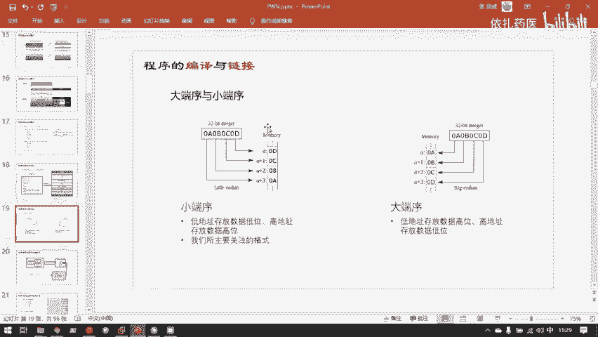
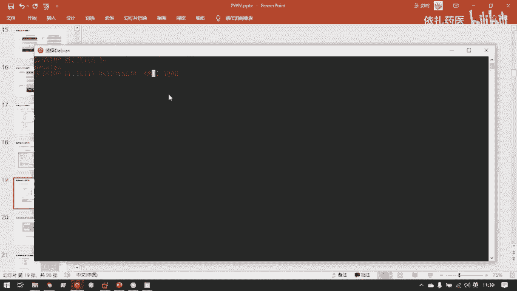
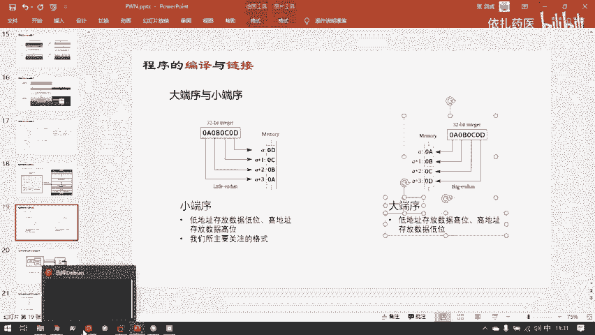
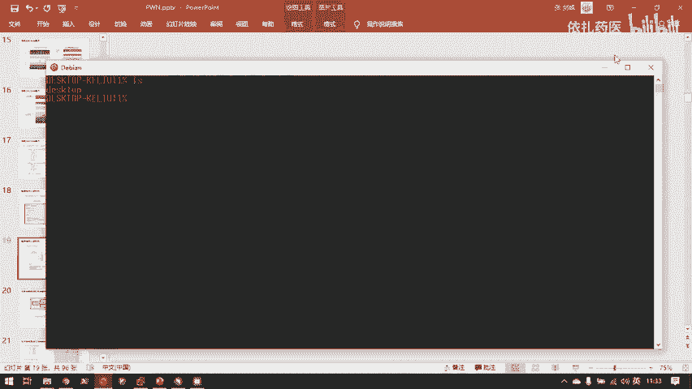
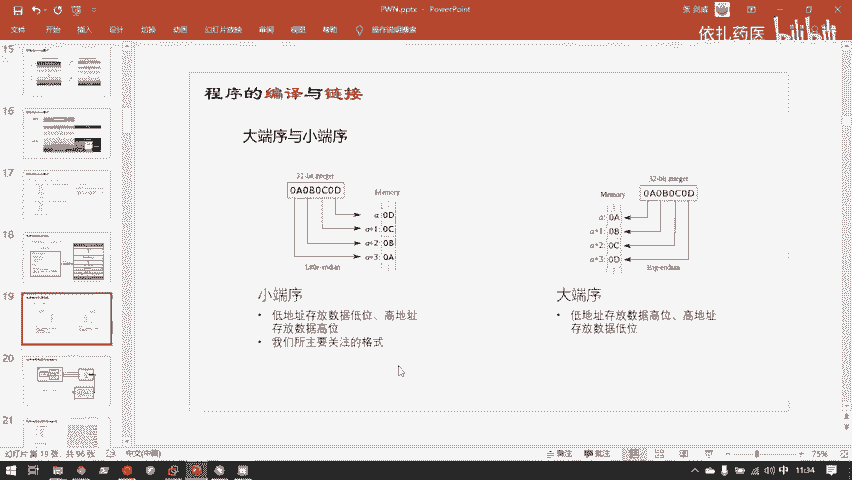
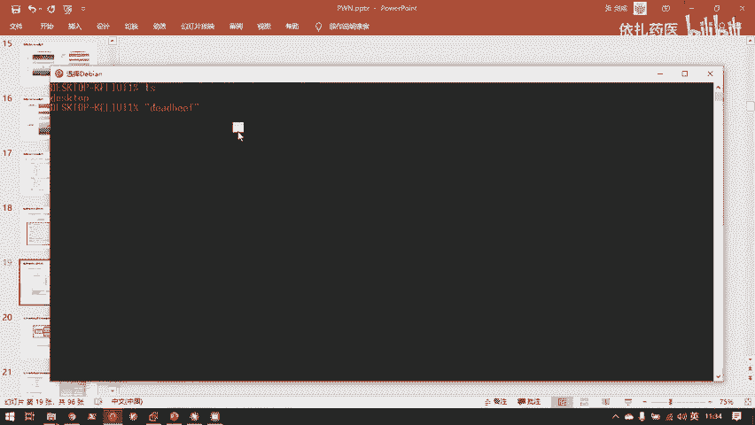
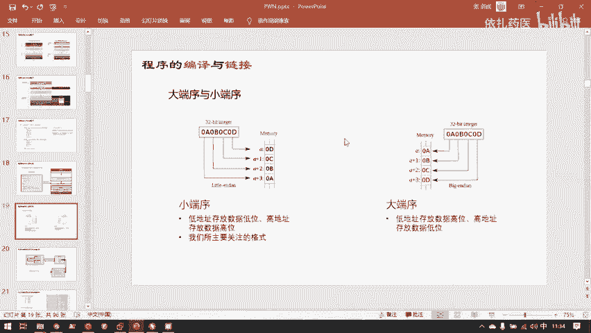

# 二进制安全：P87：4.进程虚拟地址空间

在本节课中，我们将要学习进程虚拟地址空间的核心概念。这是理解程序如何在内存中运行、操作系统如何管理内存以及后续二进制漏洞分析的基础。

## 概述

进程虚拟地址空间是操作系统为每个运行中的程序（进程）提供的一个抽象的内存视图。它让每个进程都“感觉”自己独占了整个内存地址空间，从而简化了程序员的开发工作，并增强了系统的安全性和稳定性。本节将详细解析虚拟地址空间的构成、作用以及与物理内存的关系。

## 从磁盘文件到内存段

上一节我们介绍了ELF文件的结构，本节中我们来看看当它被加载到内存中时发生了什么。

磁盘上的ELF文件包含多个“节”（section），例如代码节、数据节等。当操作系统将ELF文件载入内存以创建进程时，这些“节”会根据其权限（可读、可写、可执行）被合并成更大的“段”（segment）。

内存管理只关心“段”，因为段定义了内存区域的访问权限。操作系统根据ELF文件头中的控制信息，将这些段正确地映射到进程的虚拟内存地址空间中。这个映射过程由虚拟内存区域（VMA）等内核数据结构控制。

## 实模式与保护模式

为了理解虚拟地址空间为何必要，我们需要回顾一下计算机内存管理的发展。

早期的计算机运行在“实模式”下。在实模式下，程序直接访问物理内存地址。这意味着程序A和程序B都能直接读写物理内存条上的任何位置。

这种模式存在严重的安全和稳定性问题。一个编写不当或恶意的程序可以轻易地读写甚至篡改操作系统内核的代码和数据，导致系统崩溃或被攻击者完全控制。

后来，为了应对实模式的缺陷，人们发明了“保护模式”。

在保护模式下，用户程序无法直接访问物理内存地址。程序只能使用操作系统提供的“虚拟内存地址”。操作系统负责将这些虚拟地址转换到实际的物理内存地址上。

归根结底，数据必须存放在物理内存条上，并拥有物理地址。但从实模式到保护模式的转变在于：用户程序不再能直接获取和操控物理地址，所有对硬件的访问都必须经过操作系统的管理和转换。

现代操作系统（自i386架构起）都采用这种模式。硬件资源应由操作系统统一管理，而不是由用户程序直接访问。如果用户程序能绕过操作系统直接操控硬件（如摄像头、网卡），将带来巨大的安全风险。

因此，操作系统为程序员提供了统一的编程接口，即“系统调用”。程序必须通过系统调用，按照操作系统规定的规则来请求使用硬件资源，内存也不例外。

## 虚拟地址空间详解

每一个进程都拥有自己独立的虚拟地址空间。

以一台32位计算机为例。其CPU的寻址能力是2^32个地址，即4GB（2^32字节 = 4GB）。因此，一个32位进程的虚拟地址空间大小就是4GB。

这里有一个关键点：虽然每个进程都“看到”自己拥有4GB的连续地址空间，但这并不意味着物理内存中真的有4GB专属于它。

假设我们有一台32位电脑，物理内存为4GB。当我们运行两个进程时，每个进程都拥有4GB的虚拟地址空间，总和为8GB。这8GB如何装入4GB的物理内存呢？

答案是：**虚拟地址空间中的绝大部分区域在初始时是空的，并未对应实际的物理内存**。一个程序文件本身可能只有几十KB（例如一个17KB的`simple.elf`），当它被加载时，操作系统只为这17KB的有效内容分配物理内存。虚拟地址空间中其余的部分只是“地址范围”，并未占用物理资源。

因此，只要所有进程实际使用的物理内存总和不超过物理内存条的总容量，操作系统就可以为每个进程都分配一个完整的4GB虚拟地址空间视图。

在调试器（如GDB）中查看的进程内存地址，都是虚拟地址，而非物理地址。

## 用户空间与内核空间

在32位Linux系统中，进程的4GB虚拟地址空间被划分为两部分：
*   **用户空间**：低地址的3GB，用于存放进程本身的代码、数据、堆栈等。
*   **内核空间**：高地址的1GB，用于存放操作系统内核的代码、数据和数据结构。

所有进程的3GB用户空间是各自独立的。但所有进程共享同一份内核空间的映射。也就是说，物理内存中只需要存放一份操作系统内核代码，所有进程的虚拟地址空间都指向它。这既节省了物理内存，也保证了内核的安全性。

Windows系统的划分策略不同，通常是用户空间和内核空间各占2GB。

随着硬件发展，4GB地址空间已不够用，因此现代计算机普遍采用64位架构。64位地址空间极其巨大（2^64字节），远超当前硬件需求。因此，Linux等系统通常只使用其中的一部分，例如为用户空间和内核空间各分配128TB。

## 虚拟地址空间的布局

以下是进程虚拟地址空间的一个典型布局，了解各部分的功能对后续学习至关重要：

```
高地址
+----------------------+
|   内核空间           |
|   (操作系统内核)      |
+----------------------+
|   栈 (Stack)         | <-- 向下增长
|   (存放局部变量、函数调用信息)|
+----------------------+
|   ... (内存映射区等) ...|
+----------------------+
|   堆 (Heap)          | <-- 向上增长
|   (动态分配的内存，如malloc)|
+----------------------+
|   .bss 段            |
|   (未初始化的全局/静态变量)|
+----------------------+
|   .data 段           |
|   (已初始化的全局/静态变量)|
+----------------------+
|   .text / .rodata 段 |
|   (代码和只读数据)     |
低地址
```

**静态存储区**：在程序编译链接时就确定大小和位置，包括：
*   **.text段**：存放程序的可执行代码。注意，只读数据（如字符串常量）也常位于此段或相邻的只读数据段。
*   **.data段**：存放已初始化的全局变量和静态变量。
*   **.bss段**：存放未初始化的全局变量和静态变量。该段在磁盘上的ELF文件中不占实际空间，仅在程序加载时在内存中分配并初始化为零。

**动态存储区**：在程序运行时动态管理：
*   **堆 (Heap)**：用于动态内存分配（如C语言的`malloc`）。程序运行时通过系统调用向操作系统申请指定大小的内存。
*   **栈 (Stack)**：用于函数调用。存放函数的局部变量、参数（在x86-64架构中，前几个参数通常通过寄存器传递）、返回地址等。每个函数调用对应一个“栈帧”，函数结束时其栈帧被销毁。

## 数据在内存中的存放示例

理解一段C源代码编译运行后，其各部分数据位于虚拟地址空间的哪个区域，是分析程序内存模型的基础。

考虑以下C代码片段：
```c
int global_uninit; // 未初始化的全局变量
char *str = "Hello World"; // 已初始化的全局指针，指向字符串常量

int sum(int x, int y) { // 函数定义
    return x + y;
}

int main() {
    char *buf = malloc(0x100); // 动态分配堆内存
    read(0, buf, 0x100); // 假设读入数据 "ABCDEFG"
    int local_var = 10; // 局部变量
    sum(1, 2); // 函数调用
    return 0;
}
```

它们在内存中的分布如下：
*   **.text段**：存放 `sum` 函数和 `main` 函数的机器指令代码。
*   **.rodata段 (只读数据段)**：存放字符串常量 `"Hello World"`。
*   **.data段**：存放已初始化的全局指针变量 `str`（其值为字符串`"Hello World"`的地址）。
*   **.bss段**：存放未初始化的全局变量 `global_uninit`，初始值为0。
*   **堆 (Heap)**：存放 `malloc` 动态分配的0x100字节内存，以及读入的数据 `"ABCDEFG"`。
*   **栈 (Stack)**：存放 `main` 函数的局部变量 `buf`（指针，指向堆内存地址）和 `local_var`。当调用 `sum` 函数时，会在栈上创建新的栈帧，用于保存调用上下文（在32位系统中，参数`x`和`y`也会压栈；在64位系统中，它们通常通过寄存器传递）。

**注意**：函数的形式参数（如`sum(int x, int y)`中的`x`和`y`）的存储位置与调用约定和架构相关。在x86-64架构中，前几个整型或指针参数通常通过寄存器传递，不占用栈空间，这提升了执行效率。

## 字节序：大端序与小端序

数据在内存中如何排列字节，涉及“字节序”的概念，这对理解内存数据和漏洞利用至关重要。



对于一个多字节的整数，例如 `0x12345678`：
*   **大端序**：高位字节存放在低内存地址。内存布局（从低地址到高地址）：`0x12 | 0x34 | 0x56 | 0x78`
*   **小端序**：低位字节存放在低内存地址。内存布局（从低地址到高地址）：`0x78 | 0x56 | 0x34 | 0x12`



我们的个人计算机（x86/x86-64架构）普遍采用**小端序**。



字节序对安全有影响。例如，在利用字符串溢出漏洞时，攻击者通常从低地址向高地址覆盖数据。在小端序系统中，一个指针或整数的低位字节位于低地址，更容易被溢出数据覆盖和篡改。此外，C语言字符串以`\x00`（空字符）结尾。在小端序下，如果溢出数据覆盖了一个多字节数据，只有当覆盖到高位字节为`\x00`时，字符串才会终止，这可能为利用提供更多空间。幸运的是，我们遇到的绝大多数题目和环境都是小端序。

字符串的存储不受字节序影响，总是按字符顺序从低地址到高地址存放。例如字符串 `"ABCDEFG"` 在内存中总是：`'A' | 'B' | 'C' | 'D' | 'E' | 'F' | 'G' | '\x00'`。

## 总结



本节课中我们一起学习了进程虚拟地址空间这一核心概念。我们了解到：
1.  虚拟地址空间是操作系统为进程提供的抽象内存视图，它隔离了进程与物理内存，提升了安全性和稳定性。
2.  虚拟地址空间分为用户空间和内核空间，用户空间私有，内核空间共享。
3.  虚拟地址空间具有特定的布局，包括代码段、数据段、BSS段、堆和栈等，不同性质的数据存放在不同区域。
4.  理解一段C程序编译后，其全局变量、局部变量、动态内存、代码等分别位于虚拟地址空间的哪个部分，是进行二进制分析的基础。
5.  计算机采用小端序存储多字节数据，即低位字节在低地址，这在分析内存数据和漏洞利用时需要牢记。







掌握虚拟地址空间的知识，是后续深入学习函数调用栈、堆管理机制以及各种二进制漏洞（如栈溢出、堆溢出）的必备前提。