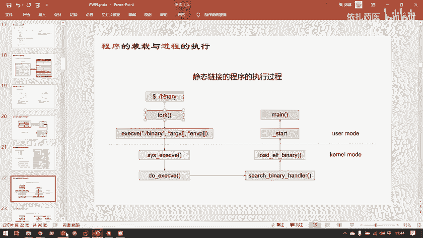
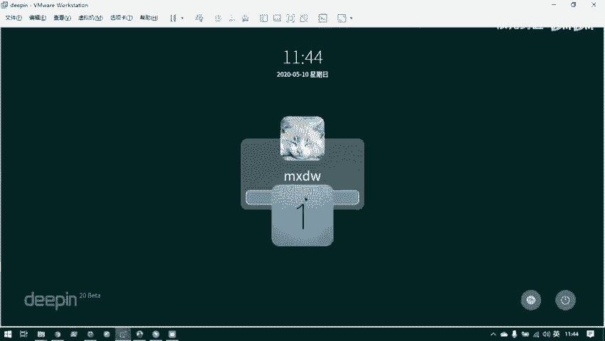
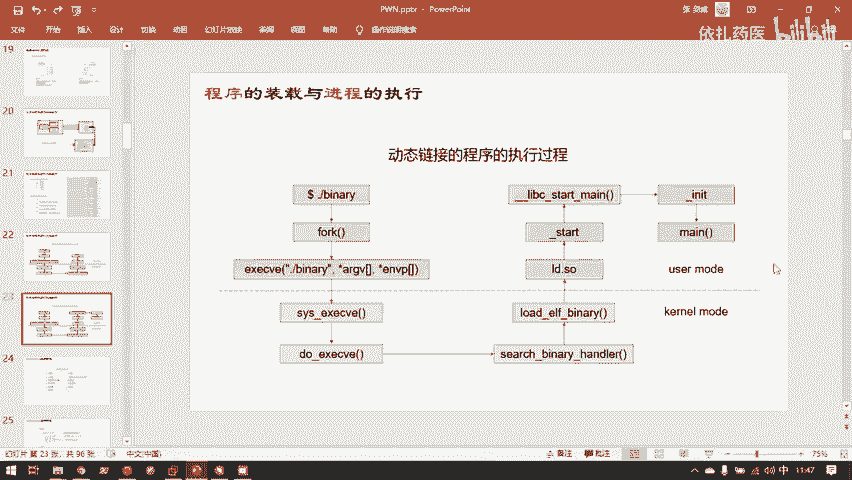

# 护网行动红蓝攻防教程：P88：5.程序的装载与进程的执行 🖥️

## 概述
在本节课中，我们将学习程序是如何与计算机硬件交互并执行的。我们将从计算机的核心组件（CPU和内存）开始，了解指令执行的基本流程，然后深入探讨程序从文件到进程的装载过程，包括静态连接与动态连接的区别，以及用户模式与内核模式在程序执行中的作用。

---

## 计算机的核心：CPU与内存
上一节我们介绍了程序在文件中的存放方法。本节中我们来看看程序是如何与整个电脑的硬件进行交互执行的。

实际上，一个CPU加一个内存，就能完成计算机的基本功能。剩下的都可以说是一些外设。例如，显卡并不是很需要CPU就能完成其工作，只是显卡的图形计算能力比CPU强很多。显示器也是一个可选的外设，因为计算机可以只计算结果而不显示。键盘鼠标同样是可选的输入外设。计算机最核心的本体只有内存和CPU。

内存和CPU通过地址总线、数据总线和控制总线进行数据传递。
*   **地址总线**：CPU告诉内存要存取哪块地址的内容。
*   **数据总线**：内存将指定地址的内容送回给CPU。
*   **控制总线**：传送控制指令。

具体的执行过程是：内存中保存着实际的代码和数据。CPU执行这些代码（机器码），同时，CPU内部有一个特殊的寄存器——**程序计数器（PC）**。

**公式/代码表示**：
*   `PC` 寄存器在不同架构的CPU中有不同名称：
    *   x86架构：`EIP`
    *   x64架构：`RIP`
*   `PC` 寄存器总是存放**当前执行指令的地址**。

寄存器是离CPU最近、速度最快的存储器，位于CPU内部。CPU通过三条总线与内存交互，同时`PC`寄存器不断加1，从而一条一条地顺序执行指令，最终完成代码段所规定的功能。所以，内存记录了“要做什么”以及“需要哪些数据”，而CPU是执行这些任务的组件。

---

## CPU寄存器的详细结构
目前大家通用的电脑基本都是AMD64架构（向下兼容x86）。在学习入门时，我们通常接触的是32位的x86架构。AMD64（或x86-64）是64位架构，其寄存器是32位寄存器的扩展。

以下是几个在程序分析和漏洞利用中最重要的寄存器（以64位为例）：
*   **`RIP`**：程序计数器（PC），存放当前执行指令的地址。
*   **`RSP`**：栈指针，存放当前栈顶的地址。
*   **`RAX`**：一个最常用的通用寄存器。编译器约定俗成地用`RAX`来保存函数的返回值。

例如，当你写了一个`main`函数并`return 0;`时，这个返回值0最终会被放在`RAX`寄存器中，返回给调用`main`的函数。

---

## 程序的入口与执行环境
在学习C/C++时，我们说`main`是程序的入口，但这并不完全准确。`main`函数只是**用户自定义代码的入口**。在执行`main`之前，程序需要做大量准备工作来初始化内存、创建执行环境。这些工作由编译器和操作系统库中的代码完成。

程序分为静态连接和动态连接两种：
*   **静态连接程序**：将所有需要的功能代码都直接写入其ELF文件中，可以独立工作。
    *   **代码示例**：`gcc -static -o binary source.c`
*   **动态连接程序**：编译时只标记需要的外部函数（如`printf`），等到真正执行时，才从操作系统的动态链接库中获取所需的代码。因此它不能独立执行，依赖的库文件必须存在。
    *   **代码示例**：`gcc -o binary source.c` (默认动态链接)

---

## 用户模式与内核模式
程序运行时有两种模式：
*   **用户模式（User Mode）**：运行用户编写的程序代码，权限较低，不能直接访问硬件。
*   **内核模式（Kernel Mode）**：运行操作系统内核代码，权限最高，可以访问和管理所有硬件。



用户程序要执行，必须获得物理内存等资源，而这些资源由操作系统管理。因此，用户程序必须通过操作系统来申请使用硬件。



---

## 进程的创建与程序装载
当一个程序（例如`simple.elf`）从Shell中启动时，其装载和执行过程如下：

1.  **Fork（复制进程）**：Shell进程调用`fork()`系统调用，复制一份自己的虚拟内存空间（例如3GB）。
2.  **Exec（执行程序）**：随后调用`execve()`系统调用（或其包装函数）。这是一个用户程序向操作系统申请资源的“手续”。
3.  **内核处理**：操作系统（内核模式）将上一步复制的3GB内存空间内容，替换成`simple.elf`文件的内容，并准备好执行环境。
4.  **进入入口点**：程序开始执行。对于静态连接程序，真正的入口是一个名为`_start`的汇编函数，它负责初始化环境，然后才调用`main`函数。

对于动态连接程序，过程更复杂：
*   需要**动态链接器（如`ld-linux.so`）** 作为中介，负责在运行时从动态库（如`libc.so`）中“借”代码给进程使用。
*   在`_start`之后，会先执行`libc`中的初始化函数（如`__libc_start_main`），等所有环境和链接器都准备好后，才会调用`main`函数。

**图示关键步骤**：
```
[Shell进程] --fork()--> [复制进程空间] --execve()--> [内核装载ELF] --> [_start] --> [main]
```

---



## 总结
本节课中我们一起学习了程序执行的核心原理。我们了解到计算机运行的基础是CPU与内存通过总线交互，并由PC寄存器指引执行流程。我们区分了静态连接与动态连接程序的不同，明白了`main`函数并非真正的起点，程序执行前需要复杂的初始化工作。最后，我们梳理了进程从`fork`到`execve`的创建过程，以及用户模式与内核模式在资源管理中的关键作用。理解这些底层机制，是后续分析程序行为、进行漏洞挖掘和应急响应的基础。