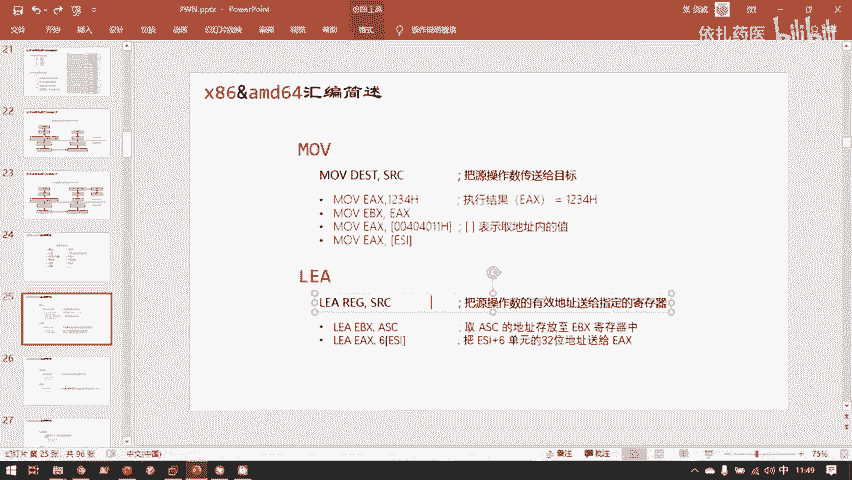
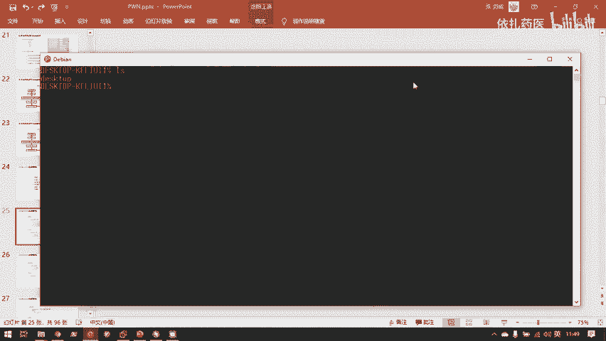
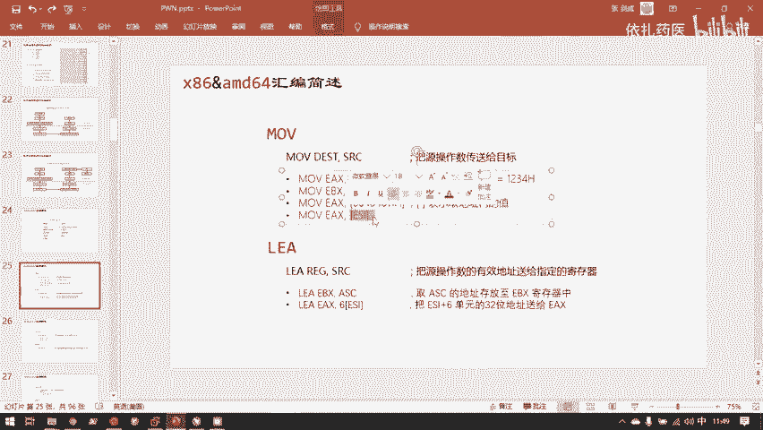
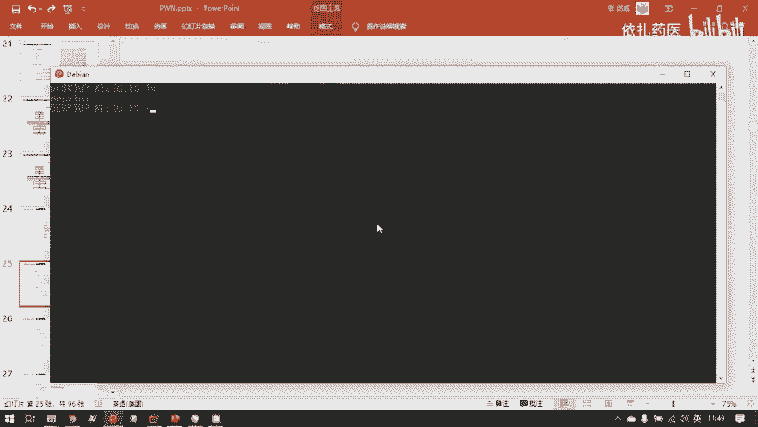
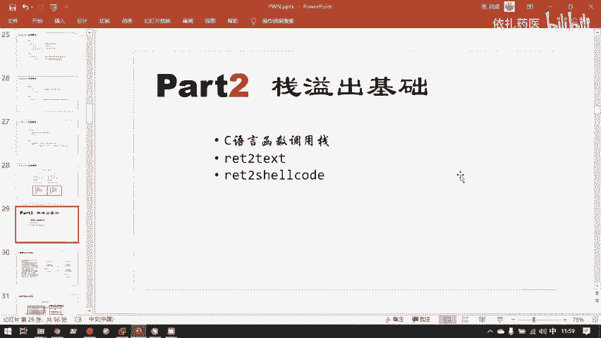

# 护网行动红蓝攻防教程：P89：6.x86&amd64汇编简述 🖥️

在本节课中，我们将学习汇编语言的基础知识，这是分析软件和漏洞时最常用的工具。我们将介绍几个核心的汇编指令，理解它们的工作原理，并了解栈这一关键数据结构。掌握这些基础知识，是后续学习漏洞利用和二进制分析的必经之路。

## 汇编指令简介



上一节我们介绍了程序内存布局的基础概念，本节中我们来看看最常用的一些汇编指令。这些指令是分析程序行为时的基础，虽然内容不多，但至关重要。





以下是几个最核心的汇编指令及其作用：



*   **`mov` 指令**：这是最常用的指令，相当于C语言中的赋值操作符 `=`。
    *   **公式/代码**：`mov dest, src` （将 `src` 的值复制到 `dest`）
    *   例如，C语言 `int a = 2;` 在汇编中近似对应 `mov [a], 2`。
*   **`push` / `pop` 指令**：这两个指令直接操作栈指针寄存器（ESP/RSP），用于管理栈数据结构。
*   **`leave` / `ret` 指令**：这两个指令通常一起使用，用于函数执行完毕时清理当前函数的栈帧并返回调用者。

## 深入理解 `mov` 与内存访问

`mov` 指令虽然简单，但结合内存访问时需要注意符号的含义。

在汇编中，方括号 `[]` 的含义与C语言中的取地址 `&` 和取值 `*` 操作相关，但逻辑相反。它表示“将括号内的值作为一个地址，并访问该地址处存储的数据”。

**公式/代码**：
*   `mov eax, var`：将变量 `var` 的**地址**存入 `eax` 寄存器。
*   `mov eax, [var]`：将变量 `var` 所在地址存储的**值**存入 `eax` 寄存器。

可以这样理解：`[ ]` 相当于C语言中的解引用操作符 `*`。因此，`mov eax, [var]` 类似于C语言的 `eax = *var;`（假设 `var` 是一个指针）。而 `mov eax, var` 则类似于 `eax = (int)&var;`。

## 栈数据结构与 `push`/`pop`

栈是一种“后进先出”（LIFO）的数据结构，想象成一摞盘子，你总是把新盘子放在最上面（入栈），也总是从最上面拿走盘子（出栈）。

在程序的内存空间中，栈用于存储函数调用时的局部变量、参数和返回地址。栈的增长方向是**从高内存地址向低内存地址**扩展，这与堆（heap）的增长方向相反。这样设计是为了让堆和栈能充分利用两者之间的空闲内存区域。

以下是 `push` 和 `pop` 指令的工作过程：

1.  **`push value`**：将 `value` 压入栈顶。
    *   操作：栈指针（ESP）向低地址移动（减少），然后将 `value` 存入新的栈顶位置。
    *   **代码示例**：`push 0x1234` 将数值 `0x1234` 压入栈。
2.  **`pop reg`**：从栈顶弹出一个值到寄存器。
    *   操作：首先读取当前栈顶的值，存入寄存器 `reg`，然后栈指针（ESP）向高地址移动（增加）。
    *   **代码示例**：`pop eax` 将栈顶的值弹出并存入 `eax` 寄存器。

**注意**：`push` 和 `pop` 操作的单位是数据（如一个4字节整数），而不是整个栈帧。

## 函数调用与 `leave`/`ret`

每个函数在栈上都有自己的一块区域，称为“栈帧”，用于保存该函数的局部状态。当一个函数（子函数）调用结束，需要返回到调用它的函数（父函数）时，需要清理自己的栈帧并恢复父函数的执行现场。这主要通过 `leave` 和 `ret` 指令完成。

*   **`leave` 指令**：等价于两条指令 `mov esp, ebp`（将栈指针指向当前栈帧底部）和 `pop ebp`（恢复父函数的栈帧基址）。它负责**销毁当前函数的栈帧**。
*   **`ret` 指令**：从栈顶弹出返回地址，并跳转到该地址继续执行。这相当于 `pop eip`（指令指针寄存器），但**EIP/RIP寄存器不能直接用 `mov` 或 `pop` 操作**，必须通过 `call`、`ret`、`jmp` 等特定指令来改变，这是CPU的安全约定，防止控制流被随意篡改。

函数调用与返回的简化流程是：
1.  调用函数前，将**返回地址**（调用指令的下一条地址）压栈。
2.  执行子函数。
3.  子函数结束时，执行 `leave` 清理自身栈帧。
4.  执行 `ret`，将之前压栈的返回地址弹给EIP/RIP，从而跳回父函数继续执行。

## 汇编语法格式：AT&T vs. Intel

你可能会看到两种主流的汇编语法格式：AT&T 格式和 Intel 格式。它们主要由不同的厂商制定，核心区别在于操作数的顺序和立即数/寄存器的表示符号。

以下是它们的主要区别：

*   **操作数顺序**：
    *   **Intel 格式**：`指令 目标操作数, 源操作数` （`mov eax, 8`）
    *   **AT&T 格式**：`指令 源操作数, 目标操作数` （`mov $8, %eax`）
*   **立即数与寄存器**：
    *   **Intel 格式**：立即数直接书写（`8`），寄存器直接书写（`eax`）。
    *   **AT&T 格式**：立即数以 `$` 开头（`$8`），寄存器以 `%` 开头（`%eax`）。
*   **内存寻址**：
    *   **Intel 格式**：使用方括号 `[]`（`mov eax, [ebx]`）。
    *   **AT&T 格式**：使用圆括号 `()`（`mov (%ebx), %eax`）。

**代码示例对比**：
```assembly
; Intel 格式
mov eax, 8
mov eax, [ebx]

; AT&T 格式
mov $8, %eax
mov (%ebx), %eax
```
两者本质是等价的，学会一种后，另一种很容易触类旁通。在后续学习中，请注意识别你正在阅读的是哪种格式。

## 总结



本节课中我们一起学习了汇编语言的基础核心知识。我们首先介绍了 `mov`、`push`/`pop`、`leave`/`ret` 这几个关键指令。然后，我们深入探讨了栈这种“后进先出”数据结构的工作原理及其在函数调用中的核心作用，理解了函数如何通过栈帧管理状态，并通过 `leave` 和 `ret` 指令实现调用与返回。最后，我们了解了AT&T与Intel两种汇编语法格式的主要区别。这些内容是分析二进制程序、理解漏洞原理的基石，请务必掌握。下一节，我们将正式进入栈溢出漏洞原理的学习。