# 护网行动红蓝攻防教程：P8：蓝队应急响应-7.抑制、根除、恢复阶段 🛡️

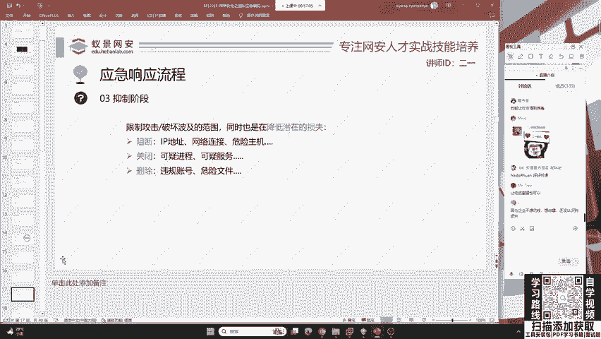

在本节课中，我们将要学习应急响应流程中的最后三个关键阶段：抑制、根除与恢复。我们将了解如何有效控制安全事件的影响、彻底清除威胁根源，并最终将业务恢复到正常状态。

上一节我们介绍了应急响应的准备与检测阶段，本节中我们来看看如何对已确认的安全事件进行处置。

## 抑制阶段：控制事态蔓延 🚧

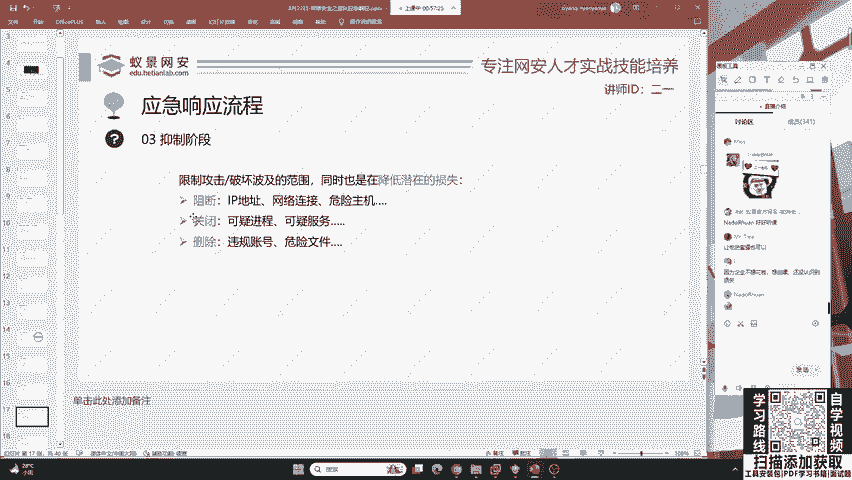

抑制阶段的核心目标是在红队攻破系统后、进一步向内网渗透之前，采取行动阻断其攻击链。这个阶段要求我们快速排查并处置攻击者留下的痕迹。

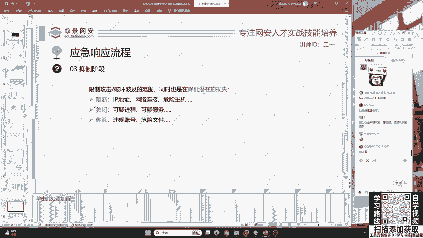

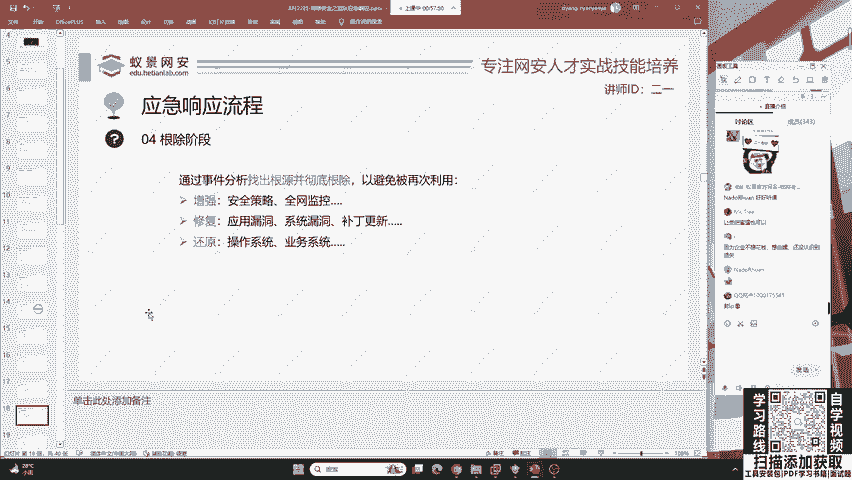

以下是抑制阶段可以采取的关键措施：

*   **阻断网络连接**：封锁攻击者的IP地址，切断其网络访问。
*   **关闭可疑进程与服务**：终止系统中由攻击者启动的恶意进程和服务。
*   **删除危险文件**：清除攻击者上传的木马、病毒等恶意文件。
*   **清理违规账号**：删除攻击者创建或利用的非授权系统账户。

为了执行这些措施，我们必须首先找到攻击者植入的恶意程序。接下来，我们将通过一个简单事例来分析如何排查。

## 根除阶段：溯源与修复 🔍

在采取防御措施之后，我们必须进行根除工作。如果仅仅删除了攻击者传入的木马，而不去追溯攻击根源并进行修复，系统很可能再次被同一漏洞攻破。

根除阶段要求我们深入分析安全事件，找到问题的根本原因。例如，攻击者是通过某个特定漏洞入侵的。如果直接关闭电源或断开所有连接，虽然能暂时阻断攻击，但也破坏了现场证据，导致无法进行有效的溯源分析。

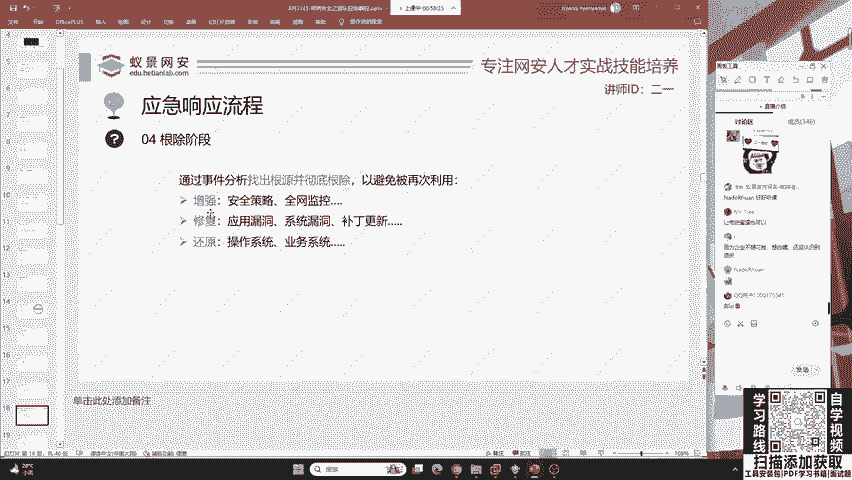

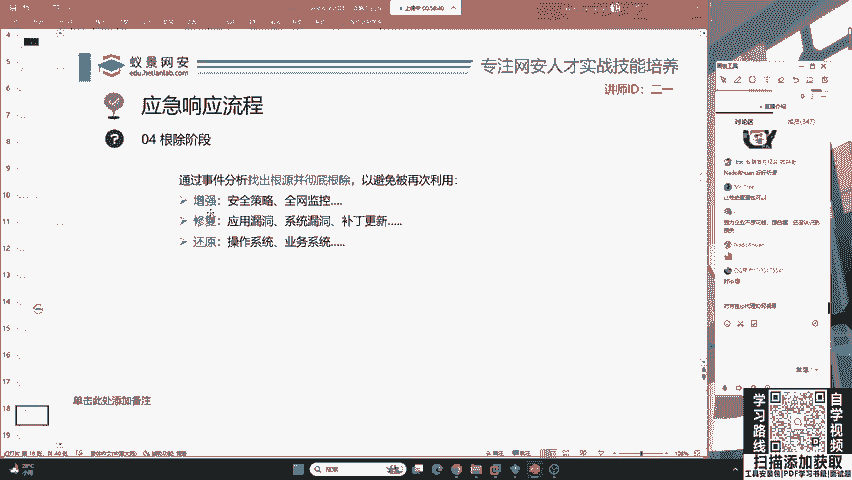

因此，正确的做法是：**在保留必要证据的前提下，分析攻击路径，修复被利用的漏洞，并增强系统防护**。这就像应对勒索病毒，理想情况下应首先尝试从备份中恢复数据。但现实是，许多企业因未重视备份工作，在遭受攻击时陷入被动。

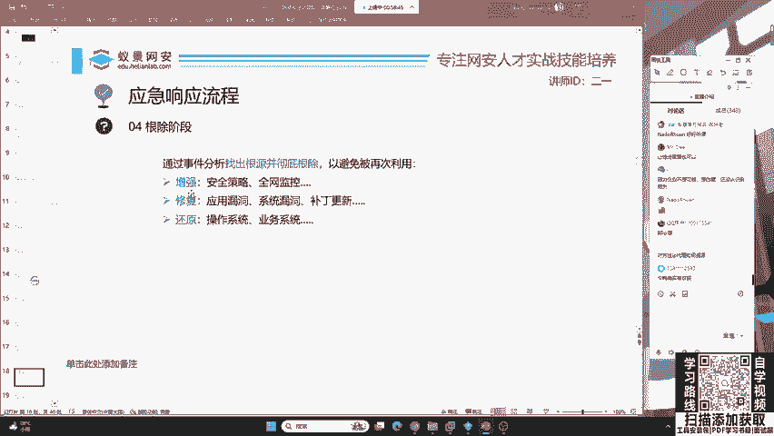

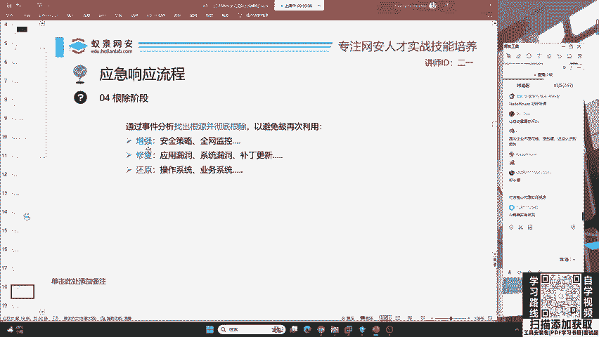

应急响应是一个涵盖攻击前、攻击时和攻击后的完整流程，技术面广，并非易事。它需要扎实的知识储备，而不仅仅是简单的操作。

## 恢复阶段：重建与运营 🔄

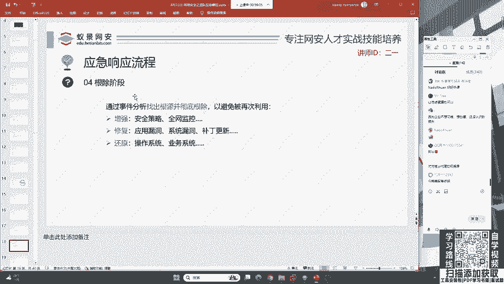

最后，我们需要将受影响的业务恢复到正常运作的状态，这是恢复阶段的任务。

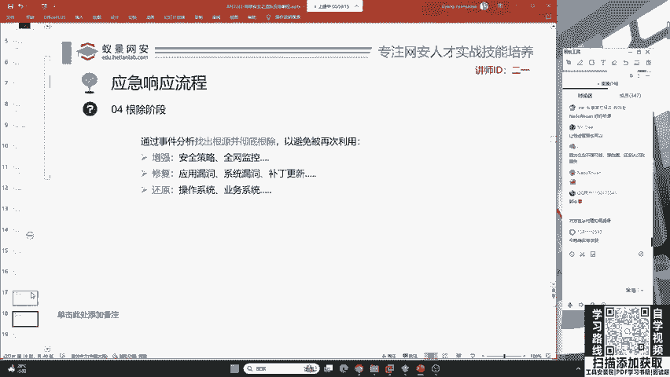

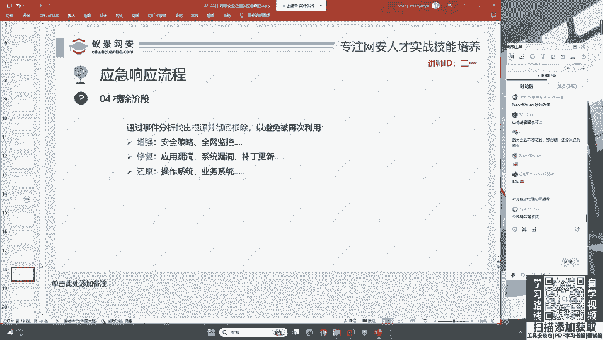

恢复阶段的主要工作包括：

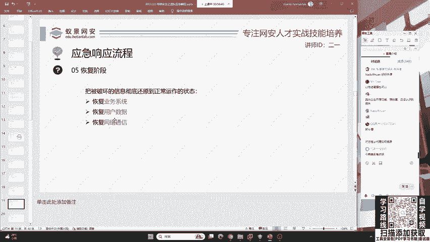

*   **恢复业务系统**：确保关键应用程序和服务重新上线。
*   **恢复数据**：利用备份还原被删除或加密的数据。
*   **恢复网络通信**：重建正常的网络连接和访问权限。

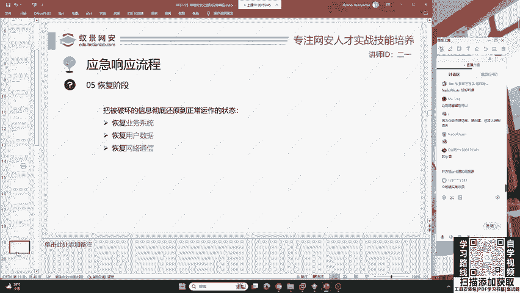

本节课中我们一起学习了应急响应的抑制、根除与恢复阶段。我们了解到，抑制在于快速控制，根除在于彻底解决，而恢复则在于让业务重回正轨。这三个阶段紧密衔接，共同构成了安全事件处置的闭环，是蓝队工程师必须掌握的核心技能。