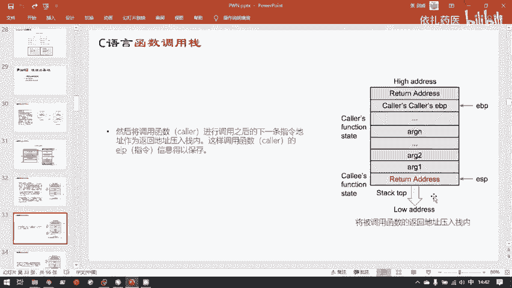
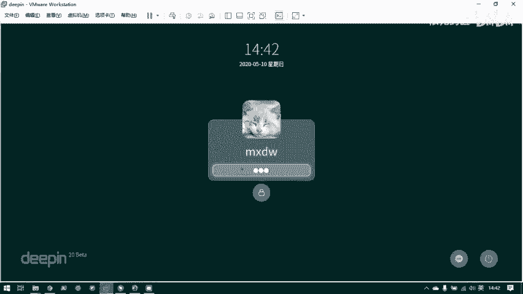
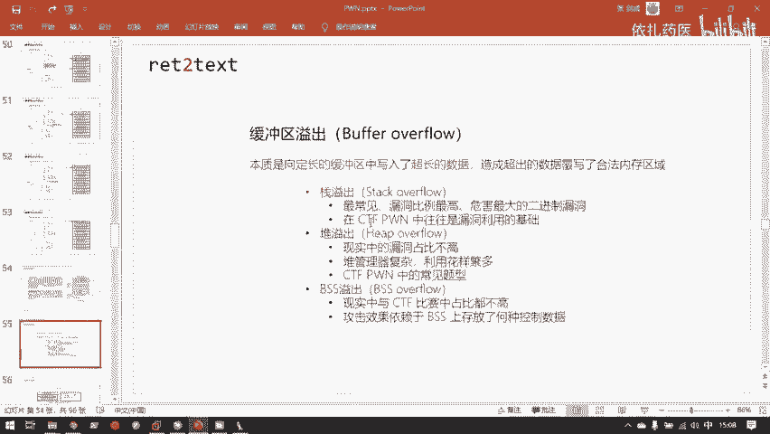

# 护网行动红蓝攻防教程：P90：1.C语言函数调用栈 🧱

在本节课中，我们将要学习二进制安全领域中最经典、最常见的漏洞之一——栈溢出。在深入讲解栈溢出漏洞的具体原理之前，我们必须先扎实掌握其基础：函数调用栈的工作原理。只有对栈的工作原理滚瓜烂熟，才能轻松理解栈溢出是如何发生的。

上午的课程已经简要介绍了函数调用栈。本节我们将对其进行更深入、更系统的剖析。

## 栈的基本概念与位置

上一节我们介绍了程序的虚拟内存布局，本节中我们来看看栈在其中的具体位置和作用。

函数调用栈位于虚拟内存用户空间的最高地址处（上午的PPT已展示过）。它的增长方向是从高地址向低地址，这与内存中其他区域（如堆）的增长方向不同。





栈的主要作用是保存函数运行时的状态信息，主要包括函数的参数和局部变量。

## 栈帧的结构

栈的基本操作单位是“栈帧”。一个栈帧保存了一个函数的状态信息。每当一个函数（父函数）调用另一个函数（子函数）时，就会在栈顶新增一个子函数的栈帧。

以下是关于栈帧的几个核心概念：
*   **栈底指针**：通常由寄存器 **`EBP`** (32位) 或 **`RBP`** (64位) 保存，指向当前栈帧的底部。
*   **栈顶指针**：通常由寄存器 **`ESP`** (32位) 或 **`RSP`** (64位) 保存，指向当前栈帧的顶部（也是整个栈的顶部）。

栈帧之间紧密相邻。在当前函数的栈帧中，有两个至关重要的控制信息紧邻其父函数的栈帧：
1.  **返回地址**：即 `return address`，是子函数执行完毕后应该跳转回去的指令地址。
2.  **保存的上一栈帧EBP**：即 `saved frame pointer`，保存了父函数栈底指针（`EBP`）的值，用于在子函数返回后恢复父函数的栈帧。

局部变量保存在当前函数栈帧的“局部变量区”。**栈溢出漏洞发生的典型位置就在这里**，因为局部变量的内容可能受用户输入控制。如果向局部变量写入的数据超长，就会覆盖掉相邻的返回地址等控制信息，从而改变程序执行流。

在32位架构下，函数参数传递也通过栈进行。需要注意的是，**子函数所用的参数实际上保存在父函数栈帧的末尾**，而非子函数自己的栈帧内。

## 函数调用栈的工作流程

函数调用过程主要涉及三个寄存器：**`ESP`**（栈顶）、**`EBP`**（栈底）和 **`EIP`**（指令指针，存储下一条要执行的指令地址）。我们先以较简单的x86架构为例进行说明。

以下是函数调用（以 `main` 调用 `sum` 函数为例）的详细步骤：

### 调用子函数时

1.  **参数压栈**：父函数（`main`）将需要传递给子函数（`sum`）的参数**按从右到左的顺序**压入自己的栈帧中。例如，对于 `sum(1, 2)`，先压入 `2`，再压入 `1`。
2.  **返回地址压栈**：执行 `call sum` 指令。该指令会先将**下一条指令的地址**（即 `call` 之后的指令地址）压栈，作为返回地址，然后跳转到 `sum` 函数的代码处执行。
3.  **保存父函数栈底**：进入 `sum` 函数后，首先执行 `push ebp`，将父函数（`main`）的 `EBP` 值（即父函数栈底）保存到栈中。
4.  **建立新栈帧**：执行 `mov ebp, esp`，将当前 `ESP`（栈顶）的值赋给 `EBP`，从而 `EBP` 指向了新栈帧（`sum` 函数的栈帧）的底部。
5.  **分配局部变量空间**：编译器根据函数局部变量的大小，通过减小 `ESP` 的值来“分配”空间（例如 `sub esp, 0x10` 分配16字节）。栈是向低地址增长，所以用“减”来分配空间。

### 子函数返回时

1.  **释放局部变量空间**：子函数执行完毕后，通过 `mov esp, ebp` 将 `ESP` 抬升到 `EBP` 的位置，从而“释放”为局部变量分配的空间（实际上只是移动指针，数据未被清除）。
2.  **恢复父函数栈底**：执行 `pop ebp`。该指令将当前 `ESP` 指向的值（即之前保存的父函数 `EBP`）弹回 `EBP` 寄存器，同时 `ESP` 上移一个单元（字长）。此时 `EBP` 恢复指向父函数的栈底。
3.  **返回父函数**：执行 `ret` 指令。该指令相当于 `pop eip`，它将当前 `ESP` 指向的值（即返回地址）弹入 `EIP` 寄存器，同时 `ESP` 再次上移。程序随即跳转到返回地址处，继续执行父函数的代码。
4.  **平衡栈指针**：父函数在 `call` 指令之后，通常需要调整 `ESP`（例如 `add esp, 8` 用于清理之前压入的两个4字节参数），使栈指针恢复到调用子函数之前的状态。

**关于字长**：在32位系统中，一个字长是4字节（32位）；在64位系统中，一个字长是8字节（64位）。`push` 和 `pop` 指令操作的数据单位都是一个字长。

## 实例分析

让我们通过一个简单的C程序及其对应的汇编代码，直观感受上述流程。

考虑以下C代码：
```c
int sum(int a, int b) {
    return a + b;
}
int main() {
    int result = sum(1, 2);
    return 0;
}
```
其对应的核心汇编指令可能如下：
```
main:
    ...
    push 2          ; 参数从右向左压栈：先压 b(2)
    push 1          ; 再压 a(1)
    call sum        ; 1.压入返回地址 2.跳转到sum
    add esp, 8      ; 平衡栈指针，清理两个参数
    ...
sum:
    push ebp        ; 保存main函数的EBP
    mov ebp, esp    ; 建立sum函数的新栈帧
    mov eax, [ebp+8]; 获取参数a (EBP+8)
    add eax, [ebp+12]; 加上参数b (EBP+12)
    mov esp, ebp    ; 释放局部变量空间（本例无）
    pop ebp         ; 恢复main函数的EBP
    ret             ; 弹出返回地址到EIP，跳回main
```
通过调试器（如GDB）或反汇编工具（如IDA）观察栈内存和寄存器的变化，可以清晰地验证每一步。

## 总结



本节课中我们一起学习了C语言函数调用栈的核心机制。我们明确了栈在内存中的位置和增长方向，剖析了栈帧的结构，特别是返回地址和保存的帧指针这两个关键控制数据。我们详细追踪了函数调用与返回的完整流程，包括参数传递、栈帧建立与销毁、控制权转移等步骤。理解这些细节是分析栈溢出漏洞的基础。请务必在课后反复回顾这个过程，直到能在脑中清晰地模拟出栈的动态变化，为后续学习漏洞利用打下坚实基础。