# 护网行动红蓝攻防教程：P94：2.动态链接过程

在本节课中，我们将要学习程序编译和运行中的一个核心环节：动态链接。我们将详细解释动态链接与静态链接的区别，并通过图解和代码调试，深入理解动态链接库（如 `libc.so`）中的函数是如何在程序运行时被定位和调用的。掌握这一过程是理解后续高级攻击技术（如 `ret2libc`）的基础。

## 静态链接与动态链接概述

从C语言源代码（`test.c`）到最终的可执行文件，用户通常只使用一行简单的 `gcc` 命令。这看似一步到位，但实际上 `gcc` 在背后完成了编译、汇编、链接等多个中间步骤。从 `test.c` 文件到进程映像被载入内存并输出字符串，可以抽象为五个主要步骤。动态链接的代码是在 **装载** 这一步才对用户可见的，而静态链接则是在 **链接** 阶段就已完成。

上一节我们概述了编译链接的流程，本节中我们来看看链接和装载具体负责什么工作。

链接是将多个目标文件（`.o` 文件）合并成一个可执行文件的过程。目标文件中可能引用了其他源文件或库中的代码。链接器会处理这些引用，无论是通过生成重定位表还是直接将代码拷贝进来，都在链接阶段完成。**静态链接** 就是将外部函数的代码直接拷贝到最终可执行文件中的过程。

而 **动态链接** 则不同，外部函数的代码不会在链接时被拷贝进来。程序一直要等到被装载进内存，并且需要调用某个函数时，才会去获取该函数的代码地址。整个动态链接库（如 `libc.so`）在程序启动时就被完整地载入内存，但程序在最初并不知道库中各个函数的具体内存地址。

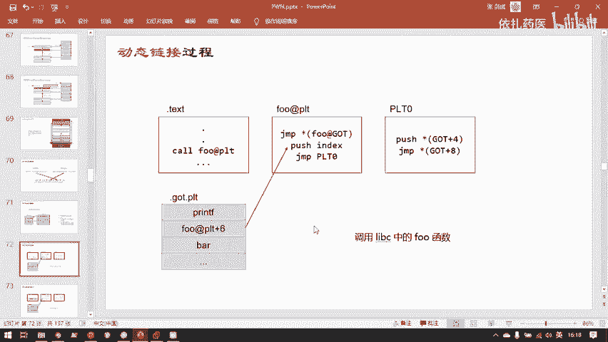

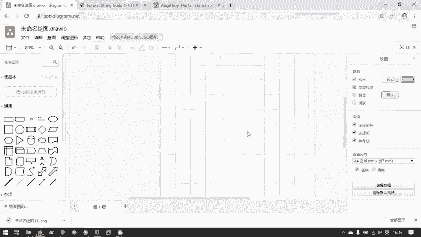

## 动态链接的挑战与解决方案

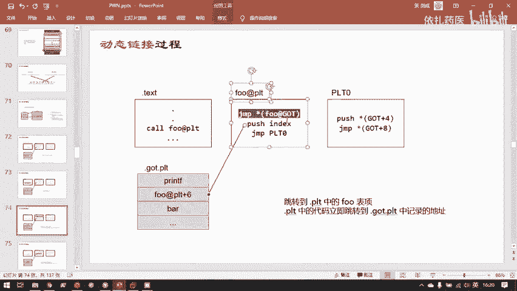

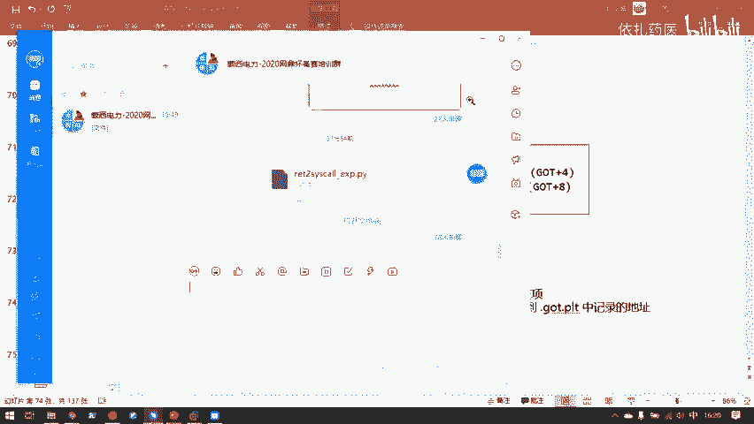

程序无法在动态链接库刚载入时就获知函数地址，原因主要有两个：
1.  地址空间布局随机化（ASLR）技术会随机化动态库的加载地址。
2.  即使关闭ASLR，不同的电脑平台和环境也会导致地址不固定。

因此，需要一个在运行时解析函数地址的机制。这就是动态链接的核心过程。

我们可以通过调试来观察这个过程。在调试器中，我们可以看到 `libc-2.28.so` 这个动态链接库被载入内存。它存放在系统的 `/lib` 或 `/usr/lib` 等目录下，类似于Windows系统中的DLL文件。程序会将该库整个映射到自己的内存空间，我们需要的函数（如 `puts`）的代码就在其中，但程序起初并不知道它的确切地址。

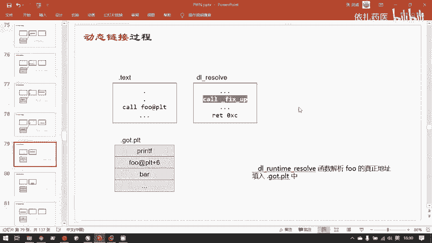

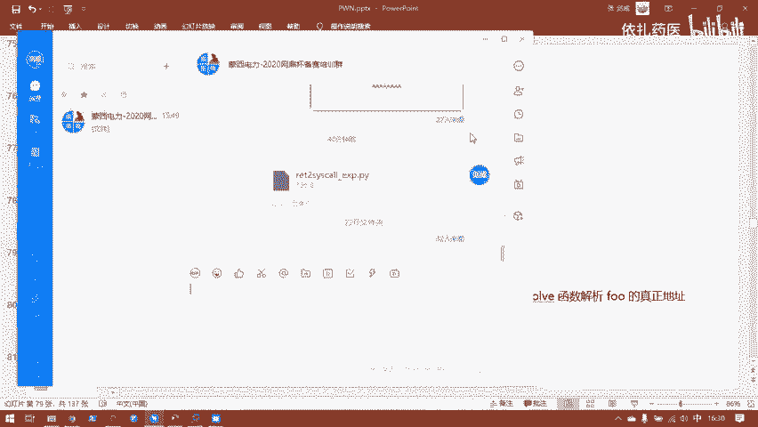

动态链接的解决方案涉及几个关键数据结构。程序的可执行文件中包含一个特殊的节（section），称为 **`.plt`**（过程链接表）。`.plt` 节里存放了一小段代码，专门用于在首次调用某个库函数时，解析该函数在 `libc` 代码段中的真实地址。

解析出的地址会被填入另一个叫做 **`.got.plt`**（全局偏移表-过程链接表）的节中，这个节位于数据段。此后，程序再调用该函数时，就可以直接从 `.got.plt` 中获取地址并跳转执行。

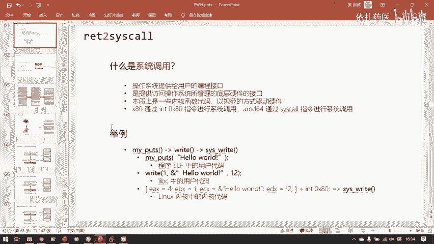

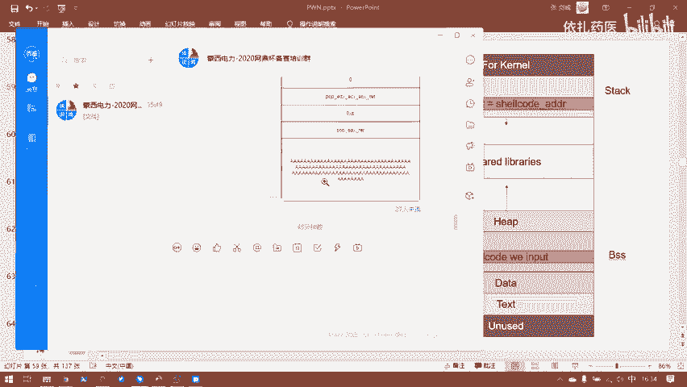

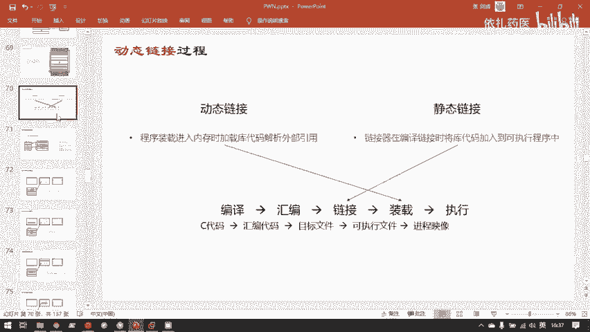

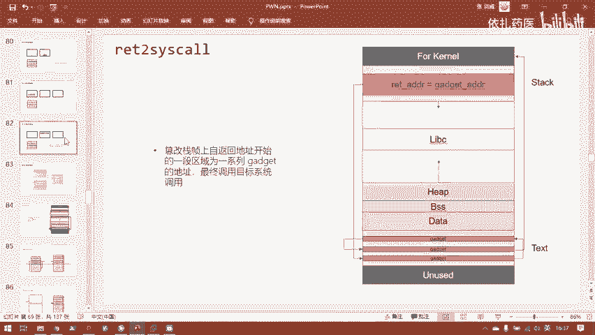

## 动态链接的关键结构

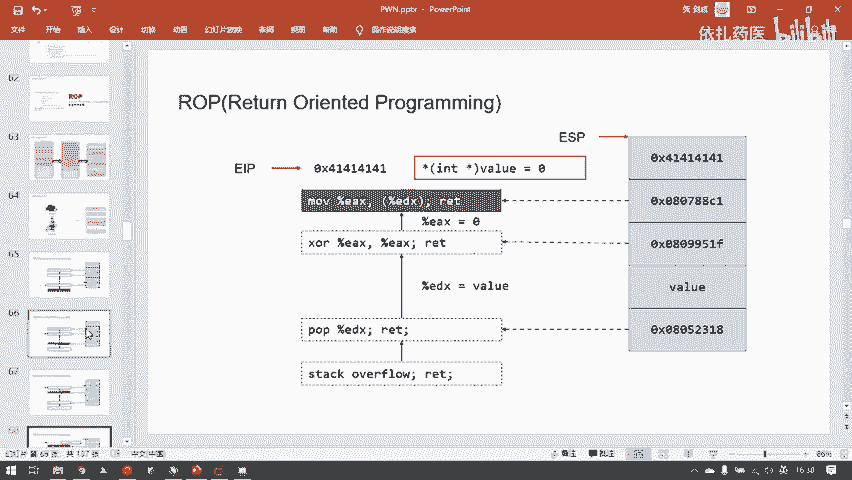

以下是动态链接程序特有的关键结构，静态链接的程序没有这些部分：
*   **`.dynamic` 节**：提供了动态链接所需的所有元信息，描述了其他表的位置和组织方式。
*   **`link_map` 结构**：保存了已载入的动态链接库链表。一个程序可能载入多个库（如基本的 `libc`、图形库等），`link_map` 记录了它们。
*   **`_dl_runtime_resolve` 函数**：这是解析函数真实地址的核心函数。它被 `.plt` 中的代码调用，并将解析出的地址写入 `.got.plt`。
*   **`.got` 与 `.got.plt` 节**：全局偏移表。`.got` 保存全局变量的地址，`.got.plt` 则专门保存函数的地址。

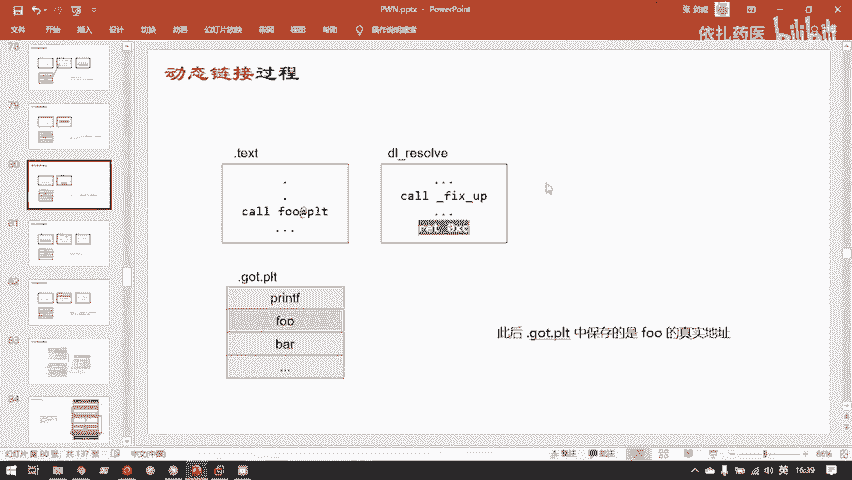

## 动态链接流程详解（首次调用）

接下来，我们通过一个流程图来详细讲解首次调用动态库函数（例如 `foo`）的完整过程。假设 `foo` 是 `libc` 中的一个函数。

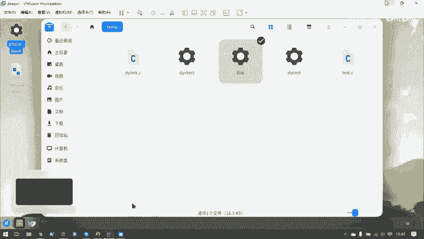

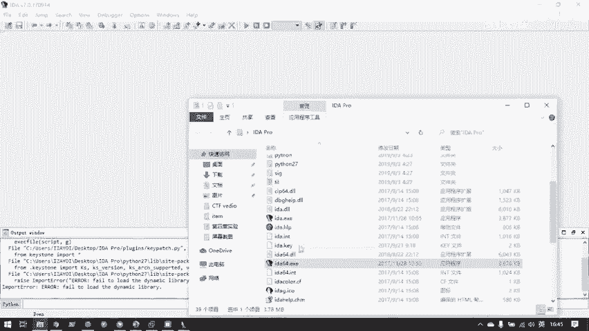

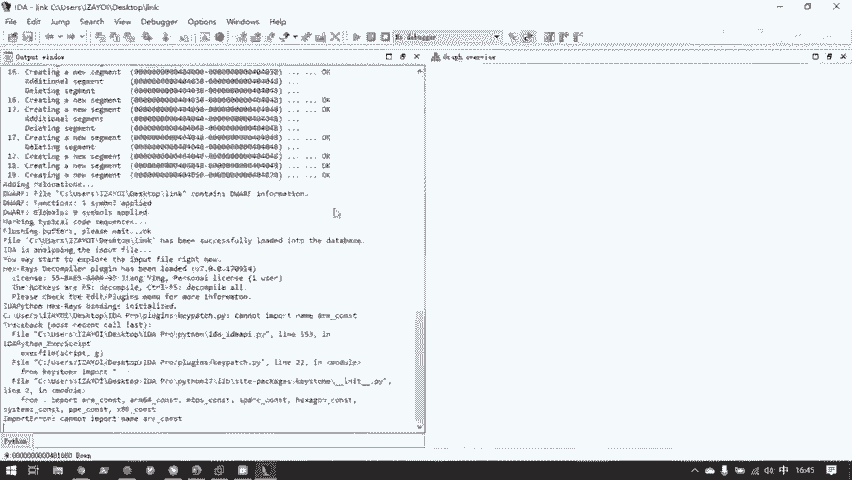

以下是动态链接首次解析函数地址的核心步骤：
1.  **程序调用 `foo`**：在 `main` 函数的代码段中，执行 `call foo`。
2.  **跳转至 `.plt` 表**：由于不知道 `foo` 的真实地址，`call` 指令实际上跳转到 `.plt` 节中 `foo` 对应的条目（`foo@plt`）。
3.  **`.plt` 查询 `.got.plt`**：`foo@plt` 的第一条指令是跳转到 `.got.plt` 表中 `foo` 对应的条目地址。
4.  **`.got.plt` 初始状态**：在首次调用时，`.got.plt` 中 `foo` 的条目里存放的并不是真实地址，而是 `foo@plt` 中第二条指令的地址。因此，跳转又回到了 `.plt` 节。
5.  **准备解析参数**：`foo@plt` 接下来的指令会压栈两个参数：
    *   `index`：函数在 `.plt`/`.got.plt` 表中的索引号，用于标识要解析的是哪个函数。
    *   `link_map` 信息：标识从哪个动态链接库中查找该函数。
6.  **调用解析函数**：最后，`foo@plt` 跳转到 `_dl_runtime_resolve` 函数。
7.  **地址解析与回填**：`_dl_runtime_resolve` 根据参数进行一系列复杂计算，找到 `foo` 在内存中的真实地址，并将其回填到 `.got.plt` 表中 `foo` 对应的条目里。
8.  **跳转执行**：解析完成后，程序跳转到 `foo` 函数的真实地址开始执行。

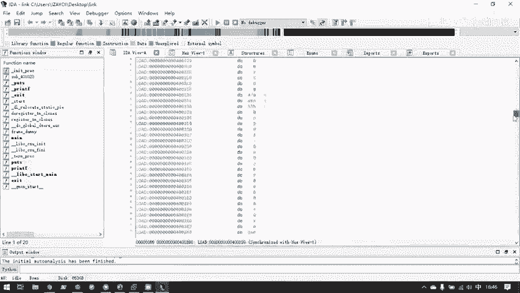

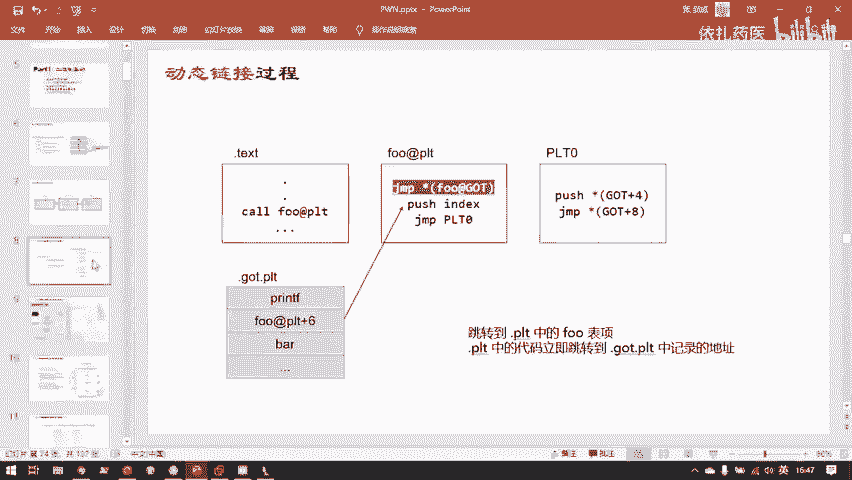

## 动态链接流程（后续调用）

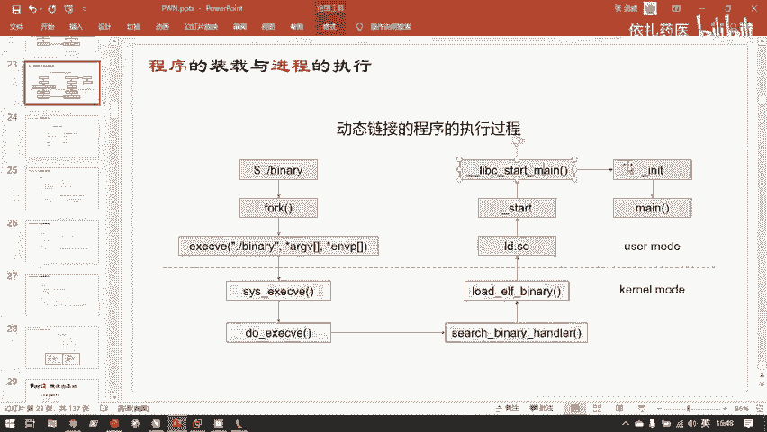

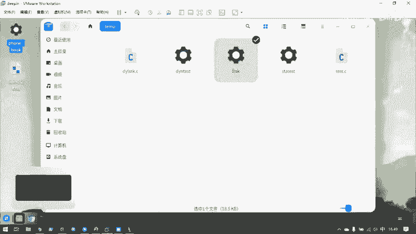

理解了首次调用的复杂过程后，后续调用就非常简单了。

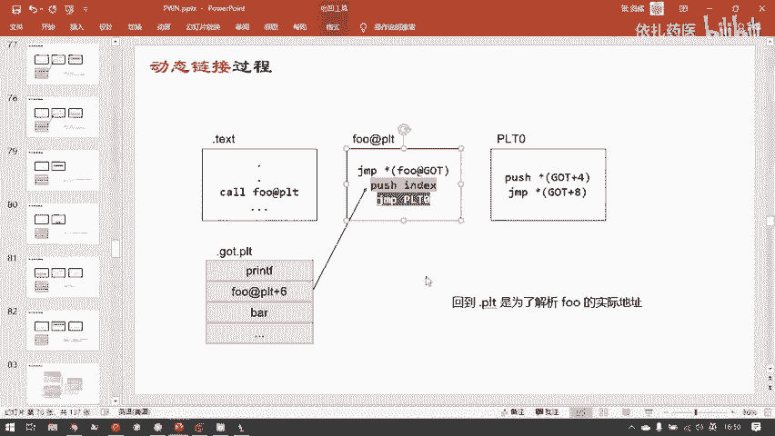

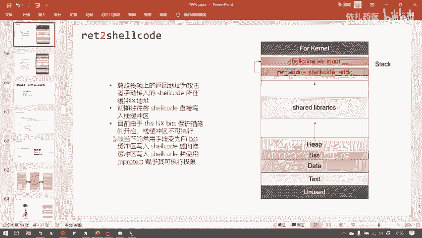

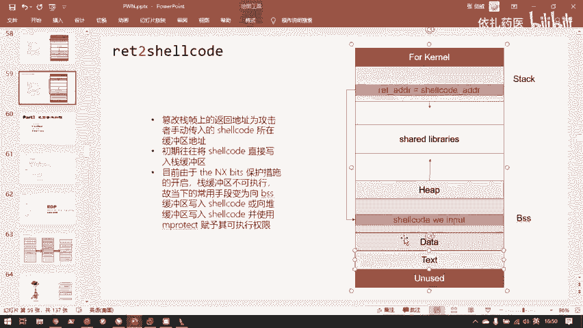

当程序第二次调用 `foo` 函数时，流程如下：
1.  `call foo` 依然跳转到 `foo@plt`。
2.  `foo@plt` 的第一条指令跳转到 `.got.plt` 表中 `foo` 的条目。
3.  此时，该条目中已经保存了首次调用时解析出的 `foo` 的真实地址。
4.  因此，程序直接跳转到 `libc` 中的 `foo` 函数执行，无需再次解析。

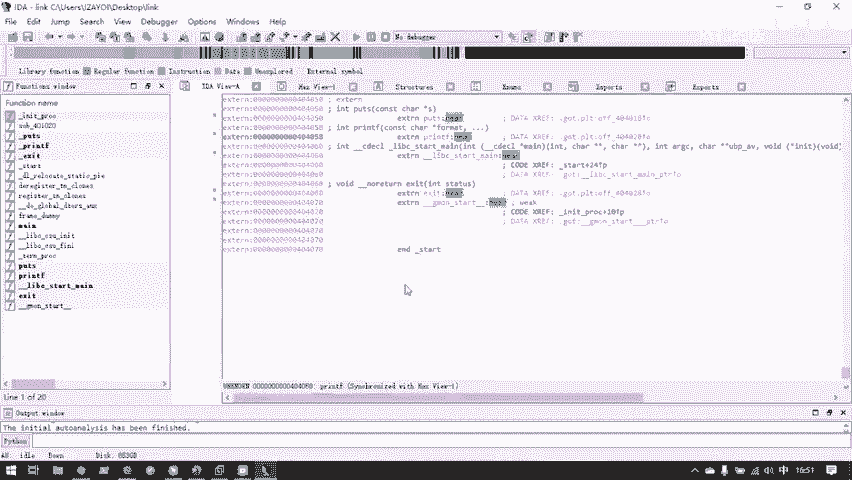

**总结**：动态链接通过“延迟绑定”技术，将函数地址的解析推迟到第一次调用发生时。首次调用较慢，需要执行解析流程；后续调用则直接通过 `.got.plt` 表跳转，速度很快。`.plt` 负责跳转和触发解析，`.got.plt` 负责存储最终地址，`_dl_runtime_resolve` 是背后的解析器。

## 实践：使用 GDB 观察动态链接

现在，让我们通过实际编写和调试一个程序，来验证上述理论。

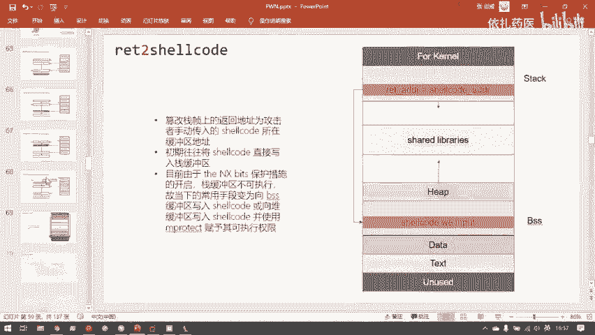

我们编写一个简单的C程序 `dynamic_test.c`：
```c
#include <stdio.h>
#include <stdlib.h>

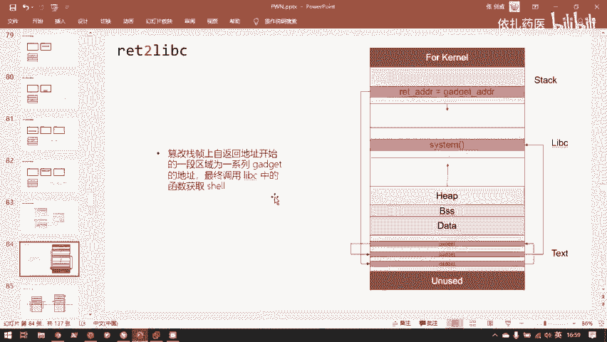

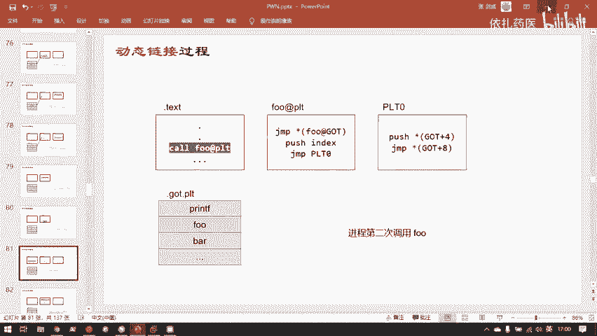

int main() {
    puts("First call"); // 第一次调用
    puts("Second call"); // 第二次调用
    printf("Hello\n"); // 调用另一个库函数
    exit(0); // 调用退出函数
}
```
使用以下命令编译（关闭PIE以便调试）：
```bash
gcc -no-pie -g -o dynamic_test dynamic_test.c
```
使用GDB进行调试：
```bash
gdb dynamic_test
```
在GDB中，我们可以使用 `plt` 命令（如果安装了 `pwndbg` 等增强插件）或手动查看内存来观察 `.plt` 和 `.got.plt` 的内容。

**关键调试步骤与命令**：
1.  **查看 `.plt` 节**：反汇编 `.plt` 节，可以看到 `puts@plt`， `printf@plt`， `exit@plt` 等条目，每个条目包含 `push index; jmp [地址]` 这样的指令模式。
2.  **查看 `.got.plt` 初始状态**：在程序运行前（`start` 命令之后），使用 `x/3gx &` 命令查看 `.got.plt` 的前几项。会发现它们指向的是对应 `@plt` 条目的第二条指令地址（即准备解析参数的代码地址）。
3.  **单步执行并观察变化**：
    *   单步执行第一次 `puts` 调用后，再次查看 `.got.plt`。会发现 `puts` 对应的条目值变成了一个指向 `libc` 内部的地址（即 `puts` 的真实地址），而 `printf` 和 `exit` 的条目仍未改变。
    *   继续执行第二次 `puts` 调用，`.got.plt` 无变化，因为地址已解析。
    *   执行 `printf` 调用后，其对应的 `.got.plt` 条目也会被更新为真实地址。
    *   执行 `exit` 后程序退出。

通过这个调试过程，你可以清晰地看到函数地址从指向 `.plt` 中的解析桩代码，到被替换为 `libc` 中真实地址的整个过程。

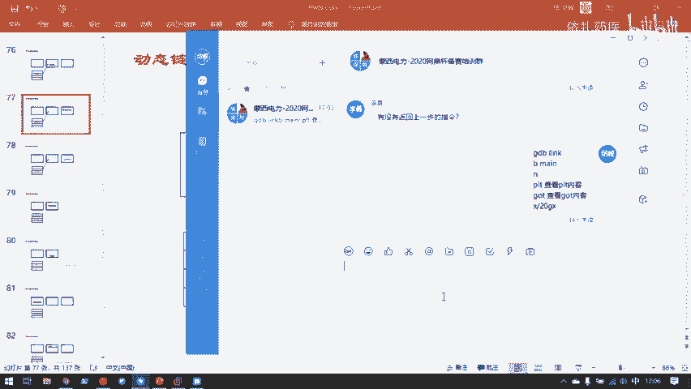

## 常用 GDB 调试命令补充

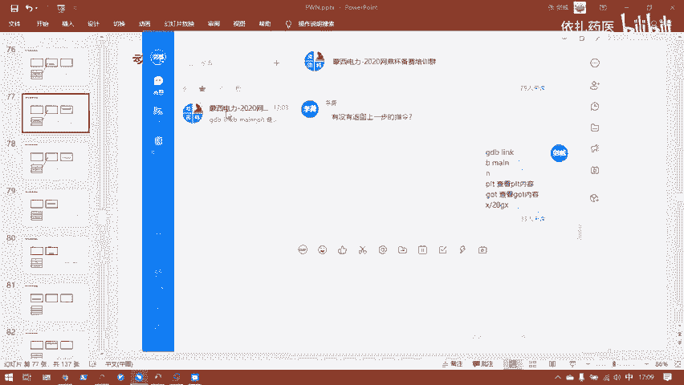

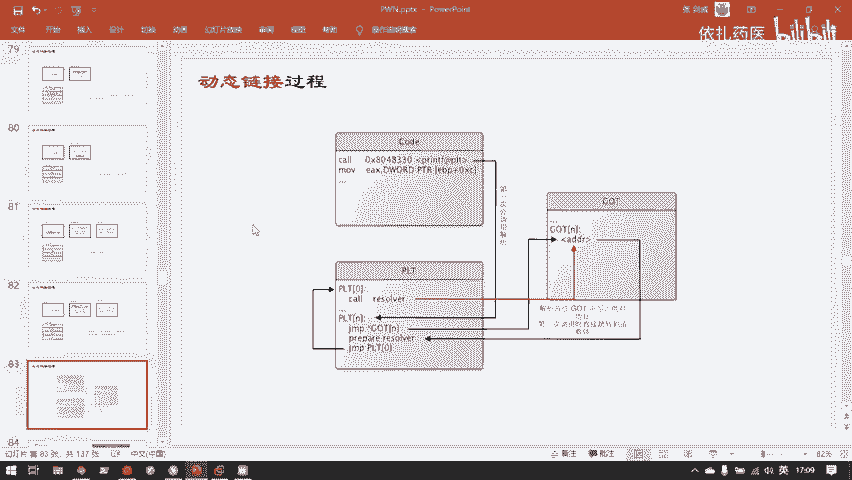

在动态链接的调试和分析中，以下GDB命令非常实用：
*   `start`：开始运行程序，并在 `main` 函数入口暂停。
*   `b *<地址>` 或 `b <函数名>`：在指定地址或函数处设置断点。
*   `n` (next)：执行下一行源代码（不进入函数内部）。
*   `s` (step)：执行下一行源代码（会进入函数内部）。
*   `c` (continue)：继续运行，直到遇到下一个断点或程序结束。
*   `x/<长度><格式> <地址>`：查看指定地址的内存内容。例如 `x/3gx 0x404018` 以16进制格式查看该地址开始的3个8字节数据。
*   `info b`：查看所有断点信息。
*   `d <断点编号>`：删除指定编号的断点。
*   `bt` (backtrace)：显示当前的函数调用栈。
*   `return`：强制从当前函数返回，常用于快速跳出复杂的库函数内部。

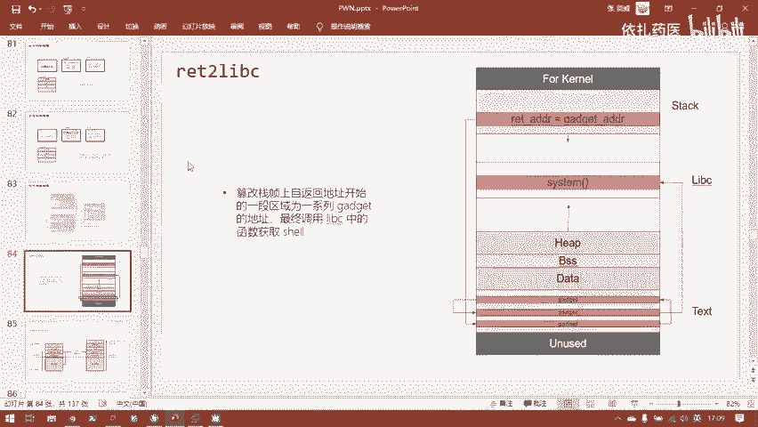

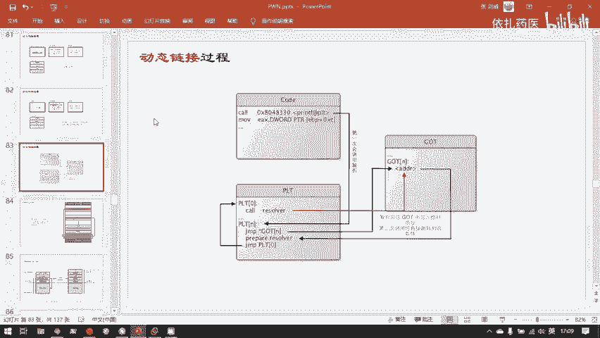

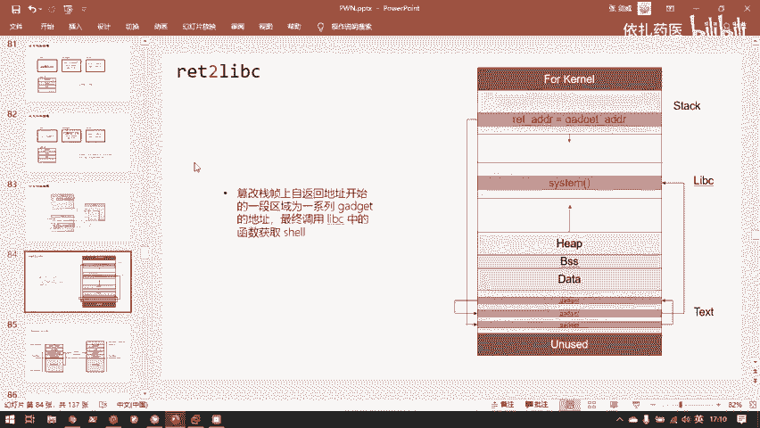

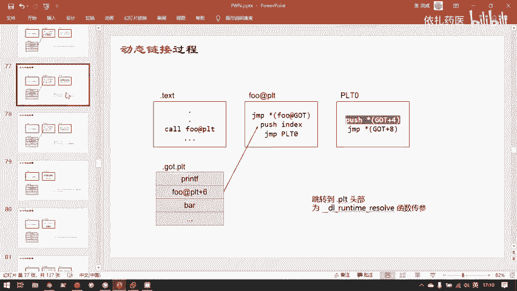

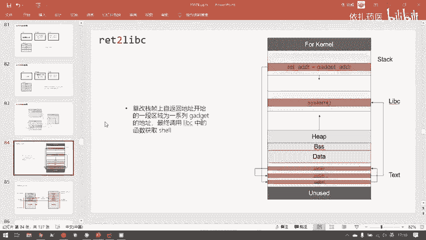

本节课中我们一起学习了动态链接的完整过程。我们从静态链接与动态链接的基本区别讲起，深入探讨了程序在运行时如何通过 `.plt`、`.got.plt` 和 `_dl_runtime_resolve` 协同工作，实现动态库函数的“延迟绑定”。最后，我们通过GDB调试实战，观察了内存中这些数据结构的变化，巩固了对理论的理解。这一机制是理解后续 `ret2libc` 等利用技术的关键基础，请务必熟练掌握。