# 护网行动红蓝攻防教程：P95：3.ret2libc

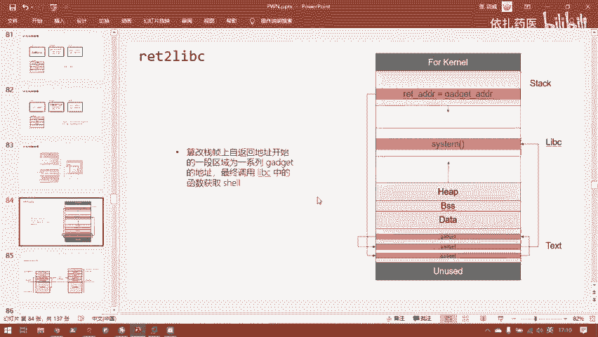

## 📖 概述
在本节课中，我们将学习一种名为 **ret2libc** 的攻击手法。这种攻击依赖于ROP（Return-Oriented Programming）技术，利用程序本身或动态链接库中的代码片段（gadget）来构造执行环境。与之前直接执行shellcode不同，ret2libc的目标是返回到libc库中的特定函数（如 `system` 函数）来获取shell。我们将通过一道具体的题目，分析其面临的困难，并详细讲解攻击的构建过程。

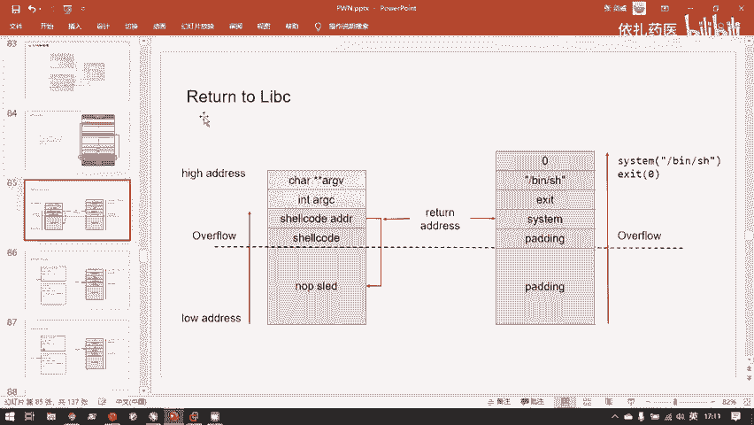

---

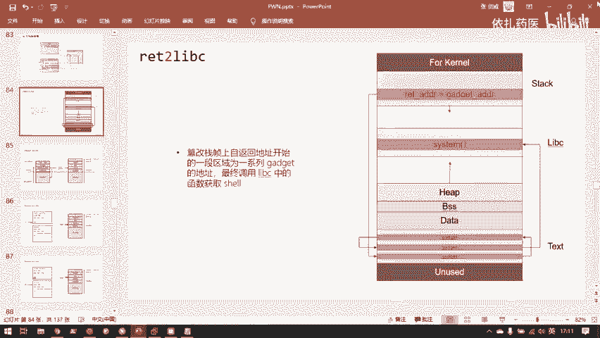

## 🔍 题目分析与新挑战

上一节我们介绍了基础的ROP攻击。本节中，我们来看看ret2libc的第一道题目，并了解它带来了哪些新的挑战。

首先，我们检查程序的基本信息。这是一个32位程序，开启了NX保护（栈不可执行），但没有开启PIE（地址随机化）。使用IDA进行反编译，可以看到主函数逻辑非常简单：在栈上开辟了一个缓冲区，并使用不安全的 `gets` 函数向其中读入任意长度的字符串。这造成了栈溢出漏洞。

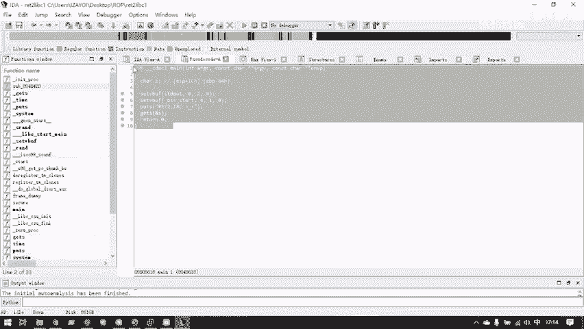

这个漏洞点与我们上一题（ret2syscall）看起来完全相同。那么，上一题的攻击方法在这里还能奏效吗？

我们按照上一题的流程进行检验。首先寻找可用的gadget来为系统调用设置寄存器。然而，执行ROPgadget搜索命令后，发现可用的gadget数量极少（仅7个），且没有能满足我们设置所有寄存器需求的片段。这与上一题形成了鲜明对比。

**原因在于程序的链接方式**。上一题是静态链接程序，包含了大量库函数代码，因此可用的gadget非常多。而本题是动态链接程序，其代码量大幅减少，导致难以找到足够的gadget来构造一次完整的系统调用。

既然直接系统调用（ret2syscall）行不通，我们考虑其他已学手法。例如，检查程序中是否存在后门函数。我们确实发现一个名为 `secure` 的函数，其中调用了 `system("/bin/sh")`。这看起来像是一个后门。

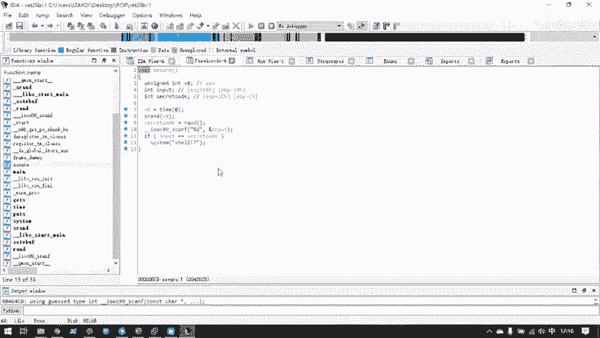

然而，仔细分析 `secure` 函数：它生成一个随机数，要求用户输入匹配，只有猜中才会执行 `system("/bin/sh?")`。这里的命令 `"/bin/sh?"` 是无效的，无法产生shell。因此，即使我们成功劫持控制流到 `secure` 函数并猜中随机数，攻击也无法成功。

虽然 `secure` 函数本身无用，但它为我们留下了一份重要的“遗产”。

---

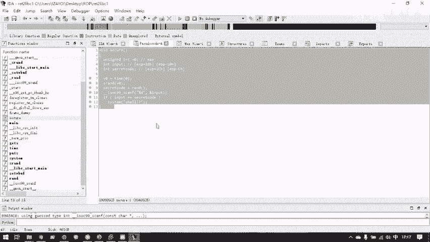

## 💡 ret2libc的核心思路：利用PLT/GOT

`secure` 函数虽然无法直接利用，但它调用了 `system` 函数。这导致了一个关键变化：程序的 **PLT（Procedure Linkage Table）** 中增加了 `system` 函数的条目。

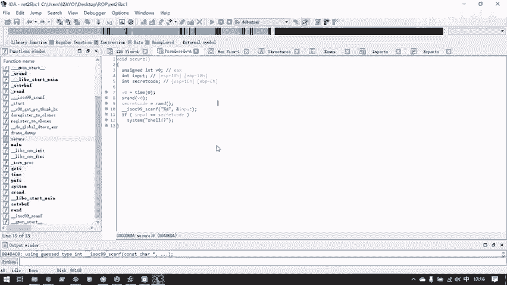

为什么这很重要？在动态链接中，程序调用库函数（如 `printf`）时，并非直接跳转到libc中的代码，而是先跳转到自身PLT表中对应的条目。PLT条目会自动完成一系列重定位操作，最终跳转到libc中的真实函数地址。

因此，对我们而言，跳转到 `system` 函数的PLT条目地址，与直接跳转到libc中的 `system` 函数，最终效果是一样的。中间的重定位过程对攻击者是透明的。

以下是寻找 `system` 函数PLT地址的方法：
```bash
# 在IDA的PLT节中查看，或使用objdump命令
objdump -d -j .plt ./ret2libc1 | grep system
```

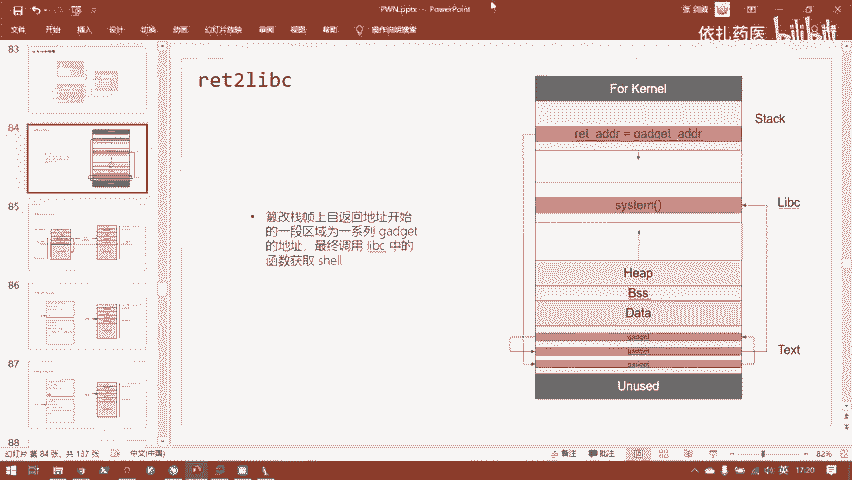

我们找到了 `system` 的PLT地址，这解决了“跳转到哪里”的问题。但还有一个关键问题：**如何为 `system` 函数传递参数？**

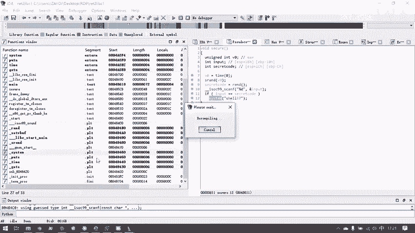

---

## 🧱 构建栈布局：传递参数与返回地址

在32位程序中，函数参数是通过栈传递的。调用函数前，调用者会将参数压入栈中。因此，我们需要在溢出后，精心构造栈上的数据布局。

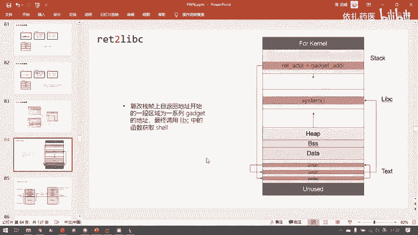

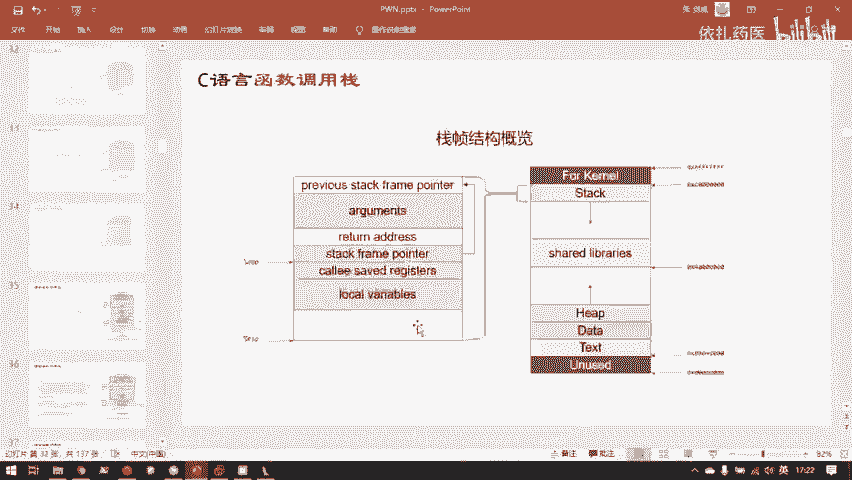

我们的目标是执行 `system("/bin/sh")`。在C语言中，字符串参数传递的是指向该字符串的指针，而非字符串内容本身。所以，我们还需要在内存中找到一个现成的 `"/bin/sh"` 字符串地址，或者自己写入一个。

幸运的是，在本题的只读数据段（.rodata）中，我们发现了一个现成的 `"/bin/sh"` 字符串，其地址为 `0x8048720`。

现在，我们可以设计攻击载荷的栈布局了。在覆盖返回地址后，栈需要被构造成以下结构：

```
| ... 填充数据 ... |
| system函数的PLT地址 |  <-- 覆盖原返回地址，控制流跳转至此
| 任意返回地址 (如exit地址) | <-- system函数执行后的返回地址
| "/bin/sh"字符串的地址 | <-- 传递给system的第一个参数
```

**为什么需要“任意返回地址”？**
因为在正常的函数调用中，`call` 指令会自动将返回地址压栈。而我们通过直接覆盖返回地址来跳转，相当于跳过了 `call` 指令。因此，我们需要手动在栈上放置一个地址，作为 `system` 函数执行完毕后的返回地址，以保证程序能平稳退出（或进行下一步攻击），避免崩溃。

最终，我们调用的实际上是 `system(0x8048720)`，而 `0x8048720` 处存放的正是字符串 `"/bin/sh"`。

---

## 🎯 总结
本节课我们一起学习了 **ret2libc** 攻击的基本原理。我们首先分析了动态链接程序在ROP攻击中面临gadget不足的新挑战。接着，我们发现了通过程序内调用 `system` 的函数，可以使其PLT表包含 `system` 条目，从而为我们提供了攻击跳转目标。最后，我们详细讲解了如何在32位环境下构造栈布局，以正确传递参数（`/bin/sh`字符串地址）和返回地址，从而成功调用 `system` 函数获取shell。

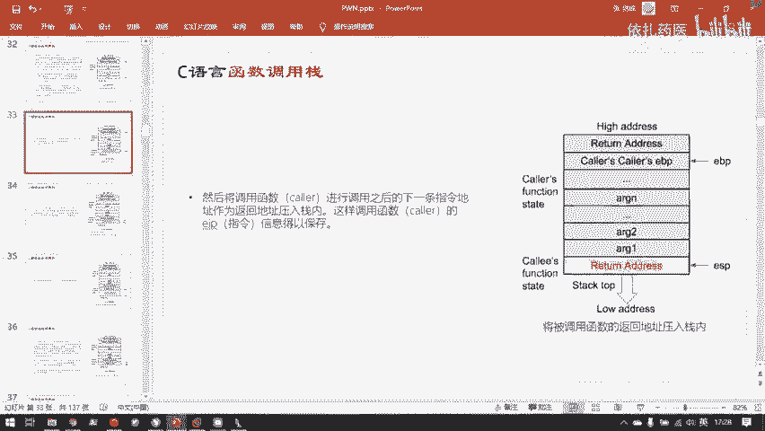

下一节，我们将动手实践，完成这道ret2libc1题目的漏洞利用。