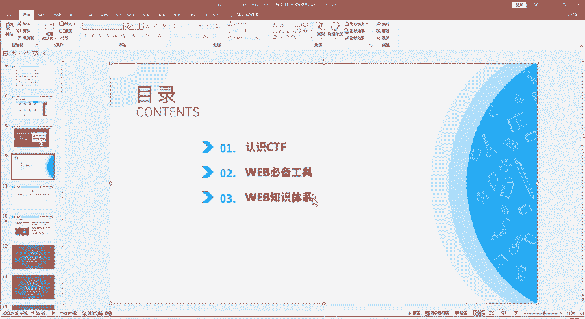
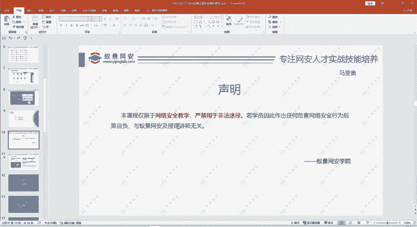
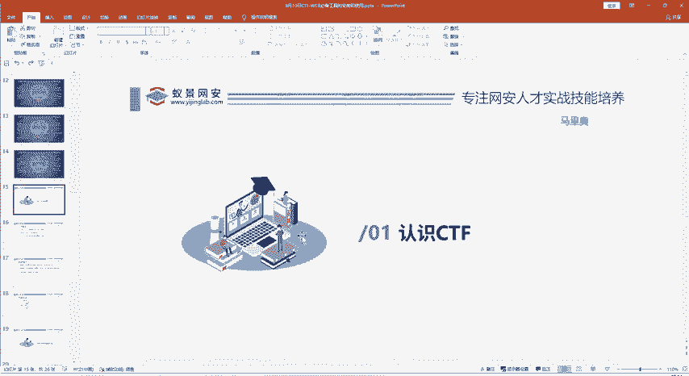
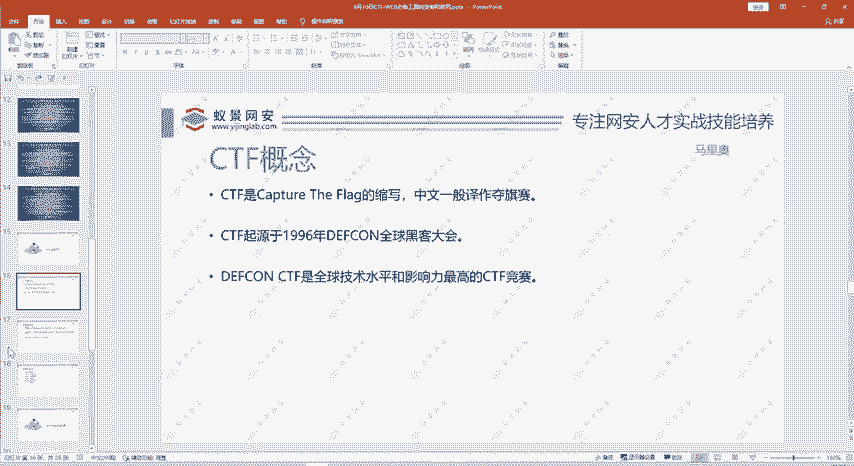
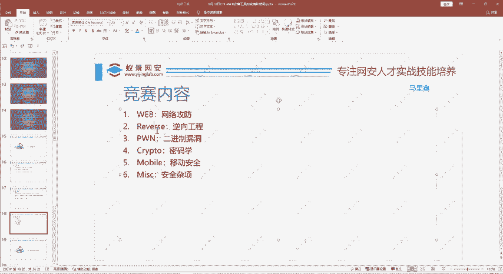
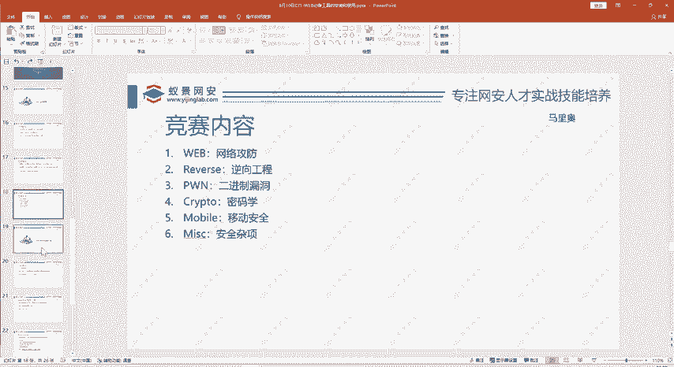
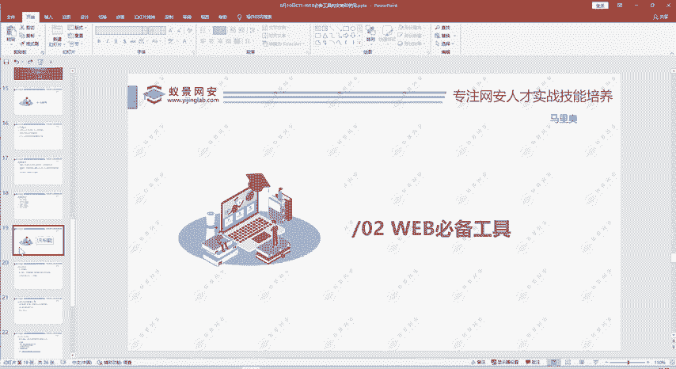
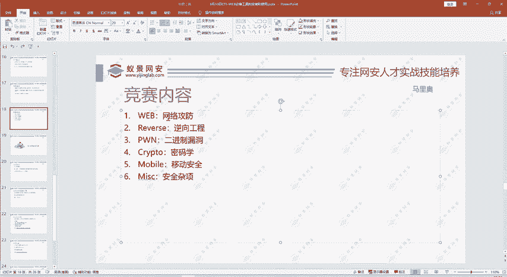
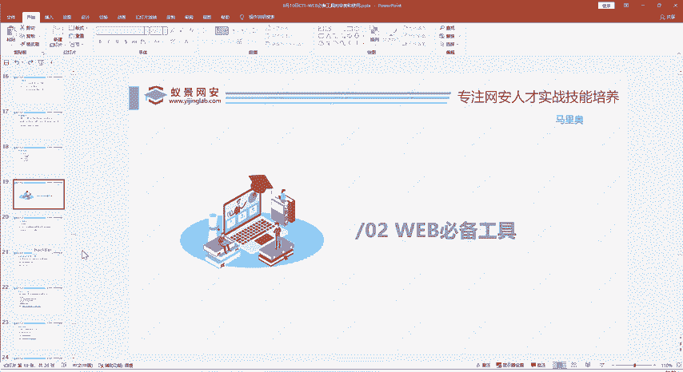
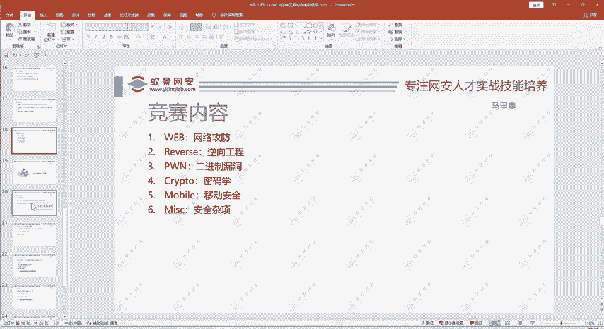

# 护网行动红蓝攻防教程：P96：1.CTF简单介绍和攻防流程 🚩

在本节课中，我们将要学习CTF（夺旗赛）的基础知识、竞赛形式以及Web安全方向的必备工具。课程内容分为三个主要部分：CTF概念介绍、Web方向必备工具安装与使用，以及CTF Web知识体系概览。

## 课程声明与法律警示 ⚖️

本课程内容仅限于网络安全技术教学，严禁用于任何非法途径。

网络安全风险日益增加，相关法律法规日趋完善。例如，《网络安全法》、《刑法》等均对网络攻击行为有明确规定。学习者应立志成为维护网络安全的“白帽子”，掌握技术的同时，必须遵守法律，杜绝攻击行为。

## 第一部分：CTF简介 🏁

上一节我们明确了学习边界，本节中我们来看看CTF到底是什么。

CTF是“Capture The Flag”（夺旗）的缩写，中文常称为“夺旗赛”。它起源于一种游戏：两队各自守护己方旗帜，并设法夺取对方旗帜。在网络安全领域，CTF竞赛则是通过技术手段而非体力来夺取“Flag”。

CTF竞赛起源于1996年的DEFCON全球黑客大会。当时，一群对计算机技术感兴趣的年轻人在论坛交流后，决定举办线下聚会切磋技术，这种形式逐渐演变为年度赛事。如今，DEFCON CTF已成为全球技术水平与影响力最高的CTF赛事。

经过20多年发展，CTF因其知识性、趣味性和严谨性而日益流行。目前各类CTF赛事繁多，从国际大赛到国内月度赛事，再到高校、企业及政府部门组织的比赛，为学习者提供了广阔的实践舞台。

## 第二部分：CTF竞赛模式与内容分类 🥇

了解了CTF的起源后，我们来看看它的具体竞赛形式和内容分类。

CTF竞赛主要有三种模式：
1.  **解题模式 (Jeopardy)**：参赛者通过解决特定的网络安全技术挑战（如找出系统漏洞或程序Bug）来获取Flag，提交后得分。此模式常见于线上比赛。
2.  **攻防模式 (Attack-Defense)**：每支队伍维护自己的服务器，在攻击对方服务器漏洞获取Flag的同时，也要防御己方服务器。此模式多见于线下比赛。
3.  **战争分享模式 (War of Sharing)**：一种较新颖的模式，参赛队伍相互出题，最终综合解题与出题情况评分。

CTF竞赛内容通常涵盖六大方向：
*   **Web（网络攻防）**：涉及SQL注入、跨站脚本攻击(XSS)、文件上传/包含漏洞、PHP反序列化等。
*   **Reverse（逆向工程）**：分析二进制程序，理解其源代码逻辑与算法。
*   **Pwn（二进制漏洞利用）**：主要研究堆溢出、栈溢出等漏洞的利用。
*   **Crypto（密码学）**：考察古典与现代密码算法的理解与应用。
*   **Mobile（移动安全）**：聚焦Android/iOS平台应用的安全与逆向分析。
*   **Misc（杂项）**：涵盖隐写术、取证分析等前述分类未包括的内容。

学习建议是：在了解各个方向（广度）的基础上，根据个人兴趣与特长，选择1到2个方向进行深入钻研（深度）。例如，本课程主讲**Web方向**。

## 第三部分：Web方向知识体系与工具 🛠️

在明确了CTF的整体框架和Web方向的位置后，本节我们将聚焦Web方向，了解其知识体系和必备工具。

Web安全是CTF竞赛中的重要板块，其知识体系主要围绕常见漏洞展开。以下是Web方向的核心知识领域：
*   **SQL注入**：通过构造恶意SQL语句，干扰后台数据库查询。
    *   示例代码：`' OR '1'='1`
*   **跨站脚本攻击**：在网页中注入恶意脚本，盗取用户信息或进行其他攻击。
*   **文件上传漏洞**：利用网站上传功能的不严谨过滤，上传恶意文件。
*   **文件包含漏洞**：利用程序动态包含文件的特性，包含并执行恶意文件。
*   **PHP反序列化漏洞**：利用PHP反序列化机制中的缺陷执行任意代码。

工欲善其事，必先利其器。进行Web安全测试需要一些专业工具，以下是部分必备工具简介：
*   **浏览器开发者工具**：用于分析网页结构、网络请求和调试JavaScript。
*   **代理抓包工具**：用于拦截、查看和修改浏览器与服务器之间的HTTP/HTTPS请求。
*   **漏洞扫描器**：用于自动化检测网站中存在的常见安全漏洞。
*   **编码/解码工具**：用于对数据进行各种编码（如Base64、URL编码）和解码操作。

每个安全方向都有其价值，并无高低之分。关键在于学习者是否精通。在CTF团队中，精通某个方向的成员往往不可或缺。

## 总结 📝

本节课中我们一起学习了CTF竞赛的基本概念、三种主要竞赛模式（解题、攻防、战争分享）以及六大内容方向（Web、Reverse、Pwn、Crypto、Mobile、Misc）。我们特别聚焦于**Web安全方向**，概述了其核心知识体系（如SQL注入、XSS等）和必备工具。请大家牢记网络安全法律法规，将所学知识用于正当途径，不断提升技能。