# 护网行动红蓝攻防教程：P97：2.WEB攻防常用工具 🛠️

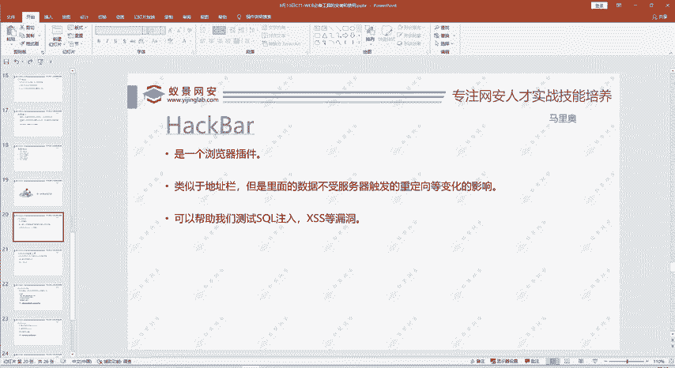

在本节课中，我们将要学习在WEB攻防实战中几个核心且常用的工具。这些工具能极大提升渗透测试、漏洞挖掘和应急响应的效率。我们将逐一介绍它们的基本功能、安装方法及简单使用场景。

## 概述
本节课程将涵盖四类WEB攻防必备工具：浏览器插件HackBar、WebShell管理工具（蚁剑/冰蝎/哥斯拉）、拦截与自动化测试工具Burp Suite，以及SQL注入自动化工具SQLmap。掌握这些工具是进行有效安全测试的基础。

---

### HackBar浏览器插件 🔧

HackBar是一个集成在浏览器中的安全测试插件。它方便测试人员快速修改和发送HTTP请求，尤其适用于处理GET/POST参数、编码解码和常见Payload测试。

上一节我们介绍了课程概述，本节中我们来看看第一个工具HackBar。

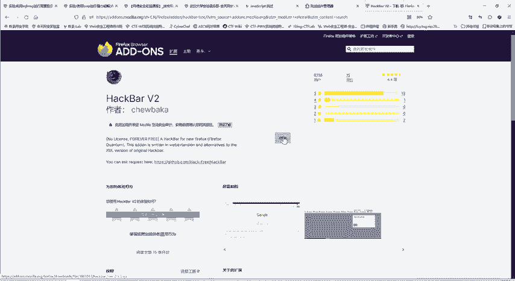

HackBar是一个浏览器插件。例如，我们访问一个本地搭建的靶场环境。在页面中点击检查，即可看到HackBar工具选项。可以将当前URL直接导入到插件中。

在插件界面可以进行各种操作。通常传递参数使用GET方法，即在URL问号后添加参数名和参数值。但传递POST数据则不太方便。

使用HackBar工具，可以直接点击“Post data”选项。在输入框中填入需要以POST方式传递的内容。这个工具功能很多，包含哈希计算（如MD5、SHA1）、Base64编码解码，以及SQL注入、XSS等常见测试语句。功能全面且强大，使用起来非常简单，因为它直接集成在浏览器中。

点击右键检查即可进入开发者工具。切换到HackBar标签页即可使用。

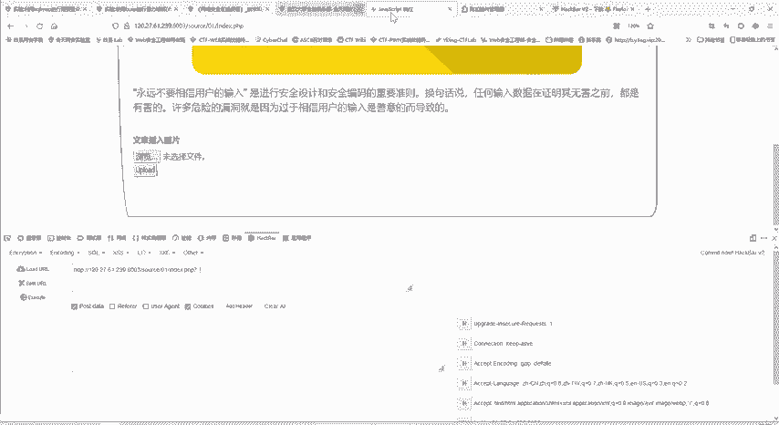

那么如何安装呢？有人可能点击右键检查后，发现没有HackBar这个插件。这个插件需要手动安装才能使用。

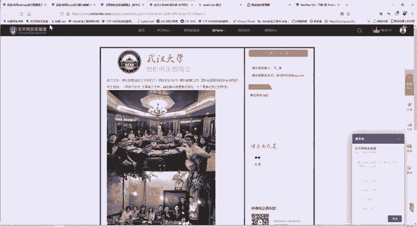

安装方法是在浏览器的扩展管理页面进行搜索。直接搜索“HackBar”。网络速度可能较慢，安装其他插件也是同样的方法。点击浏览器的扩展或主题管理，在搜索框进行搜索即可。

搜索后会显示结果。HackBar有不同版本。上方版本使用较多，但需要付费，请酌情选择。下方的HackBar V2版本是免费的，点击进入后直接添加即可安装。

如果后续不想使用该插件，同样在此页面点击移除即可删除。

添加成功后，在浏览器的任意网页中点击右键检查，就能看到HackBar选项。其他功能也都具备，还可以添加Cookie等信息。

对于谷歌浏览器，方法相同，在扩展商店搜索即可。这里不演示谷歌浏览器的原因是其商店访问需要特殊网络环境。360浏览器可能搜索不到，但同样可以安装。想安装的同学可以联系课程班主任。即使浏览器自带市场搜索不到，也可以通过其他方式安装。联系班主任后，会提供安装链接或所需的学习资料。

HackBar的一个优点是其中的数据不受服务器重定向变化的影响。这意味着在插件界面输入的内容会保持不变。例如，在做SQL注入题目时，作用非常明显。

在插件中测试`id=1`或`id=2`时，URL会直接变化。如果在浏览器地址栏输入，每次重定向会比较麻烦。但在HackBar中输入并执行，操作就简单很多。如果需要用POST方法传递数据，在插件中输入也非常方便。

它还集成了编码解码、加密以及测试SQL注入、XSS漏洞等功能。因此，这个插件是我们经常使用的工具之一。

---

### WebShell管理工具 🐜

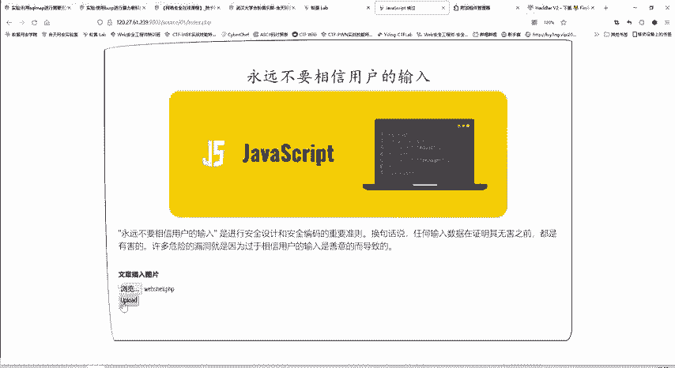

第二个工具是WebShell管理工具。大家可能都听说过一句话木马。将木马上传到服务器后，如何进行连接和管理呢？

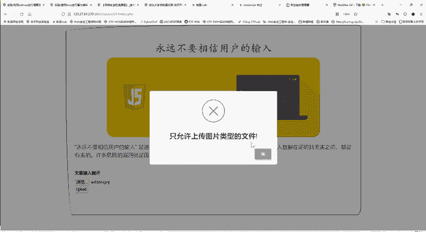

一句话木马就是一段简短的代码。例如：
```php
<?php @eval($_POST['pass']);?>
```
这就是一个一句话木马。将这段代码传到服务器上，就可以控制服务器。但如何控制呢？这就需要通过WebShell管理工具来实现。

主要有三种工具：蚁剑、冰蝎和哥斯拉。之前的中国菜刀使用较多，但现在已逐渐淘汰，且很多下载版本带有后门。因此，这里介绍蚁剑、冰蝎和哥斯拉这三种。

例如，蚁剑如何使用呢？这里看一下文件上传漏洞中的例子。这是蚁剑的下载安装包，分为两部分：`loader`（加载器）和源代码。如何安装呢？

将两个文件解压缩后，进入`loader`文件夹，里面有一个可执行文件。由于我这里已经安装过，所以不会出现初始化的界面。初次安装时会出现初始化，要求选择工作目录。此时选择源代码所在的目录即可。

这些工具如果没有，可以联系班主任领取。班主任是大家的学习助手，学习中有任何困难或疑问，都可以联系班主任。

同样，冰蝎和哥斯拉也是类似的工具。之所以介绍三种，是因为在某些场景下，某种软件可能被封锁无法使用。尤其是在参加护网比赛或某些内部比赛时，可能无法连接互联网，或者某些软件被禁用，这时就需要使用其他替代工具。

如何使用呢？其实使用起来很简单。只要跟着操作即可。例如，这里是一个文件上传漏洞的题目。我们可以上传一个文件。查看`webshell.php`的内容，就是我们刚才写的一句话木马。然后进行上传。

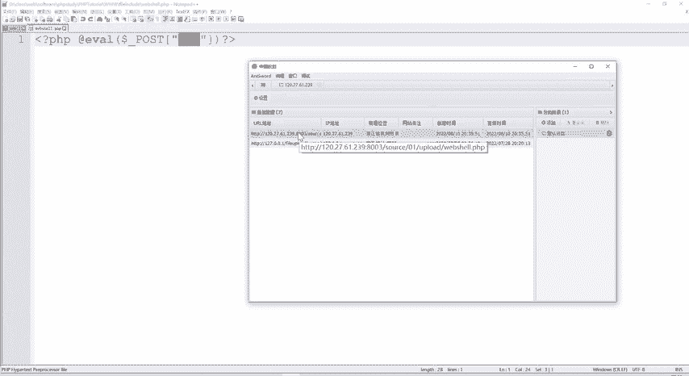

通常直接上传木马是不被允许的，会有各种限制。这里提示只允许上传图片。但在比赛或做题时，目标就是上传木马以获取服务器权限。这时就需要绕过限制。这是文件上传漏洞的题目，后续在讲解文件上传漏洞类型时，会详细讲解解题原理。这里我们直接演示操作。

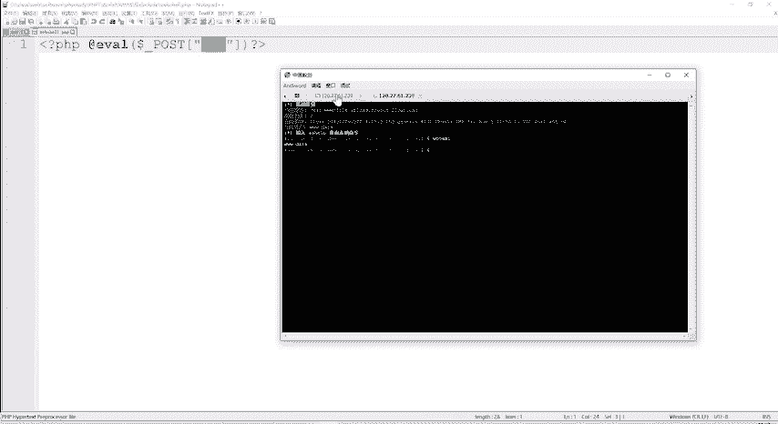

现在上传成功了，因为我们在设置中关闭了JavaScript检查。这时服务器以为我们上传了一个图片，但实际上我们上传的是木马。

打开上传的`webshell.php`文件，发现页面没有显示内容，也看不到源码。那么上传的一句话木马就没用了吗？不是的。这时就需要利用蚁剑工具来连接木马。

在蚁剑界面空白处右键，点击“添加数据”。将复制的URL粘贴过来。连接密码是什么？就是你上传的WebShell中使用的参数值，参数名也叫连接密码。这里保持两者一致即可。无论参数名是`cmd`、`password`还是其他，都可以。

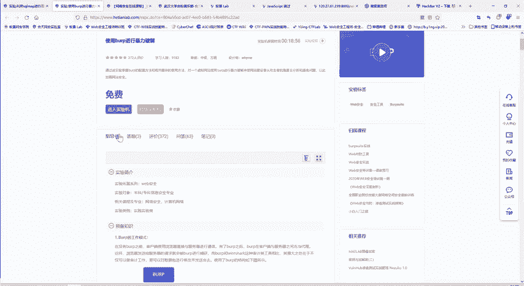

点击测试连接，出现连接成功的标志，说明木马已被激活。然后添加这条数据。双击新添加的数据，可以看到服务器已经被我们控制。可以查看目录结构、文件夹内容等。例如，`tmp`目录下有一个`flag.php`文件，里面就是flag值。做CTF题目也是这个过程：获取服务器权限，查看文件找到flag，然后复制提交。

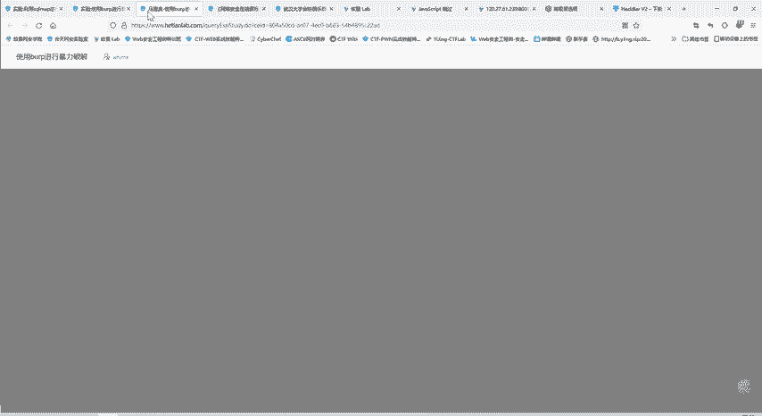

但它的功能远不止查看文件。右键点击可以打开虚拟终端，像在本地一样执行命令。所以，这一小段代码配合蚁剑工具就能发挥强大作用。

这些安装包和资料都可以找班主任获取。蚁剑、冰蝎和哥斯拉就不一一详细介绍了，因为它们的使用方式类似。我们课程时间安排比较紧凑，后面还有很多内容要讲。

---

### Burp Suite 拦截与测试工具 🛡️

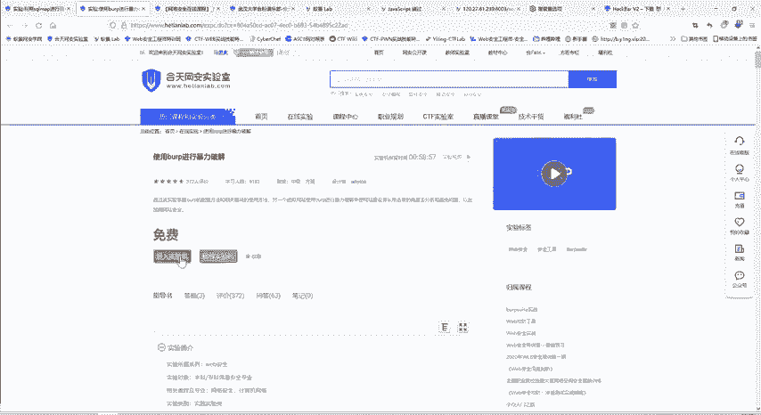


现在介绍在WEB安全中最常用、必不可少的工具：Burp Suite。Burp Suite是什么？它是一个用Java编写的、用于测试Web应用程序安全性的图形化工具。

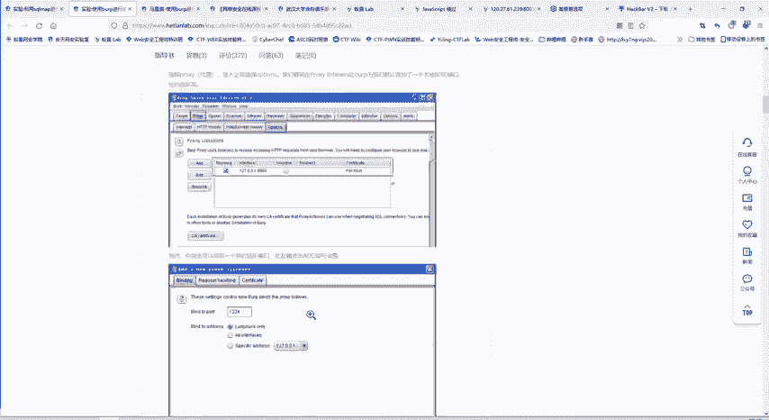

它的主要功能包括：拦截、查看或修改HTTP请求和响应；自动化扫描Web应用程序的安全漏洞；自动化攻击漏洞；以及自动解码。

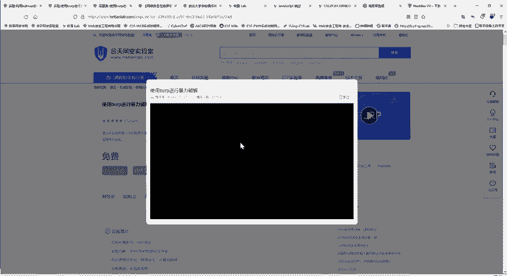

如何使用Burp Suite呢？核天网安实验室有相应的实验。我之前已经打开过实验环境。点击创建虚拟机，然后进入虚拟机。如果创建时间过长或出现问题，可以释放实验机后重新创建。

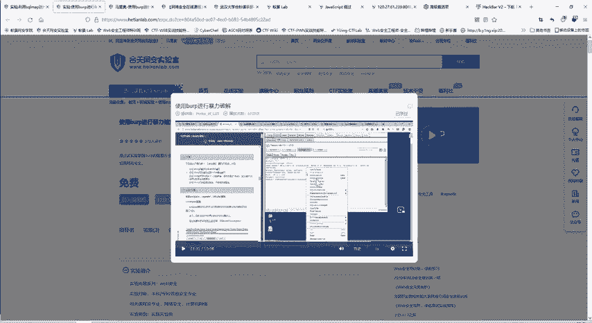

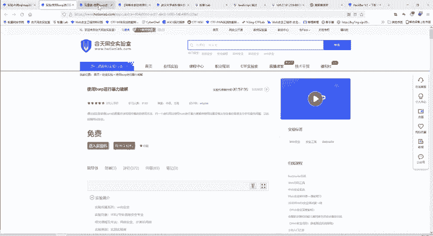

每个实验都配有解说视频、文字指导书、实验机和实操环境，是三合一的。既有文字，又有视频和实操，确保大家能学懂、学透彻，并且自己会操作。

这里介绍了Burp Suite的工作模式。原本浏览器直接访问服务器，服务器响应也直接发给浏览器。加入Burp后，它在中间充当代理。浏览器将请求发给Burp，Burp再转发给服务器；服务器的响应也先发给Burp，再由Burp转发给浏览器。在这个过程中，Burp可以进行拦截、修改、扫描和攻击等操作。这是Burp存在的工作模式。

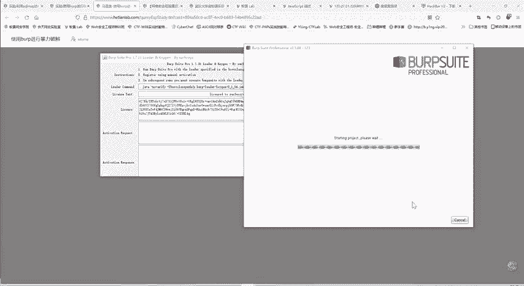

Burp可以用于暴力破解等。我们在本机也可以进行暴力破解。实验指导书详细讲解了这些，但对于某些初学者，仅看文字可能不太容易理解。这时可以点击播放视频，观看详细的操作过程。视频介绍了暴力破解、重放、对比等模块。

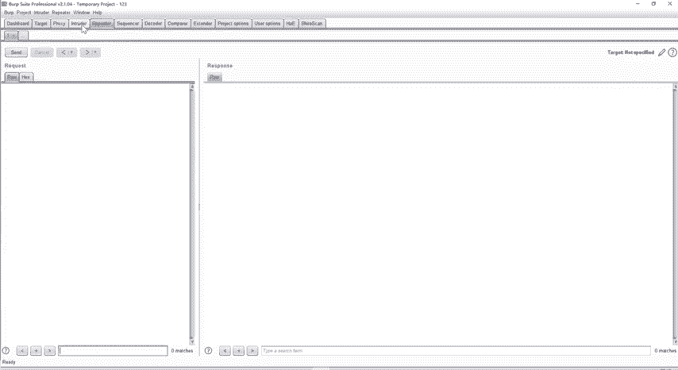

我们在本机也安装了Burp Suite。点击运行。为什么要通过这种方式运行呢？因为我们使用的是Burp Suite专业版，并且是经过激活的，所以需要通过特定方式启动。

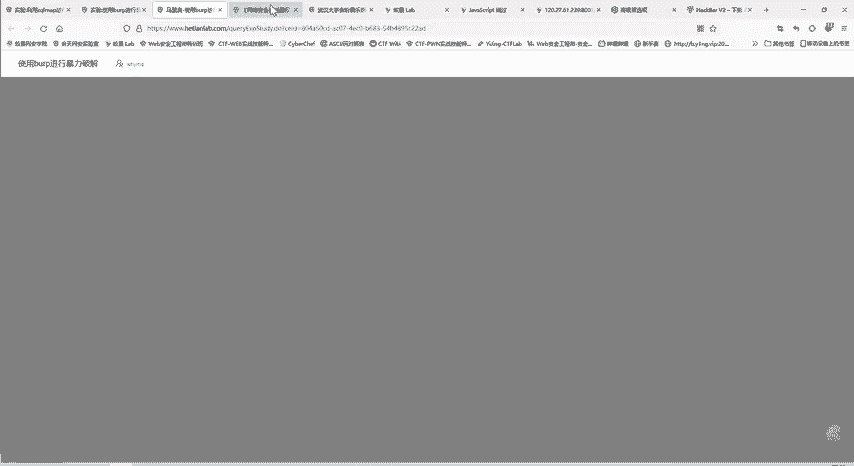

这就是Burp Suite的界面。它分为多个模块，例如`Dashboard`（仪表板），主要显示访问目标和整合信息；`Proxy`（代理）模块；`Intruder`（入侵者，用于爆破）模块等。

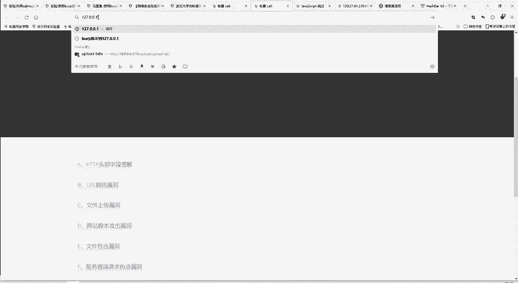

Burp Suite功能非常强大，一节课不可能讲完。这里我们看一下如何进行暴力破解。

例如，我们看一下自己搭建的DVWA靶场。DVWA靶场功能全面。我们使用PHPStudy部署PHP环境，然后搭建DVWA靶场。靶场有难度等级，我们从最简单的开始，演示暴力破解模块。

假设用户名是`admin`，密码也是`admin`，但登录失败。如何破解出正确的用户名和密码呢？这时可以使用Burp Suite的`Intruder`模块。

首先，在浏览器中开启代理。这样，浏览器的访问流量就会被Burp拦截。原本浏览器直接与服务器通信，现在被Burp拦截。因此，刚才的访问请求会出现在Burp中。我们可以选择转发这个请求包，也可以进行修改。因为网络请求很多，都会被拦截下来。可以关闭拦截功能，关闭后请求会自动发送，但过程会被记录下来。

这是我们刚才的访问请求，输入的用户名是`admin`，密码是`admin`。如何进行暴力破解呢？可以将这个请求发送到`Intruder`模块：右键 -> Send to Intruder。这样，目标IP和端口就设置好了。需要爆破的位置就是我们要尝试的部分。

暴力破解就是尝试各种可能性，例如`admin/123`、`admin/456`等。这里我们重点尝试密码部分。设置`Payload Positions`，即定义请求中可变的部分。然后导入简单的密码字典。

`Payload`是什么？就是可变部分的内容。我们重复发送请求包，就像在网页上不断尝试输入用户名和密码一样，只是现在由Burp自动发送，无需手工操作。变化的内容由`Payload`决定。

这时可以导入一个爆破字典。字典文件可以在本地查找。字典种类很多，有常用密码等。可以打开一个字典文件导入，这些是可能存在的用户名和密码。如果觉得不够，还可以自行添加。例如，添加`password`、`123456`等可能性。

添加完成后，点击`Start attack`。Burp会开始尝试。字典有7000多个条目，手工尝试非常耗时。Burp会逐个尝试，每次只改变密码部分，其他部分保持不变。尝试的密码包括`admin123`、`admin888`等。

字典可以下载，也可以自己生成。在做题或实际工作中，有时需要进行爆破（需在合法前提下）。如果没有额外信息，可以使用大而全的字典。如果知道目标的一些信息（如年龄、性别、身份证等），可以根据这些信息生成或修改字典，提高爆破成功率。

这些资料我们作为专业培训机构都有提供。核天网安实验室成立于2014年，一直与大学保持合作，资料非常全面。大家需要任何资料都可以找班主任索取。包括课堂上没讲的内容，学习过程中的疑问或找不到的资料，都可以联系班主任。班主任是我们的全能宝库。

当尝试到`admin`和`password`时，测试成功。如果输入其他随机组合，则会失败。通过这种方法，我们就能进行口令的暴力破解。

当然，Burp Suite功能强大，其他模块如`Repeater`（重放）等也经常使用。后续讲题时会用到其他模块，届时再详细介绍使用方法。

爆破成功后，如何筛选结果呢？我们尝试了7000多个密码，正确的密码只有一个，即最特殊的那一个。在结果中筛选`password`列，找到长度或内容与众不同的那条即可。

---

### SQLmap 自动化注入工具 🗃️

下面介绍另一款神器：SQLmap。它主要用于SQL注入测试。大家之前是否了解过SQL注入？SQL注入主要通过命令拼接的方式，将我们想要执行的命令传入数据库。

有过SQL注入做题经验的人知道，拼接的命令可能会非常长，尤其是盲注时，代码语句非常多，很容易出错。这时就可以使用SQLmap。

它是一款用Python编写的自动化SQL注入工具。可以帮助我们探测目标是否存在SQL注入漏洞，以及获取数据库名称、表名、字段名和具体数据。

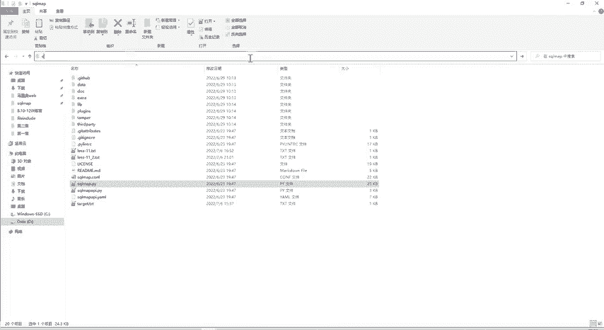

这里看一下SQLmap。这是一个压缩文件，解压后包含`sqlmap.py`等文件。由于是用Python编写的，主要功能就在`sqlmap.py`这个Python文件中。

功能非常强大。如何使用呢？

打开命令行，切换到SQLmap目录。输入`python sqlmap.py`（这里使用Python3）。首次使用工具时，可能不知道如何使用。一个通用的方法是输入`--help`查看帮助信息。这不仅适用于SQLmap，其他工具也基本适用。只要开发者设计良好，都会提供帮助信息。

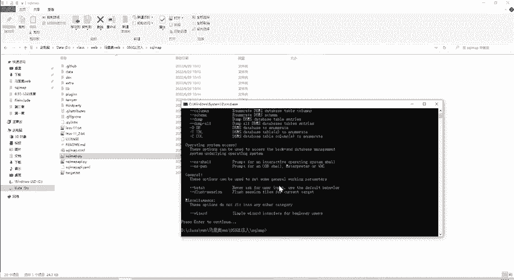

输入`-h`或`--help`会显示帮助信息，`--version`显示版本信息等。`-u`后面接URL，即要测试的网站地址，检查是否存在SQL注入漏洞。

今天讲的都是工具，这些工具能极大提高工作效率。从事网络安全工作，应对这些工具不陌生。计算机本身也是一个工具。

核天网安实验室也有专门的SQLmap实验教程。在实验平台中也可以直接搜索想学的内容，例如SQLmap的用法。之前页面功能显示不全，是因为在做题时关闭了JavaScript。现在重新打开，功能就能正常使用了。

所以做题一定要了解原理，否则很容易把自己的环境搞崩溃。当然，这是学习过程中的正常阶段。关于靶场环境搭建，无论是什么靶场，都可以将需求发给班主任。我们有很多靶场：文件上传靶场、DVWA靶场、SQL注入靶场等。具体每个靶场如何搭建，将需求告知班主任即可。

这是SQLmap的实验教程，分为五个实验。大家打卡三天即可获得实验室会员，可以做这些实验。按照实验顺序进行操作即可。

这里演示了SQLmap对需要登录的注入点进行测试。实验基于DVWA靶场。教程写得很详细，介绍了如何使用。命令是`python sqlmap.py`，这里省略了`python`，因为`.py`文件默认用Python打开。

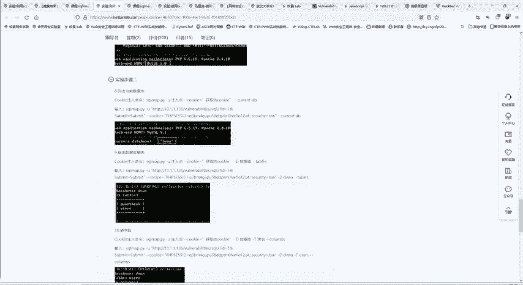

`-u`参数指定注入点（URL）。`--cookie`参数用于需要登录的场景，利用Burp抓包获取Cookie后复制到这里。`--current-db`用于查询当前网站使用的数据库名称。还可以使用`--dbs`查询所有数据库，`--tables`查询表等。只要存在SQL注入漏洞，利用SQLmap工具就能获取数据库的信息。

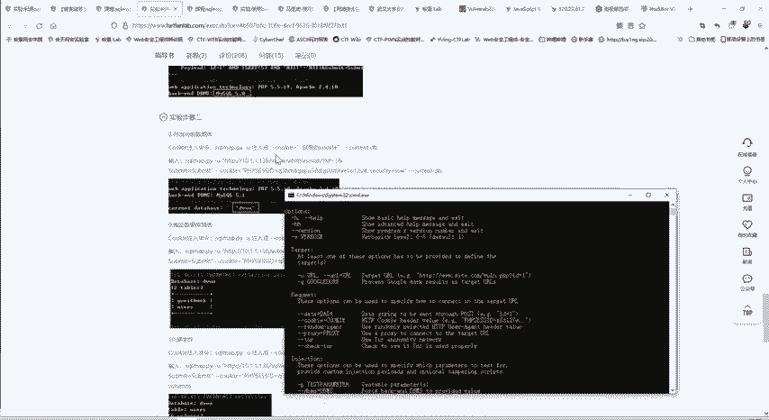

这是SQLmap的一个简单介绍。

---

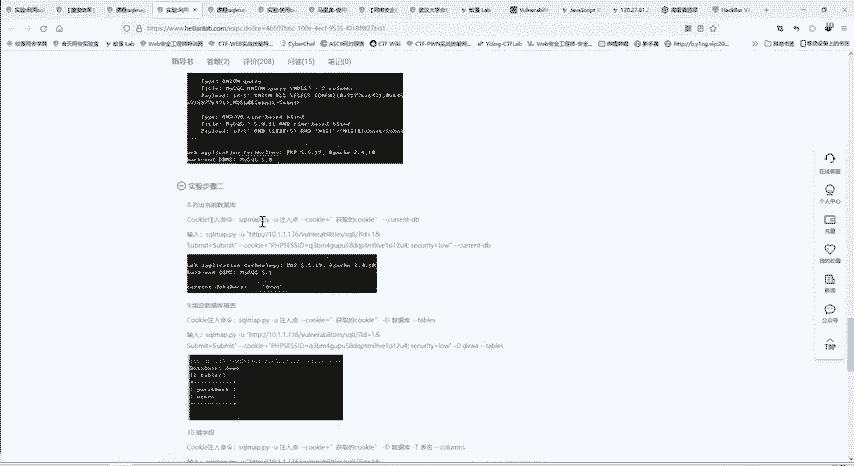

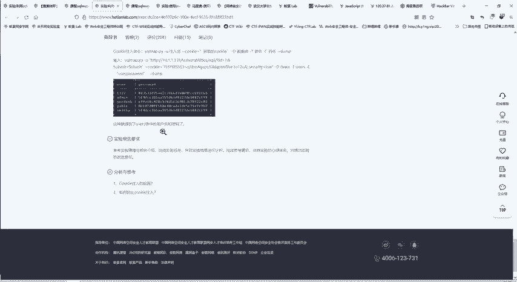

## 总结
本节课我们一起学习了四类WEB攻防核心工具：HackBar浏览器插件用于快速修改和测试HTTP请求；WebShell管理工具（蚁剑/冰蝎/哥斯拉）用于连接和管理一句话木马；Burp Suite用于拦截、修改请求及自动化漏洞测试；SQLmap用于自动化检测和利用SQL注入漏洞。这些工具是安全测试人员必须掌握的技能，能显著提升工作效率和测试深度。