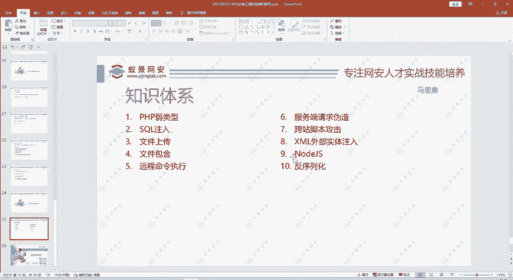
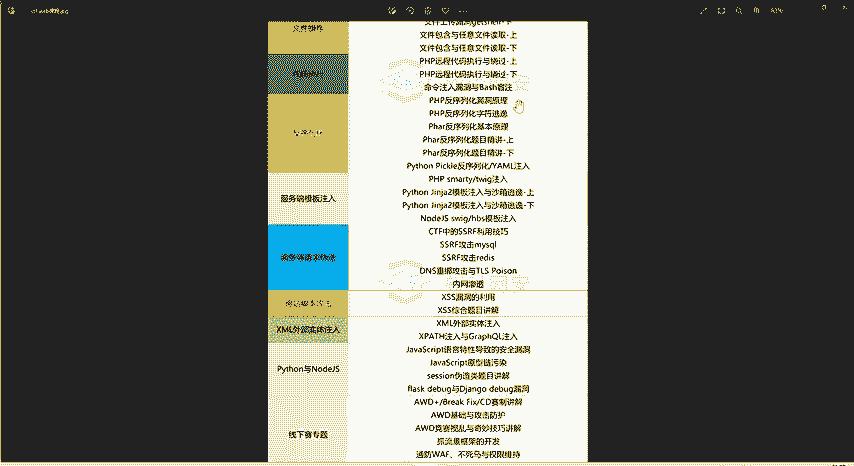
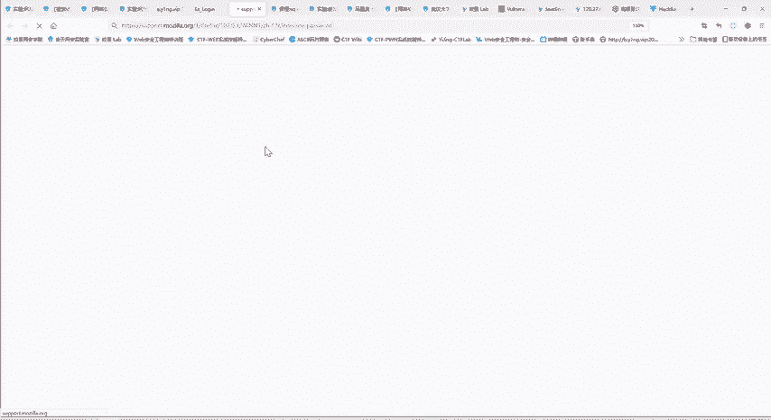
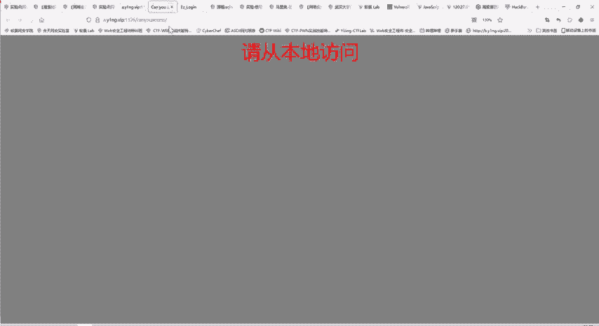
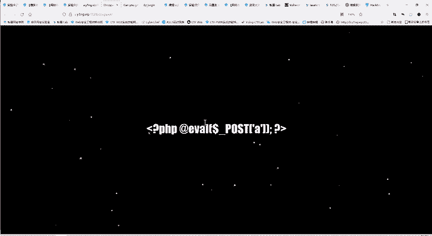
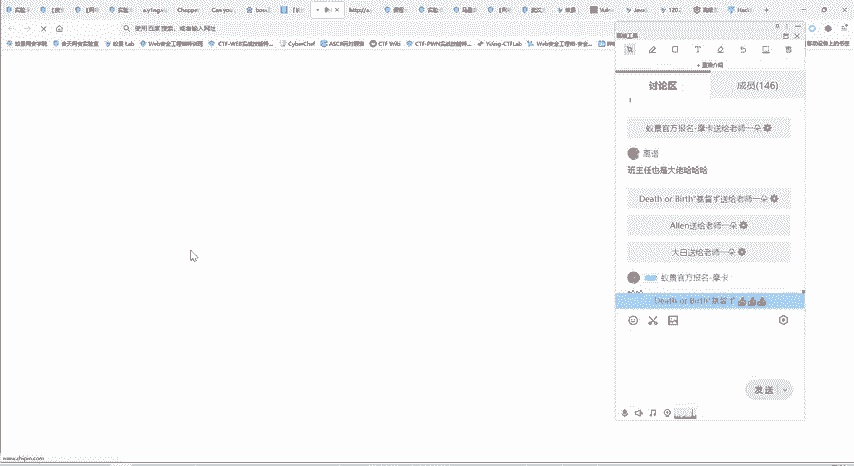
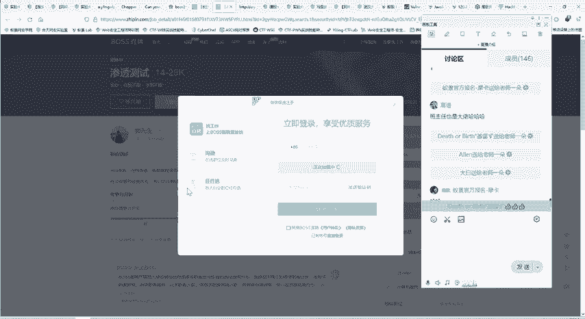
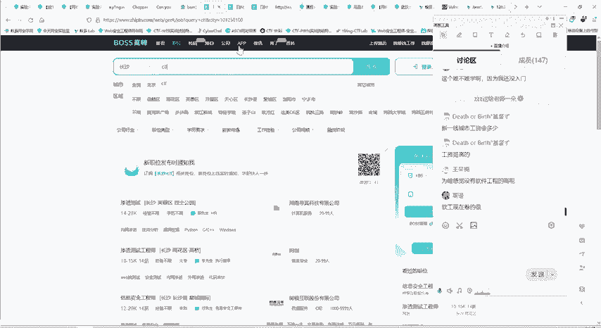
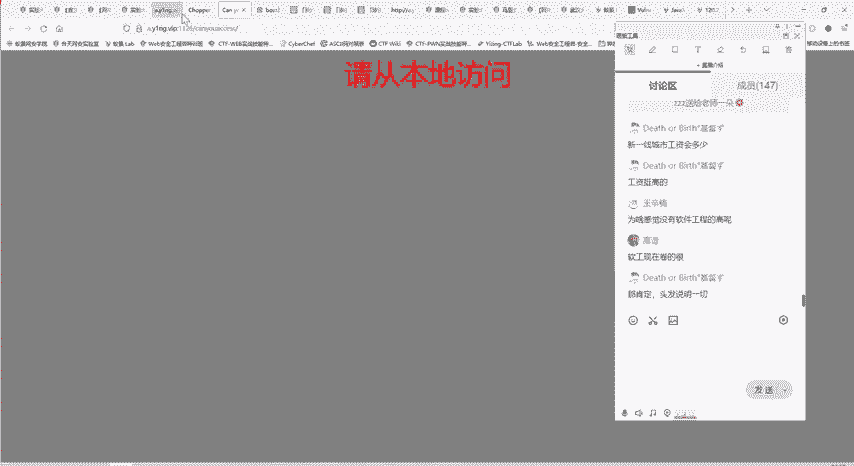
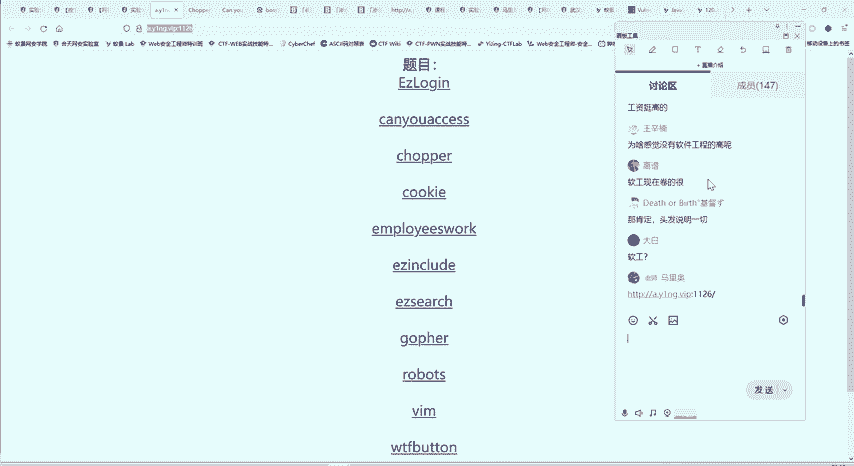

# CTF Web攻防知识体系：P98：3.WEB攻防知识体系 🎯

在本节课中，我们将系统性地介绍CTF（Capture The Flag）比赛中Web安全方向的知识体系。我们将了解其主要构成板块、核心知识点以及高效的学习路径，帮助你构建完整的Web攻防技能树。

## 课程概述 📚

CTF比赛中的Web安全挑战主要涵盖十大核心板块。掌握这些内容对于参与比赛和实际应用都至关重要。下图展示了详细的Web攻防知识体系结构。

## 知识体系详解

### 新手入门与基础绕过

以下是初学者需要掌握的基础知识，这些是解决许多简单题目的关键。

*   **弱类型比较**：理解PHP等语言中`==`与`===`的区别，例如`"0e123456" == "0e987654"`在弱类型比较下结果为`True`。
*   **MD5绕过**：利用MD5碰撞或特定字符串（如`0e`开头的数字字符串）进行身份验证绕过。
*   **CTF比赛经验**：比赛类似于考试，解题技巧与知识储备同等重要。

### SQL注入深度解析

SQL注入是Web安全中最常见且题目最多的漏洞类型。在现实中，MySQL数据库应用广泛，因此相关题目也最多。

上一节我们介绍了基础知识，本节中我们来看看SQL注入的具体利用方式。

*   **联合查询注入**：使用`UNION`语句合并查询结果，获取数据库信息。
*   **宽字节注入**：利用编码问题（如GBK）绕过单引号转义。
*   **堆叠注入**：执行多条SQL语句，例如`id=1'; DROP TABLE users; --`。
*   **盲注**：在页面无显错时，通过布尔或时间延迟判断注入结果。
*   **文件读写操作**：利用`LOAD_FILE()`读取文件或`INTO OUTFILE`写入文件。

虽然其他数据库（如SQL Server、PostgreSQL）在比赛中出现较少，但了解其特性也有必要，课程中也会进行介绍。

### 解题技巧与经验

CTF比赛脱胎于游戏，趣味性强，许多题目需要结合知识、经验和“脑洞”才能解决。解题技巧部分将分享如何快速定位漏洞、利用非常规思路解题。

### 文件操作类漏洞

文件操作是获取服务器权限的重要手段。以下是相关的漏洞类型。

*   **文件上传漏洞**：通过上传恶意文件（如Webshell）获取服务器控制权。核心是上传一句话木马，例如PHP的`<?php @eval($_POST['cmd']);?>`。
*   **检测与绕过**：比赛不会直接允许上传木马，因此需要学习如何绕过前端JS校验、MIME类型检查、文件内容检测（如图片马）、后缀黑/白名单等。
*   **文件包含漏洞**：利用`include`、`require`等函数包含恶意文件，实现任意文件读取或代码执行。
*   **任意文件读取**：直接读取服务器上的敏感文件，如`/etc/passwd`或源码。

### 代码执行与高级漏洞

在掌握了基础漏洞后，我们需要进一步学习更复杂的漏洞类型。

*   **反序列化漏洞**：不当处理用户输入的序列化数据可能导致对象注入和远程代码执行。
*   **服务端模板注入（SSTI）**：在模板引擎中注入恶意代码，例如Jinja2的`{{ config.__class__.__init__.__globals__['os'].popen('id').read() }}`。
*   **服务端请求伪造（SSRF）**：诱使服务器向内部或任意网络发起请求，攻击内网服务。
*   **跨站脚本攻击（XSS）**：分为反射型、存储型和DOM型，用于窃取Cookie或进行客户端攻击。
*   **XML外部实体注入（XXE）**：利用XML解析器加载外部DTD文件，实现文件读取、内网探测或命令执行。

### 比赛形式与实战训练

CTF比赛分为线上赛和线下赛（AWD攻防模式）。线上赛多为初赛，而决赛常采用更具挑战性的线下AWD模式。课程将在知识点讲解中穿插线上解题技巧，并专门设置模块讲解线下赛策略。

后续课程将设置**真题讲解模块**，每节课带领大家实战解题。因为“光学不练”很快会遗忘，只有学练结合，才能真正掌握。

## 高效学习路径建议 🚀

关于学习顺序，建议**直接开始学习CTF Web安全**，而非先系统学习一门编程语言。

*   **边学边做**：直接接触CTF题目，在解题过程中遇到不懂的编程语言（如Python）、工具使用或环境问题，再针对性学习和提问。这样学习效率最高，因为知识立刻有了应用场景。
*   **避免低效**：如果先花费大量时间学习计算机基础、C语言、Python，而没有实际应用，很容易遗忘，学习进程缓慢。
*   **目标驱动**：以解题为目标学习相关知识，你会觉得这些知识“有用”，从而掌握得更牢固。

我们的课程体系非常全面，初学者看到“反序列化”、“SSTI”等概念感到陌生是正常的。但只要按照课程体系，认真听课、完成作业、勤于提问并实践所有题目，你就能成为一名合格的CTF Web选手，具备参加个人赛或组队赛的能力。

## 实操环节与靶场环境 🖥️

实操是学习过程中必不可少的一环。我们将利用丰富的靶场环境进行实战训练。

课程配备了超过1500个实验的靶场，每个实验都是一道CTF题目。例如下面这道题目，就涉及我们之前演示过的文件上传漏洞。

我们不会直接给出答案，而是**模拟初次解题的探索过程**：从审题、查看源代码、尝试各种思路（如尝试用户名`admin`）、验证方案A失败、转向方案B，直至最终找到正确解法。这个过程对于培养独立解题能力至关重要。

## 行业价值与前景 💼

掌握CTF技能在求职时具有显著优势。许多网络安全岗位（如渗透测试）的招聘要求中会注明“**有CTF比赛经验者优先**”或“**在大型CTF比赛中取得名次者优先**”。

CTF成绩是技术实力的有力证明，备受行业认可。目前网络安全人才供不应求，即使是面向初学者的岗位（经验不限），在一线城市薪资也颇具竞争力。拥有CTF经验不仅能提升个人能力，也能为职业生涯增添重要筹码。

## 课程总结与预告 📝

本节课我们一起学习了CTF Web攻防的完整知识体系，涵盖了从SQL注入、文件上传到反序列化、SSRF等十大核心板块。我们强调了**“知识”与“技巧”并重**、**“学习”与“练习”结合**的高效方法。

本课程一半讲解知识，一半进行实战训练。大家可以在讨论区获取实战题目的网址，先行尝试探索。

在接下来的课程中，我们将通过真题讲解，带领大家将理论知识应用于实践，真正掌握Web安全攻防技能。