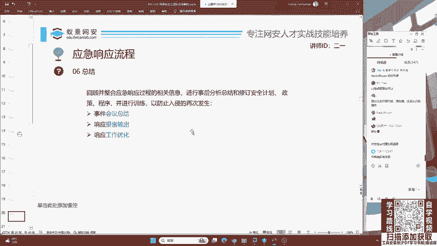
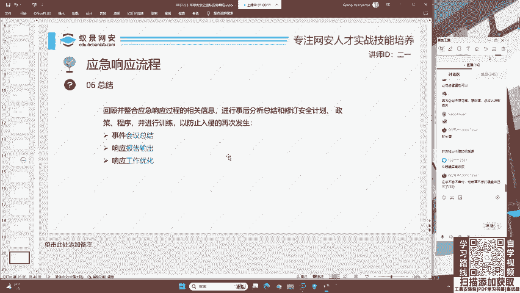
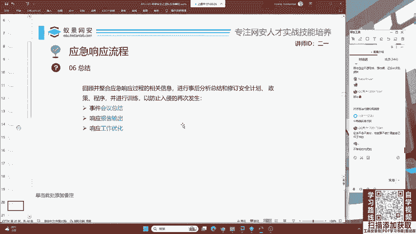
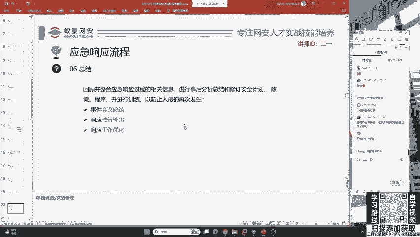
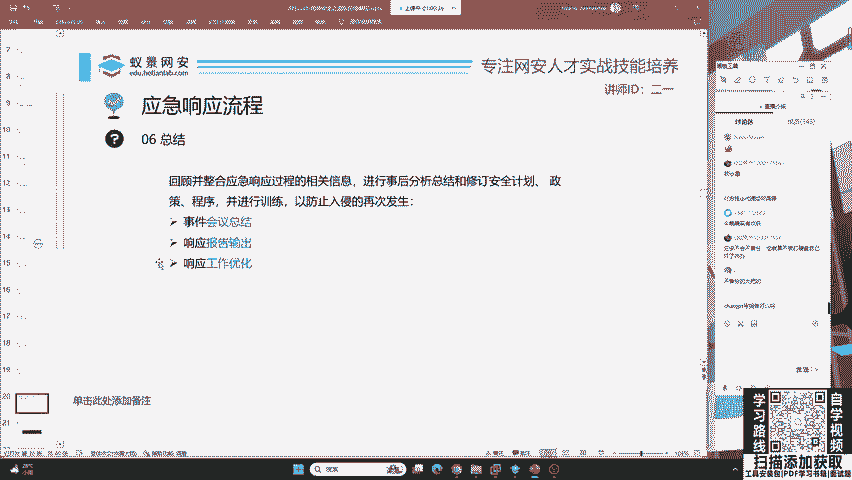
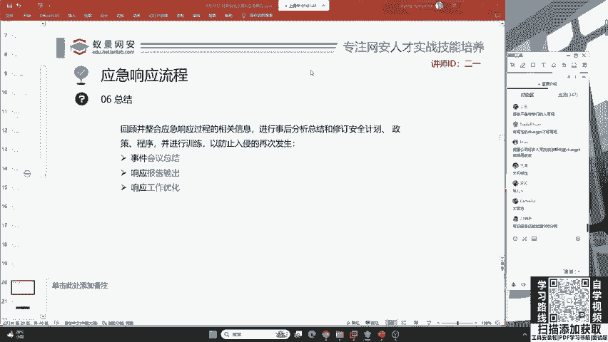

# 护网行动红蓝攻防教程：P9：蓝队应急响应-8.总结阶段 📝

在本节课中，我们将要学习蓝队应急响应的最后一个关键环节：总结阶段。这个阶段的核心任务是撰写专业的应急响应报告，向客户或甲方清晰地展示整个响应过程与成果。



上一节我们介绍了应急响应的处置流程，本节中我们来看看如何将这些行动系统地总结成一份有价值的报告。

## 报告撰写的必要性



无论参加国家级、企业级还是行业级的护网行动，撰写报告都是蓝队成员必须掌握的技能。你需要通过报告向客户说明，在遭受攻击时你采取了哪些应急措施来缓解危害。



以下是一份完整报告需要涵盖的核心内容：



*   **事件概述**：简述攻击事件的基本情况。
*   **响应流程**：详细记录从检测到抑制的完整操作步骤。
*   **分析发现**：展示攻击路径、利用的漏洞、植入的恶意软件等关键发现。
*   **处置措施**：说明采取的具体缓解与修复行动。
*   **影响评估**：评估攻击造成的业务影响与数据损失。
*   **改进建议**：提出防止类似事件再次发生的安全加固建议。



## 报告的专业性要求

报告需要遵循一定的规范，不能随意撰写。例如，直接使用公开的通用AI模型（如ChatGPT）生成报告内容是不可取的。

```
# 不专业的AI生成内容示例（过于机械）
“检测到系统存在异常进程，疑似恶意软件活动，建议进行查杀。”
```

上述回答具有明显的“AI腔调”，缺乏安全工程师的专业判断和具体上下文，容易被识别。因此，报告必须体现人工分析和专业洞察。



## 总结

本节课中我们一起学习了蓝队应急响应的总结阶段。我们明确了撰写专业报告是护网行动的必备环节，报告需要系统性地呈现整个响应过程与分析结果，并且必须由安全人员基于实际情况亲手完成，确保其专业性和可信度。掌握这项技能，能让你在团队中脱颖而出，成为一名合格的蓝队成员。