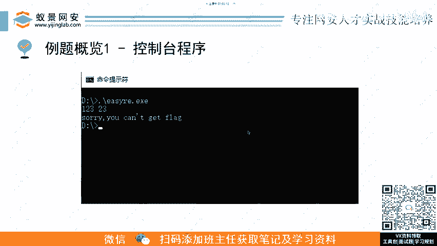
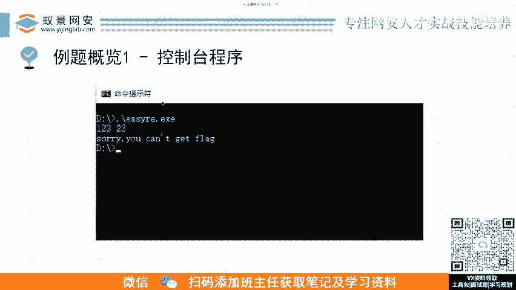

# CTF逆向工程入门：P2：逆向基础题-常规CTF逆向解题流程 🚩

在本节课中，我们将要学习CTF逆向工程中，面对一道常规赛题时的标准解题流程。我们将从拿到一个可执行文件开始，一步步拆解分析，直到最终获取Flag。

---

## 信息收集：了解你的对手 🔍

上一节我们介绍了逆向工程的基本概念，本节中我们来看看面对一个未知文件时，第一步应该做什么。信息收集是逆向分析的基石，它决定了后续的分析方向。

首先，当我们拿到主办方发来的一个EXE或ELF文件时，不应直接拖入复杂的分析工具。应使用一些基础命令来快速探查文件特征。

以下是几个关键的信息收集命令：

*   **`strings`**：查看文件中的所有可打印字符串。有时出题人可能忘记删除调试信息或Flag本身，这个命令可能直接给出非预期解。
*   **`file`**：查看文件的类型、架构（如x86, ARM）、字节序（大端/小端）等信息。
*   **`binwalk`**：分析文件结构。对于某些组合或嵌入式的文件（如IoT固件），可以用它进行切分和提取。
*   **`strace`**：跟踪程序执行时的系统调用。例如，执行 `strace ./target` 可以列出程序调用了哪些系统函数（如 `read`, `write`, `mmap`），这有助于在静态分析前侧面了解程序行为。

根据收集到的这些信息，可以进行Google或GitHub搜索。在高级比赛中，题目附件可能源自某个特定设备、游戏或冷门系统。通过搜索文件特征，你可能找到相关的分析博客、解包工具或已知漏洞，这能极大提升解题效率。不断在比赛中学习新知识，正是CTF的魅力所在。

---

## 保护机制分析与绕过 🛡️

在收集完基本信息后，我们需要研究程序采用了哪些保护或反逆向手段。

出题人或软件厂商为了增加分析难度，会加入各种保护，例如代码混淆、反调试、加壳等。我们的目标是设法**破除**或**绕过**这些保护。

可以将其理解为程序对原始逻辑进行了一次“加密”。我们的工作就是对其进行“解密”，从而获得程序原本、真实的代码逻辑和功能实现方式。

---

## 静态分析与动态调试的结合 ⚙️

成功绕过保护后，我们便获得了可分析的程序本体。接下来，应根据程序平台（Windows/Linux）和语言选择相应的反汇编器/反编译器（如IDA Pro, Ghidra, radare2）进行**静态分析**。

静态分析的目标是快速定位到程序的关键代码（例如，验证输入、处理Flag的函数）。对于初学者，如何在海量代码中快速定位关键点是一大难点，这需要经验积累和对程序特征的敏感度。

静态分析后，必须结合**动态调试**（使用GDB, x64dbg, OllyDbg等工具）。逆向工程讲究“动静结合”。

在静态分析时，你可能会猜测某个函数是Base64编码或某种加密算法。此时，可以通过动态调试来验证：输入一个已知明文，观察经过该函数后的输出结果，并与你的猜测进行比对。

这种结合方式能让你高效地确定函数功能，而不是漫无目的地跟踪每一个函数调用，从而大幅提升分析速度。

---

## 理清逻辑与逆向算法推导 🔄

通过动静结合的分析，我们验证了猜想，并进一步熟悉了程序的功能实现和Flag的验证逻辑。

理清程序流程后，我们便可根据正向算法推导逆向算法。这是逆向工程的核心。

一个典型场景是：程序将你的输入（明文）进行一系列加密变换，得到一个密文，然后将此密文与程序中存储的**目标密文**进行比较。若一致，则输入即为正确的Flag。

我们的任务就是：
1.  通过分析理解这个正向的加密过程（即 `明文 -> 加密 -> 密文`）。
2.  根据分析出的加密算法，编写一个逆向脚本，从已知的**目标密文**反向推导出原始的**明文**（即 `密文 -> 解密 -> 明文`）。

这个过程就是“逆向”一词的由来——将正向过程倒推回去。

---

## 总结 📝

本节课中我们一起学习了CTF逆向工程面对常规赛题的标准解题流程：

1.  **信息收集**：使用基础命令探查文件，为后续分析定位方向。
2.  **保护分析**：识别并设法绕过程序的反逆向保护机制。
3.  **动静结合**：先静态分析定位关键代码，再通过动态调试验证猜想，高效理解程序逻辑。
4.  **算法逆向**：在理清正向加密流程后，编写脚本从目标密文反向求解出Flag明文。

这是一个最常规、最基础的逆向解题框架。接下来，我们将通过几道CTF中的经典例题来具体实践这个流程。