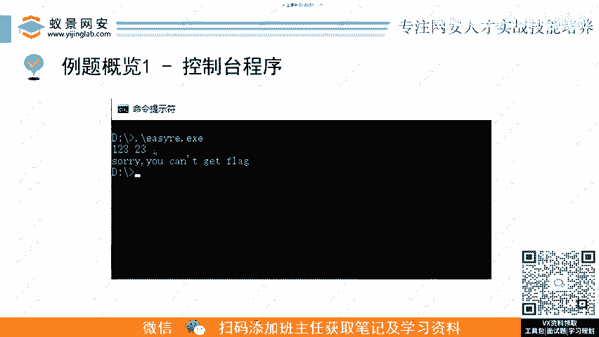
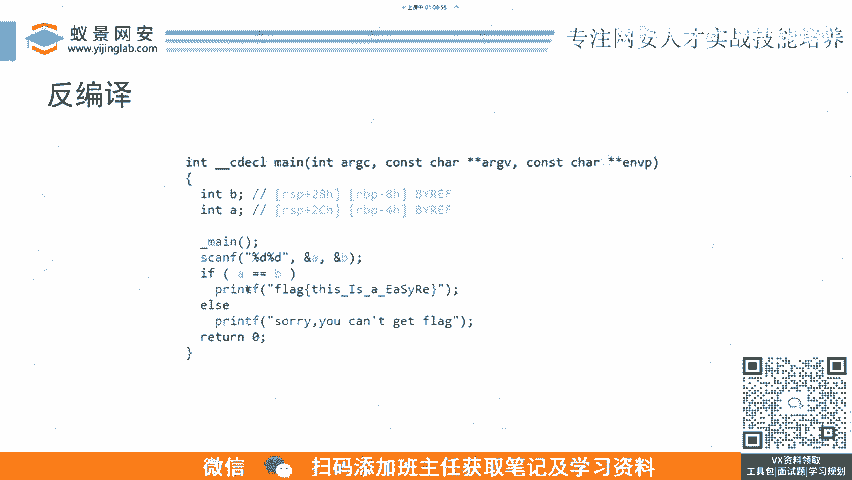
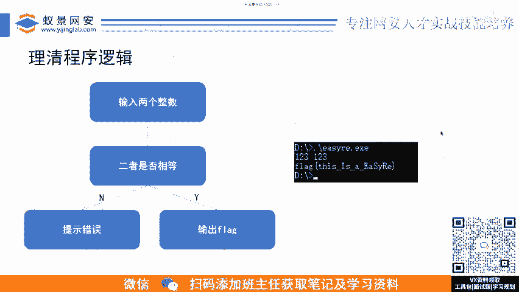
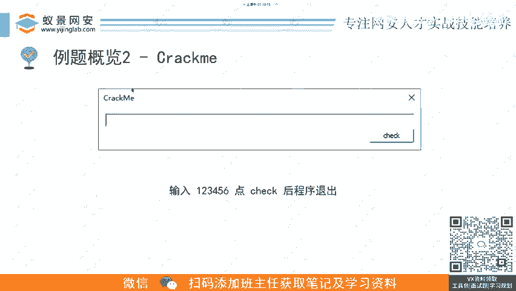

# CTF逆向工程入门：P3：逆向基础题-2.例题1：控制台程序逆向 🚩

## 概述
在本节课中，我们将学习CTF逆向工程中最基础、最经典的一种题型——控制台程序逆向。我们将通过一个具体的例题，了解从拿到一个可执行文件到最终获取Flag的完整分析流程，并介绍静态分析与动态调试的基本概念。

---

## 赛题形式与背景

上一节我们介绍了逆向工程的基本概念，本节中我们来看看一个具体的例题形式。

控制台程序是CTF逆向赛题中最经典的一种形式。题目通常会提供一个可执行文件（例如Windows上的`.exe`或Linux上的`ELF`文件）。当你运行这个程序时，它可能会给出一些提示信息，并要求你输入内容。程序随后会对你的输入进行校验，如果输入正确，则会输出Flag；如果错误，则会提示失败。

例如，在本题中，运行程序并输入“123 23”后，程序会提示“你不能拿到flag”。这正是典型的CTF逆向挑战形式。

---



## 逆向分析流程

结合常规的逆向流程，我们如何分析这类程序呢？以下是分析此类题目的关键步骤。

### 1. 信息收集
首先，我们需要收集目标程序的基本信息。这包括判断程序是32位还是64位、由何种编译器编译、是否加壳等。这些信息是后续分析的基础。

我们可以使用一些常用工具来完成信息收集，例如：
*   **PEiD** (针对Windows PE文件)
*   **Exeinfo PE**
*   **file** 命令 (Linux)

例如，通过工具分析，我们可能得到如下信息：
*   **入口点(Entry Point)**：位于`.text`节。
*   **链接器版本**：2.23。
*   **编译器**：MinGW，64位。
*   **加壳情况**：如果程序被加壳，工具可能会检测出壳的类型（如UPX、ASPack等）。根据壳的类型，我们需要采取相应的脱壳手段来绕过保护。

### 2. 静态分析
在收集完基本信息后，下一步是将程序载入逆向分析工具进行静态分析。这里以IDA Pro为例。

将程序拖入IDA后，工具会列出程序中包含的所有函数。点击任意函数，IDA会展示该函数的反汇编代码。

以下是两种主要的静态分析视图：
*   **反汇编视图**：展示程序的汇编指令。例如，你可能会看到 `push`, `mov`, `cmp` 等指令。对于不熟悉汇编的初学者，直接阅读会比较困难。
    ```assembly
    ; 示例汇编代码片段
    mov     eax, [ebp+var_4]
    cmp     eax, [ebp+var_8]
    jz      short loc_401235
    ```
*   **反编译视图（伪代码）**：IDA等高级工具可以将汇编代码转换为更易读的、类似C语言的伪代码。这极大地简化了逻辑理解的过程。
    ```c
    // 示例伪代码
    if ( a == b ) {
        puts("flag{this_is_your_flag}");
    } else {
        puts("Wrong!");
    }
    ```

**重要提示**：反编译工具生成的伪代码并非绝对准确，有时需要对变量类型或结构进行人工修正。因此，**不能完全摒弃对汇编代码的阅读能力**。两者需要结合使用：优先阅读清晰的伪代码来理解大体逻辑，再辅以汇编代码进行细节验证和修正。

### 3. 动态调试
静态分析让我们理解了程序的逻辑，但为了验证我们的分析是否正确，并观察程序运行时的具体状态（如寄存器值、内存数据），我们需要进行动态调试。

我们可以使用调试器（如x64dbg, GDB, IDA自带的调试器）来运行程序。
*   在关键逻辑处（如判断输入是否相等的代码行）设置断点。
*   运行程序并输入测试数据。
*   当程序在断点处暂停时，观察：
    *   **寄存器窗口**：查看通用寄存器（EAX, EBX等）的值。
    *   **栈窗口**：查看函数调用栈和局部变量。
    *   **内存查看器**：查看特定地址的内存数据。

通过动静结合的方式，我们可以高效地验证程序逻辑，并定位关键数据。

---

## 例题实战解析

理清了上述流程后，我们来看这道例题的具体解法。

通过静态分析（查看反编译的伪代码），我们得知程序的逻辑非常简单：
1.  程序要求输入两个整数。
2.  判断这两个整数是否相等。
3.  如果相等，则打印出Flag；否则，提示错误。

因此，解题思路非常直接：我们只需要运行程序，并输入两个相同的数字即可。



以下是解题步骤：
1.  运行题目提供的可执行文件。
2.  根据程序提示，输入两个相同的数字，例如 `1` 和 `1`。
3.  程序判断输入相等，于是输出Flag。

在动态调试时，我们可以在输出Flag的代码附近（通常是调用 `puts` 或 `printf` 函数）打上断点，并查看其参数，从而在内存中直接找到Flag字符串。

---

## 总结



本节课中，我们一起学习了CTF逆向工程中控制台程序题型的分析方法。我们掌握了从**信息收集**、**静态分析**（反汇编与反编译）到**动态调试**的完整流程。关键在于理解程序逻辑，并灵活运用工具进行动静结合的分析。



这个例题虽然简单，但它清晰地展示了逆向工程的基本思想：**通过分析程序的执行逻辑，找到通过校验的关键条件，从而获取目标（Flag）**。这是所有复杂逆向题目的基础。在后续课程中，我们将面对更复杂的保护机制和算法，但核心的分析思路是相通的。