# CTF零基础入门教程：P4：逆向基础题-3.例题2：crackme-软件逆向

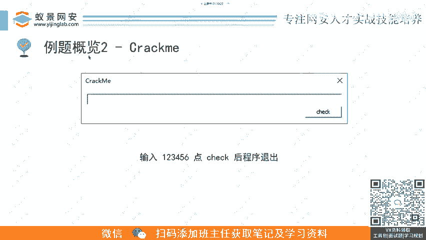

在本节课中，我们将要学习CTF逆向工程中的第二类经典题型——CrackMe。我们将通过一个具体的例题，了解如何分析、破解一个需要输入注册码的程序，并最终获取正确的Flag。

## 什么是CrackMe？🔐

上一节我们介绍了逆向工程的基本概念，本节中我们来看看一种非常经典的逆向题目类型：CrackMe。

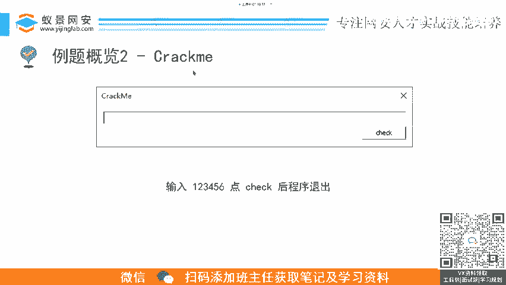

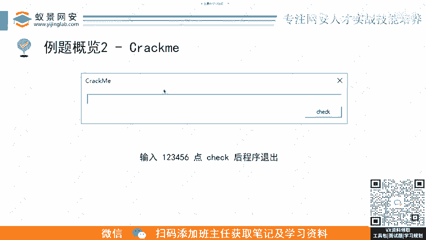

CrackMe是一种旨在被破解的软件。开发者会设计一个看似难以破解的程序，挑战者需要分析其内部逻辑，找到正确的注册码或Flag。在CTF比赛中，这类题目通常表现为一个带有输入框和“检查”按钮的程序。

## 题目分析流程🛠️

面对一个CrackMe题目，我们需要遵循一套标准的分析流程。以下是解题的关键步骤：

1.  **信息收集与查壳**：首先检查程序是否加壳，以及是否存在反调试、反逆向等保护手段。本例题中的程序确实存在此类保护。
2.  **脱壳与绕过保护**：如果程序有壳，需要先进行脱壳操作，并绕过其反调试机制，以便进行后续分析。
3.  **静态分析代码**：使用反汇编工具（如IDA Pro）对程序进行静态分析，定位核心的注册码校验或加密函数。
4.  **动态调试验证**：结合动态调试工具（如x64dbg），在程序运行时观察数据流和逻辑，验证静态分析的结论。
5.  **编写解密脚本**：分析清楚程序的加密逻辑后，需要编写逆向脚本，模拟其解密过程，从而计算出正确的Flag。

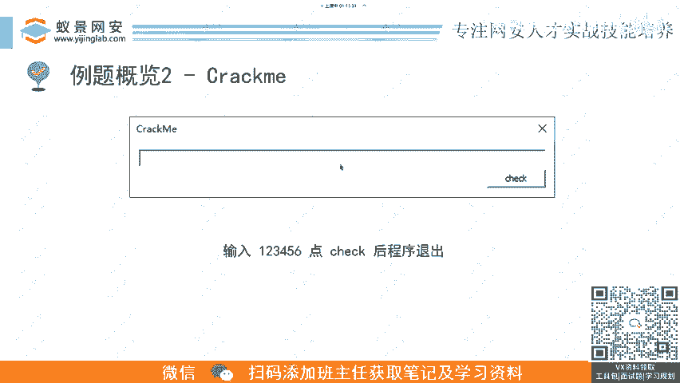

## 例题实战解析💻


我们以本课例题为例进行具体说明。该程序包含多个加密函数。

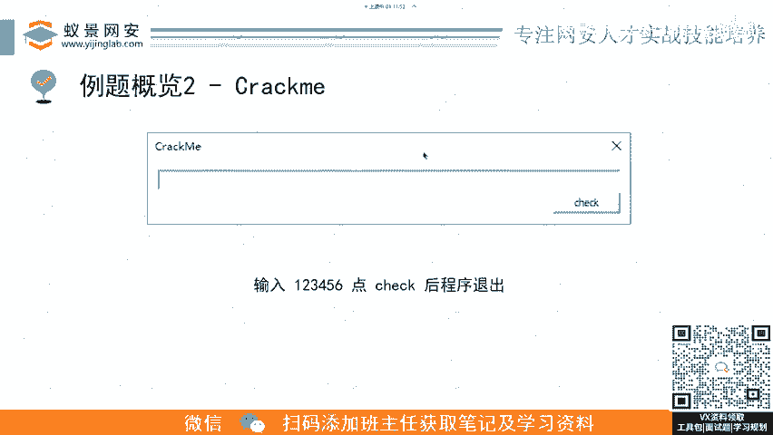

经过分析，我们发现该程序共有7个加密函数。解题的关键在于分析出每一个加密函数的逻辑，并编写出其对应的逆向解密函数。

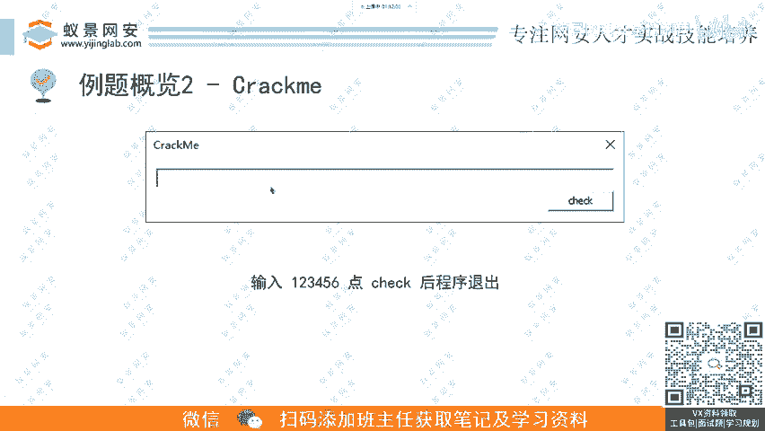

例如，其中一个解密函数的核心逻辑可能如下所示（以伪代码表示）：
```python
def decode_five(ciphertext):
    # 这里是第五个加密函数的逆向逻辑
    plaintext = some_operation(ciphertext)
    return plaintext
```

我们需要将密文依次通过从`decode_one`到`decode_seven`的所有逆向函数，才能得到最终的明文Flag。

脚本运行后，可能会得到一串看似不规则的字符串，例如：
```
flag{Th1s_1s_A_We1rd_Str1ng}
```


## 结果验证与提交✅

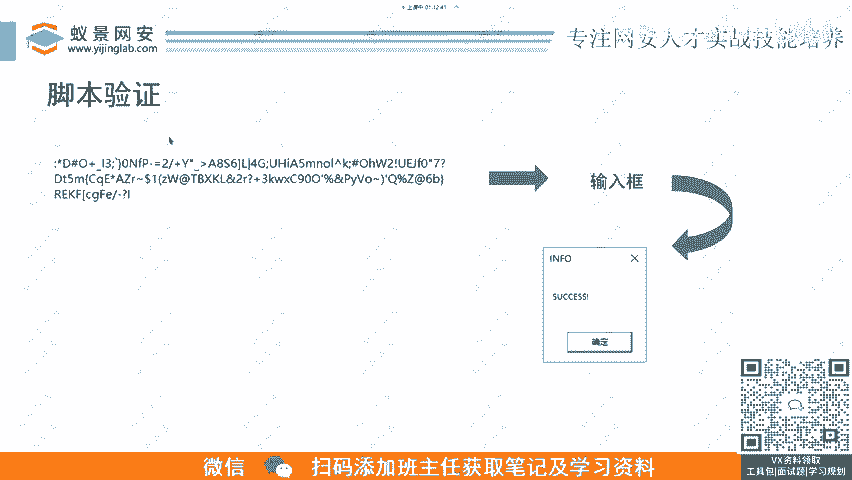

得到解密结果后，需要将其输入原程序进行验证。

如果程序反馈“Success”、“Yes”或类似的正确提示，就说明我们得到的字符串是正确的。此时，可以将其作为Flag提交到比赛平台。

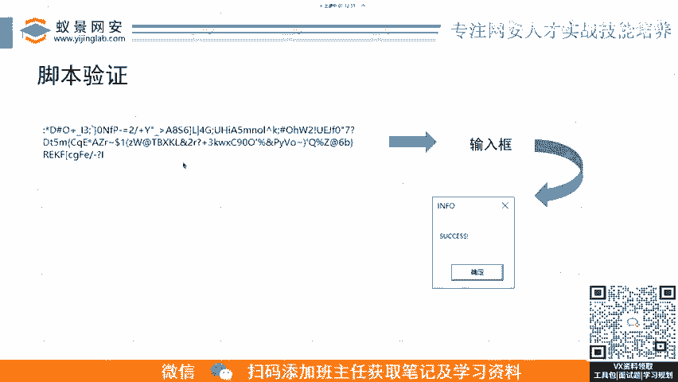

**请注意**：有时Flag的格式可能比较特殊。只要程序本身验证通过，就应坚信结果的正确性。如果提交到平台后显示错误，可能是题目存在多解或平台Flag设置错误，而非你的解题过程有误。

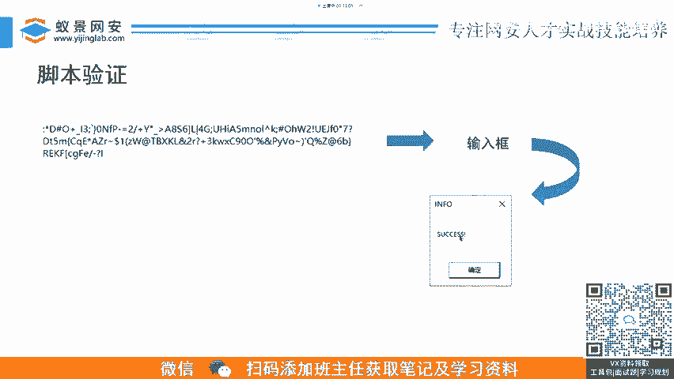

## 总结📝

本节课中我们一起学习了CTF逆向工程中的CrackMe题型。

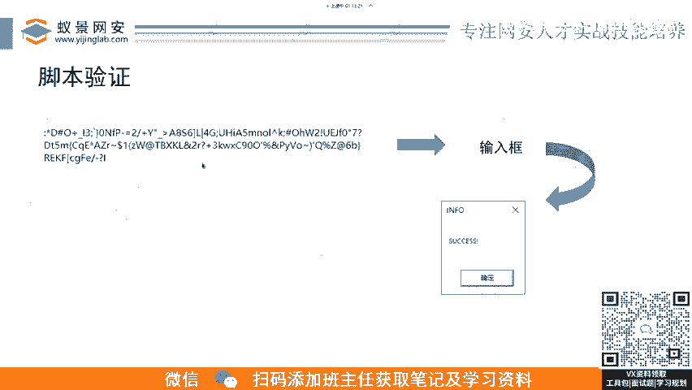

我们了解了CrackMe的基本概念，掌握了一套从信息收集、脱壳、静态/动态分析到编写解密脚本的标准解题流程。通过实战例题，我们认识到复杂的题目可能包含多个加密环节，需要耐心地逐一分析并逆向。最后，我们强调了结果验证的重要性，并建立了提交Flag的信心。

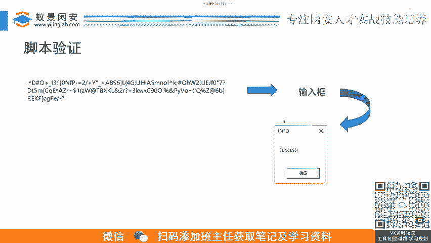

掌握这些基础，你将能够应对大多数入门级的逆向CrackMe挑战。