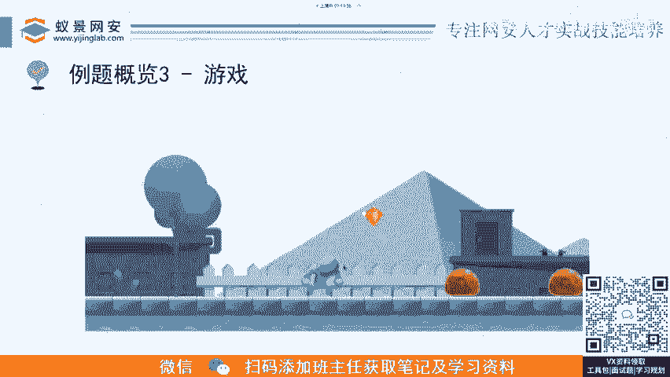
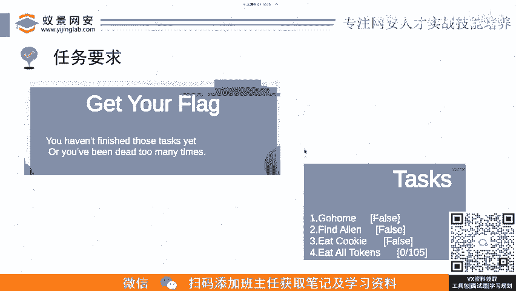
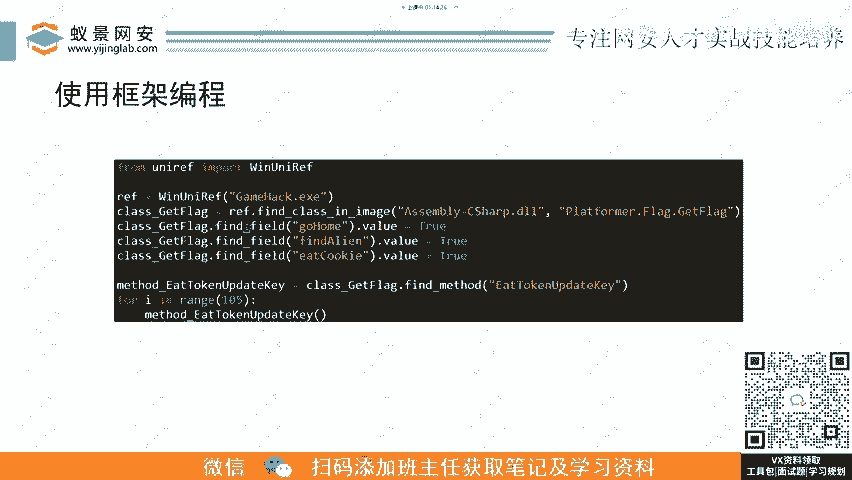
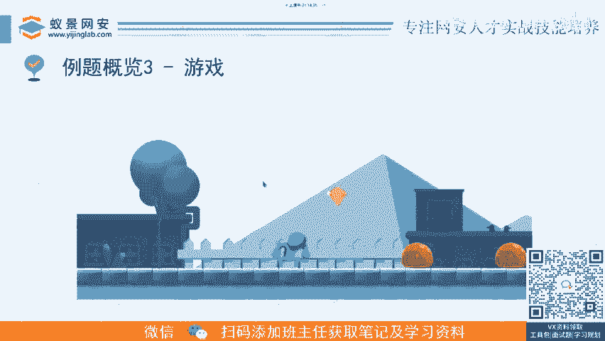
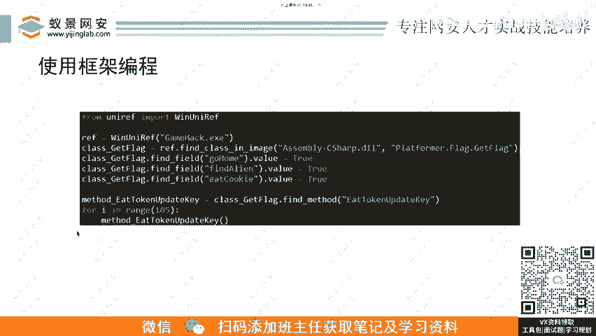
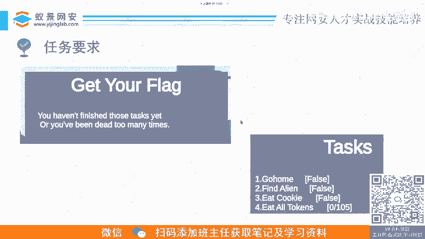
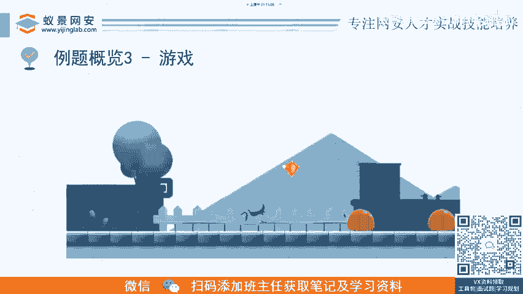
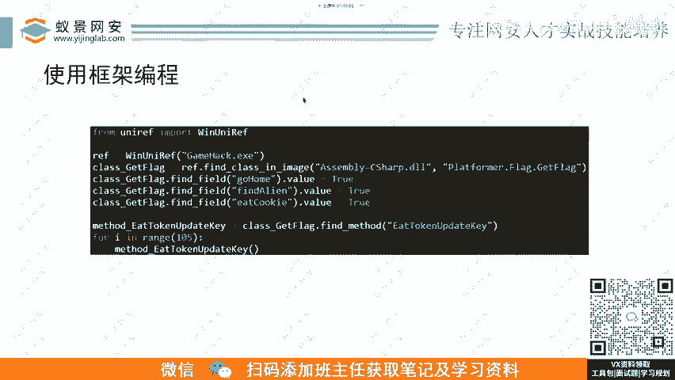

# CTF逆向工程入门：P5：逆向基础题-游戏-游戏逆向 🎮

在本节课中，我们将要学习CTF逆向工程中一种常见的题型——游戏逆向。我们将通过一道典型的游戏题目，了解其基本目标、常规解题思路，并初步认识使用开源框架解题带来的效率提升。

## 题目概述与目标 🎯

上一节我们介绍了逆向工程的基本流程，本节中我们来看看如何将其应用于游戏题目。

第三种常见的题型是比较经典的游戏题。这道题目是2019年或2020年的一道真题。题目的核心是需要玩家在游戏内完成一系列指定的任务目标。

以下是游戏界面中显示的具体任务目标：
*   右下角的“Tasks”列表列出了几个目标。
*   你需要控制角色“回家”（go home）。
*   找到外星人并吃掉曲奇。
*   吃掉所有的“token”。

当你成功完成所有这些任务后，就可以获得最终的flag。游戏规则明确指出，如果未能完成任务，则不会给出flag。

## 常规解题流程 🔍

接下来，我们分析解决此类题目的常规方法。

如果按照正常流程来解答这道题，我们依然会遵循之前讲解的标准逆向步骤。

以下是标准的逆向分析流程：
1.  **信息收集**：收集程序的基本信息。
2.  **查壳**：检查程序是否被加壳保护。
3.  **静态分析**：使用反汇编工具（如IDA Pro）分析程序代码逻辑。
4.  **动态调试**：使用调试器（如x64dbg）运行程序，观察其运行时行为。

按照这个流程，是可以解出这道题的。然而，这种方法通常需要编写较长的自动化脚本。

## 使用开源框架的高效解法 ⚡

现在，我们来看看一种更高效的解题方法——使用开源框架。

PPT中提到的“使用框架编程”是我们后续课程会重点讲解的内容。如果结合题目具体场景使用现有的开源框架，解题效率将大幅提升。

使用常规解法编写的自动化脚本，最少也需要三四十行代码来完成。但是，如果学会使用开源框架，解决同样的问题可能只需要寥寥几行代码。

这解释了在CTF比赛中，为什么有时你无法抢到“一血”。差距往往在于：别人熟练运用了高效的框架，而你还在进行原始的手动分析。因此，掌握实用的框架在CTF逆向领域中非常重要。

## 课程框架学习规划 📚

最后，我们来了解一下本课程在框架教学方面的安排。

我们的课程将对这一部分进行着重讲解。我们将学习到非常多当前CTF逆向领域中实用的开源框架。

以下是本课程框架学习内容的概括：
*   基本上涵盖了目前主流、可用的各类框架。
*   对于一些比较偏门或细分领域的工具，由于过于 specialized，课程不会涉及。
*   我们的目标是讲解那些在实战中真正高频、核心的开源框架。

---

本节课中我们一起学习了游戏逆向题目的基本形式、常规的静态与动态分析解题流程，并认识了使用开源框架可以极大提升解题效率。理解“框架思维”并掌握相关工具，是CTF逆向从入门到精通的关键一步。