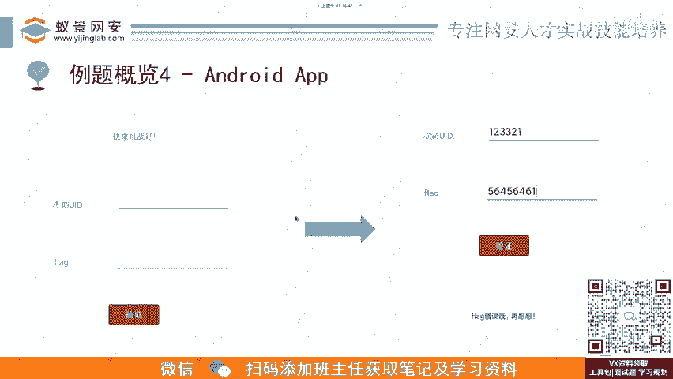
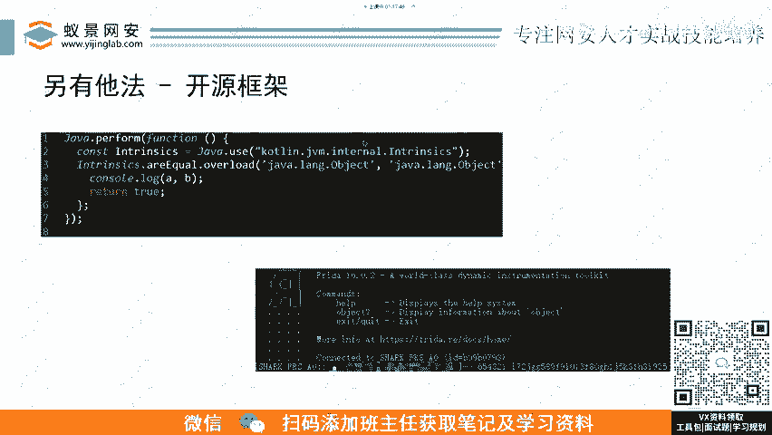

# CTF入门教程：P6：例题4：Android APP-安卓安装包逆向 🧩

在本节课中，我们将学习如何对一个典型的Android应用程序（APK）进行逆向分析。我们将通过一个CTF竞赛中的真实例题，讲解从获取APK文件到最终解密出Flag的完整流程，并对比手动分析与使用自动化框架的差异。

上一节我们介绍了逆向工程的基础概念，本节中我们来看看如何将其应用于移动安全领域。

## 例题背景与目标

这是一个来自“我爱破解”平台的新年红包挑战题。题目是一个Android APK安装包。程序具有一个非常典型的用户界面：包含两个输入框，分别用于输入用户名和密码，以及一个验证按钮。用户点击验证后，程序会执行内部逻辑判断输入是否正确。如果正确，则显示Flag；如果错误，则提示错误信息。



我们的目标就是分析这个APK，理解其验证逻辑，并最终获取到正确的Flag。

## 逆向分析流程

接下来，我们按标准的逆向分析流程进行操作。

### 第一步：定位与分析加密逻辑


首先，我们需要对APK文件进行反编译，分析其Java源代码或Smali代码，找到程序验证用户名和密码的核心逻辑。通常，关键代码会位于按钮点击事件的处理函数中。

### 第二步：翻译与模拟加密逻辑

找到核心的加密或验证函数后，由于其原始实现是Java，我们可以将其翻译成自己更熟悉的语言，例如Python或C。以下是翻译过程的一个概念性示例：

假设原始Java验证函数的核心是一个自定义的`encode`方法：
```java
public String encode(String input) {
    // 复杂的加密逻辑
}
```
我们可以将其用Python重写：
```python
def encode(input_str):
    # 将Java加密逻辑用Python实现
    result = ""
    # ... 具体的加密步骤 ...
    return result
```
这样做的好处是思路更清晰，并且可以编写脚本模拟整个加密过程，进行离线测试或暴力破解。

### 第三步：获取Flag

通过分析，我们可能发现Flag是由特定的用户名和密码经过加密后生成的。一旦我们成功用脚本模拟出加密逻辑，就可以计算出正确的Flag。

## 使用自动化框架的优势

在逆向工程中，合理利用现有工具和框架可以极大提升效率。

以下是手动编写代码与使用成熟开源框架的对比：

*   **手动翻译方法**：可能需要编写几十行甚至上百行代码来复现完整的加密逻辑（例如`encode1`、`encode2`等多个函数）。
*   **使用开源框架方法**：借助一些专门用于Android逆向或密码学分析的框架，可能仅需寥寥数行代码即可直接调用并执行APK中的关键函数，从而快速得到结果。



如图所示，使用框架可以用极短的代码（例如7行）替代大量的手动逆向工作，直接输出Flag。这充分说明了在CTF竞赛和实际逆向分析中，掌握和利用强大工具的重要性。


## 总结

本节课中我们一起学习了Android APK逆向的基本流程。我们从一个具体的CTF例题出发，讲解了如何分析APK的验证逻辑、将核心代码翻译成脚本语言进行模拟，并最终强调了使用自动化框架对于提升解题效率的关键作用。掌握从手动分析到工具辅助的完整技能栈，是CTF逆向工程从入门到精通的重要一步。