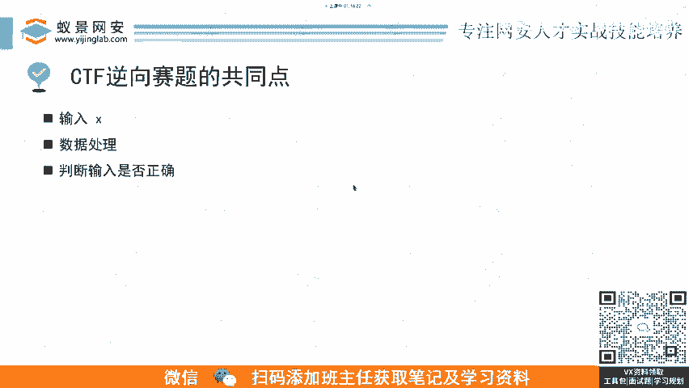
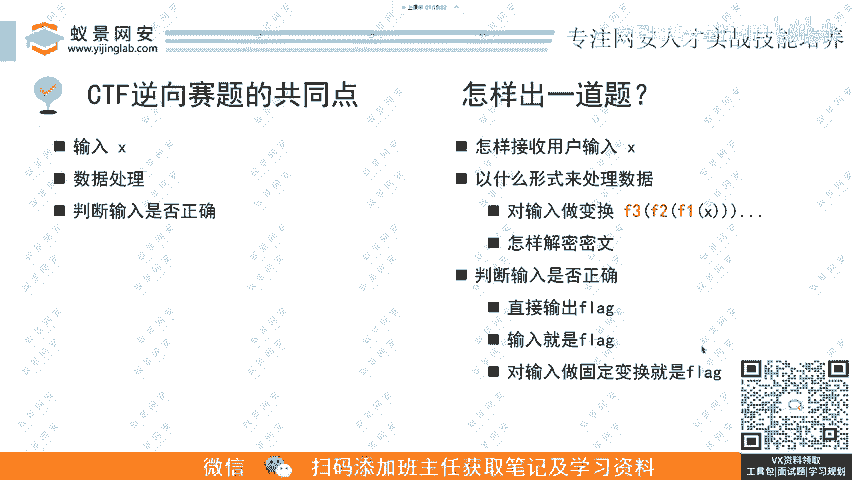
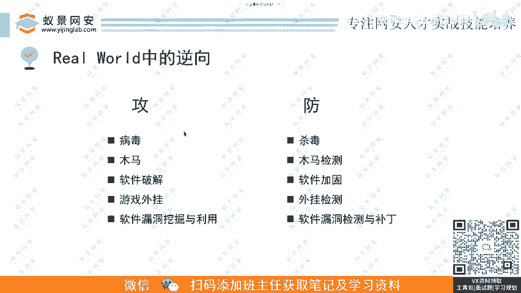

# CTF逆向工程入门：P7：逆向基础题-出题思路与实战应用

## 概述
在本节课中，我们将通过分析四道例题，总结CTF逆向赛题的共同特征与核心流程。我们将探讨出题人的设计思路，并了解逆向工程技术在真实网络安全攻防领域的广泛应用。

## CTF逆向赛题的共同点
上一节我们介绍了逆向工程的基础概念，本节中我们来看看典型CTF逆向赛题的通用模式。通过观察例题，可以发现所有赛题都遵循一个基本流程。

以下是逆向赛题的标准处理流程：
1.  **获取用户输入**：程序首先接收选手的输入，记为变量 `X`。这个 `X` 可能是最终的 `flag`，也可能不是。
2.  **处理输入数据**：程序对输入 `X` 进行一系列的数据处理或变换。
3.  **验证结果**：程序将处理后的结果与一个预设的正确值进行比较，判断输入是否正确。若正确，则输出 `flag` 或提示输入即为 `flag`。

## 逆向赛题的出题思路
理解了赛题的共同点后，我们可以从出题人的视角来构思一道题目。出题流程同样遵循“输入-处理-判断”的三段式结构。

以下是设计一道逆向赛题的关键步骤：
1.  **设计输入方式**：构思程序如何接收用户输入 `X`。形式可以多样，例如在控制台程序中通过 `scanf` 或类似函数从标准输入读取；在游戏或任务型题目中，输入可能是完成特定操作或达到某个状态。
2.  **设计数据处理逻辑**：这是题目的核心。通常有两种主流思路：
    *   **正向加密套娃**：对输入 `X` 进行多层加密或变换。例如，`X` 先后经过函数 `F1`、`F2`、`F3` 的处理，即 `result = F3(F2(F1(X)))`，然后将 `result` 与目标值比较。
    *   **渐进式解密**：题目给出一段密文。选手的输入 `X` 需要满足一系列条件，每满足一个条件，密文就被解密一部分，最终全部解密后得到明文的 `flag`。
3.  **设计判断逻辑**：决定如何告知选手成功。常见方式有：直接输出 `flag`；提示“你的输入就是 `flag`”；或对输入进行固定变换（如计算哈希值 `hash(X)`）后，其结果本身就是 `flag`。

## 逆向工程在真实世界中的应用
CTF竞赛是网络安全技能的演练场，其逆向工程题目是实战的缩影。在真实的网络攻防世界中，逆向技术的应用面极为广泛。

在攻击层面，逆向工程是许多技术的基石：
*   病毒与木马分析
*   软件破解
*   外挂开发
*   软件漏洞挖掘与利用

有攻必有防，攻防双方在对抗中不断进化，是一个“魔高一尺，道高一丈”的过程。

在防御层面，逆向工程同样至关重要：
*   **对抗病毒/木马**：杀毒软件的核心技术之一就是逆向分析，用于检测和清除恶意代码。
*   **防止软件破解**：采用代码混淆、软件加壳等技术增加逆向难度。
*   **应对外挂**：游戏安全中通过逆向分析外挂行为，开发检测机制。
*   **修复漏洞**：通过逆向分析漏洞成因，开发补丁进行修复。

我们的课程中也会涉及部分实战逆向内容。学习CTF逆向对于转向实战有巨大帮助，你会发现许多比赛中的知识点，在研究真实世界的软件（如大型厂商的应用程序）时都能遇到并应用。

## 总结
本节课中我们一起学习了CTF逆向赛题的通用模型，即“输入-处理-验证”流程。我们从出题人角度拆解了如何设计一道逆向题目。最后，我们拓展视野，了解了逆向工程技术在真实网络攻防战中的关键作用，它既是攻击者的利器，也是防御者的盾牌。掌握CTF逆向，将为你在更广阔的网络安全领域实践打下坚实基础。