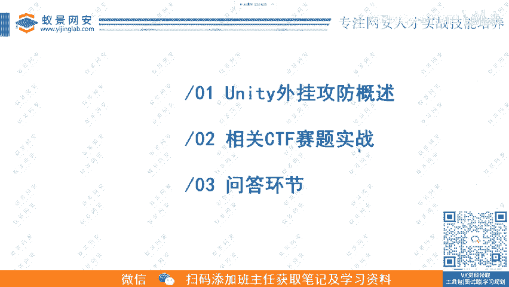
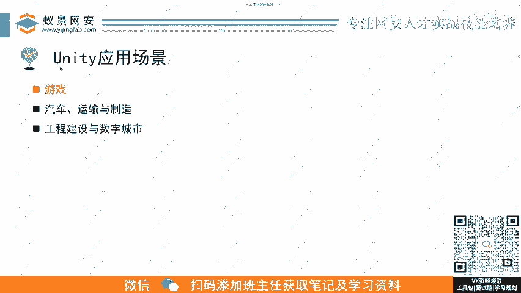

# CTF零基础入门教程：P8：逆向基础题-unity外挂攻防科普 🎮

在本节课中，我们将要学习Unity引擎游戏的外挂攻防基础知识，并通过一个CTF赛题进行实战演练。

## 课程声明与法律须知

首先是一个声明，昨天也强调过。请务必遵守《网络安全法》。大家记住，学习技术要用于正轨。

## 课程内容概述

本节课内容分为三个主要部分。

第一部分，我们会讲解大家可能都比较感兴趣的内容，即外挂与反外挂的攻防。我们将探讨外挂是如何攻击的，以及防御方应如何防御。

第二部分，是一个相关的CTF赛题实战。这是一个实操环节。

第三部分，是问答以及优惠券发放。

## 第一部分：Unity外挂攻防概述 🔍

上一节我们介绍了课程的整体安排，本节中我们来看看Unity外挂攻防的基础概念。

### 什么是Unity引擎？

我相信大多数人都见过这个图标——三个箭头。当你打开一个游戏时，如果先显示这个图标再进入游戏，就说明这个游戏是使用Unity引擎制作的。

Unity官方给自己的定义是：一个实时的3D互动内容创作和运营平台。它可以用于以下领域：
*   游戏开发
*   美术（如电影特效制作）
*   建筑
*   汽车设计
*   影视

其中，游戏和美术领域应用最为广泛。除了Unity，常见的游戏引擎还有Unreal Engine（虚幻引擎）。我们今天主要讲解Unity。

Unity宣称可以用于创作、运营和变现任何2D、3D内容。它支持跨平台开发，兼容以下平台：
*   手机、平板
*   个人电脑（PC）
*   游戏主机
*   增强现实（AR）
*   虚拟现实（VR）

增强现实（AR）技术，常见于一些让你打开摄像头对准桌面，然后在屏幕上显示人偶等虚拟元素的APP。虚拟现实（VR）则是指佩戴头戴式设备，让人沉浸于虚拟环境中的技术。这些都可以用Unity实现。

### Unity的应用场景

Unity的应用场景包括：
*   游戏
*   汽车、运输与制造
*   工程建设
*   数字城市

我们今天主要聚焦于游戏领域，因为这在CTF比赛中考察较多。

### 典型的Unity游戏

以下是几个使用Unity引擎制作的典型游戏案例：
*   **王者荣耀**：一款非常知名的手机游戏。
*   **原神**：一款在全球范围内流行的开放世界游戏。
*   **永劫无间**：一款买断制竞技动作游戏。
*   **明日方舟**：一款策略塔防手机游戏。
*   **森林之子**：是游戏《森林》的续作。

可以看到，许多著名游戏都使用Unity引擎制作。这个引擎虽然方便，但我们后面会讲到，针对它制作外挂也相对方便。

### Unity的其他用途

除了游戏，Unity在其他领域也有应用，例如：
*   **汽车、运输与制造**：例如在车展或体验店，通过平板或投影为你可视化呈现车身内部结构。
*   **工程建设和数字城市**：利用Unity进行AR或VR内容开发，用于城市规划或建筑展示。

---

本节课中我们一起学习了Unity引擎的基本概念、其广泛的应用场景（特别是在游戏领域），并了解了几款典型的Unity游戏。在接下来的部分，我们将深入探讨Unity游戏外挂的攻防原理。