# CTF入门教学：P11：PHP函数定义与使用 📚

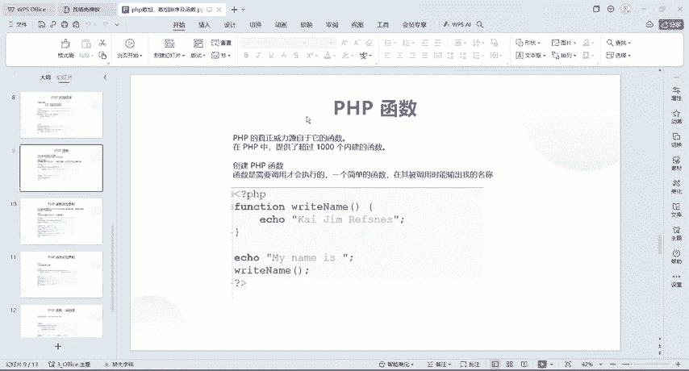

在本节课中，我们将要学习PHP中一个非常核心的概念——函数。函数是组织代码、实现代码复用的基本单元，理解它对于后续学习至关重要。

上一节我们介绍了数组及其排序方法，本节中我们来看看如何定义和使用PHP函数。

## 什么是PHP函数？ 🤔

PHP的强大功能很大程度上源于其丰富的内置函数库，提供了超过1000个内置函数。我们不会逐一讲解所有函数，而是聚焦于常见函数的基本创建和使用方法。

## 创建PHP函数

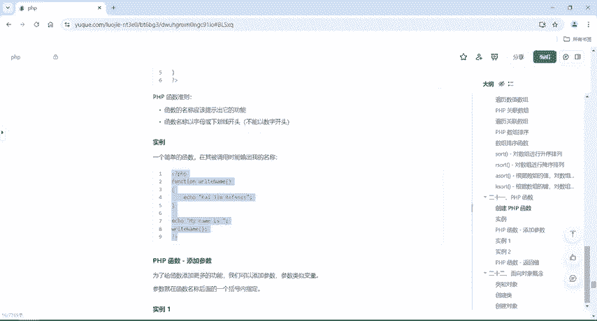

在PHP中，通过`function`关键字来创建函数。函数需要被调用才会执行。

以下是定义一个函数的基本语法结构：
```php
function functionName() {
    // 要执行的代码
}
```
关于函数命名，有以下准则需要遵循：
*   函数名称应能提示其功能。
*   名称以字母或下划线开头，不能以数字开头。
*   通常采用驼峰命名法（例如：`writeName`）。

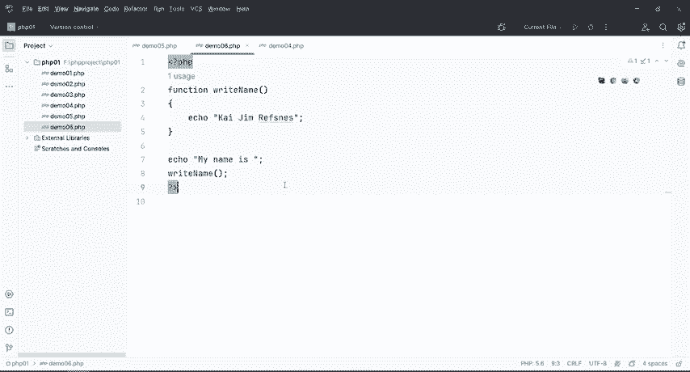

## 函数的定义与调用

让我们通过一个实例来理解无参数函数的定义和调用。

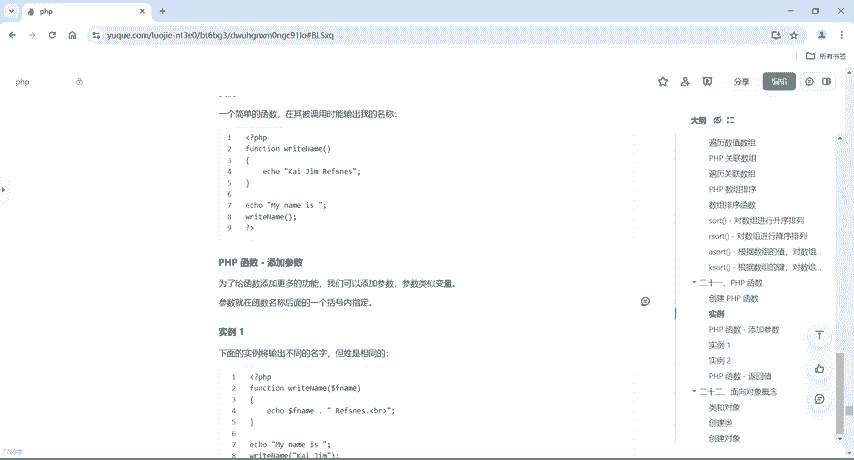

以下是一个定义并调用函数的示例：
```php
<?php
function writeName() {
    echo "Kai Jim Refsnes";
}
echo "My name is ";
writeName();
?>
```
代码执行流程说明：
1.  程序从上到下执行，首先输出 `"My name is "`。
2.  当执行到 `writeName();` 时，调用`writeName`函数。
3.  函数内的代码 `echo "Kai Jim Refsnes";` 被执行。
4.  最终输出结果为：`My name is Kai Jim Refsnes`。

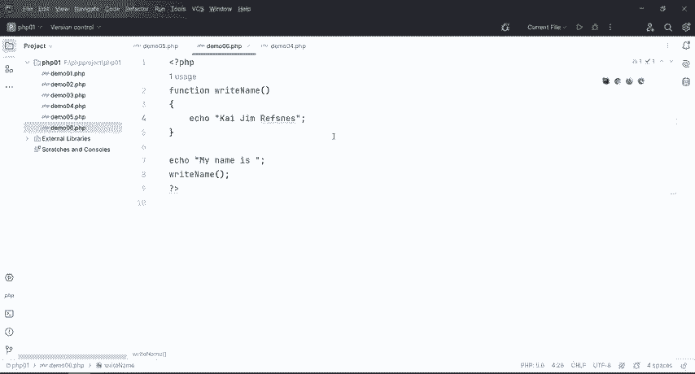

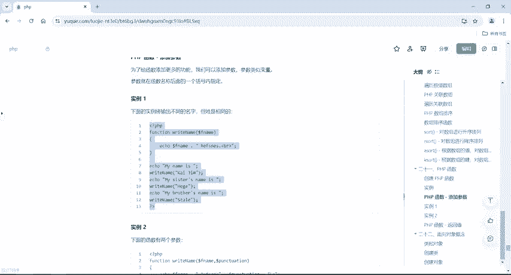

**核心要点**：函数定义后不会自动执行，必须在需要的地方进行调用。

## 向函数添加参数

为了让函数能处理不同的数据，我们可以为其添加参数。参数在函数名后的括号内指定，可以是一个或多个。

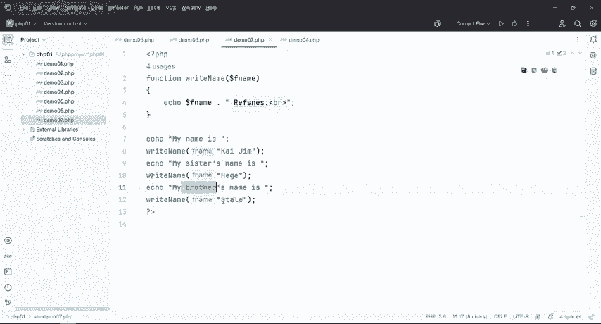

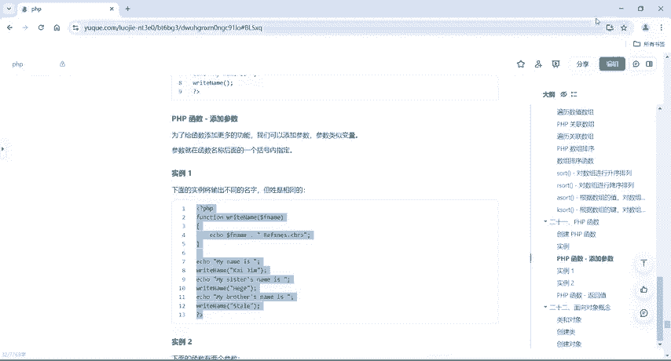

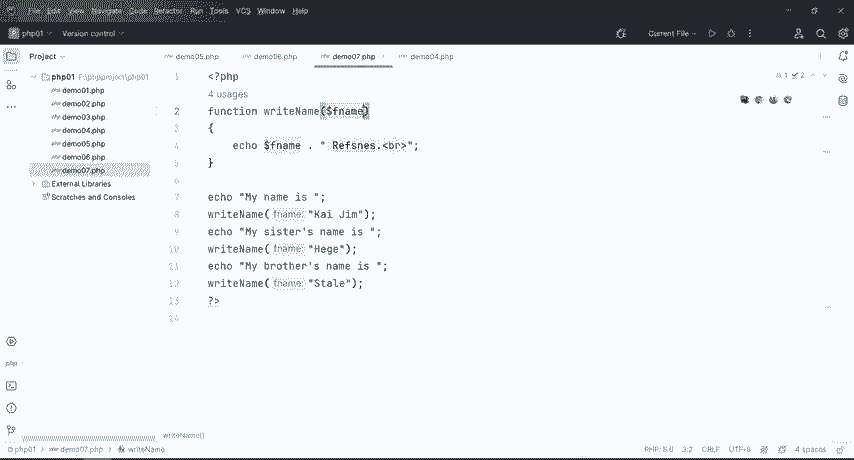

以下是带参数函数的定义与调用方法：
```php
<?php
function writeName($fname) {
    echo $fname . " Refsnes.<br>";
}
echo "My name is ";
writeName("Kai Jim");
echo "My sister's name is ";
writeName("Hege");
echo "My brother's name is ";
writeName("Stale");
?>
```
在这个例子中，`$fname`是参数。调用`writeName`时，我们传入不同的值（如`"Kai Jim"`），该值就会在函数内部被使用。

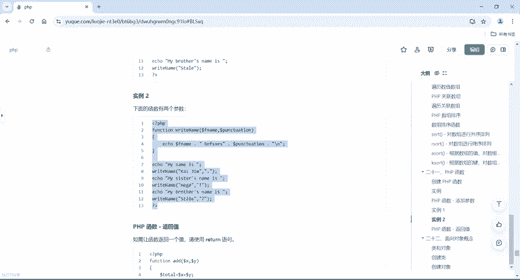

函数也支持多个参数：
```php
<?php
function writeName($fname, $punctuation) {
    echo $fname . " Refsnes" . $punctuation . "<br>";
}
echo "My name is ";
writeName("Kai Jim", ".");
echo "My sister's name is ";
writeName("Hege", "!");
echo "My brother's name is ";
writeName("Ståle", "?");
?>
```
调用带多个参数的函数时，需要按顺序传入相应数量的值。

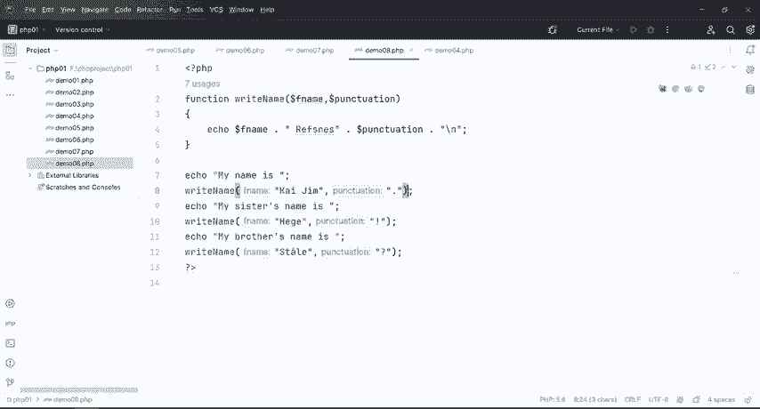

## 函数的返回值

如果希望函数执行后返回一个结果给调用者，需要使用`return`语句。

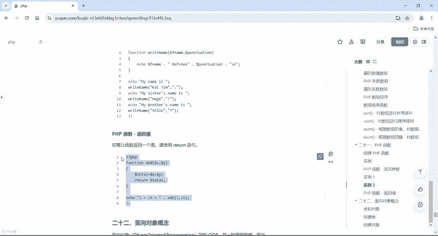

以下是使用`return`语句的函数示例：
```php
<?php
function add($x, $y) {
    $total = $x + $y;
    return $total;
}
echo "1 + 16 = " . add(1, 16);
?>
```
**有`return`和无`return`函数的区别**：
*   **无`return`函数**：通常在函数内部直接执行输出（如`echo`），调用函数即产生效果。
*   **有`return`函数**：函数内部进行计算或处理，并通过`return`将结果返回。调用函数后，通常会配合`echo`或将返回值赋给变量来使用这个结果。

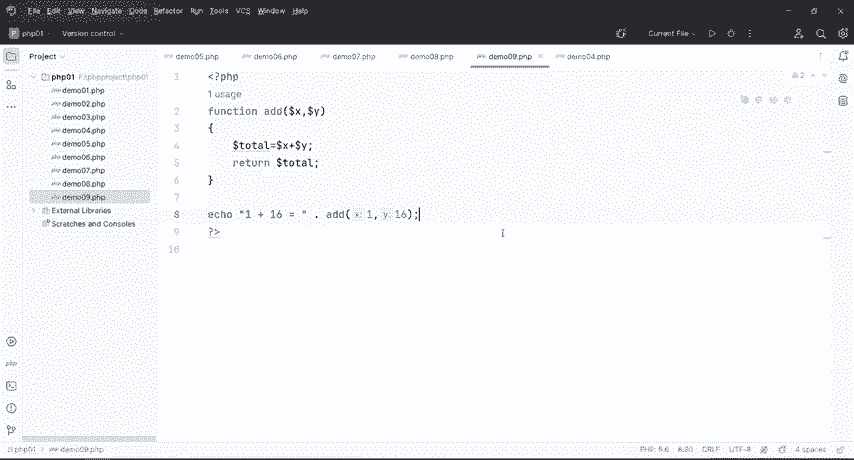

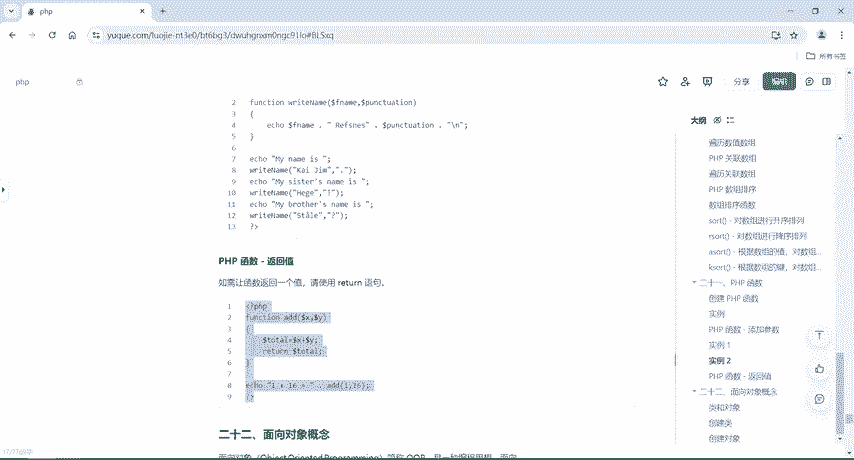

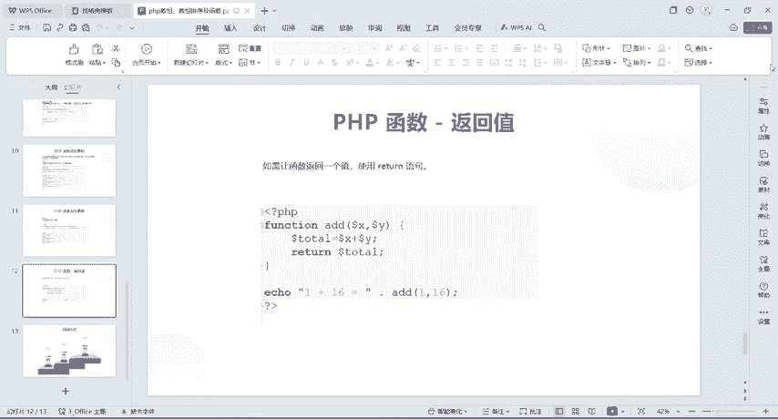

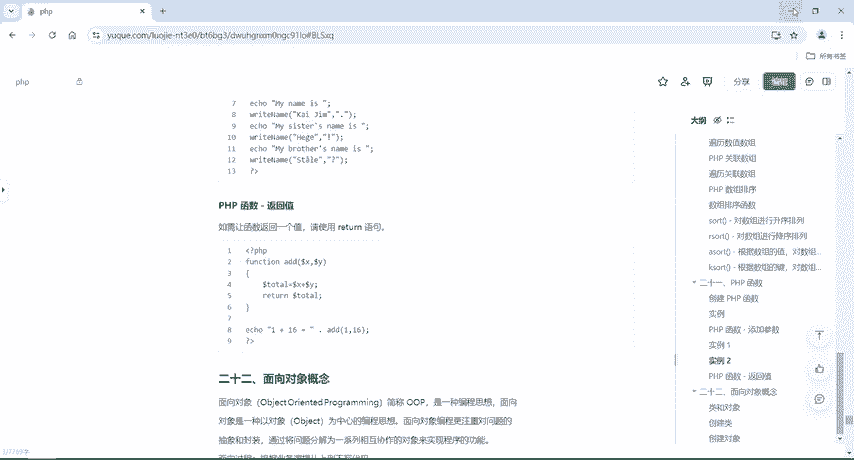

在本例中，`add(1, 16)`会计算并返回`17`，然后由外层的`echo`语句输出。

## 总结 📝

本节课中我们一起学习了PHP函数的核心知识：
1.  **函数定义**：使用 `function` 关键字创建函数。
2.  **函数调用**：通过函数名加括号 `()` 来执行函数。
3.  **函数参数**：可以向函数传递一个或多个参数，使其处理不同的数据。
4.  **返回值**：使用 `return` 语句可以让函数将处理结果返回给调用者。

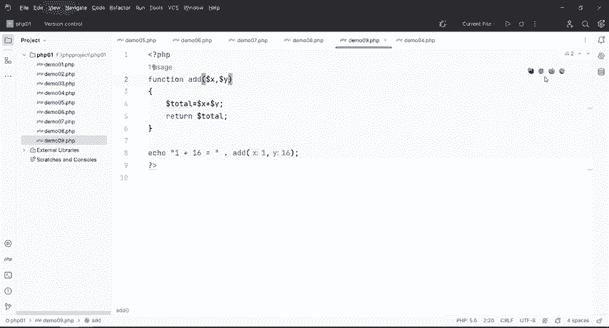

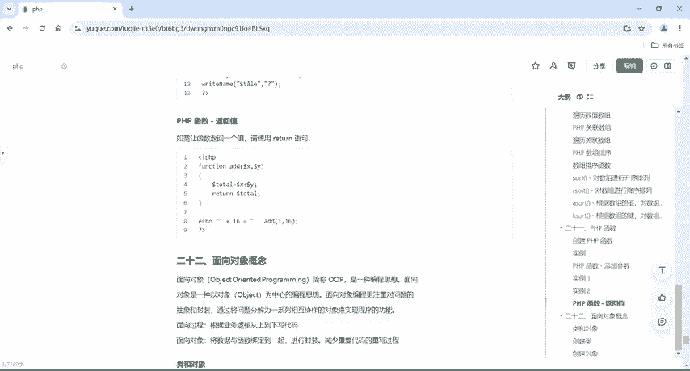

函数是构建复杂程序的基础，熟练掌握其定义和使用是PHP编程的关键一步。下一节课，我们将进入PHP的另一个重要主题：面向对象编程。