# CTF入门教学：P12：PHP面向对象 🧩

在本节课中，我们将要学习PHP编程中的一个核心概念——面向对象编程。我们将了解什么是面向对象，它与面向过程的区别，并学习如何在PHP中创建和使用类与对象。

## 概述

面向对象是一种以对象为中心的编程思想。在接触面向对象之前，我们通常采用面向过程的编程方式，即根据业务逻辑从上到下编写代码。这种方式容易导致代码冗余，即编写大量重复的代码。为了避免这种情况，我们可以使用面向对象的编程思想，将数据与函数绑定在一起进行封装，从而减少重复代码的编写过程。

## 类与对象的概念

理解了面向对象的基本思想后，我们来看看PHP中的类和对象。

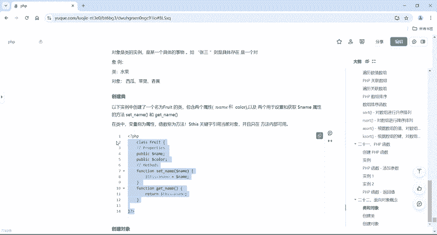

*   **类** 是一个抽象的概念，它仅仅是一个模板，用于描述具有相同属性和方法的对象的集合。例如，“人”是一个类。
*   **对象** 是类的实体，是某一个具体的事物。例如，“张三”是一个具体的对象。

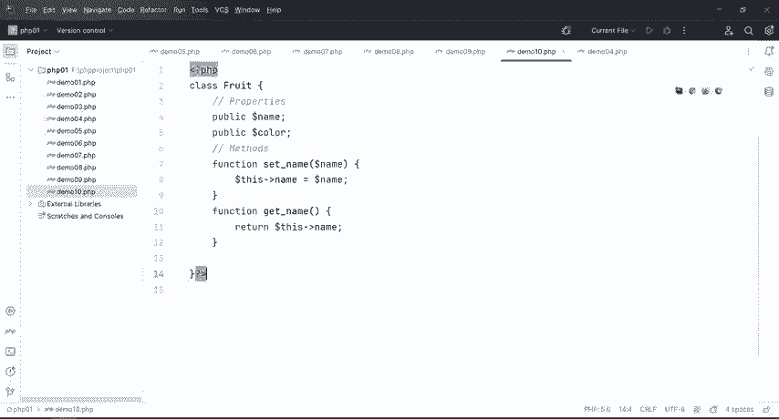

再举一个例子，“水果”是一个类。而“西瓜”、“苹果”、“香蕉”等具体的水果，都是“水果”这个类的对象。

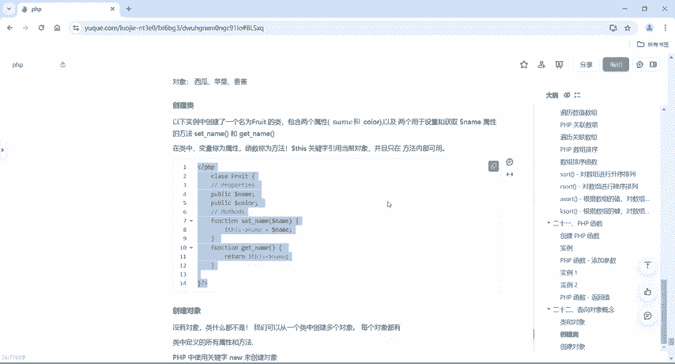

## 在PHP中创建类

上一节我们介绍了类与对象的基本概念，本节中我们来看看如何在PHP中具体创建一个类。

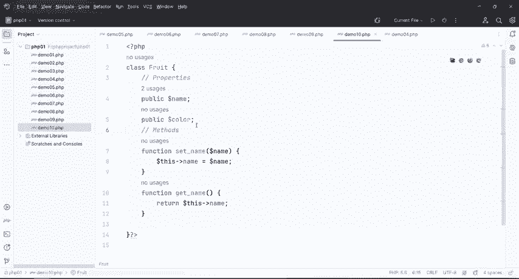

以下是一个创建名为 `Fruit`（水果）类的示例代码：

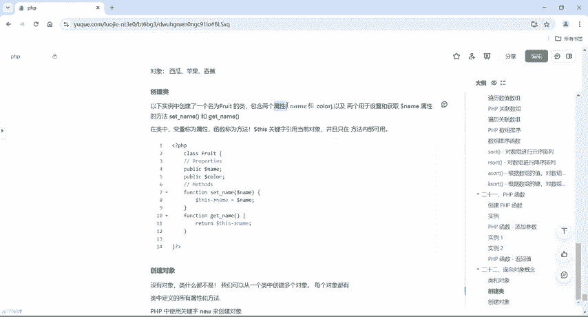

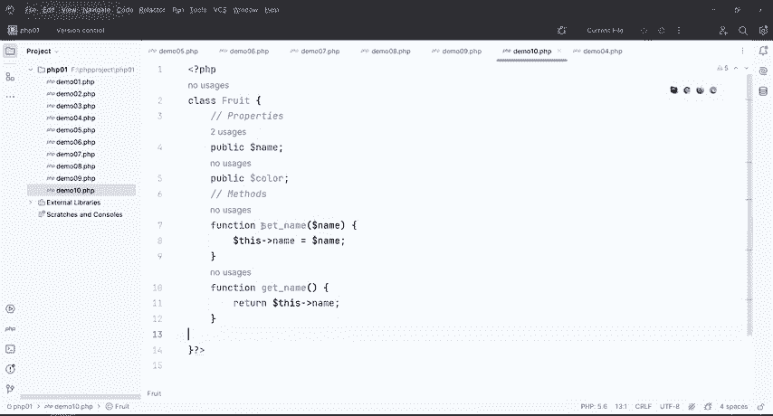

```php
class Fruit {
    // 属性
    public $name;
    public $color;

    // 方法：设置名称
    function set_name($name) {
        $this->name = $name;
    }

    // 方法：获取名称
    function get_name() {
        return $this->name;
    }

    // 自定义方法：打招呼
    function say() {
        echo "我的名字是" . $this->name;
    }
}
```

代码解析：
*   使用 `class` 关键字定义类，类名后直接跟花括号 `{}`。
*   在类中，变量被称为**属性**（如 `$name`, `$color`）。
*   在类中，函数被称为**方法**（如 `set_name()`, `get_name()`）。
*   `$this` 关键字用于引用当前对象，并且只能在方法内部使用。

## 创建与使用对象

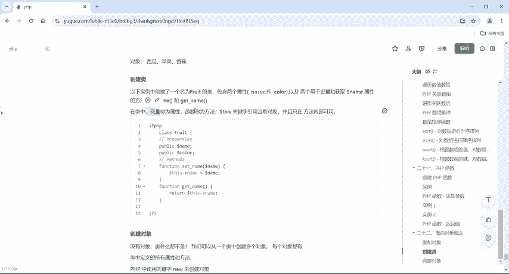

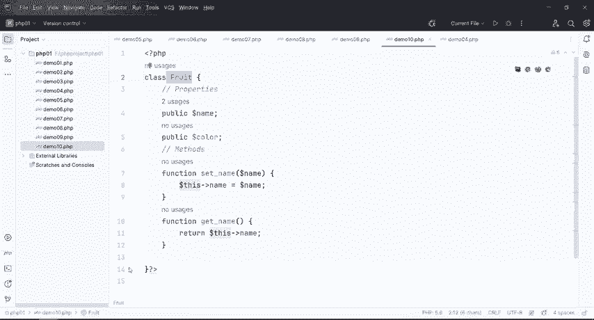

类定义好后，本身并不能直接使用。我们需要根据类来创建具体的对象。在PHP中，使用 `new` 关键字来创建对象。

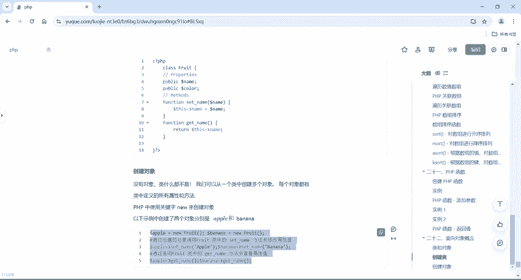

以下是创建和使用对象的步骤：

```php
// 根据 Fruit 类创建两个对象
$apple = new Fruit();
$banana = new Fruit();

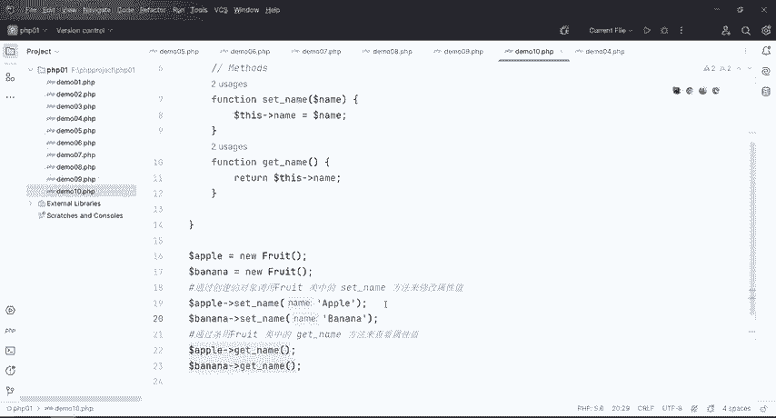

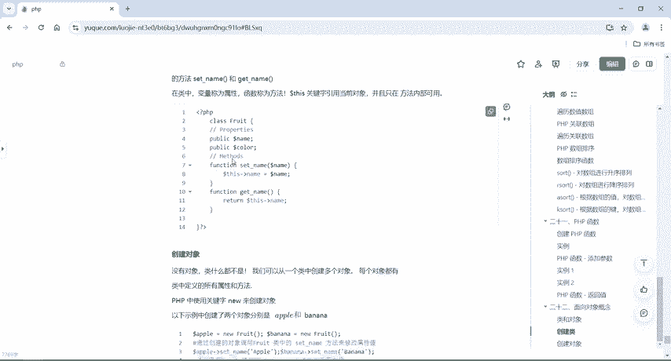

// 调用对象的方法来设置属性
$apple->set_name("Apple");
$banana->set_name("Banana");

// 调用对象的方法来获取属性并输出
echo $apple->get_name(); // 输出：Apple
echo "<br>";
echo $banana->get_name(); // 输出：Banana
echo "<br>";

// 调用自定义的 say 方法
$apple->say(); // 输出：我的名字是Apple
echo "<br>";
$banana->say(); // 输出：我的名字是Banana
```

运行以上代码，我们将得到两个对象：`$apple` 和 `$banana`，并成功调用它们的方法来设置、获取属性以及执行自定义操作。

## 总结

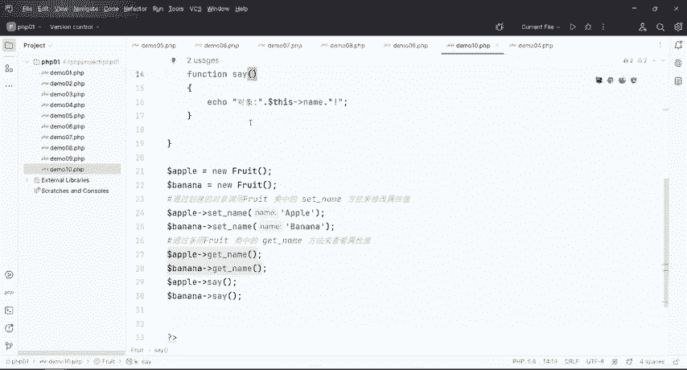

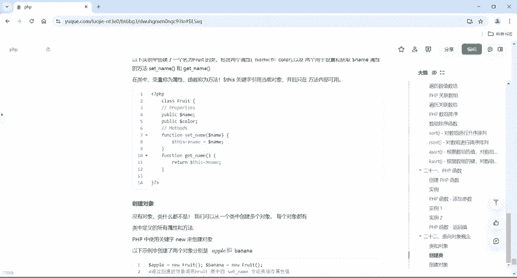

本节课中我们一起学习了PHP面向对象编程的基础知识。我们首先了解了面向对象是一种减少代码冗余的编程思想。然后，我们学习了**类**（抽象的模板）和**对象**（类的具体实例）这两个核心概念。最后，我们通过实例掌握了如何在PHP中使用 `class` 关键字定义类（包含属性和方法），以及如何使用 `new` 关键字创建对象，并通过 `->` 运算符调用对象的方法。理解这些概念是深入学习PHP和应对CTF中Web安全挑战的重要基础。