# CTF入门教学：P13：PHP构造函数与析构函数

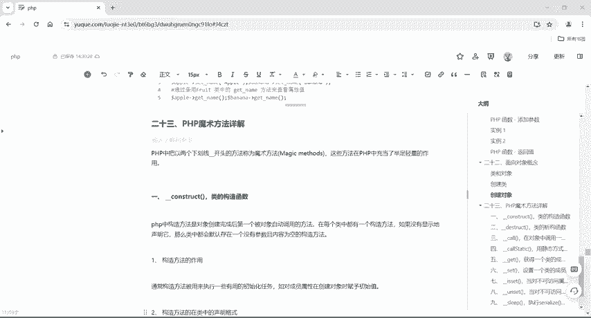

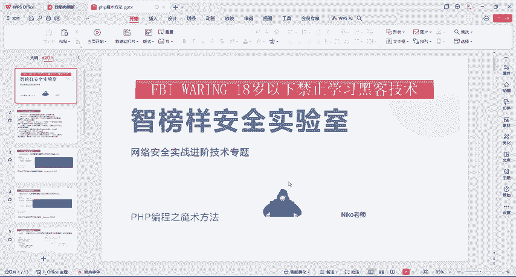

在本节课中，我们将要学习PHP编程中两个重要的魔术方法：构造函数（`__construct`）与析构函数（`__destruct`）。理解它们是掌握PHP反序列化漏洞的基础。

## 概述：什么是魔术方法？

在PHP中，魔术方法是指以两个下划线（`__`）开头的方法。它们在特定时机会被PHP自动调用，在面向对象编程和反序列化中扮演着关键角色。我们之前学习的普通方法需要显式调用，而魔术方法则会在满足条件时自动执行。

## 构造函数 `__construct`

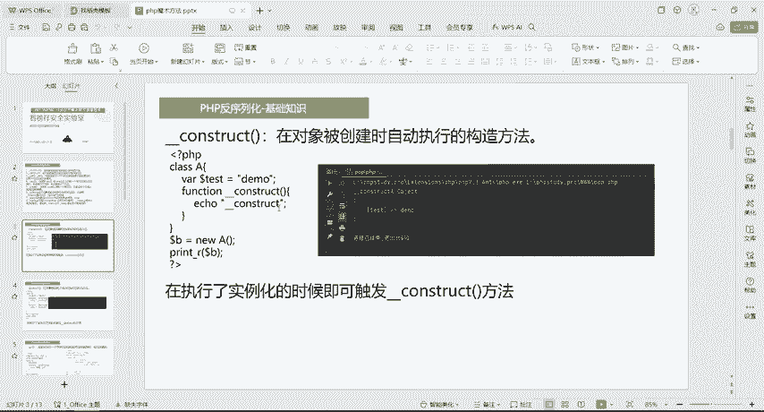

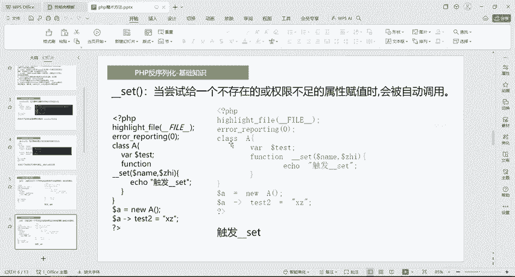

上一节我们介绍了魔术方法的基本概念，本节中我们来看看第一个具体的魔术方法——构造函数。

构造函数是对象被创建（即使用 `new` 关键字实例化）时**自动执行**的第一个方法。它通常用于初始化对象的属性或执行一些必要的设置任务。

### 构造函数的声明与特点

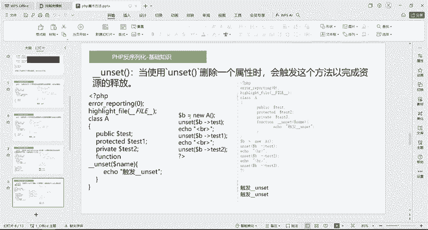

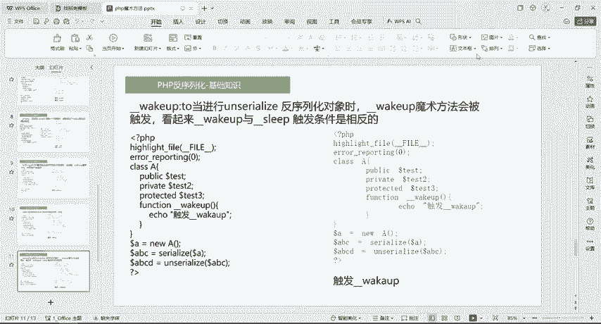

以下是构造函数声明的核心格式：

```php
public function __construct([参数列表]) {
    // 方法体，通常用于初始化成员属性
}
```

关于构造函数，需要注意以下几点：
1.  一个类中**只能声明一个**构造函数，因为PHP不支持构造函数的重载。
2.  构造函数的名称必须**以两个下划线开头**，即 `__construct`。
3.  如果在类中没有显式声明构造函数，PHP会提供一个默认的、无参数且内容为空的构造函数。

### 构造函数示例分析

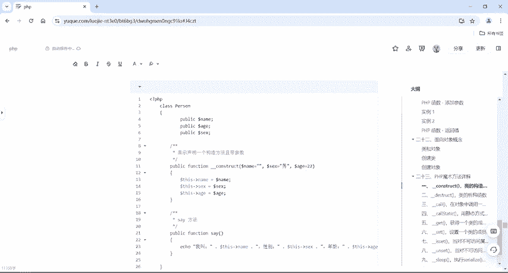

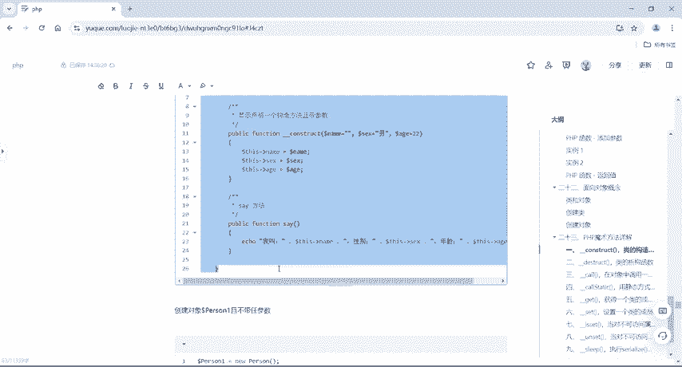

让我们通过一个代码示例来理解构造函数的工作原理。

```php
class Person {
    public $name;
    public $sex;
    public $age;

    // 显式声明一个带默认参数的构造函数
    public function __construct($name = '', $sex = '男', $age = 22) {
        $this->name = $name;
        $this->sex = $sex;
        $this->age = $age;
        echo "我叫" . $this->name . "，性别" . $this->sex . "，年龄" . $this->age . "。";
    }
}

// 创建对象1：不传递参数，使用构造函数的默认值
$person1 = new Person();
// 输出：我叫，性别男，年龄22。

// 创建对象2：传递部分参数
$person2 = new Person('小明');
// 输出：我叫小明，性别男，年龄22。
```

**代码解析：**
*   在 `Person` 类中，我们显式定义了一个 `__construct` 方法，并为三个参数设置了默认值。
*   当使用 `new Person()` 创建 `$person1` 时，没有传递任何参数，因此对象属性使用构造函数中定义的默认值（`$name` 为空，`$sex` 为‘男’，`$age` 为22）。
*   当使用 `new Person(‘小明’)` 创建 `$person2` 时，传递了第一个参数，因此 `$name` 被初始化为‘小明’，其余两个属性仍使用默认值。
*   构造函数在对象创建时自动被调用，并执行了内部的 `echo` 语句。

## 析构函数 `__destruct`

了解了对象创建时的自动调用机制后，我们再来看看对象销毁时的对应方法——析构函数。

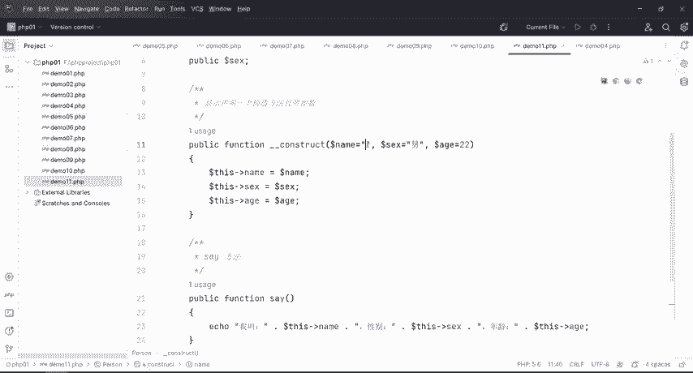

析构函数是对象被销毁（例如脚本执行结束、对象被显式销毁 `unset()`）**之前自动执行**的方法。它常用于执行一些清理工作，例如关闭文件、释放数据库连接等。

### 析构函数的声明与特点

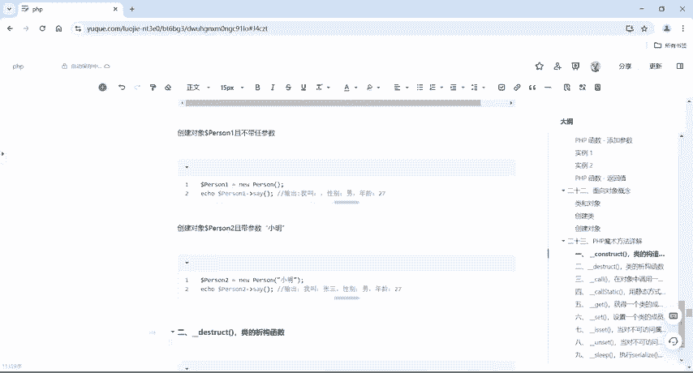

析构函数的声明格式如下：

```php
public function __destruct() {
    // 方法体，执行对象销毁前的清理操作
}
```

析构函数的特点：
1.  析构函数**不能带有任何参数**。
2.  其名称同样以两个下划线开头，即 `__destruct`。
3.  通常在一个对象的所有引用都被删除，或者脚本执行结束时被调用。

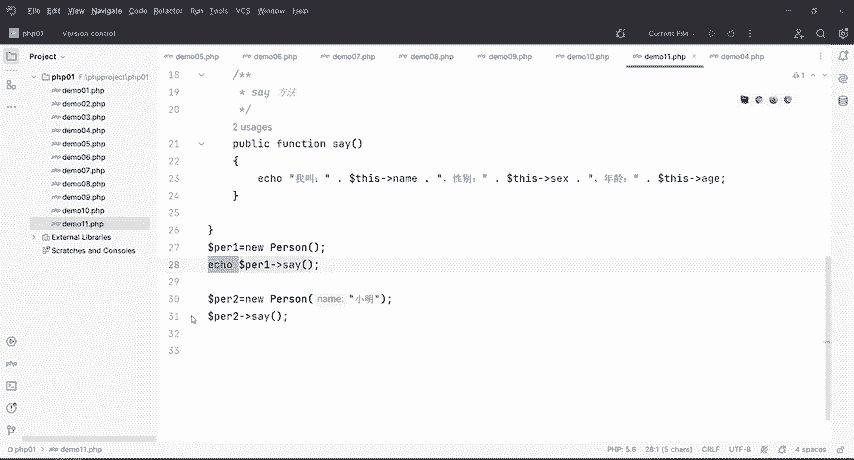

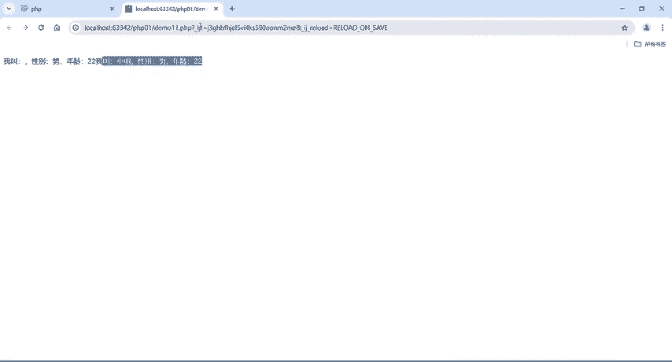

### 析构函数示例分析

我们在之前的 `Person` 类基础上添加析构函数。

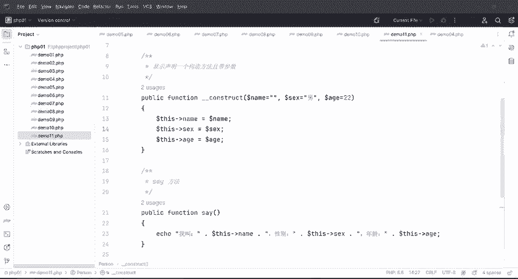

```php
class Person {
    public $name;
    // ... 其他属性和构造函数同上 ...

    // 析构函数
    public function __destruct() {
        echo "<br>对象即将被销毁，最后再说一次：我的名字叫" . $this->name . "。";
    }
}

// 创建对象
$person = new Person('小明');
// 输出：我叫小明，性别男，年龄22。

// 脚本执行结束时，会自动调用析构函数
// 最终输出：对象即将被销毁，最后再说一次：我的名字叫小明。
```

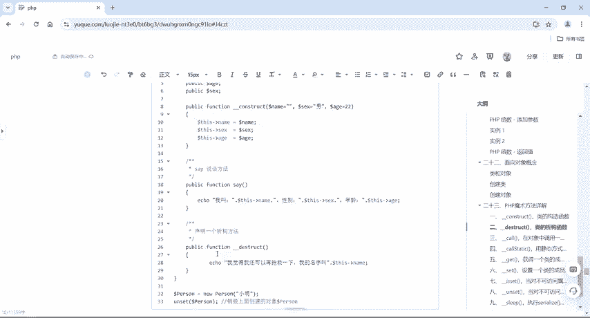

**代码解析：**
*   我们在 `Person` 类中添加了 `__destruct` 方法。
*   当对象 `$person` 被创建时，构造函数首先被调用，输出介绍信息。
*   当PHP脚本执行完毕，或对象被 `unset($person)` 时，该对象就会被销毁。在销毁**之前**，析构函数 `__destruct` 被自动调用，输出了告别信息。

## 总结

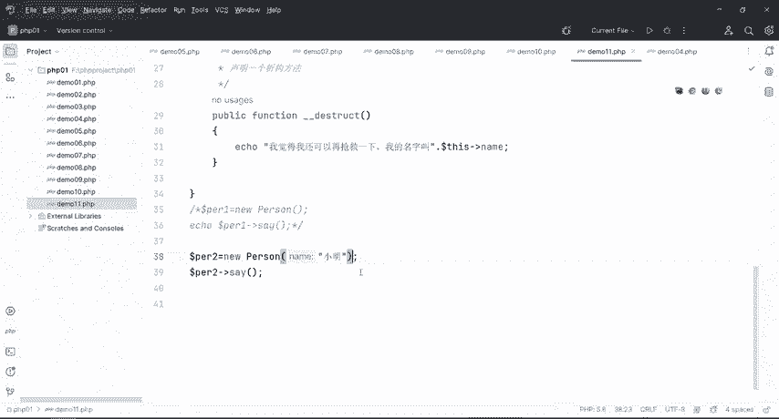

本节课中我们一起学习了PHP中两个成对的魔术方法：
*   **构造函数 `__construct`**：在对象被 `new` 创建时**自动调用**，常用于初始化对象属性。
*   **析构函数 `__destruct`**：在对象被销毁前**自动调用**，常用于执行清理和收尾工作。

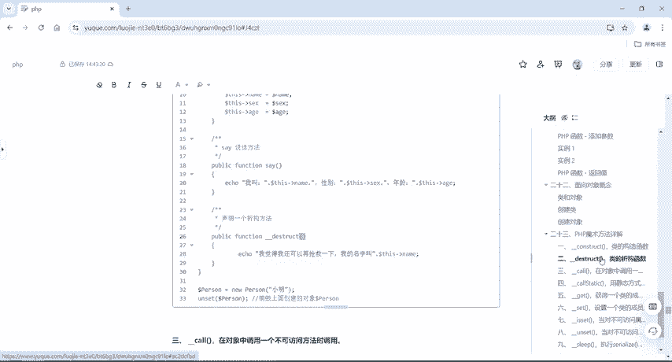

它们都以双下划线 `__` 开头，并且都在特定生命周期节点自动执行，无需手动调用。理解这两个方法是后续学习 `__wakeup`、`__sleep` 等其他魔术方法以及PHP反序列化漏洞的重要基石。在接下来的课程中，我们将继续探索其他魔术方法的奥秘。