# CTF入门教学：P14：魔术方法之__call及__callStatic

在本节课中，我们将要学习PHP中的两个重要魔术方法：`__call`和`__callStatic`。它们主要用于处理对象中调用不存在或不可访问的方法时的情况，是理解PHP面向对象编程和后续Web安全（如反序列化漏洞）的基础。

## 概述
上一节我们介绍了其他魔术方法，本节中我们来看看`__call`和`__callStatic`。这两个方法的核心作用是“兜底”，当程序试图调用一个不存在或不可访问的方法时，它们会被自动触发，从而避免程序因致命错误而终止执行。

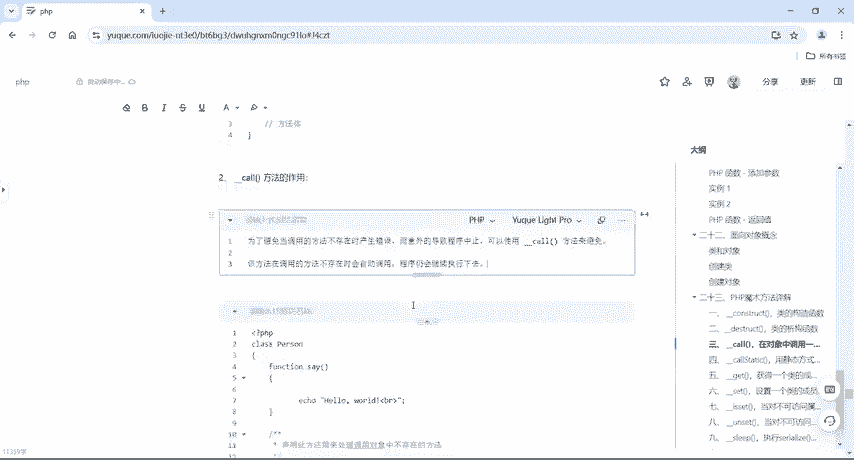

## __call 魔术方法
`__call`方法在对象中调用一个不可访问的（非公开的）方法时被自动调用。

它的标准格式如下：
```php
public function __call($method_name, $arguments) {
    // 处理逻辑
}
```
以下是`__call`方法的关键点：
*   **参数**：它接受两个参数。第一个参数`$method_name`会自动接收不存在的方法名。第二个参数`$arguments`会以数组的形式接收调用该方法时传入的多个参数。
*   **目的**：主要是为了避免因调用不存在的方法而导致程序报错并停止运行。声明了`__call`方法后，即使调用不存在的方法，程序也会继续执行下去。

### 代码示例与解析
我们通过一个具体例子来理解。假设有一个`Person`类：

```php
class Person {
    public function say() {
        echo "Hello World";
    }

    public function __call($method_name, $arguments) {
        echo "你所调用的方法 {$method_name} 不存在。参数为：";
        print_r($arguments);
    }
}

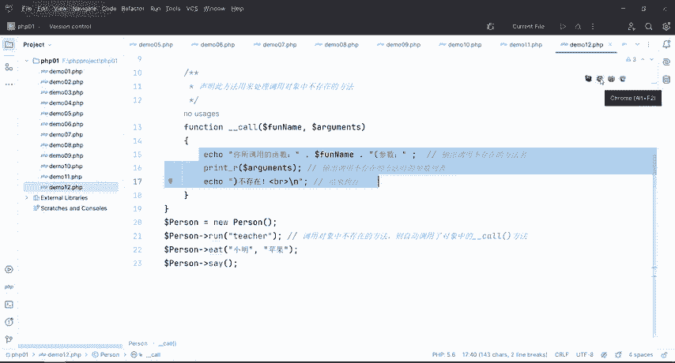

$teacher = new Person();
$teacher->say();      // 输出：Hello World
$teacher->run("fast"); // 触发 __call
$teacher->eat("apple", "banana"); // 触发 __call
```
运行上述代码，`say()`方法正常执行。而`run()`和`eat()`方法在类中并不存在，因此会触发`__call`方法，输出相应的提示信息，而程序不会报错。

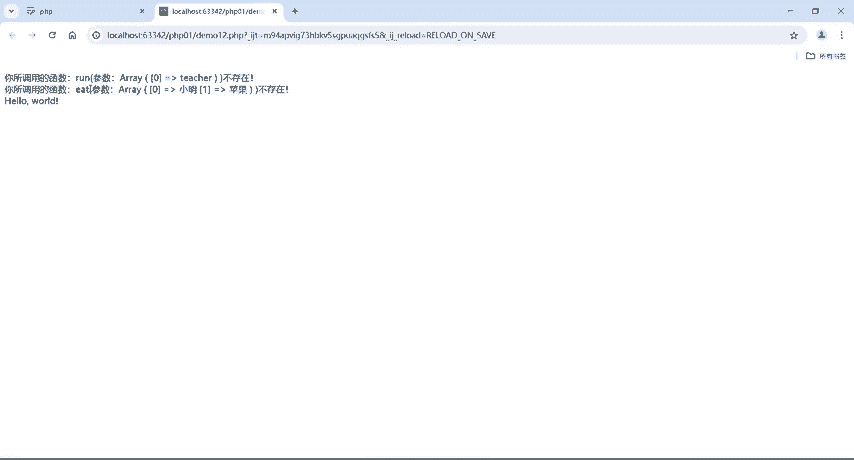

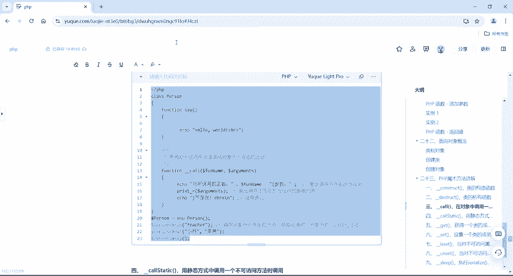

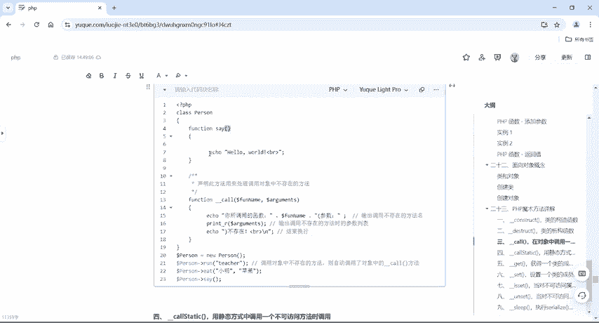

为了对比，如果我们移除`__call`方法，再次尝试调用不存在的`run()`方法：
```php
class Person {
    public function say() {
        echo "Hello World";
    }
    // 移除了 __call 方法
}

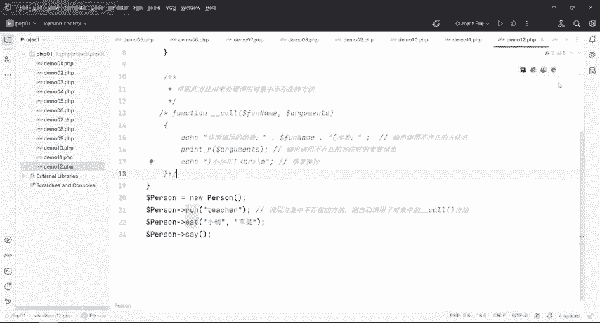

$teacher = new Person();
$teacher->run();
```
程序将会报错：`Fatal error: Uncaught Error: Call to undefined method Person::run()...`，导致脚本终止。

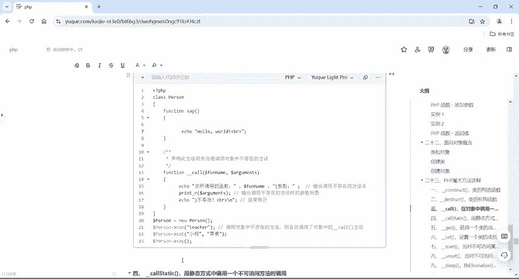

## __callStatic 魔术方法
上一节我们介绍了对象实例调用时的`__call`，本节中我们来看看静态调用的情况。`__callStatic`方法与`__call`功能类似，但它在**静态上下文**中调用一个不可访问的方法时被触发。

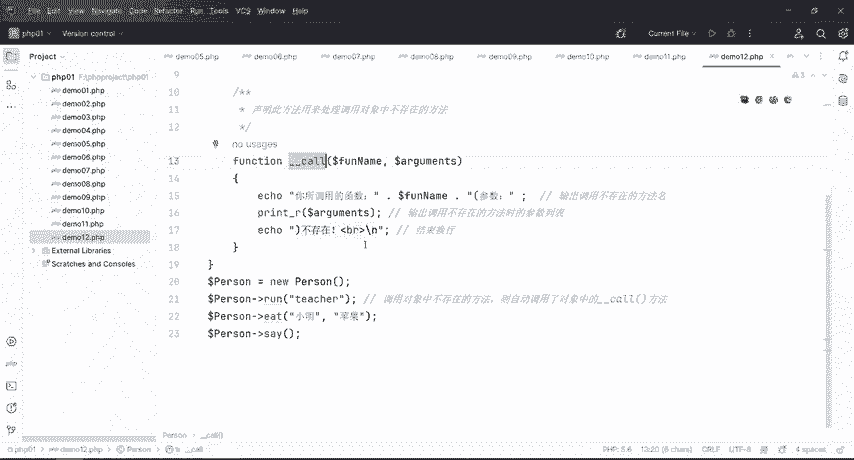

它的标准格式如下：
```php
public static function __callStatic($method_name, $arguments) {
    // 处理逻辑
}
```
以下是`__callStatic`方法的关键点：
*   **静态声明**：方法本身必须使用`static`关键字声明为静态方法。
*   **触发方式**：必须使用`::`范围解析操作符（双冒号）进行静态调用时才会触发。
*   **目的**：同样是处理不存在的静态方法调用，防止程序报错。

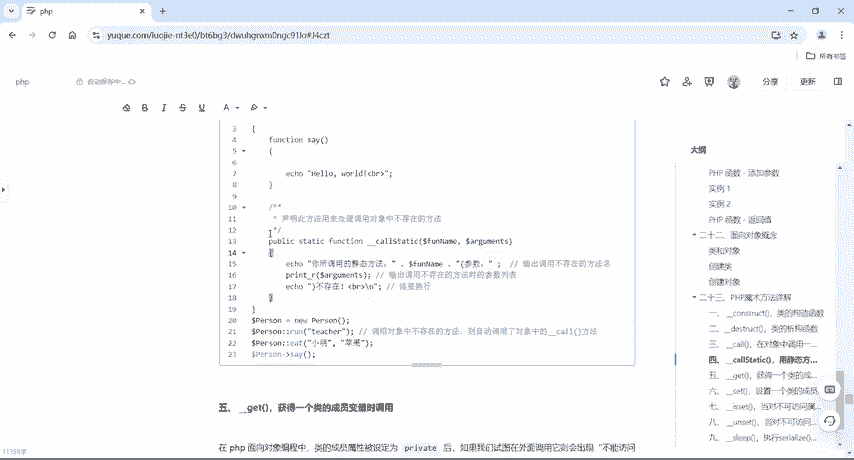

### 代码示例与解析
我们修改上面的例子，使其支持静态调用：

```php
class Person {
    public static function say() {
        echo "Hello World";
    }

    public static function __callStatic($method_name, $arguments) {
        echo "静态调用：你所调用的方法 {$method_name} 不存在。参数为：";
        print_r($arguments);
    }
}

Person::say();      // 输出：Hello World
Person::run("fast"); // 触发 __callStatic
Person::eat("fruit"); // 触发 __callStatic
```
在这个例子中，`Person::say()`是合法的静态调用。`Person::run()`和`Person::eat()`是不存在的静态方法，因此触发了`__callStatic`方法。

**核心区别总结**：
*   `__call` 针对对象实例调用（使用 `->` 操作符）。
*   `__callStatic` 针对静态调用（使用 `::` 操作符）。

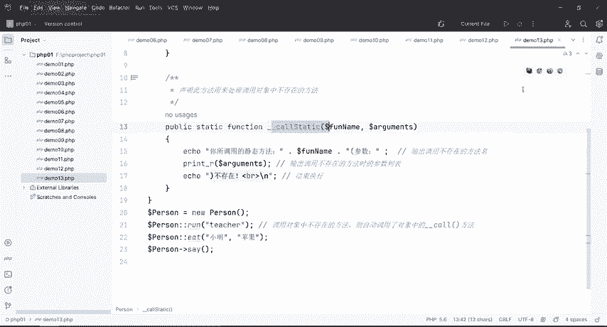

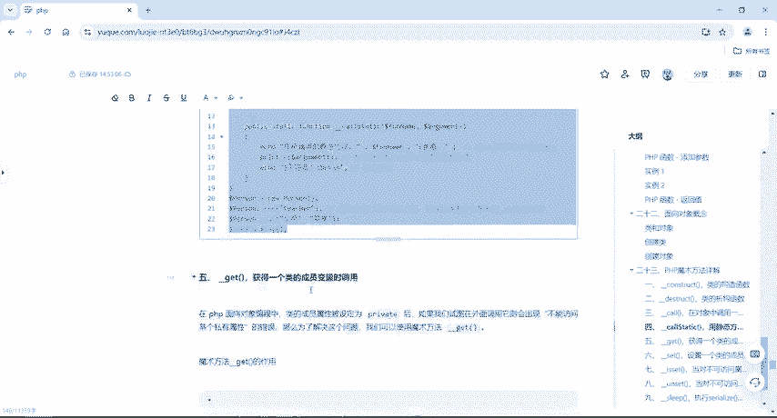

## 总结
本节课中我们一起学习了PHP中的`__call`和`__callStatic`魔术方法。
*   **共同点**：它们都是当调用不存在或不可访问的方法时的“安全网”，用于捕获错误并使程序能够继续执行，而不是直接崩溃。
*   **不同点**：`__call`用于普通的对象方法调用，而`__callStatic`专门用于静态方法调用。
理解这两个魔术方法的工作原理，对于编写健壮的面向对象代码以及后续学习CTF中与PHP对象相关的安全漏洞（如反序列化）至关重要。