# CTF入门教学：P15：魔术方法之__set及__get

在本节课中，我们将要学习PHP中的两个重要魔术方法：`__set`和`__get`。它们主要用于处理类的私有属性访问问题，是CTF Web题目中常见的考点。

上一节我们介绍了其他魔术方法，本节中我们来看看`__get`和`__set`的具体作用与用法。

## `__get`魔术方法

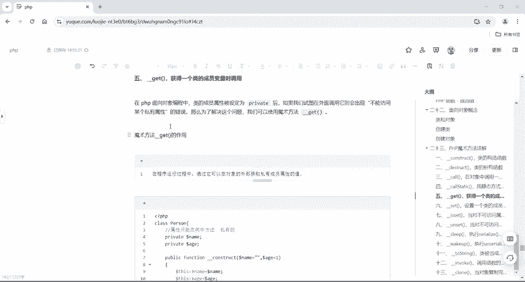

`__get`方法在程序试图**获取**一个类的私有或受保护的成员属性时被自动调用。它的作用是提供一个接口，让我们能够在类外部安全地读取私有属性的值。

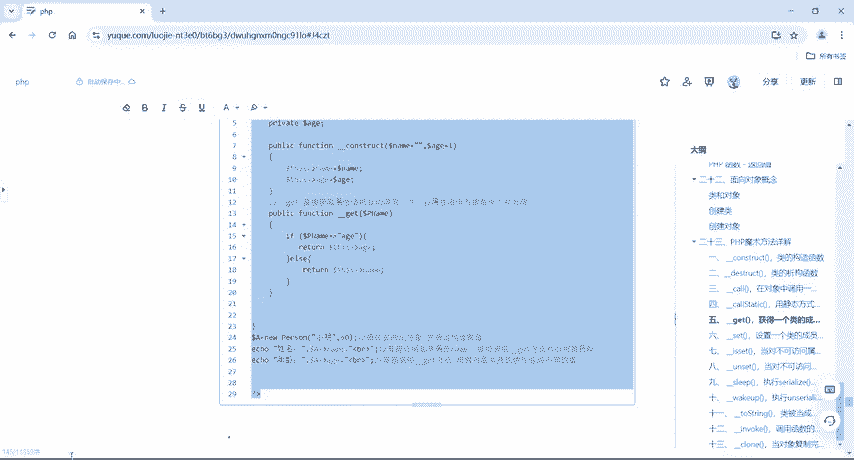

以下是`__get`方法的核心概念：
*   **触发条件**：在对象外部访问一个**不可访问的属性**（如`private`或`protected`属性）时。
*   **方法签名**：`public function __get($property_name)`
*   **参数**：`$property_name`是试图访问的属性名。

为了理解其必要性，我们先看一个会报错的例子。当一个类的属性被声明为`private`时，在类外部直接访问它会引发错误。

```php
<?php
class Person {
    private $name;
    private $age;
    
    public function __construct($name, $age) {
        $this->name = $name;
        $this->age = $age;
    }
    // 此处没有定义 __get 方法
}

$a = new Person("小明", 60);
echo $a->name; // 这里会报错：Cannot access private property Person::$name
?>
```

为了解决上述错误，我们可以在类中定义`__get`方法。

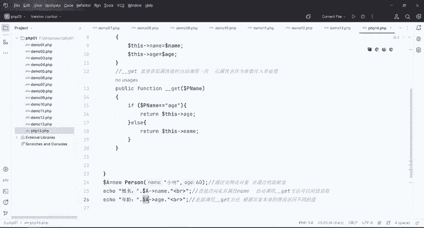

以下是使用`__get`方法修正后的代码示例：

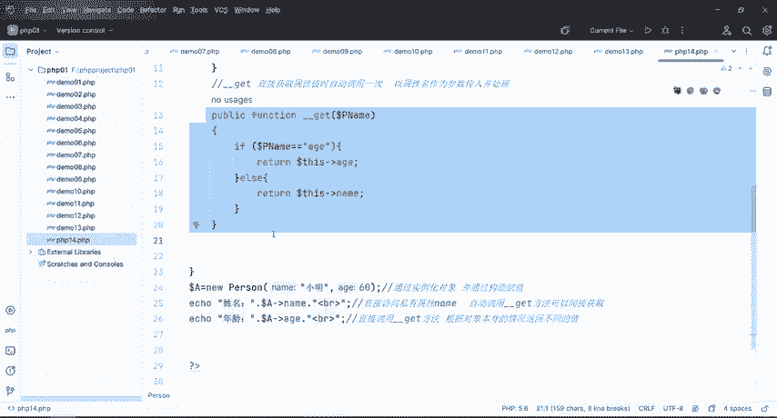

```php
<?php
class Person {
    private $name;
    private $age;
    
    public function __construct($name, $age) {
        $this->name = $name;
        $this->age = $age;
    }
    
    // 声明 __get 魔术方法
    public function __get($property_name) {
        // 判断试图访问的属性名，并返回对应的值
        if ($property_name == "age") {
            return $this->age;
        } else {
            return $this->name;
        }
    }
}

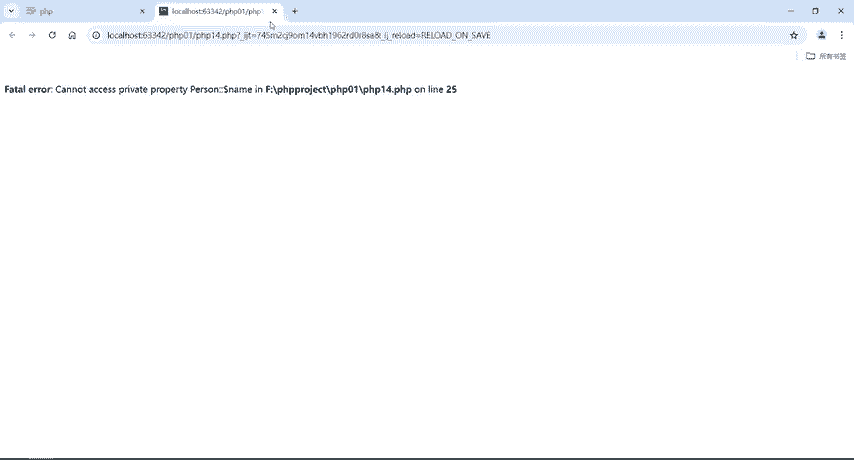

$a = new Person("小明", 60);
echo $a->name; // 输出：小明
echo $a->age;  // 输出：60
?>
```
现在，通过`__get`方法，我们可以成功在类外部获取私有属性的值而不会报错。

## `__set`魔术方法

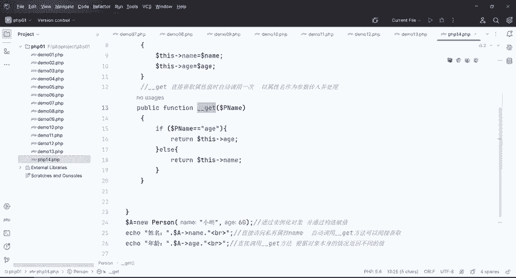

接下来我们看看`__set`方法。它与`__get`相对应，在程序试图**设置**一个类的私有或受保护的成员属性时被自动调用。

以下是`__set`方法的核心概念：
*   **触发条件**：在对象外部给一个**不可访问的属性**（如`private`或`protected`属性）赋值时。
*   **方法签名**：`public function __set($property_name, $value)`
*   **参数**：
    *   `$property_name`：试图设置的属性名。
    *   `$value`：试图赋给该属性的值。

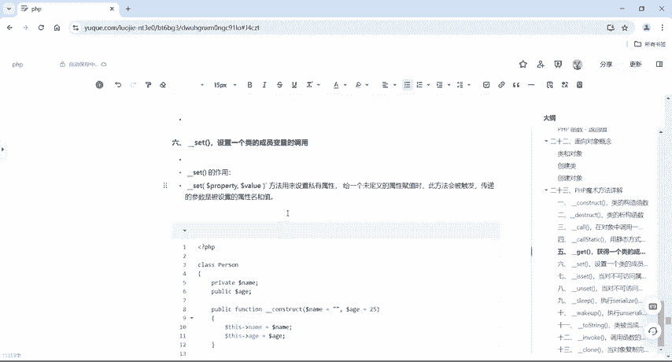

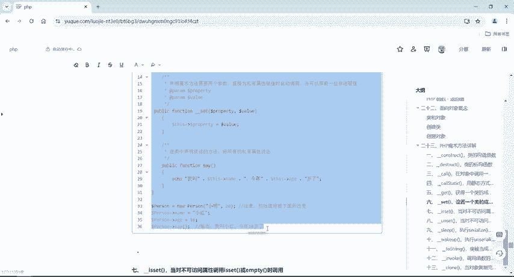

同样，我们先看一个没有`__set`方法时会报错的例子：

```php
<?php
class Person {
    private $name;
    public $age;
    
    public function __construct($name, $age) {
        $this->name = $name;
        $this->age = $age;
    }
    // 此处没有定义 __set 方法
}

$person = new Person("小明", 16);
$person->name = "小红"; // 这里会报错：Cannot access private property Person::$name
echo $person->name;
?>
```

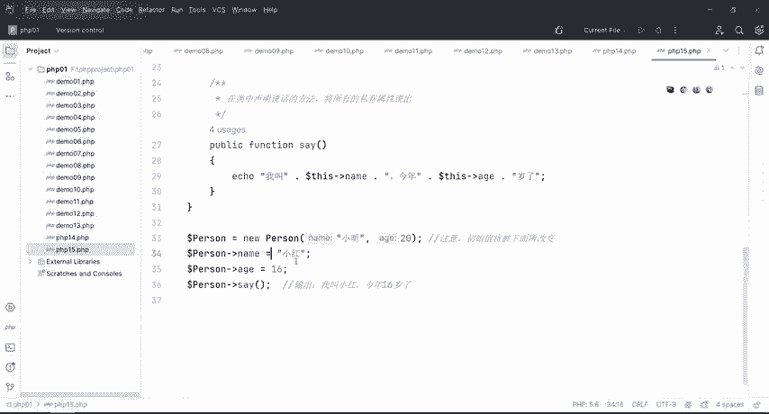

为了避免上述错误，我们可以定义`__set`方法来处理对私有属性的赋值操作。

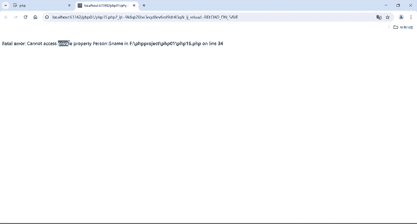

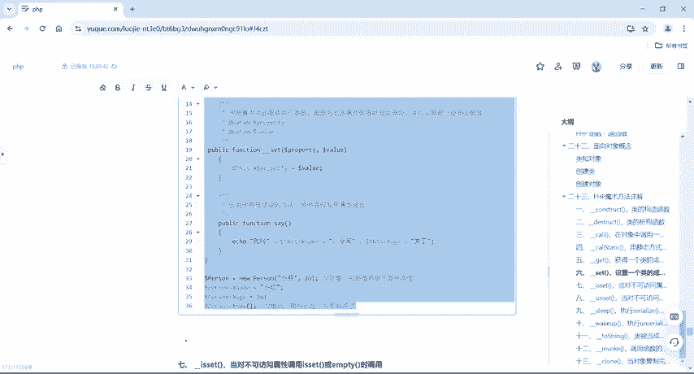

以下是使用`__set`方法修正后的代码示例：

```php
<?php
class Person {
    private $name;
    public $age;
    
    public function __construct($name, $age) {
        $this->name = $name;
        $this->age = $age;
    }
    
    // 声明 __set 魔术方法
    public function __set($property_name, $value) {
        // 当试图设置私有属性 $name 时，将操作重定向到公有属性 $age（仅为示例）
        if ($property_name == "name") {
            $this->age = $value; // 注意：这里实际修改的是 $age
        }
    }
}

$person = new Person("小明", 16);
$person->name = "小红"; // 触发 __set，将 $age 改为 "小红"
echo "我叫" . $person->name . "，今年" . $person->age . "岁了。";
// 输出取决于 __get 如何定义。若 __get 返回 $this->name，则输出“我叫小明，今年小红岁了。”
?>
```
通过`__set`方法，我们可以拦截并自定义对私有属性的赋值行为。

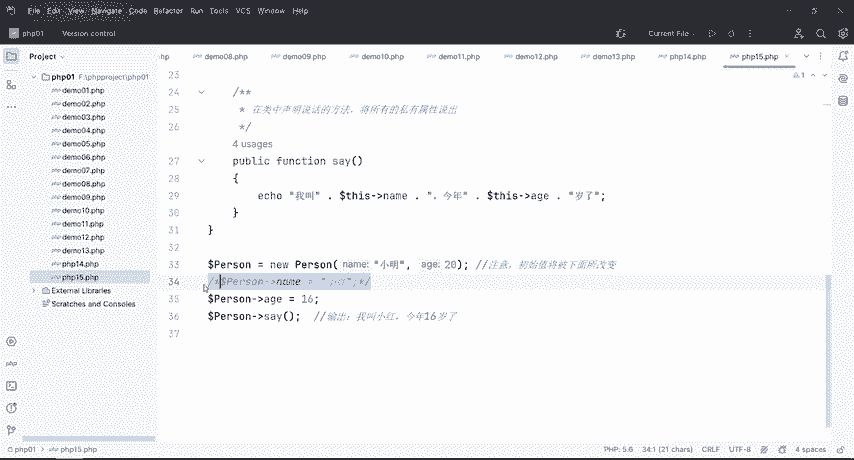

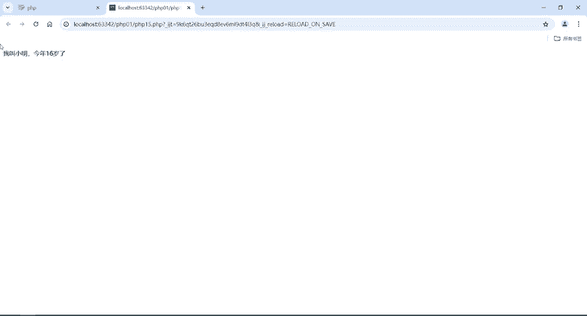

---

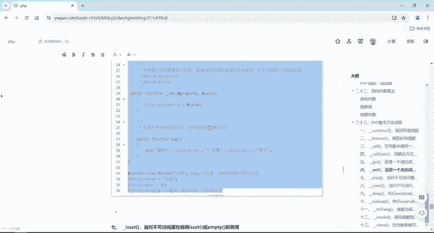

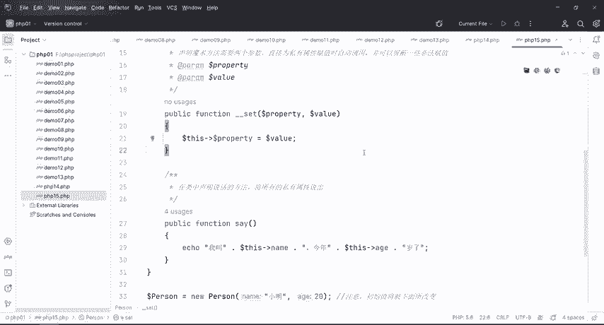

本节课中我们一起学习了`__get`和`__set`这两个魔术方法。总结如下：
1.  `__get()`：在读取不可访问属性时自动调用，用于安全地获取私有属性值。
2.  `__set()`：在给不可访问属性赋值时自动调用，用于拦截并处理对私有属性的赋值操作。
它们共同为类的封装性提供了灵活的接口，是PHP面向对象编程中处理属性访问控制的重要工具，在CTF题目中常被用来构造或利用一些特定的代码逻辑。