# CTF入门教学：P16：魔术方法之__isset()及__unset()

在本节课中，我们将要学习PHP中的两个重要魔术方法：`__isset()` 和 `__unset()`。理解它们与普通函数 `isset()` 和 `unset()` 的区别，对于掌握PHP面向对象编程和后续的CTF Web题目至关重要。

## 概述

上一节我们介绍了其他魔术方法，本节中我们来看看 `__isset()` 和 `__unset()`。这两个魔术方法在尝试访问或操作对象的**不可访问属性**（如私有属性）时会被自动调用，为我们提供了拦截和处理这类操作的机会。

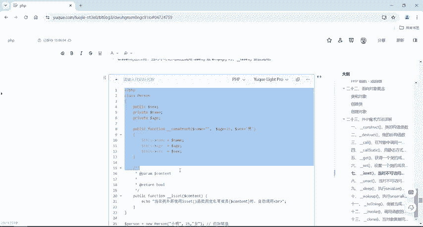

## __isset() 魔术方法

`__isset()` 是一个魔术方法。当在类的外部使用 `isset()` 或 `empty()` 函数来检测对象的**不可访问属性**时，`__isset()` 方法会被自动调用。

它的作用与普通的 `isset()` 函数不同。普通 `isset()` 函数用于检测变量是否已设置且非NULL。而魔术方法 `__isset()` 则是在特定条件下触发的回调。

以下是 `__isset()` 方法的基本语法：
```php
public function __isset($name) {
    // 处理逻辑
}
```

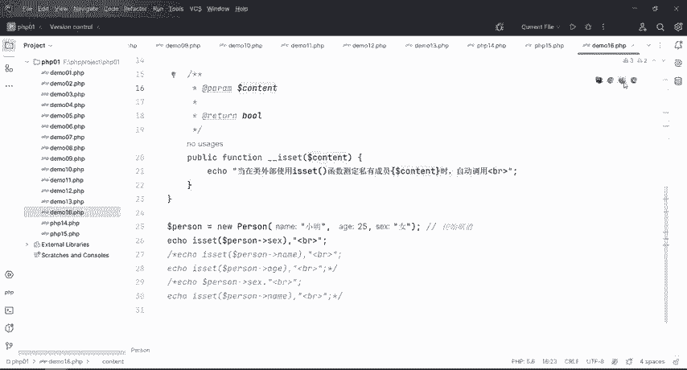

为了理解其工作方式，我们来看一个具体的代码示例。

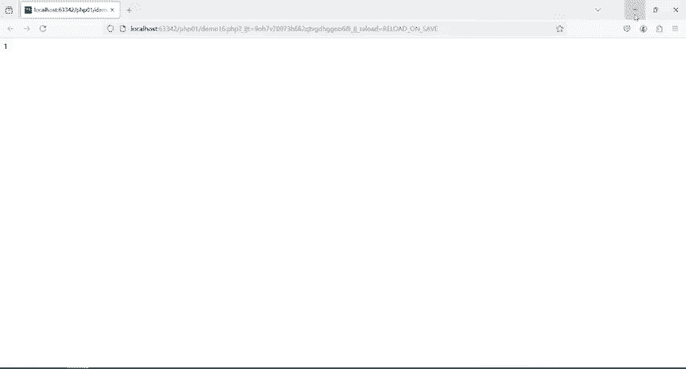

```php
<?php
class Person {
    public $sex;
    private $name;
    private $age;

    public function __construct($name="", $age=25, $sex='男') {
        $this->name = $name;
        $this->age = $age;
        $this->sex = $sex;
    }

    /**
     * 当在类外部使用isset()检测对象的私有属性时，此方法被调用
     */
    public function __isset($content) {
        echo "当在类外部使用isset()函数测定私有成员{$content}时，自动调用<br>";
        return isset($this->$content);
    }
}

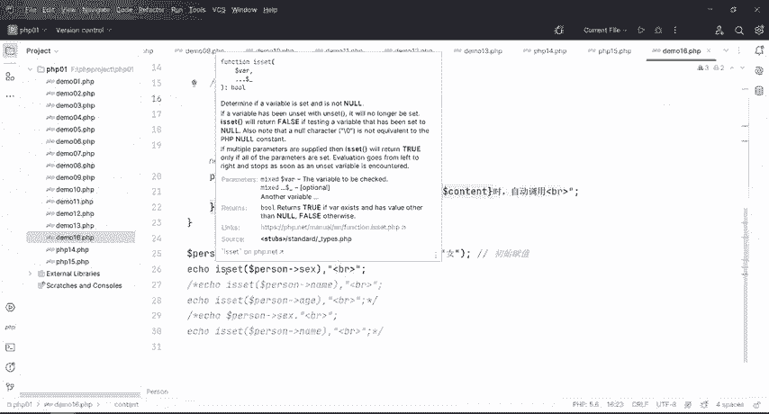

$person = new Person("小明", 25, '女'); // 初始赋值
echo isset($person->sex) . '<br>'; // 公有属性，正常检测
echo isset($person->name) . '<br>'; // 私有属性，触发__isset()
echo isset($person->age); // 私有属性，触发__isset()
?>
```


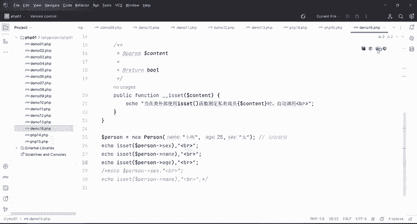

代码分析如下：
1.  类 `Person` 有一个公有属性 `$sex` 和两个私有属性 `$name`、`$age`。
2.  当在类外部使用 `isset($person->sex)` 时，因为 `$sex` 是公有属性，所以直接调用普通 `isset()` 函数，返回结果。
3.  当尝试使用 `isset($person->name)` 或 `isset($person->age)` 检测私有属性时，由于在类外部无法直接访问，PHP会自动调用类中定义的 `__isset()` 魔术方法。
4.  如果类中没有定义 `__isset()` 方法，那么检测私有属性会导致错误。

简单来说，`__isset()` 为检测私有属性提供了一个“安全通道”。

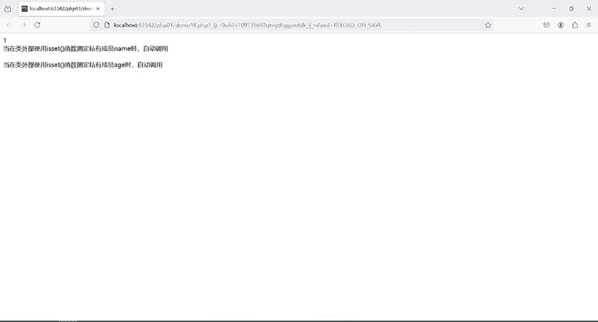

## __unset() 魔术方法

接下来我们学习 `__unset()` 魔术方法。当在类的外部使用 `unset()` 函数尝试销毁一个对象的**不可访问属性**时，`__unset()` 方法会被自动调用。

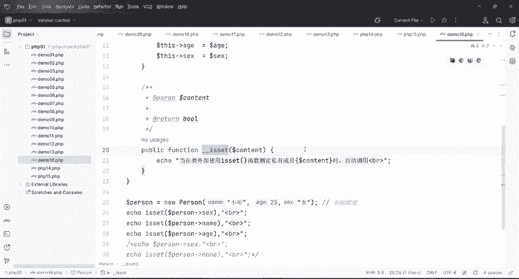

普通 `unset()` 函数用于销毁给定的变量。而魔术方法 `__unset()` 则是在尝试销毁不可访问属性时的拦截器。

以下是 `__unset()` 方法的基本语法：
```php
public function __unset($name) {
    // 处理逻辑
}
```

让我们通过代码来观察它的行为。

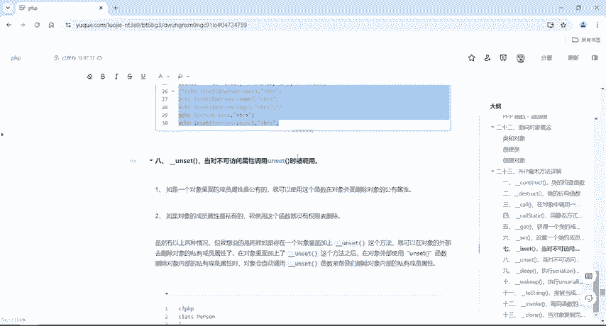

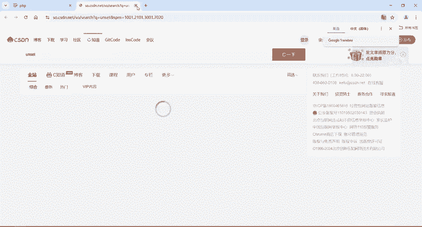

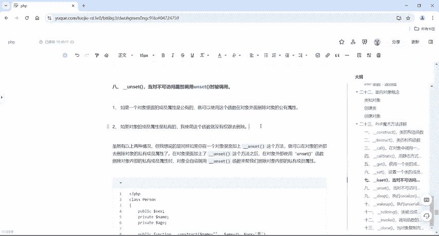

```php
<?php
class Person {
    public $sex;
    private $name;
    private $age;

    public function __construct($name="", $age=25, $sex='男') {
        $this->name = $name;
        $this->age = $age;
        $this->sex = $sex;
    }

    /**
     * 当在类外部使用unset()销毁对象的私有属性时，此方法被调用
     */
    public function __unset($content) {
        echo "当在类外部使用unset()函数测定私有成员{$content}时，自动调用<br>";
        echo "我叫{$this->name}，今年{$this->age}岁了<br>";
    }
}

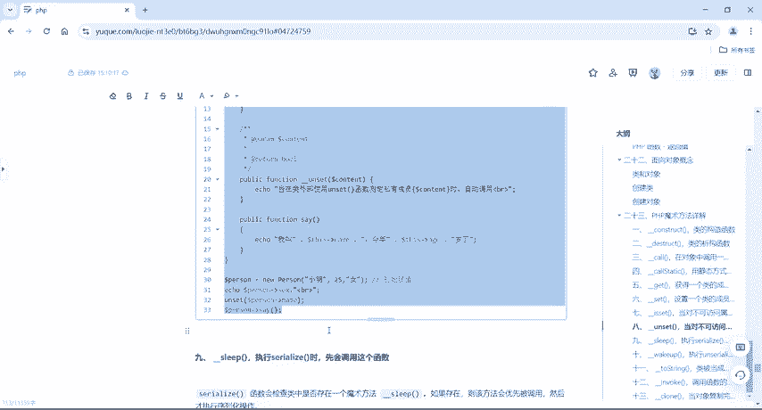

$person = new Person("小明", 25, '女');
unset($person->sex); // 公有属性，正常销毁
unset($person->name); // 私有属性，触发__unset()
?>
```

代码执行过程如下：
1.  使用 `unset($person->sex)` 可以成功销毁公有属性 `$sex`。
2.  当使用 `unset($person->name)` 试图销毁私有属性 `$name` 时，由于权限不足，PHP会自动触发类中定义的 `__unset()` 方法。
3.  在 `__unset()` 方法内，我们定义了自定义的行为（这里打印了一句话）。
4.  如果类中没有定义 `__unset()` 方法，那么尝试 `unset()` 一个私有属性将会导致一个致命错误。

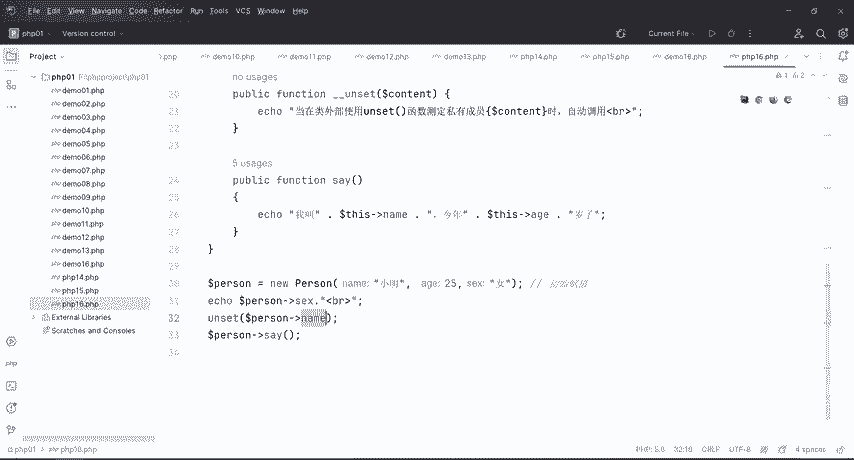

因此，`__unset()` 方法让我们能够以可控的方式响应外部销毁私有属性的企图。

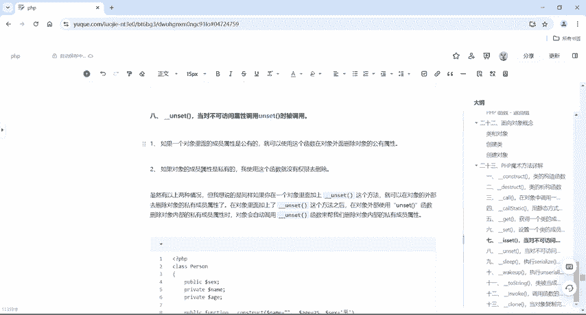

## 核心区别总结

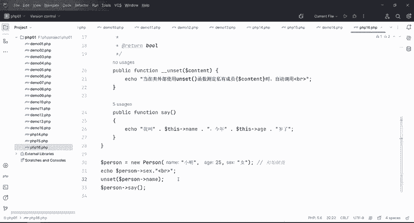

以下是 `__isset()`/`__unset()` 与 `isset()`/`unset()` 的核心区别，方便你记忆：

| 特性 | 魔术方法 (__isset / __unset) | 普通函数 (isset / unset) |
| :--- | :--- | :--- |
| **形式** | 带有双下划线 `__` | 无下划线 |
| **触发条件** | 针对对象的**不可访问属性**（如private） | 针对任何变量或对象的**可访问属性**（如public） |
| **本质** | 类中定义的方法，是一种回调机制 | PHP内置的语言结构/函数 |
| **作用** | 提供拦截和处理非法访问的入口 | 直接执行检测变量或销毁变量的操作 |

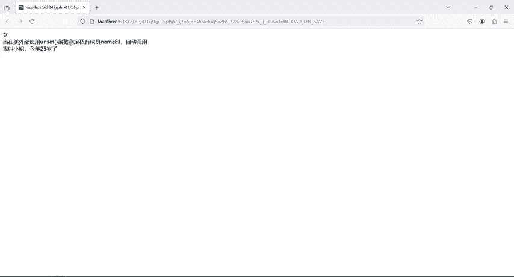

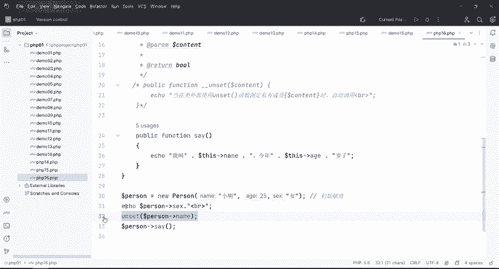

简单记忆：**当普通函数搞不定（无权访问）私有属性时，对应的双下划线魔术方法就会登场帮忙处理。**

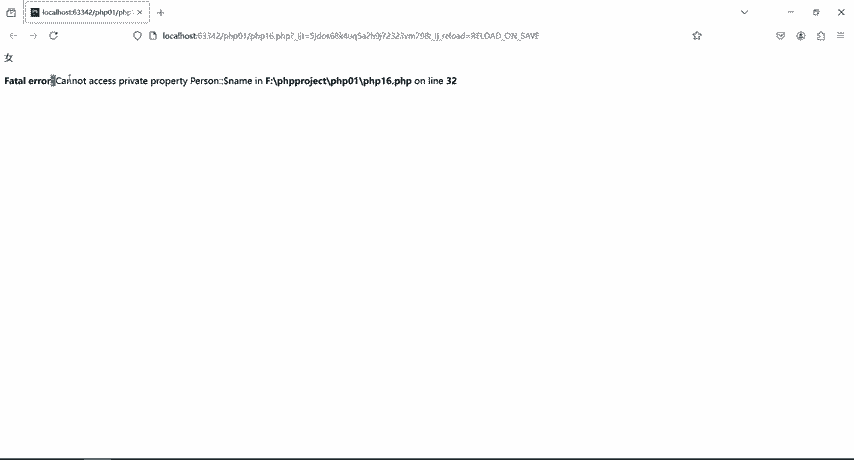

## 本节课总结

本节课中我们一起学习了PHP中两个成对的魔术方法：
1.  **`__isset()`**：当在类外部使用 `isset()` 或 `empty()` 检测对象不可访问属性时自动调用。
2.  **`__unset()`**：当在类外部使用 `unset()` 尝试销毁对象不可访问属性时自动调用。

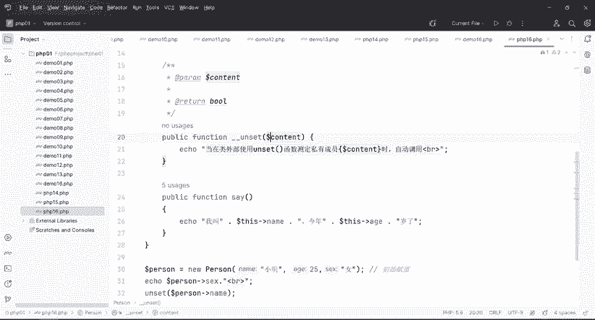

理解它们与普通函数的区别是关键：**普通函数处理“能直接碰到的”东西，而魔术方法处理那些“从外面直接碰不到的”私有属性**。在CTF的Web题目中，尤其是涉及PHP反序列化漏洞时，攻击链的构造常常依赖于这些魔术方法的自动调用特性，因此务必掌握其原理。