# CTF入门教学：P17：魔术方法之sleep()、wakeup()、__toString()、__invoke()、__clone()

在本节课中，我们将要学习PHP中几个关键的魔术方法，它们在序列化、反序列化以及对象操作中扮演着重要角色。理解这些方法是掌握PHP反序列化漏洞的基础。

## 概述

魔术方法是PHP中一类特殊的方法，它们会在特定的时机被自动调用。本节我们将重点探讨 `__sleep()`、`__wakeup()`、`__toString()`、`__invoke()` 和 `__clone()` 这五个方法，了解它们的触发条件、作用以及在实际代码（尤其是CTF题目）中的应用。

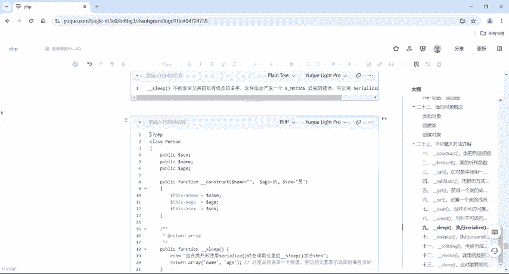

## `__sleep()` 方法

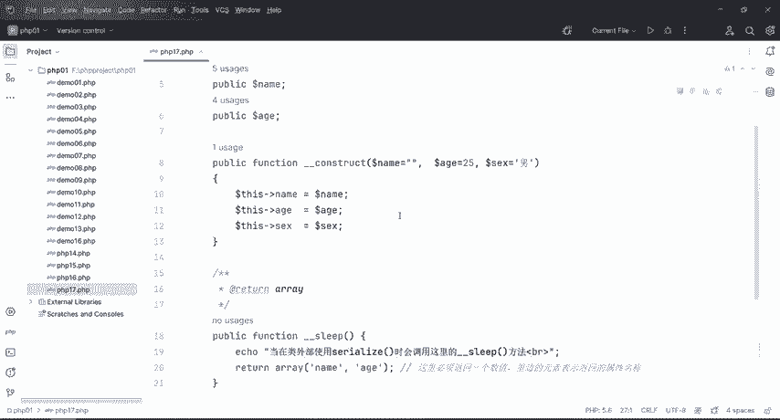

上一节我们介绍了序列化的基本概念，本节中我们来看看在序列化过程中首先被调用的魔术方法 `__sleep()`。

当在类外部使用 `serialize()` 函数对一个对象进行序列化时，PHP会检查该类中是否定义了 `__sleep()` 方法。如果存在，该方法会**优先**于序列化操作被调用。

`__sleep()` 方法的主要用途是清理对象，并返回一个**数组**，该数组包含对象中**应被序列化的属性名称**。如果该方法没有返回任何内容（即返回 `NULL`），则会引发一个 `E_NOTICE` 级别的错误。注意，`__sleep()` 不能返回父类的私有成员名称，否则会产生错误。

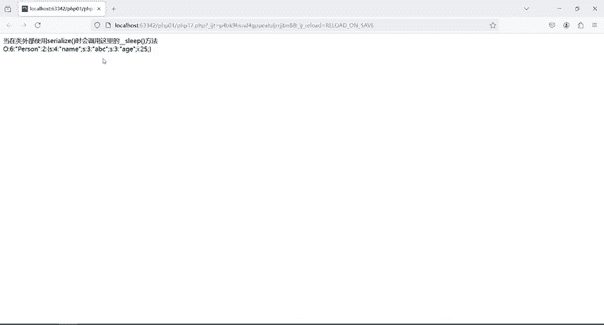

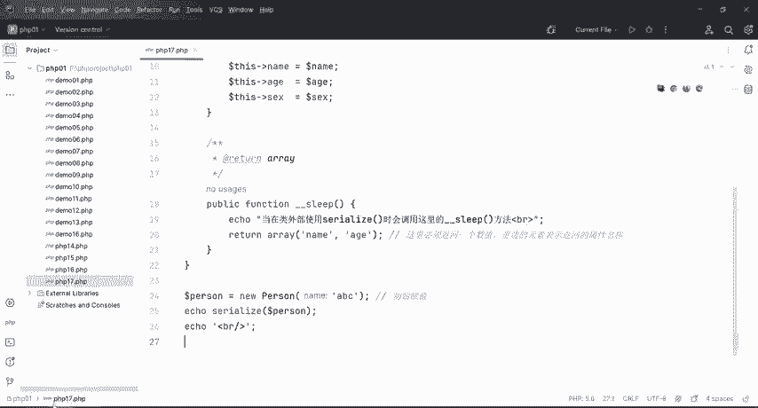

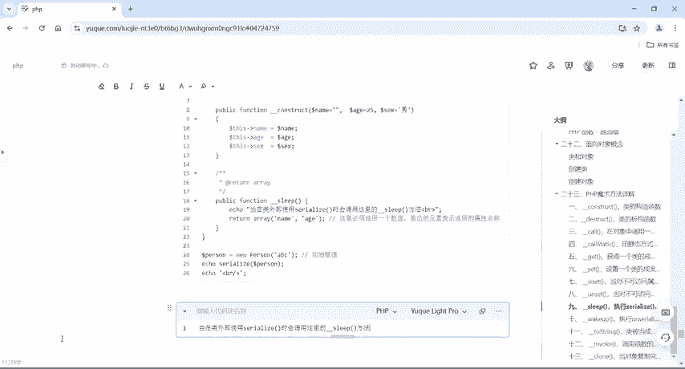

以下是 `__sleep()` 方法的使用示例：

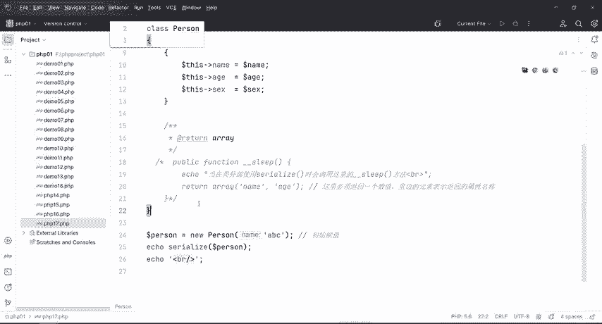

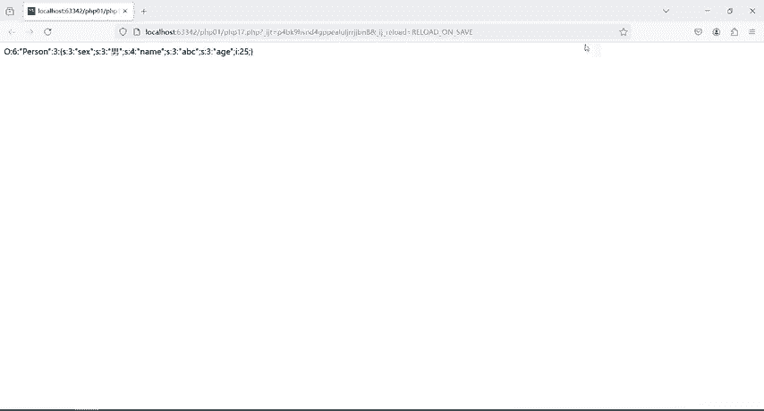

```php
class Person {
    public $name = 'ABC';
    public $age = 25;
    private $secret = 'hidden';

    public function __sleep() {
        // 清理操作，并指定只序列化 name 和 age 属性
        echo "正在调用 __sleep() 方法\n";
        return array('name', 'age'); // 返回需要序列化的属性名数组
    }
}

$person = new Person();
$serialized = serialize($person);
echo $serialized;
```

运行上述代码，输出会是：
```
正在调用 __sleep() 方法
O:6:"Person":2:{s:4:"name";s:3:"ABC";s:3:"age";i:25;}
```

可以看到，`__sleep()` 方法先被执行，并且只有 `name` 和 `age` 属性被序列化，`secret` 属性被排除在外。如果类中没有 `__sleep()` 方法，`serialize()` 会直接序列化对象的所有属性。

`__sleep()` 方法常用于提交未提交的数据或执行清理操作。当对象很大且不需要全部保存时，这个方法非常有用。

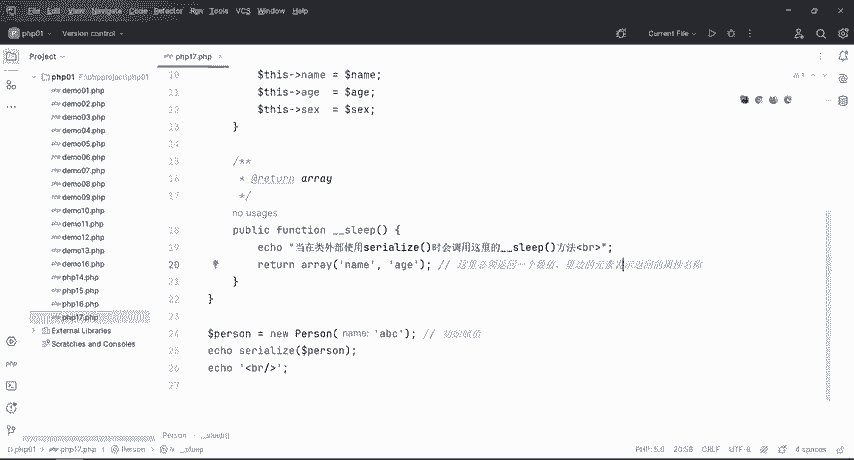

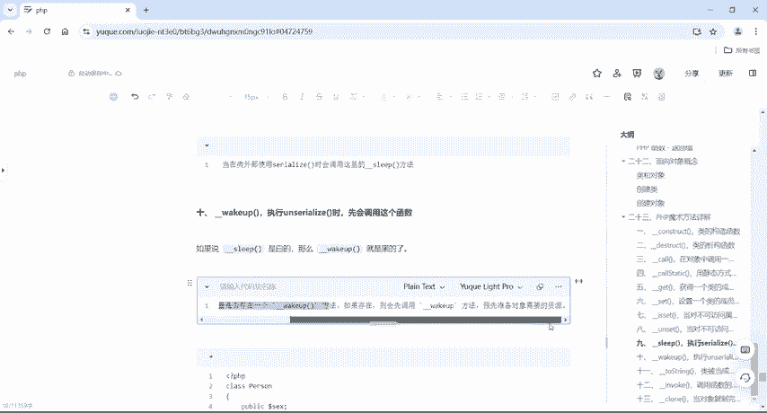

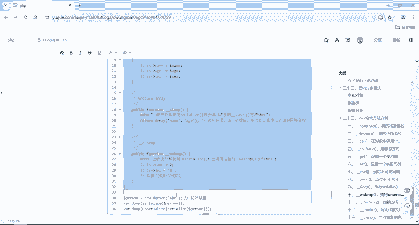

## `__wakeup()` 方法

有“睡觉”（sleep）就有“起床”（wakeup）。与 `__sleep()` 在序列化时触发相反，`__wakeup()` 方法在**反序列化**时被调用。

当在类外部使用 `unserialize()` 函数进行反序列化时，PHP会检查是否存在 `__wakeup()` 方法。如果存在，则**优先**调用它，然后再执行反序列化操作。这个方法通常用于在对象被重新构建前，预先准备对象所需的资源（如重新建立数据库连接等）。

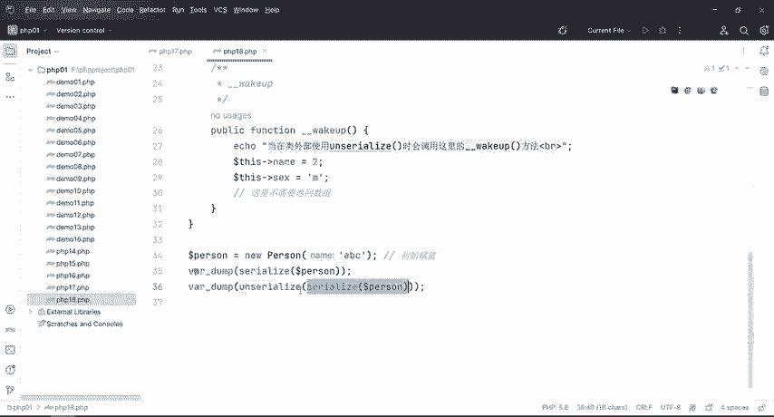

在序列化漏洞中，`__sleep()` 和 `__wakeup()` 经常成对出现。以下是一个同时使用两者的例子：

```php
class Person {
    public $name;
    public $age;

    public function __construct($name, $age) {
        $this->name = $name;
        $this->age = $age;
    }

    public function __sleep() {
        echo "序列化前调用 __sleep()\n";
        return array('name', 'age');
    }

    public function __wakeup() {
        echo "反序列化前调用 __wakeup()\n";
    }
}

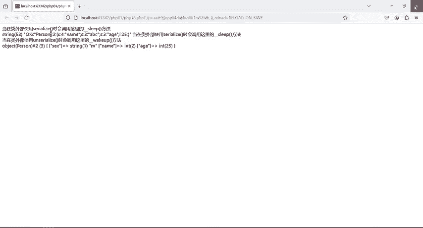

// 序列化
$person = new Person('小明', 25);
$serialized = serialize($person);
echo "序列化结果: " . $serialized . "\n";

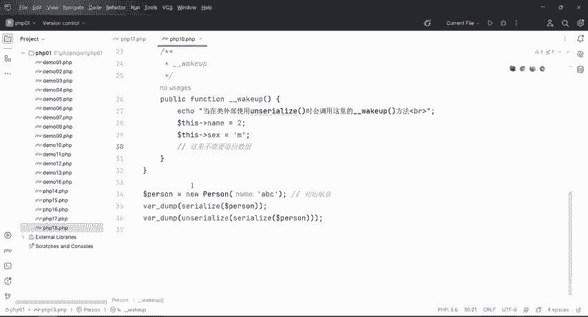

// 反序列化
$unserialized = unserialize($serialized);
echo "反序列化后对象: ";
var_dump($unserialized);
```

运行代码后，输出顺序是：
1.  先执行 `__sleep()` 并打印信息。
2.  输出序列化字符串。
3.  反序列化时，先执行 `__wakeup()` 并打印信息。
4.  最后输出反序列化后的对象。

这个流程清晰地展示了两个方法在序列化与反序列化过程中的执行顺序。

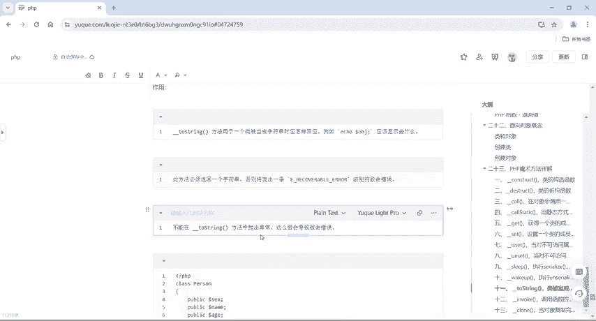

## `__toString()` 方法

接下来，我们看看当对象被当作字符串处理时会发生的魔法。`__toString()` 方法在一个类被当成**字符串**时自动调用。

例如，当你使用 `echo` 或 `print` 直接输出一个对象时，如果该类没有定义 `__toString()` 方法，PHP会抛出一个致命错误，提示“Object of class X could not be converted to string”。定义该方法可以避免此错误，并决定对象如何以字符串形式展现。**该方法必须返回一个字符串**。

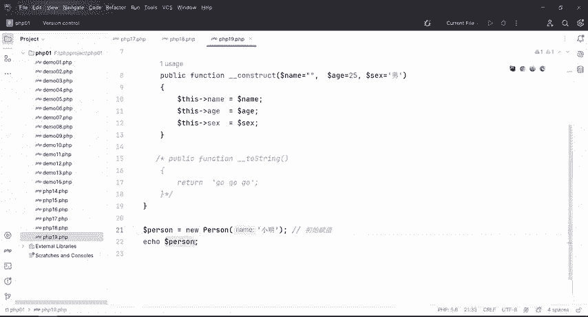

以下是 `__toString()` 的示例：

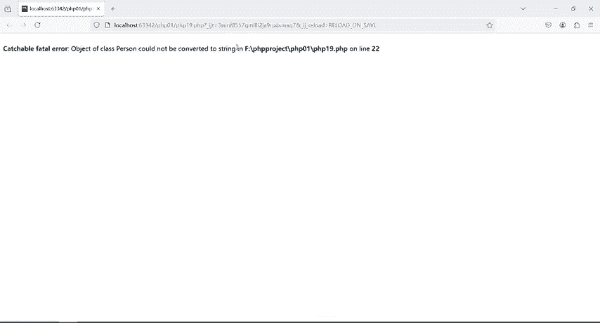

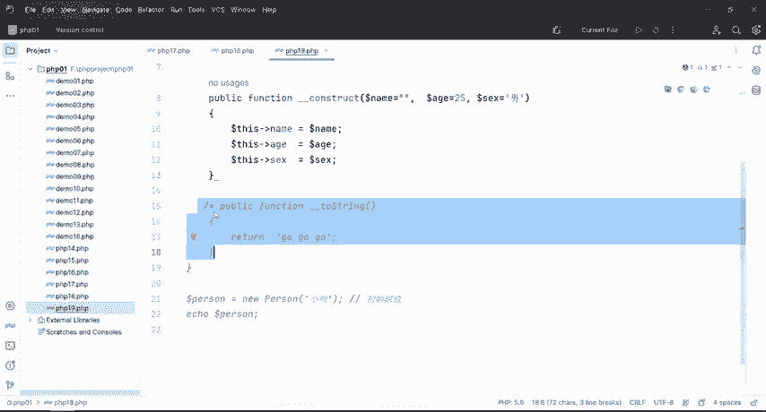

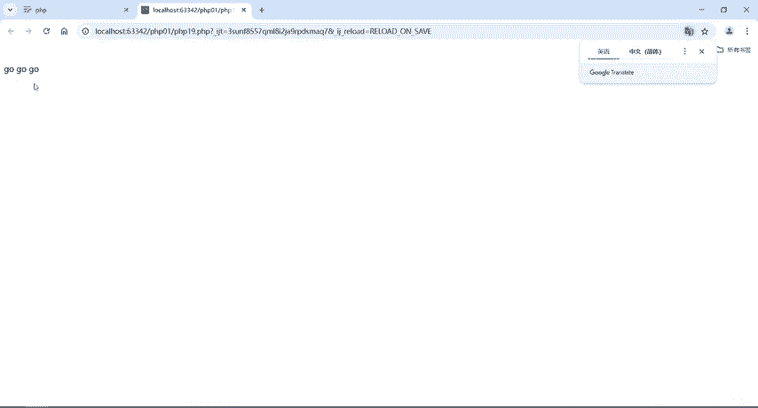

```php
class Person {
    public $name = '小明';
    public $age = 25;

    public function __toString() {
        // 当对象被当作字符串时，返回此字符串
        return "Person对象: 姓名={$this->name}, 年龄={$this->age}";
    }
}

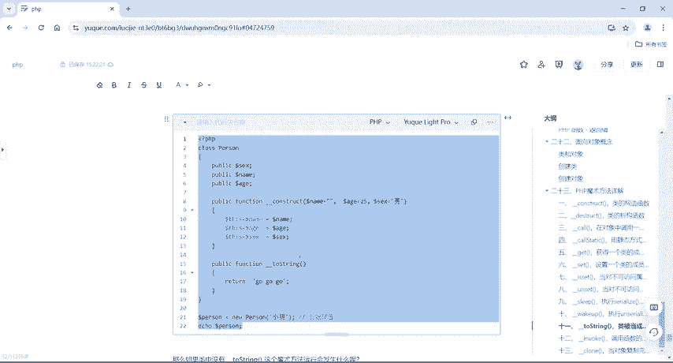

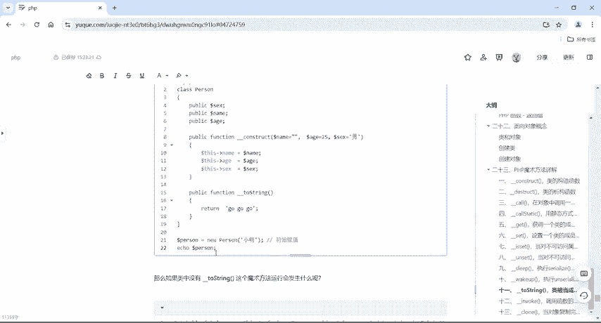

$person = new Person();
// 直接输出对象，会触发 __toString()
echo $person;
```

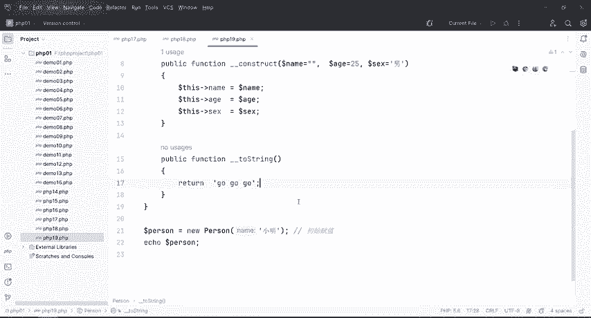

输出结果为：
```
Person对象: 姓名=小明, 年龄=25
```

如果没有 `__toString()` 方法，上面的 `echo $person;` 语句会导致错误。这个方法让对象的输出更加友好和可控。

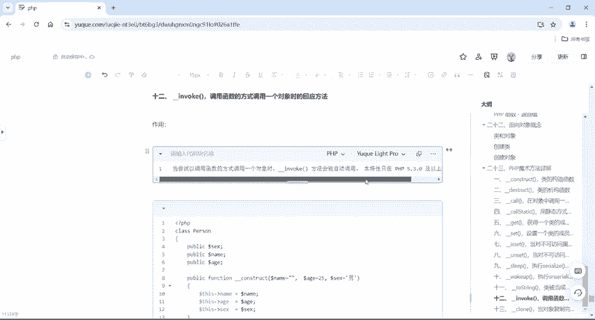

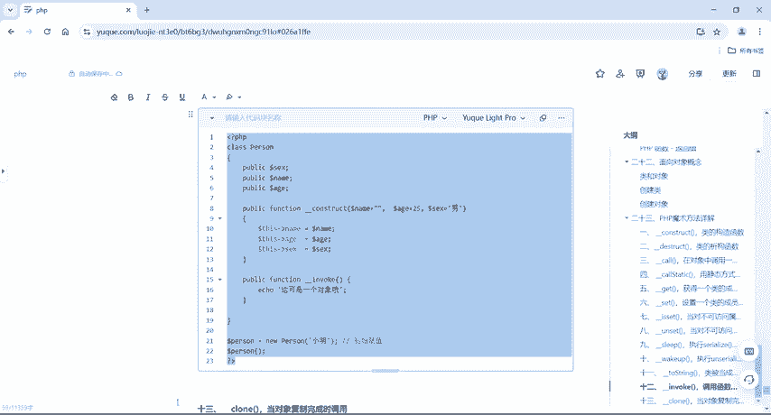

## `__invoke()` 方法

`__invoke()` 方法允许我们以**调用函数的方式**来调用一个对象。当尝试像调用函数一样使用一个对象时（例如 `$object()`），如果该类定义了 `__invoke()` 方法，它就会被自动调用。

这个特性在 **PHP 5.3+** 版本中有效。它的一个常见用途是提供更清晰的错误提示，防止程序因错误调用而直接终止。

```php
class Person {
    public function __invoke($param) {
        echo "这是一个对象，不能像函数一样被调用。你传递的参数是: {$param}\n";
    }
}

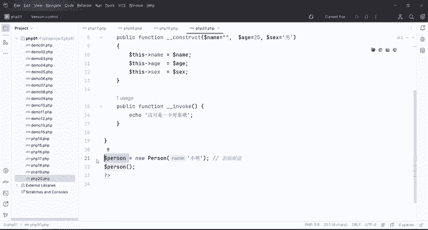

$person = new Person();
// 以函数方式调用对象，触发 __invoke()
$person('test');
```

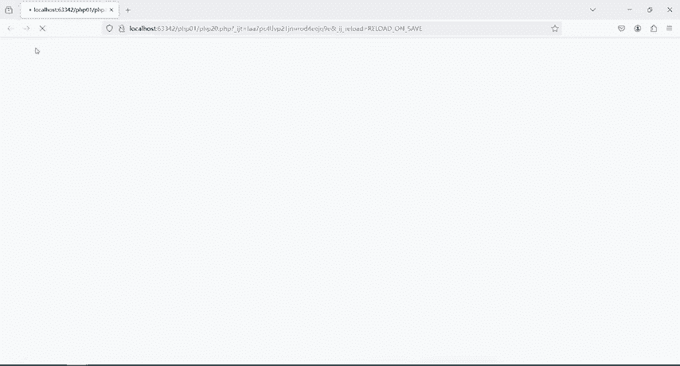

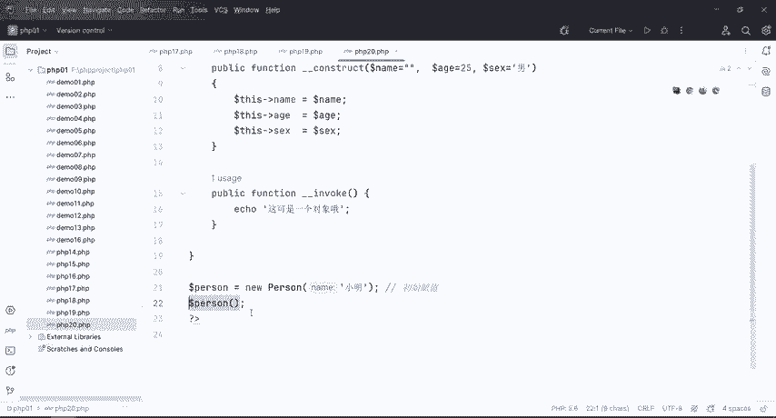

输出：
```
这是一个对象，不能像函数一样被调用。你传递的参数是: test
```

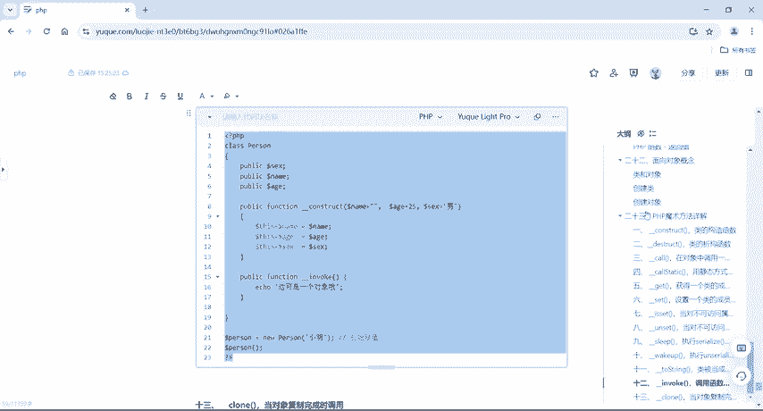

如果没有 `__invoke()` 方法，执行 `$person('test')` 会导致一个致命错误。定义该方法后，程序可以继续运行，并给出有意义的提示，方便开发者调试。

## `__clone()` 方法

最后，我们来学习对象的克隆。`__clone()` 方法在使用 `clone` 关键字**复制一个对象完成后**被自动调用。

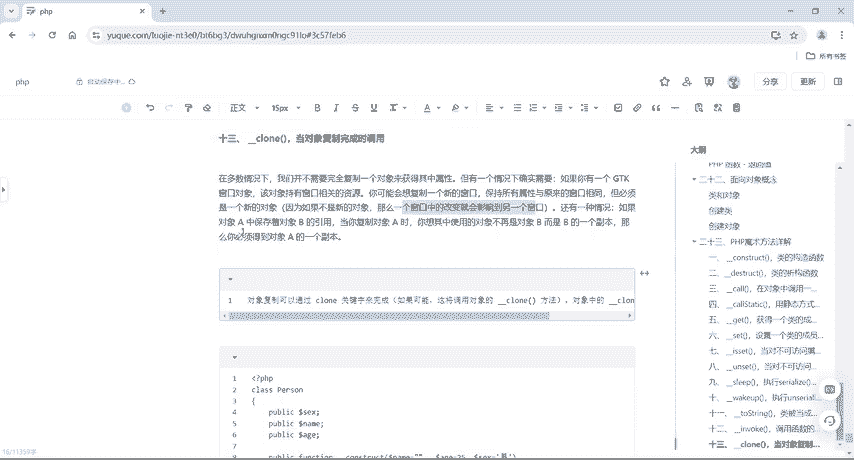

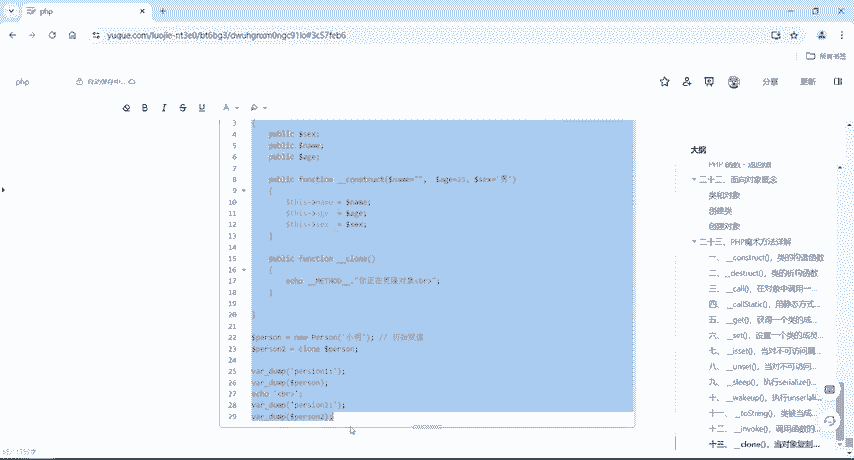

“克隆”对象相当于创建该对象的一个副本。新对象拥有原对象的所有属性值（在克隆发生时）。`__clone()` 方法通常用于处理一些复制对象时需要特殊处理的资源，例如，如果对象包含一个文件句柄或网络连接，你可能需要在克隆时创建新的资源，而不是共享原来的资源。

```php
class Person {
    public $name;
    public $age;

    public function __construct($name, $age) {
        $this->name = $name;
        $this->age = $age;
    }

    public function __clone() {
        echo "正在克隆对象...\n";
        // 可以在这里对新克隆的对象进行一些修改
        // $this->name = '克隆的' . $this->name;
    }
}

$person1 = new Person('小明', 25);
// 克隆对象
$person2 = clone $person1;

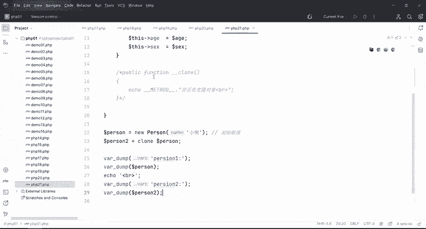

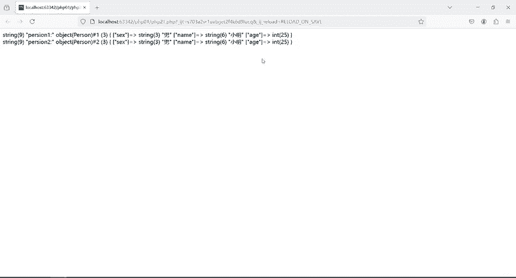

echo "person1: ";
var_dump($person1);
echo "person2: ";
var_dump($person2);
```

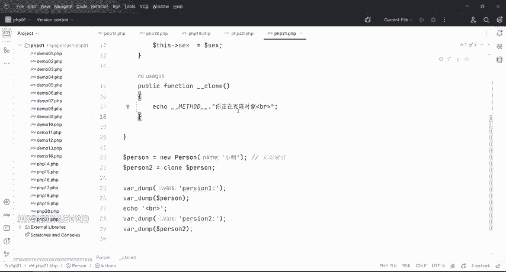

输出：
```
正在克隆对象...
person1: object(Person)#1 (2) { ["name"]=> string(6) "小明" ["age"]=> int(25) }
person2: object(Person)#2 (2) { ["name"]=> string(6) "小明" ["age"]=> int(25) }
```

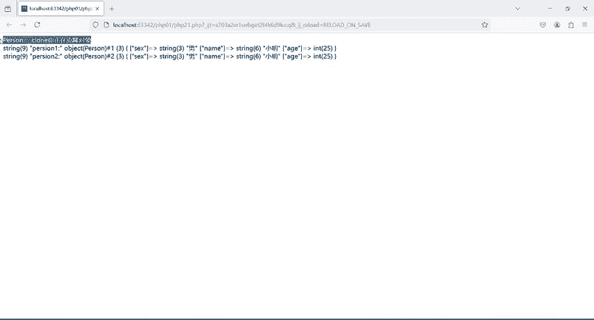

可以看到，`$person2` 是 `$person1` 的一个独立副本，它们的内存地址（`#1` 和 `#2`）不同。`__clone()` 方法在克隆过程中被调用，我们可以在其中为新对象执行一些初始化操作。

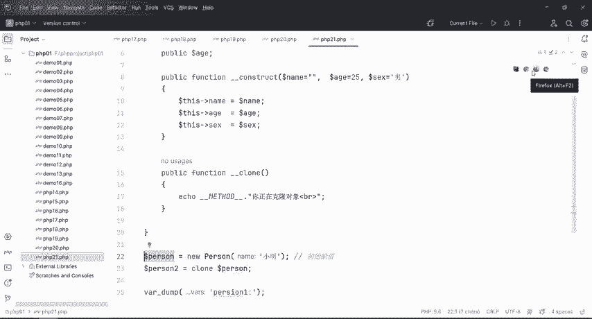

## 总结

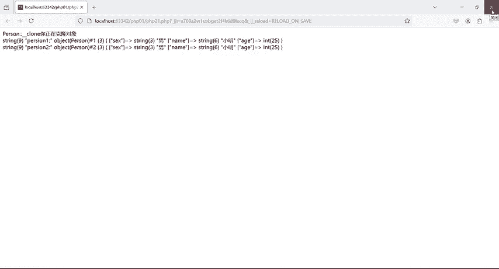

本节课我们一起学习了PHP中五个重要的魔术方法：
*   **`__sleep()`** 和 **`__wakeup()`** 是序列化与反序列化过程中的关键钩子，分别用于序列化前清理和反序列化前初始化，是PHP反序列化漏洞的核心。
*   **`__toString()`** 决定了对象如何被当作字符串处理，避免了直接输出对象时的错误。
*   **`__invoke()`** 让对象可以像函数一样被调用，主要用于提供友好的错误处理。
*   **`__clone()`** 在对象被复制时调用，用于管理对象克隆时的深层复制或资源分配。

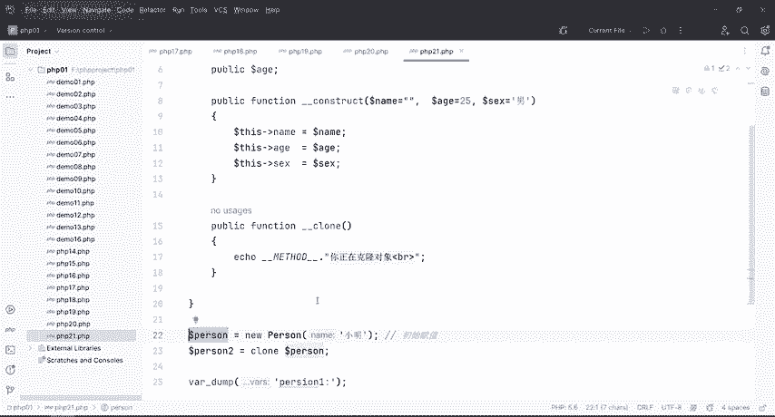

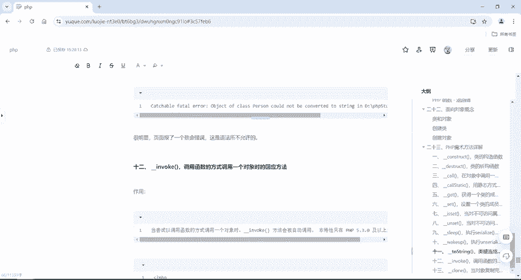

理解这些魔术方法的触发时机和作用，对于阅读PHP代码、进行代码审计以及解决CTF中的Web题目至关重要。它们的存在使得PHP对象的操作更加灵活，同时也引入了需要特别注意的安全点。