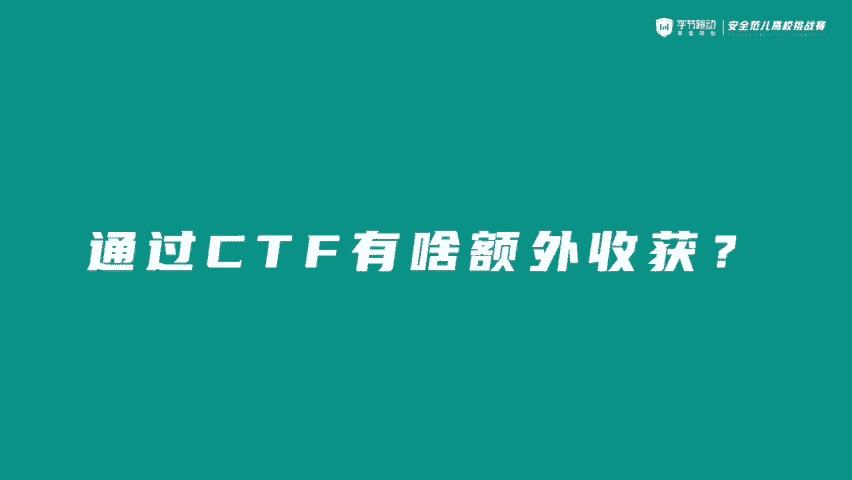
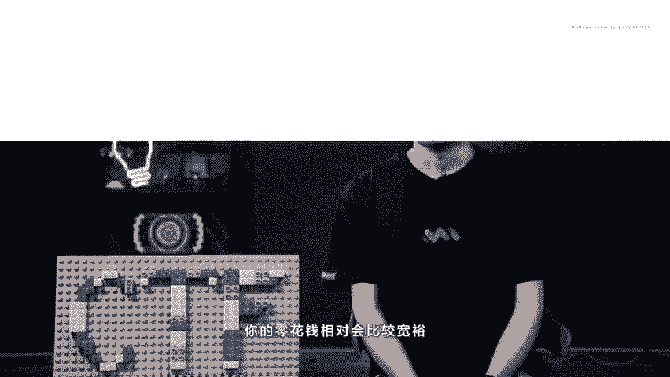
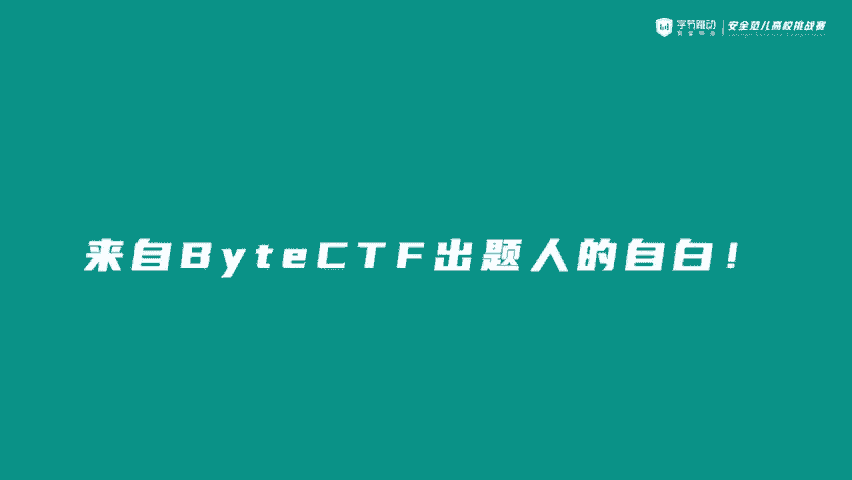
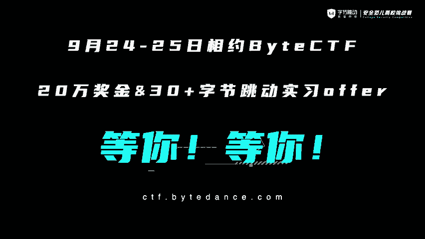
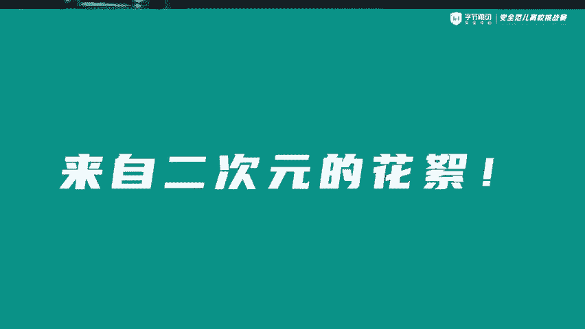
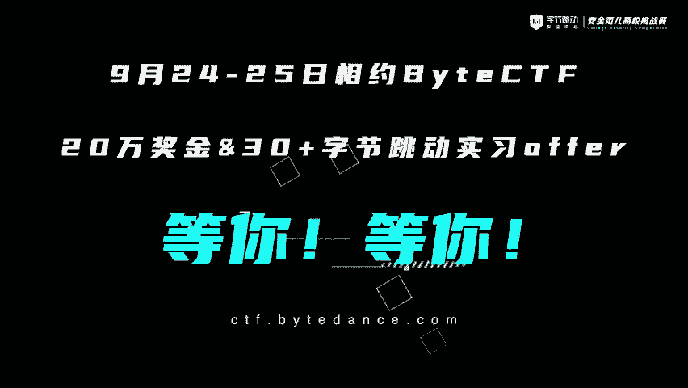

# CTF入门教学：P18：CTFer的经验分享

在本节课中，我们将聆听几位资深CTF选手的经验分享。他们将讲述自己参与CTF比赛的收获、对CTF的看法以及这项竞赛如何影响了他们的学业与职业生涯。这些真实的经历能为初学者提供宝贵的参考。

## 🎓 个人经历与收获

上一节我们了解了CTF的基本概念，本节中我们来看看实战选手们的亲身经历。以下是几位选手分享的个人故事。

*   一位选手表示，他在本科期间通过CTF实现了经济独立，大学生活得以在各地旅游中度过。他后来认识了研究生导师，并成功考研至清华大学网络研究院。
*   选手大雄目前在无痕实验室，曾效力于r3、redbud、T1、蓝莲花等战队。作为一名CTF“老赛棍”，他认为丰富的比赛经验在保研和求职时都能成为加分项，帮助通过简历筛选。
*   选手贝尔来自北京邮电大学天枢战队，现在字节跳动无恒实验室实习。他表示，CTF让他收获了许多朋友，包括队友、各高校的高手以及企业安全研究员，获得他们的认可是一种鼓励。
*   选手恩妮来自字节跳动无恒实验室，也是白帽杯CTF的赛事负责人。她首次从幕后走到台前进行分享，并欢迎大家找她线下切磋。

## 💡 CTF带来的核心价值

了解了选手们的背景后，我们来看看他们从CTF中具体获得了什么。以下是他们总结的主要收获。

*   **快乐与成就感**：与队友一起解题、在比赛中获奖的瞬间，能带来巨大的快乐和成就感。
*   **技能与职业起点**：CTF是进入安全行业的良好起点，能让人学习到实用的知识，结识志同道合的朋友。
*   **现实福利**：通过比赛可以“公费旅游”，体验不同地方的风土人情。比赛奖金和培训收入也能让零花钱更宽裕。
*   **行业认可与求职优势**：安全行业越来越看重CTF经历，这能显著提高求职竞争力。出色的比赛成绩甚至能带来直接的招聘机会，简化求职步骤。

## 🤔 CTF能否作为职业？

在探讨了CTF的诸多价值后，一个自然的问题是：它能成为一份职业吗？以下是选手们对此的不同看法。

*   一种观点认为，CTF催生了相关的产业链，确实可以作为一种职业。有选手曾借助CTF培训赚取零花钱。
*   另一种观点则倾向于将CTF视为**兴趣爱好**。他们更享受与朋友一起解题的乐趣，担心将其职业化会失去比赛本身的快乐。
*   折中的看法是，CTF本身或许不能直接成为职业，但它无疑是**通往安全职业的优秀敲门砖**。

## 🏆 关于CTF比赛本身

最后，让我们从赛事组织者的角度，更深入地理解CTF。一位出题人分享了他的见解。

CTF中文常译为“夺旗赛”，最早源于1996年的DEFCON全球黑客大会。这类比赛可以模拟企业真实的业务场景，有助于提升参赛者的**安全编码**、**风险发现**和**安全防护**能力。

该出题人因为本科时期参赛经验丰富，加入公司后便顺理成章地负责起CTF赛事的相关工作。他认为，只有熟悉比赛的选手才懂得如何举办一场优秀的比赛。

## 😄 趣味花絮

在严肃的分享之外，选手们也透露了一些轻松有趣的幕后故事。一个常见的传闻是“打CTF的同学都非常喜欢二次元”。

对此，选手们的反应颇为有趣。有人坚决否认，声称自己不是二次元，也不看番剧。另有人则表示自己周一到周五认真学习，周日还要打CTF，根本没有时间看那些内容。当然，也有选手“不小心”透露自己最近在追《海贼王》，并认为特别精彩。

---

本节课中，我们一起学习了多位CTF选手的经验分享。他们讲述了CTF带来的个人成长、现实收益以及对职业生涯的助益。我们也了解到CTF既可以作为深造的跳板，也可以成为有趣的业余爱好。最后，别忘了关注像“白帽杯”这样的大型赛事，它们提供了丰厚的奖金和实习机会，是检验与提升自己的绝佳舞台。