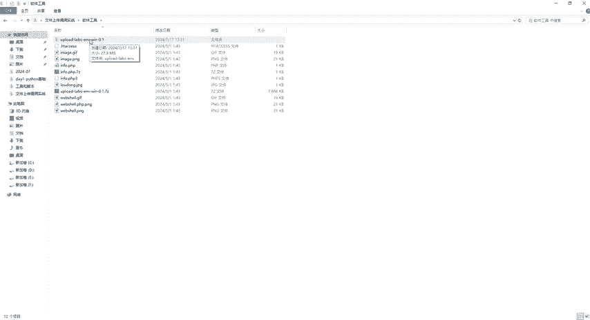

# CTF入门教学：P19：1、文件上传漏洞介绍

在本节课中，我们将要学习CTF比赛中一个非常关键的Web安全漏洞——文件上传漏洞。我们将从概念、成因、危害到实战环境搭建，系统地了解这一攻击手法。

## 什么是文件上传漏洞？

文件上传功能在Web应用中非常常见，例如上传头像、共享文档等。然而，如果文件上传功能的实现不当，就可能引发严重的安全漏洞。

文件上传漏洞是指攻击者利用Web应用的文件上传功能，上传可执行文件（例如木马、WebShell），从而在服务器上执行恶意代码。

## 漏洞是如何形成的？

上一节我们介绍了文件上传漏洞的定义，本节中我们来看看它形成的主要原因。漏洞的形成通常源于以下三点：

1.  **缺乏有效的输入验证**：例如，网站可能只允许上传JPG、PNG或GIF格式的图片，并限制文件大小在50KB以下，但未对文件内容本身进行严格检查。
2.  **服务器配置不当**：例如，文件上传目录被赋予了可执行权限。
3.  **文件类型检查不严格**：程序仅通过文件扩展名（如.txt）来判断文件类型，而没有真正检查文件的实际内容（MIME类型或文件头）。

## 漏洞的检测方法

了解了漏洞成因后，我们来看看如何检测这类漏洞。检测可以分为客户端和服务端两个层面。

以下是客户端检测的常见方式：
*   文件类型限制
*   文件大小限制

以下是服务端检测的常见方式：
*   检测文件扩展名
*   检测文件内容（如MIME类型、文件头）
*   检查服务器权限设置

## 文件上传漏洞的危害

那么，攻击者利用这个漏洞能造成哪些危害呢？主要有以下四个方面：

1.  **服务器控制**：攻击者上传WebShell等恶意文件后，可以获得服务器的控制权。
2.  **数据泄露**：控制服务器后，可以窃取服务器上的敏感数据。
3.  **网站篡改**：可以任意修改网站内容，进行非法宣传或植入恶意信息。
4.  **作为攻击跳板**：以被攻陷的服务器为基地，向其他系统发起攻击，隐藏自身踪迹。

## 实战环境准备

前面我们介绍了理论知识，本节我们将开始搭建实战环境。本次实战我们将使用一个名为“upload-labs”的靶场。

**所需环境与工具：**
*   **系统**：Windows（本机即可）
*   **集成环境**：PHPStudy
*   **靶场**：upload-labs
*   **PHP版本**：5.2.17
*   **必要组件**：需确保PHP相关组件及中间件配置正确。

**环境说明：**
有同学可能会问，某些关卡是否必须在Linux下运行？请放心，老师提供的版本已经配置好，第1关到第20关均可在Windows操作系统上完成。

**部署步骤：**
1.  获取提供的工具包（可在评论区自取）。
2.  将`upload-labs`压缩包解压到PHPStudy的`WWW`目录下。
3.  启动PHPStudy，确保服务运行正常。
4.  在浏览器中访问相应地址（如 `http://localhost/upload-labs/`）即可进入靶场。

解压后，你将会看到一个名为`upload-labs`的文件夹，这就是我们的实战靶场。

## 总结

本节课中我们一起学习了文件上传漏洞。我们首先了解了它的定义，即因上传功能实现不当而导致的安全风险。接着分析了其形成的三个主要原因：验证缺失、配置不当和检查不严。然后，我们探讨了漏洞的检测方法和可能带来的四种严重危害。最后，我们完成了实战环境的搭建，为后续的关卡实战做好了准备。从下节课开始，我们将正式进入`upload-labs`靶场，逐一挑战并学习如何利用和防御文件上传漏洞。