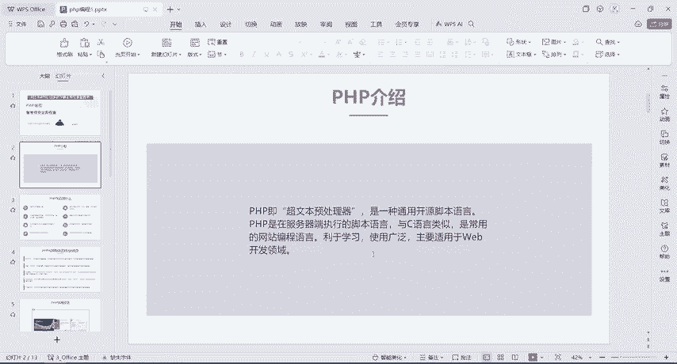
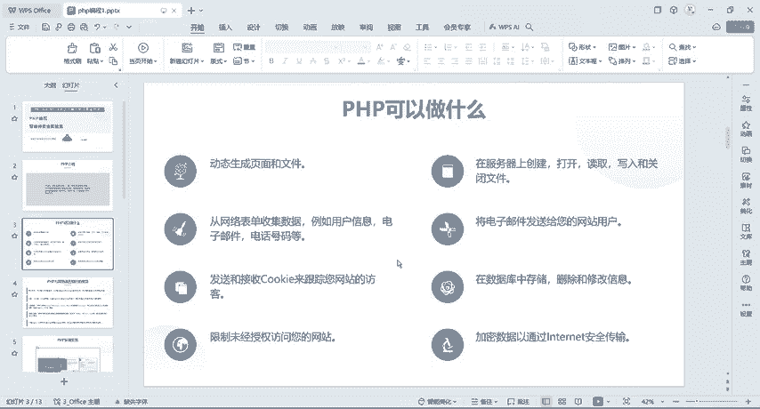
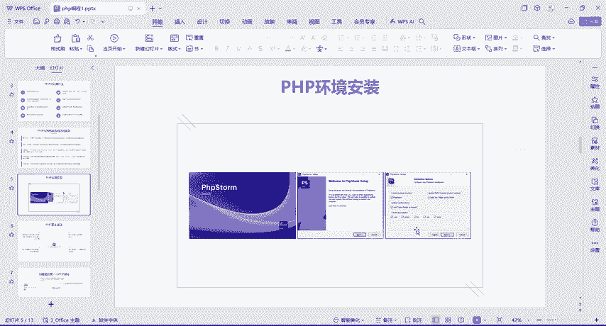
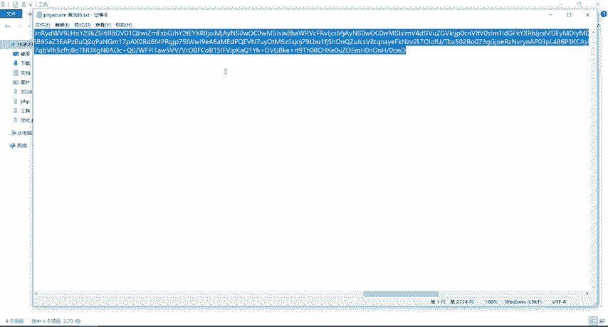
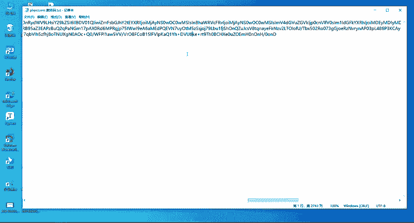
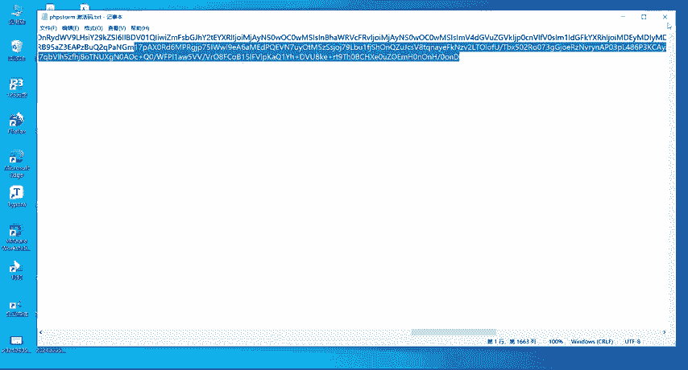

# CTF入门教学：1：PHP介绍及环境安装 🚩

在本节课中，我们将要学习PHP的基础知识，并完成PHP集成开发环境（PhpStorm）的安装与配置。这是CTF竞赛中Web安全方向的重要第一步。

## PHP介绍

PHP是一种通用的开源脚本语言，全称为“超文本预处理器”。它与C语言类似，是常用的网站编程语言，易于学习且使用广泛。PHP主要适用于Web开发领域。

PHP可以执行多种任务，例如动态生成网页、在服务器上创建或读取文件等。

与其他编程语言（如Java）相比，PHP具有以下优势：
*   **易于学习**：语法相对简单。
*   **开源免费**：是一个开放源代码的项目。
*   **可移植性高**：能在多种操作系统和平台上运行。
*   **性能快速**：相比其他脚本语言，PHP脚本的执行速度通常更快。
*   **社区广阔**：拥有世界范围内的开发者社区支持，易于找到相关帮助和文档。

## PHP环境安装

上一节我们介绍了PHP的基本概念，本节中我们来看看如何搭建PHP的开发环境。我们将使用PhpStorm这款集成开发环境（IDE）。

安装过程非常简单，主要步骤是运行安装程序并点击“下一步”。

以下是具体的安装与激活步骤：

1.  **运行安装程序**：打开提供的PhpStorm安装程序（`.exe`文件），按照提示点击“下一步”直至安装完成。安装后，桌面会出现PhpStorm图标。

2.  **准备破解文件**：首次运行PhpStorm会提示需要激活。我们使用提供的工具包进行激活。首先，解压工具包中的破解文件（ZIP格式）。

3.  **运行破解脚本**：在解压后的文件夹中，进入 `scripts` 目录。
    *   首先双击运行 `uninstall-all-users.vbs` 脚本，卸载所有用户权限，点击弹出窗口的“确定”。
    *   然后双击运行 `install-all-users.vbs` 脚本，进行安装，等待其执行完成。

4.  **激活软件**：再次打开PhpStorm，会弹出激活窗口。
    *   选择第二项“Activation Code”（激活码）。
    *   打开工具包中提供的“激活码.txt”文件，全选（`Ctrl+A`）并复制（`Ctrl+C`）所有内容。
    *   将复制的内容粘贴（`Ctrl+V`）到PhpStorm激活窗口的输入框中。如果激活码有效，输入框会变绿，且“Activate”按钮变为可点击的蓝色。
    *   点击“Activate”按钮。激活成功后，界面会显示许可有效期至2025年（实际可长期使用至2099年）。若未来提示过期，可重复此激活步骤。

激活完成后，即可开始使用PhpStorm进行PHP开发。

## 总结

本节课中我们一起学习了PHP的基本概念及其在Web开发中的作用，并完成了PhpStorm开发环境的安装与激活。现在，你已经拥有了一个功能强大的PHP编程工具，为后续的CTF Web安全学习打下了基础。