# CTF入门教学：P20：2、文件上传第一关 🚩

在本节课中，我们将学习如何搭建一个CTF文件上传漏洞的本地靶场环境，并完成第一关的挑战。第一关的核心是绕过前端JavaScript（JS）验证，成功上传一个WebShell文件。

## 概述

我们将从下载并配置靶场环境开始，然后通过修改前端代码来绕过文件类型检查，最终上传一个PHP信息文件（WebShell）到服务器。

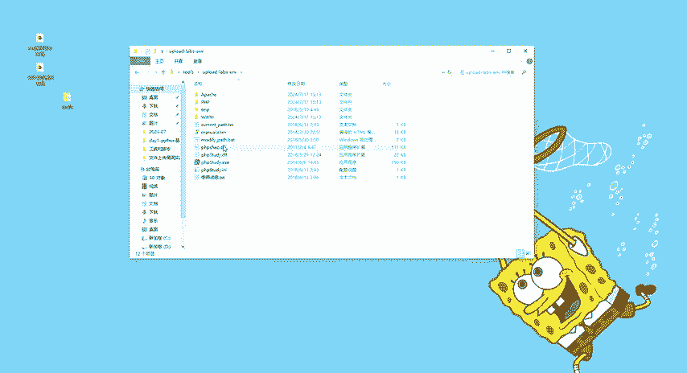

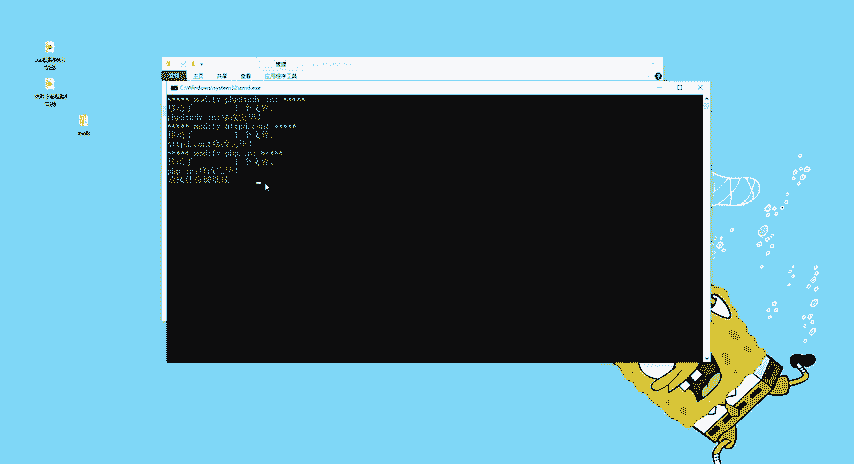

---

### 靶场环境搭建

上一节我们介绍了文件上传漏洞的基本概念，本节中我们来看看如何搭建实践环境。

#### 步骤一：解压与放置靶场文件


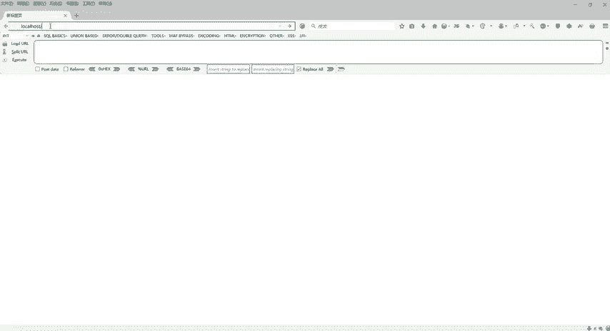

首先，需要将提供的工具包解压。解压后会得到一个文件夹，该文件夹内包含靶场文件。

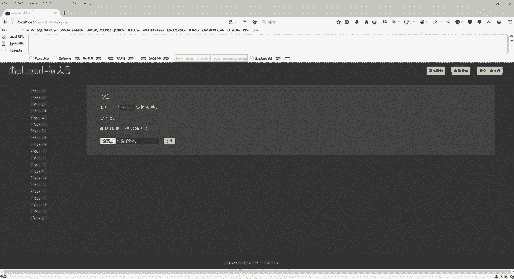

以下是操作步骤：
1.  在桌面新建一个文件夹，**文件夹名称不能包含中文**。例如，命名为 `twice`。
2.  将解压后得到的靶场文件夹（例如名为 `upload` 的文件夹）复制到新建的 `twice` 文件夹内。

#### 步骤二：配置PHP集成环境

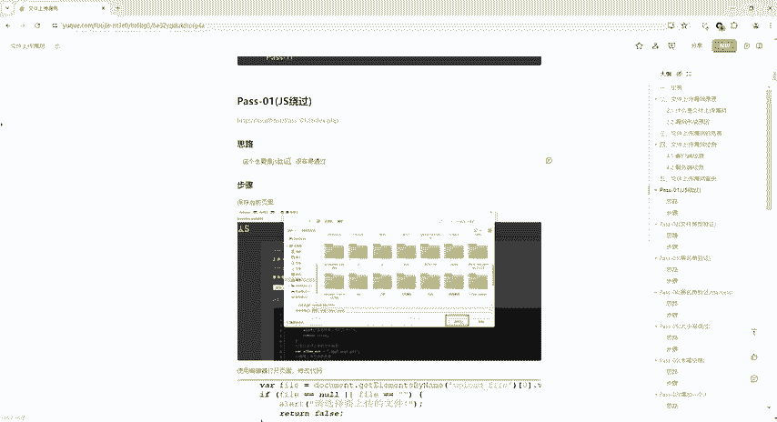

靶场工具包内集成了 `PHPStudy` 环境。以下是启动和配置步骤：
1.  在靶场文件夹中找到 `PHPStudy` 目录，运行其中的 `.bat` 文件。运行完成后，按任意键关闭窗口。
2.  运行 `PHPStudy.exe` 启动程序。
3.  程序启动后，默认PHP版本为 **5.2.17**，无需修改。

#### 步骤三：修改网站根目录

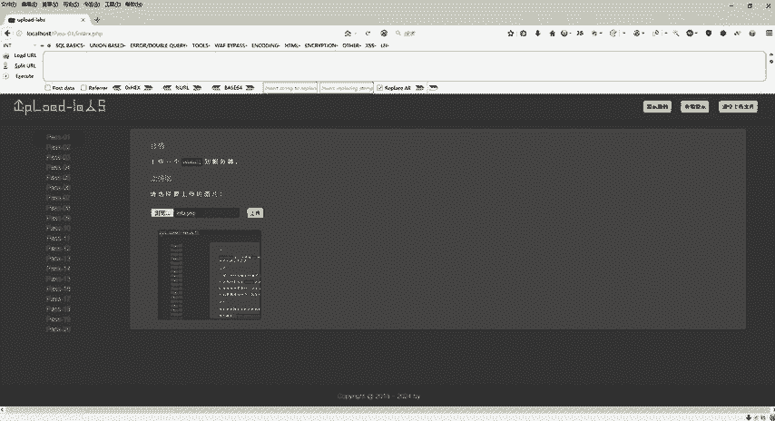


为了使Apache服务正常运行，必须将 `PHPStudy` 的网站目录指向靶场文件。

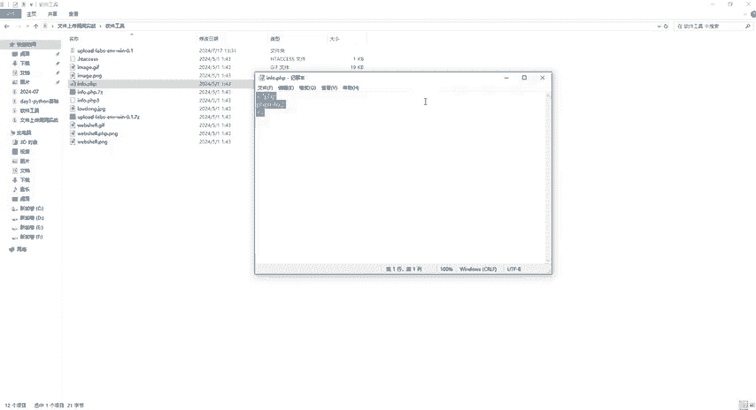

以下是操作步骤：
1.  在 `PHPStudy` 界面，点击“其他选项菜单” -> “PHPStudy设置” -> “端口常规设置”。
2.  找到“网站目录”选项，点击右侧的“...”按钮。
3.  浏览并选择之前放置在 `twice` 文件夹内的 `upload` 靶场文件夹，进一步选择其下的 `www` 目录。
4.  点击“确定”并“应用”。设置成功后服务会自动重启。
5.  确保Apache服务右侧显示为**绿色运行状态**。如果未启动，通常是网站目录设置错误。

#### 步骤四：访问靶场

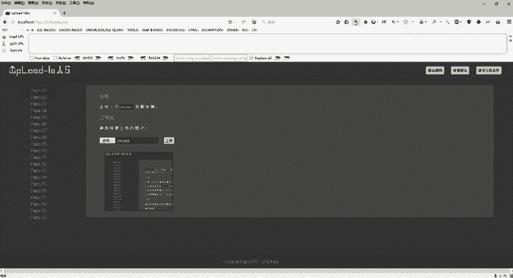

环境配置成功后，即可在浏览器中访问靶场。

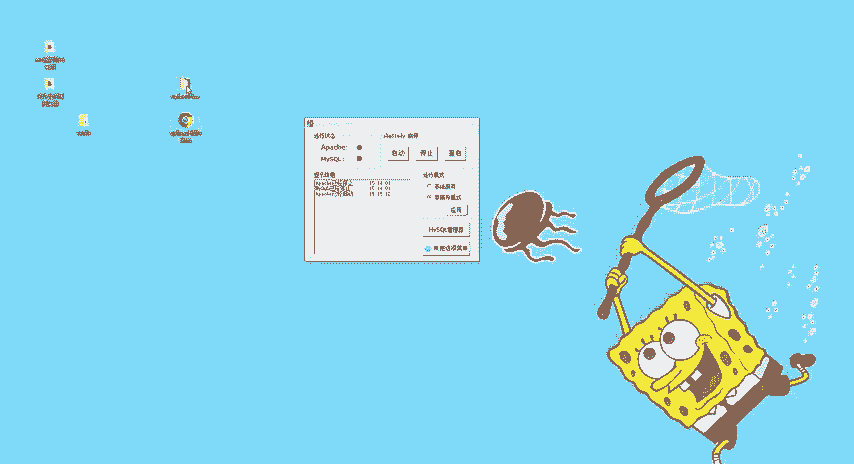

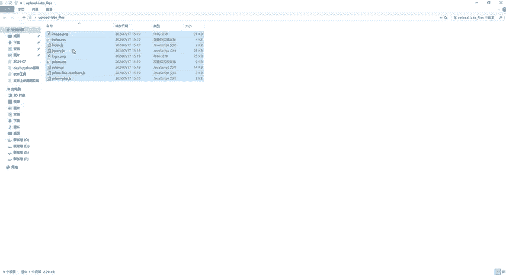

操作如下：
1.  打开浏览器。
2.  在地址栏输入 **`http://localhost`** 或 **`http://127.0.0.1`**。
3.  成功访问后，将看到包含20个关卡的文件上传漏洞练习界面。


至此，本地靶场环境已搭建完成。

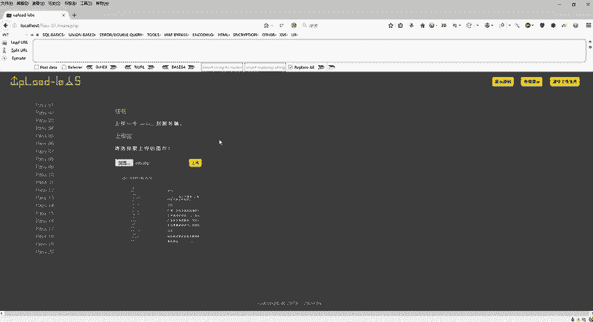

---

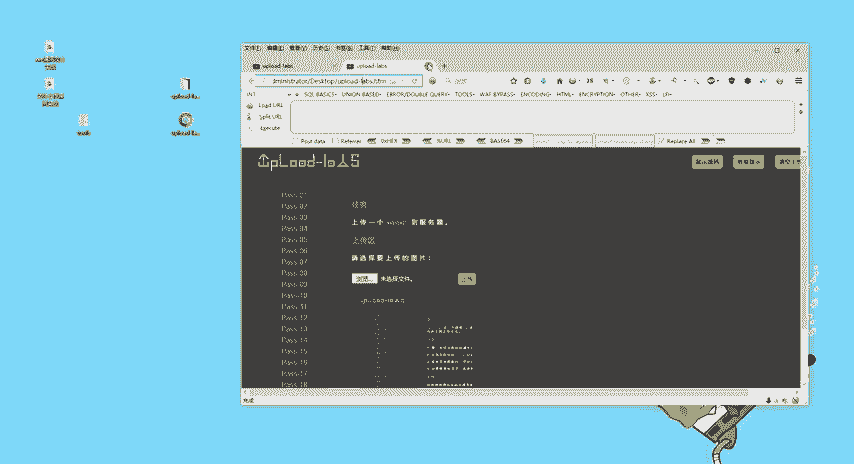

### 第一关：JS前端验证绕过

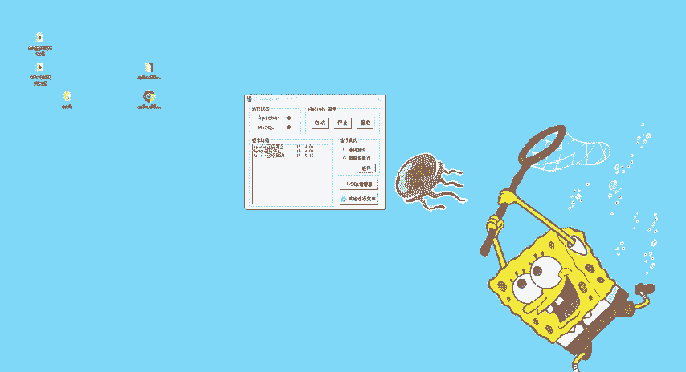

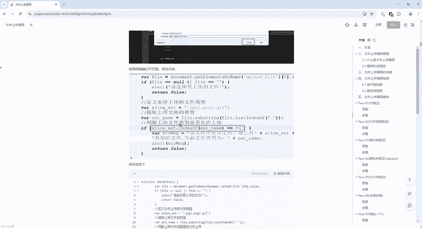


环境准备好后，我们开始挑战第一关。这一关存在前端JS验证，只允许上传图片格式（如.jpg, .png, .gif）的文件。

#### 核心思路

绕过前端验证的通用方法是：将含有验证代码的网页保存到本地，修改或删除验证逻辑，然后使用本地修改后的页面上传文件。

#### 实战步骤

以下是通关第一关的具体步骤：

**1. 分析验证机制**
*   在靶场第一关页面，尝试上传一个PHP文件（如提供的 `info.php`）。
*   页面会弹出警告，提示只允许上传特定图片格式。这个弹窗就是**前端JS验证**的结果。

**2. 保存前端页面**
*   在浏览器中按 **`Ctrl + S`** （或右键选择“另存为”），将当前网页完整保存到本地（例如桌面）。

**3. 修改前端验证代码**
*   用文本编辑器（如记事本、VS Code）打开刚保存的HTML文件。
*   在代码中搜索关键词 **`checkFile`**，找到负责文件检查的JavaScript函数。
*   该函数中包含判断文件类型的逻辑。关键代码如下：
    ```javascript
    if (file_ext == -1) {
        // 如果不允许，则弹出警告并阻止提交
        alert("该文件不允许上传，请上传jpg，png，gif格式的文件~");
        return false;
    }
    ```
*   **修改方法**：将判断条件改为永远不成立，使验证失效。例如，将 `(file_ext == -1)` 修改为 `(1 == -1)`。
    ```javascript
    if (1 == -1) { // 条件永远为假，内部的警告代码永远不会执行
        alert("该文件不允许上传，请上传jpg，png，gif格式的文件~");
        return false;
    }
    ```

**4. 修正表单提交地址**
*   找到网页中的 `<form>` 表单标签。
*   为其添加或修改 `action` 属性，确保文件提交到正确的靶场地址。例如：
    ```html
    <form method="post" action="http://127.0.0.1/pass-01/index.php" onsubmit="return checkFile()">
    ```
*   保存修改后的HTML文件。

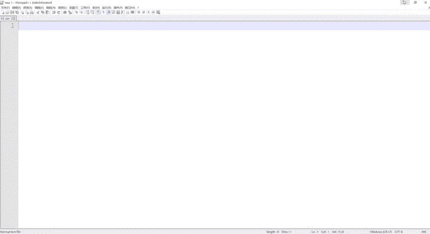

**5. 使用本地页面上传**
*   **重要**：在浏览器中直接打开**修改后的本地HTML文件**（文件路径类似 `file:///C:/Users/.../桌面/upload_labs.html`），而不是再次访问 `localhost`。
*   在本地页面中，选择要上传的 `info.php` 文件，点击上传。
*   此时，被我们修改过的前端代码不再进行拦截，文件将被成功上传到靶场服务器。

**6. 验证上传结果**
*   上传成功后，页面会返回文件的访问路径。
*   复制该路径，在浏览器的新标签页中打开。如果看到服务器的PHP配置信息页面，则说明WebShell（`info.php`）已成功上传并执行。
*   `info.php` 的核心代码是 `<?php phpinfo(); ?>`，用于输出PHP环境信息。

---

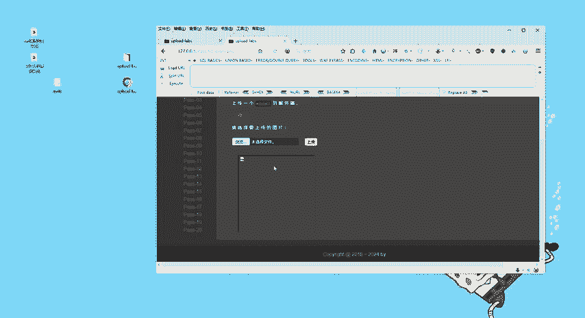

### 总结

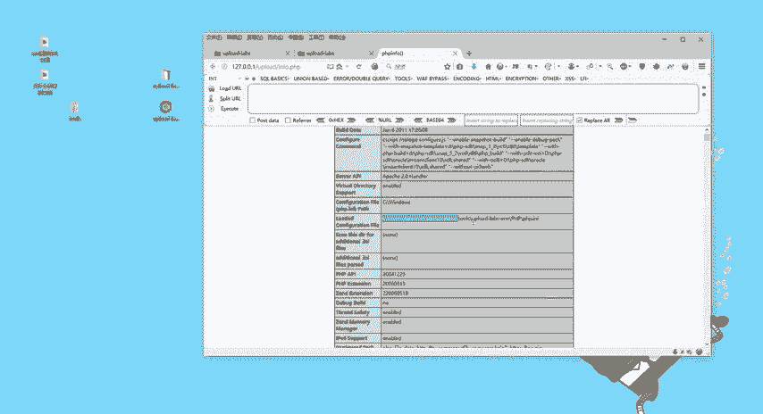

本节课中我们一起学习了CTF文件上传漏洞第一关的突破方法。
1.  **环境搭建**：我们配置了本地的PHPStudy环境和upload-labs靶场。
2.  **漏洞原理**：第一关是**前端JS验证绕过**，验证仅在浏览器端执行，容易被绕过。
3.  **突破方法**：通过“保存页面 -> 修改JS验证逻辑 -> 本地提交”的三步流程，成功绕过了前端限制，上传了WebShell文件。

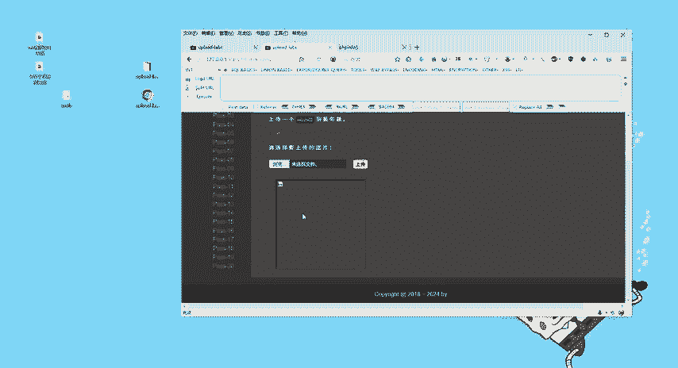

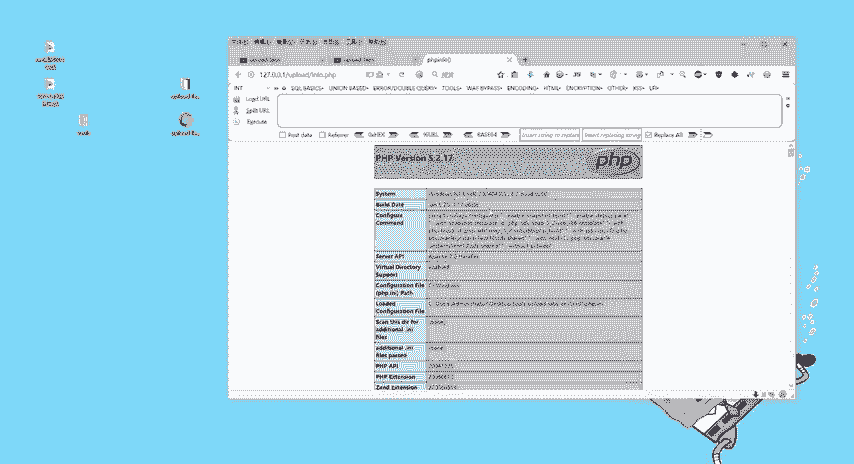

核心在于理解：**前端验证仅适用于用户体验，不能作为安全防御手段**。任何客户端检查都可以被绕过。