# CTF入门教学：P21：3、文件上传第二关至第四关 🔐

在本节课中，我们将学习CTF中文件上传漏洞的三种常见绕过方法。我们将从第二关的客户端MIME类型验证开始，逐步深入到第三关和第四关的黑名单验证绕过。通过实际操作，你将掌握如何利用工具和服务器特性来突破这些安全限制。

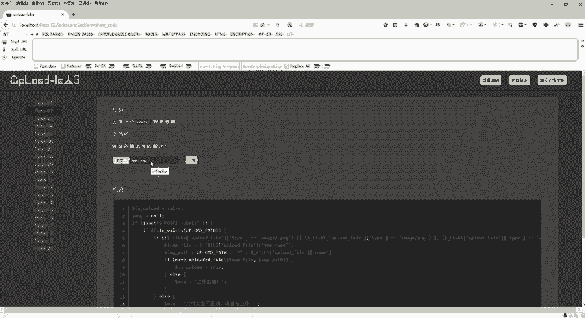

## 第二关：绕过客户端MIME类型验证

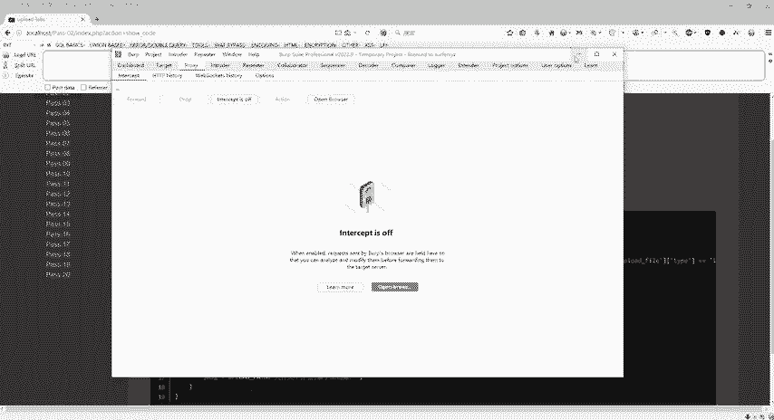

上一节我们介绍了基础的文件上传概念，本节中我们来看看如何绕过第二关的客户端验证。第二关要求上传图片，但其源码显示，它通过JavaScript验证了上传文件的MIME类型。

以下是关键的限制代码逻辑：
```javascript
if (file.type !== 'image/jpeg' && file.type !== 'image/png' && file.type !== 'image/gif') {
    alert('文件类型不正确，请重新上传。');
    return false;
}
```
这段代码只允许`image/jpeg`、`image/png`和`image/gif`三种MIME类型。

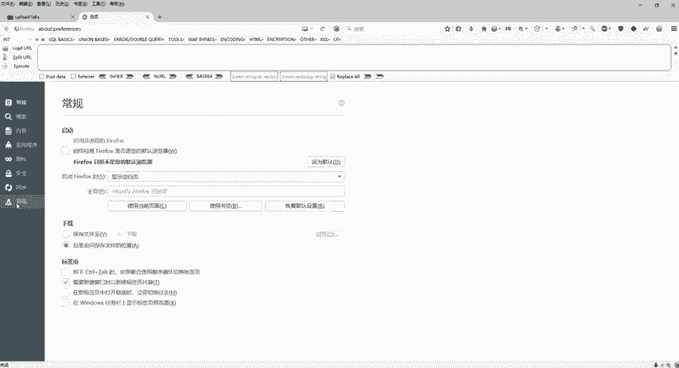

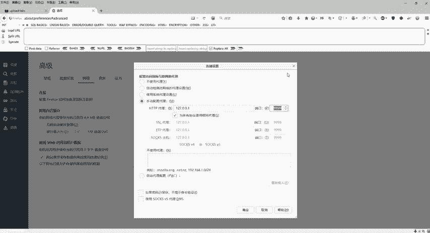

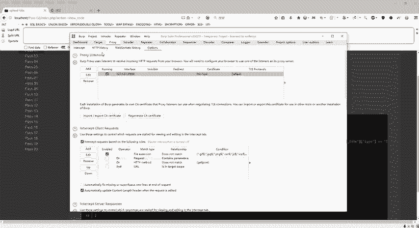

为了绕过此验证，我们需要拦截并修改HTTP请求包中的`Content-Type`头部。以下是具体操作步骤：

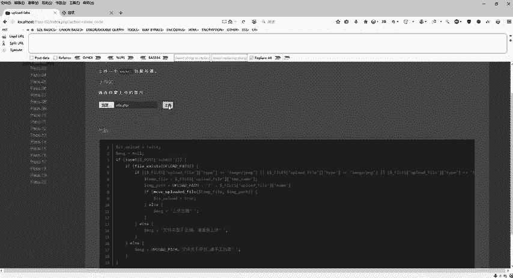

1.  配置浏览器代理：在浏览器设置中，将代理服务器设置为`127.0.0.1`，端口设置为`9999`（需与Burp Suite保持一致）。
2.  配置Burp Suite：确保Burp Suite的代理监听器端口也为`9999`。
3.  拦截请求：在网页中选择一个PHP文件（如`info.php`）进行上传，此时Burp Suite会拦截到该请求。
4.  修改数据包：在Burp Suite的拦截界面，找到请求头中的`Content-Type`字段，将其值从`application/x-php`修改为允许的类型，例如`image/png`。
5.  放行请求：关闭拦截，让修改后的请求发送到服务器。

完成上述步骤后，文件便会上传成功。通过访问该文件的URL，可以验证绕过是否成功。

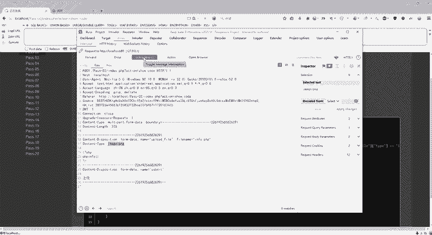

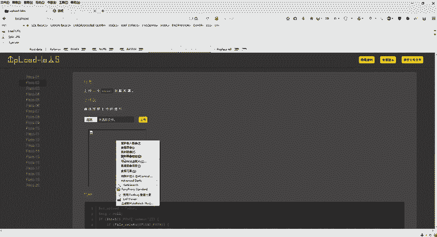

## 第三关：利用黑名单不完整进行绕过

在成功绕过第二关后，我们进入第三关。第三关采用了黑名单验证机制，明确禁止了某些危险的后缀名。

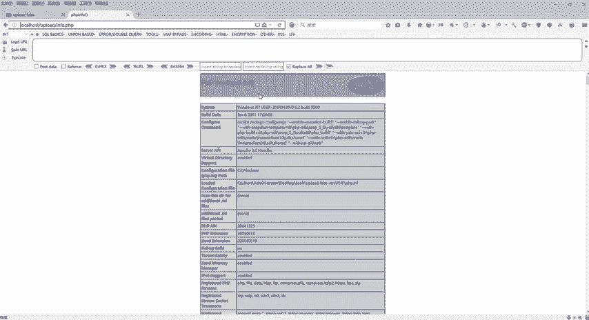

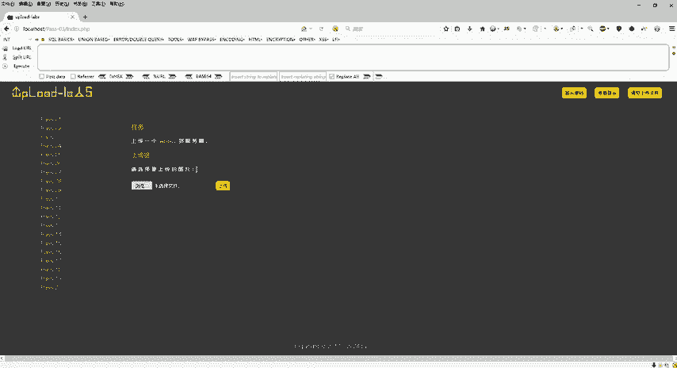

以下是源码中定义的黑名单数组：
```php
$deny_ext = array('.asp', '.aspx', '.php', '.jsp');
```
服务器会检查文件后缀名是否在此黑名单内。

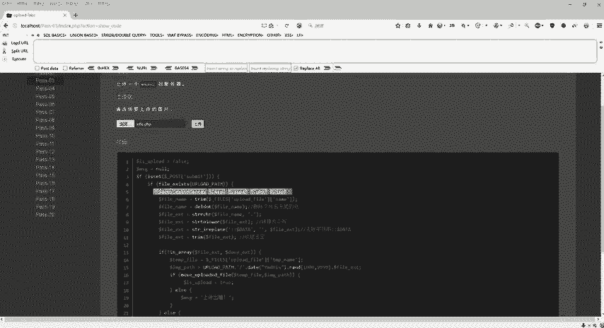

然而，这份黑名单并不完整。Apache等服务器除了能解析标准的`.php`文件外，还能解析其他一些后缀。以下是绕过思路：

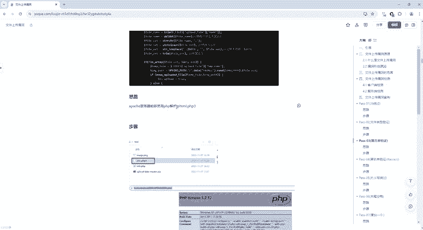

利用Apache服务器的解析特性，它能够解析`.phtml`或`.php3`等后缀的文件。因此，我们可以将Webshell文件的后缀名改为`.php3`。

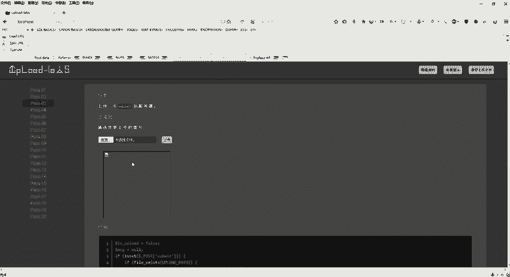

操作步骤如下：
1.  准备一个内容为PHP代码的文件，但将其命名为`info.php3`。
2.  在网页上传界面选择该文件并上传。
3.  上传成功后，访问该文件的URL，服务器会将其作为PHP脚本解析并执行，从而绕过黑名单验证。

## 第四关：利用.htaccess文件进行绕过

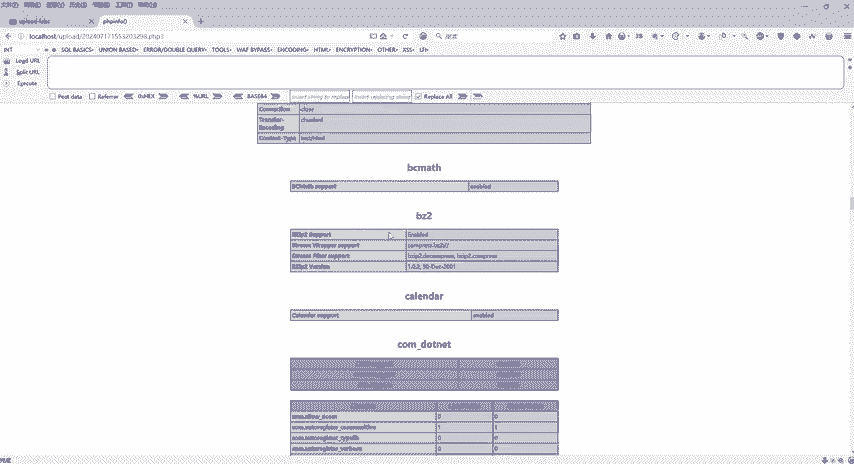

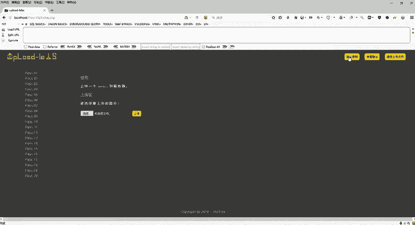

第三关我们利用了黑名单的遗漏，但第四关的黑名单更加全面，包含了`.php3`、`.phtml`等多种变体。此时，我们需要一种更强大的绕过方法。

第四关的绕过核心是利用Apache服务器的`.htaccess`文件。`.htaccess`是一个分布式配置文件，可以在目录级别覆盖服务器的默认设置。

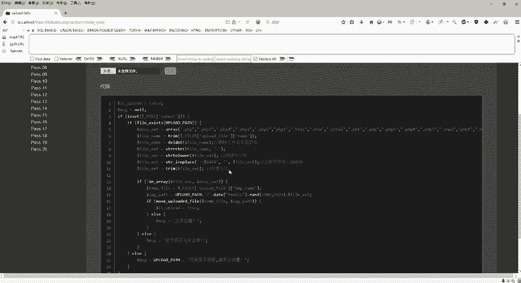

以下是具体的操作步骤：

1.  **创建并上传.htaccess文件**：首先，创建一个名为`.htaccess`的文本文件，内容如下。这段代码的意思是，将所有`vul.jpg`文件都当作PHP脚本来解析。
    ```
    <FilesMatch "vul.jpg">
    SetHandler application/x-httpd-php
    </FilesMatch>
    ```
    将此文件上传到服务器。

2.  **准备并上传特制图片**：其次，准备一个名为`vul.jpg`的文件。这个文件表面上是图片，但其内容实际上是一段PHP代码（例如`<?php phpinfo(); ?>`）。确保该文件名与`.htaccess`中`FilesMatch`规则匹配的名称完全一致。
3.  **上传特制图片**：最后，上传这个`vul.jpg`文件。

完成以上两步后，当你访问`vul.jpg`这个URL时，Apache服务器会根据`.htaccess`文件的指令，将其中的PHP代码解析执行，从而成功绕过后缀名黑名单验证。

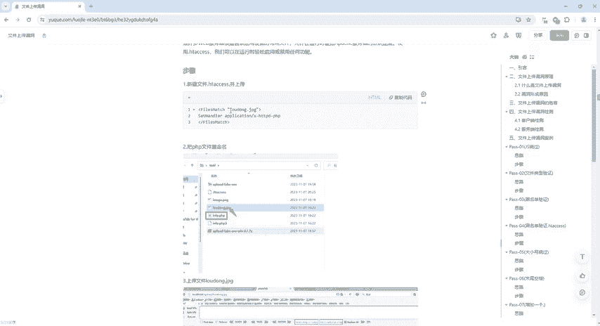

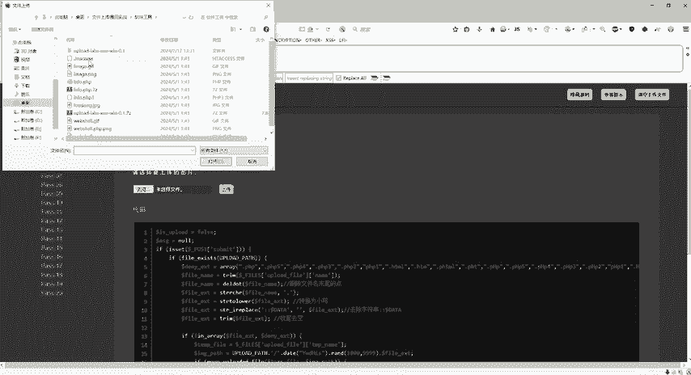

---

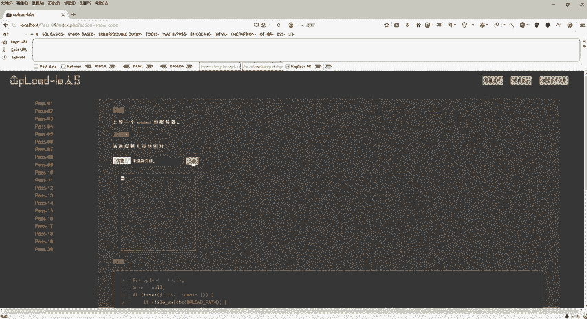

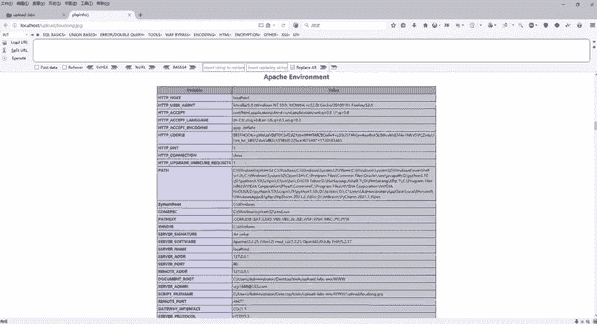

本节课中我们一起学习了文件上传漏洞的三种中级绕过技术：通过代理工具修改MIME类型绕过前端验证、利用服务器解析特性绕过不完整的黑名单、以及使用`.htaccess`文件强制服务器解析特定文件。理解这些方法的原理，能帮助你更深入地认识Web应用的安全机制与弱点。