# CTF入门教学：P22：4、文件上传第五关至第七关 🚩

在本节课中，我们将学习文件上传漏洞挑战的第五关至第七关。我们将通过分析每一关的源代码，找出其验证逻辑的缺陷，并演示如何利用这些缺陷成功上传Webshell文件。核心在于理解服务器端对文件名的处理逻辑，并找到绕过方法。

## 第五关：利用大写后缀绕过

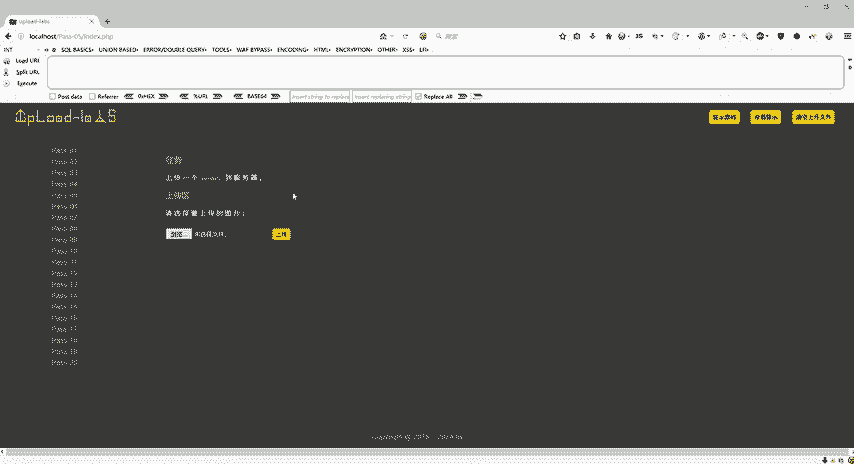

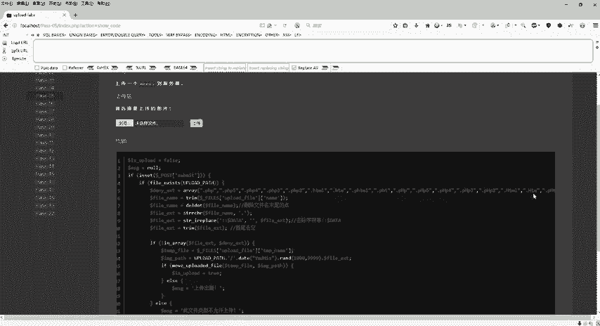

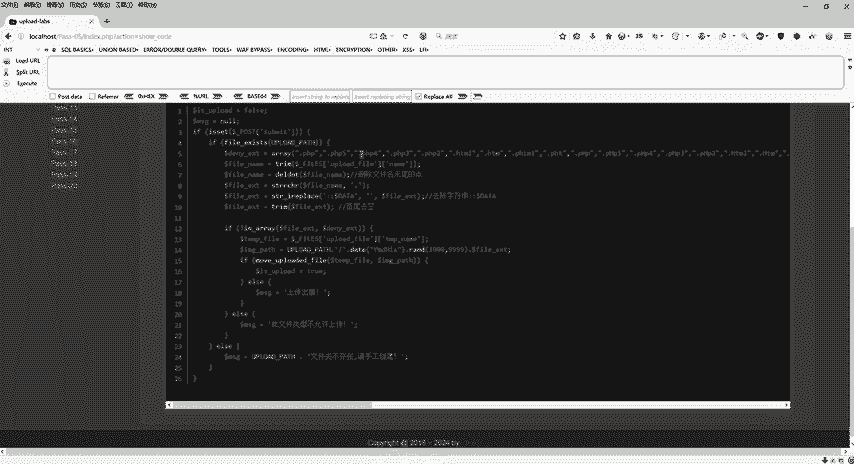

上一节我们介绍了前几关的绕过思路，本节中我们来看看第五关的挑战。

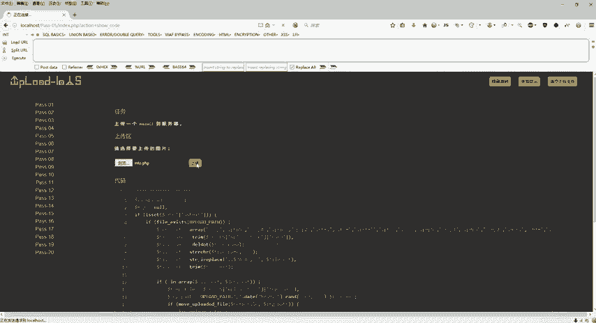

首先，查看第五关的源代码。代码中对文件后缀名进行了多种验证，例如检查是否为`php`、`php5`、`php4`、`php3`、`html`、`htm`、`phtml`、`pht`等。同时，代码还进行了大小写转换和去除字符串首尾空格的操作。

然而，通过仔细分析可以发现，代码的验证逻辑存在一个漏洞：它没有检查后缀名**全部为大写**的情况。验证逻辑主要针对小写或大小写混合的情况。

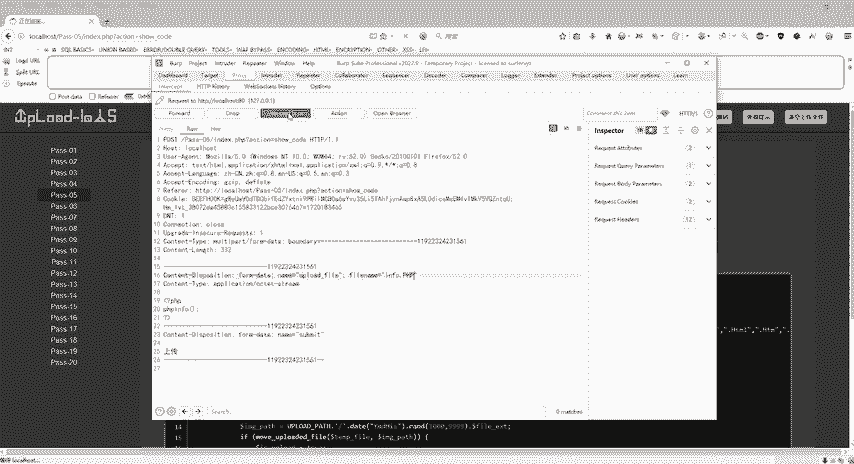

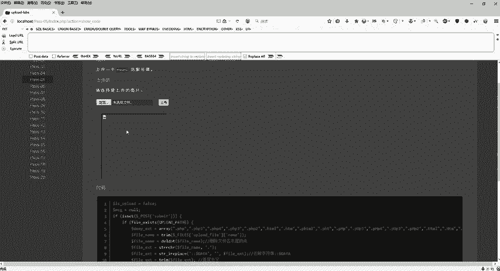

以下是关键的绕过思路：
既然验证逻辑没有覆盖大写后缀，我们可以将上传文件的后缀名全部改为大写。

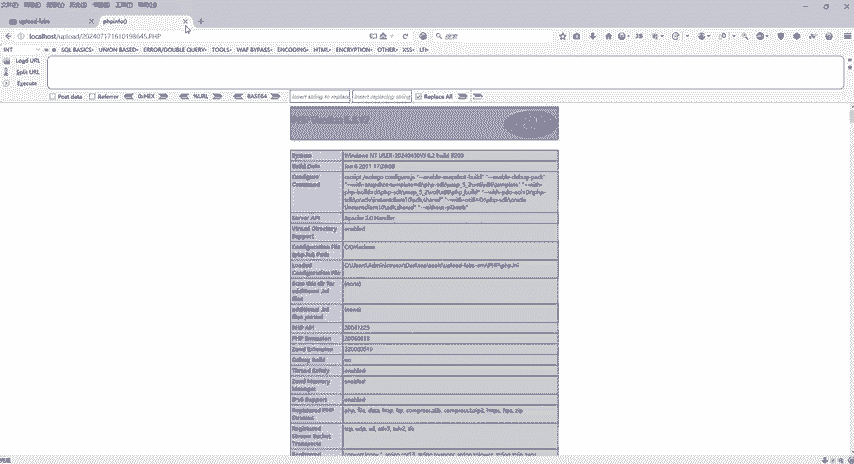

具体操作步骤如下：
1.  点击“浏览”按钮，选择准备好的Webshell文件，例如 `shell.php`。
2.  打开Burp Suite代理工具，拦截浏览器发出的上传请求数据包。
3.  点击“上传”按钮，此时请求会被Burp Suite截获。
4.  在Burp Suite的拦截界面中，找到文件名参数，将后缀名从 `.php` 修改为 `.PHP`（全部大写）。
5.  修改完成后，点击“Forward”按钮放行数据包。
6.  返回网页界面刷新，可以看到文件上传成功的提示。
7.  复制上传文件的访问地址，在浏览器中打开，验证Webshell是否可以正常执行。

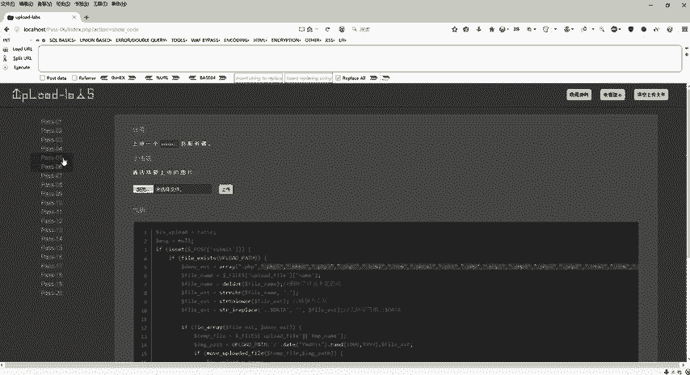

通过将后缀名改为大写，我们成功绕过了第五关的文件类型检查。

## 第六关：利用末尾空格绕过

在成功绕过第五关后，我们进入第六关。这一关在第五关的基础上增加了更多的安全验证。

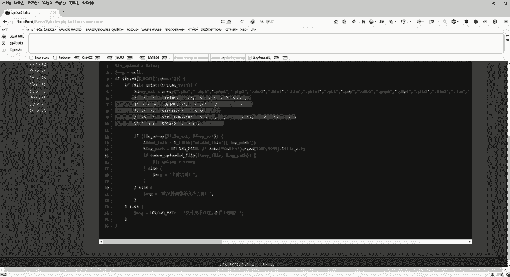

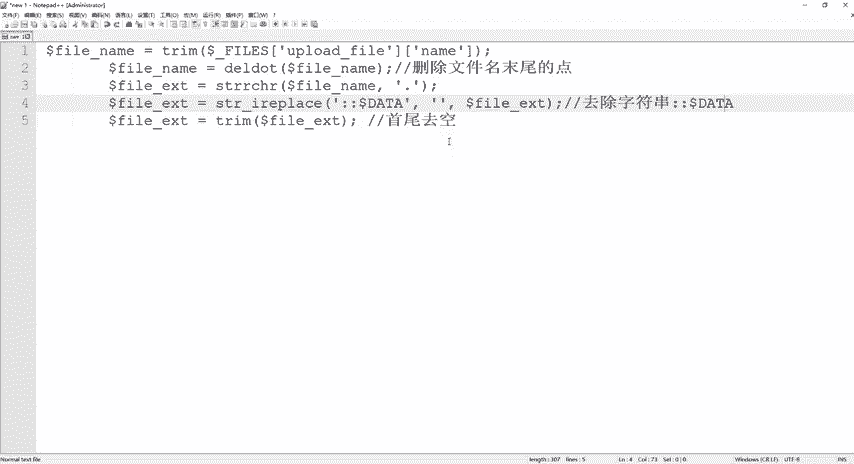

我们首先查看第六关的源代码，并将其与第五关的代码进行对比。对比后发现，第六关的代码**缺少了“去除字符串首尾空格”**的函数调用（例如 `trim()`）。

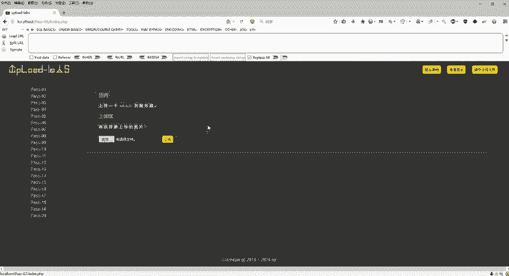

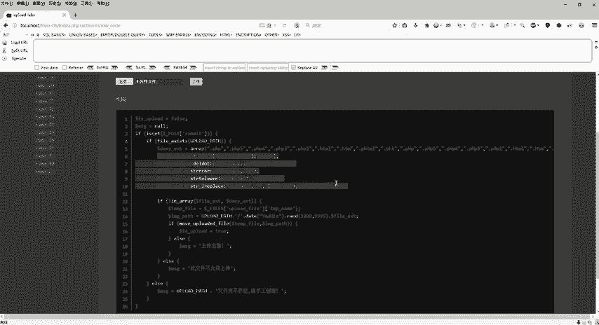

以下是关键的绕过思路：
由于服务器没有对文件名进行首尾去空处理，我们可以在文件名**末尾添加一个空格**。当服务器进行后缀名检查时，带空格的后缀名 `php `（注意末尾有空格）不匹配黑名单中的 `php`，从而绕过检查。而在某些系统（如Windows）保存文件时，末尾的空格会被自动忽略，最终文件仍以 `.php` 格式保存。

具体操作步骤如下：
1.  同样选择 `shell.php` 文件进行上传，并用Burp Suite拦截请求。
2.  在Burp Suite中，找到文件名参数，在 `.php` 后面添加一个空格，使其变为 `shell.php `。
3.  放行数据包。
4.  刷新页面确认上传成功，并复制地址进行访问验证。

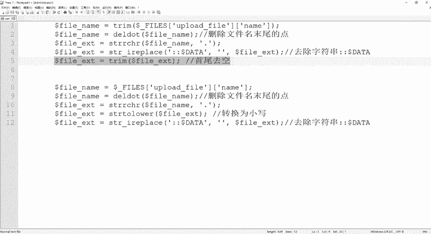

通过在文件名末尾添加空格，我们绕过了第六关更严格的黑名单检查。

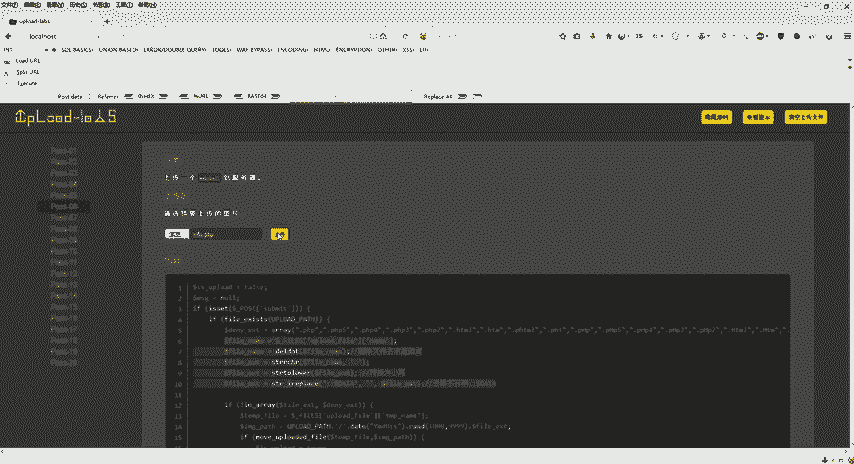

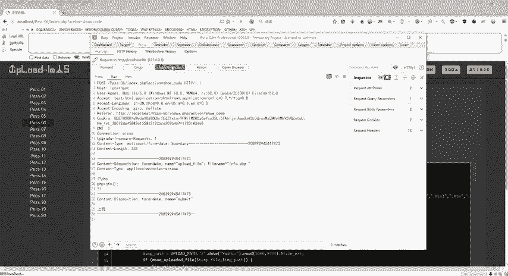

## 第七关：利用末尾点号绕过

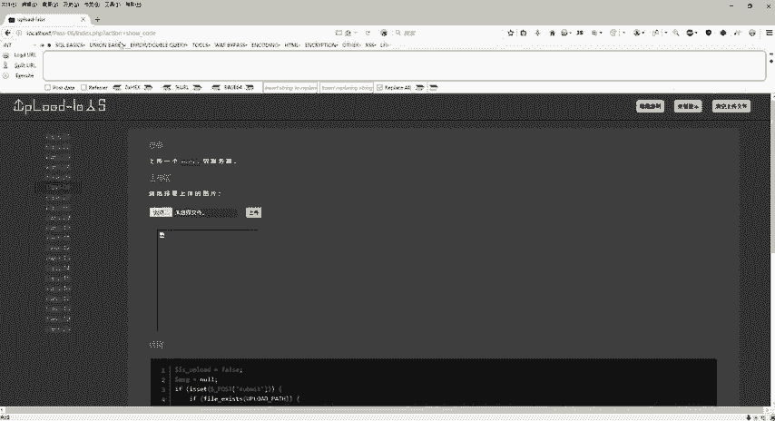

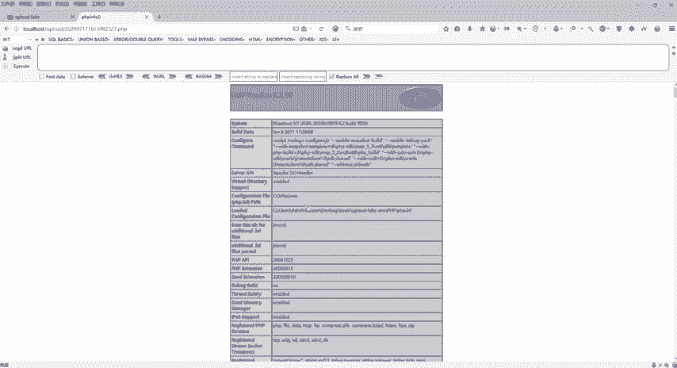

接下来是第七关。根据关卡连续升级的特点，第七关很可能修复了上一关的漏洞。

我们查看第七关的源代码，并与第六关对比。可以发现，第七关的代码**重新加入了“去除字符串首尾空格”的函数**，修复了第六关的漏洞。但同时，我们注意到它**缺少了“删除文件名末尾点号”**的逻辑。

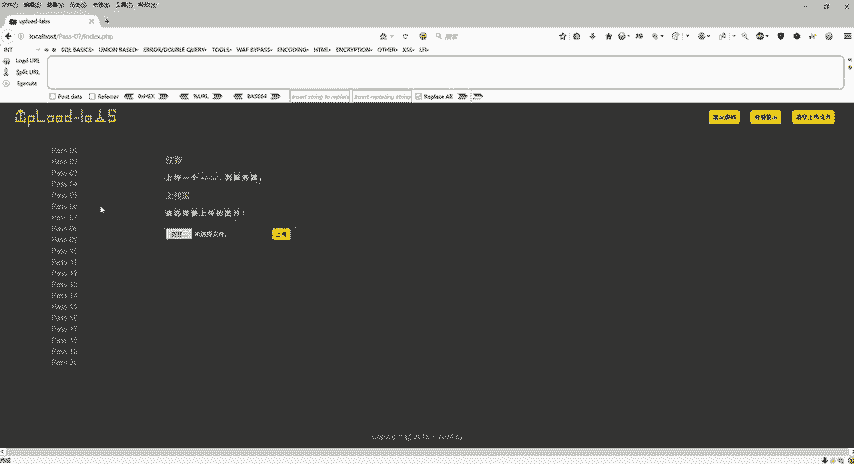

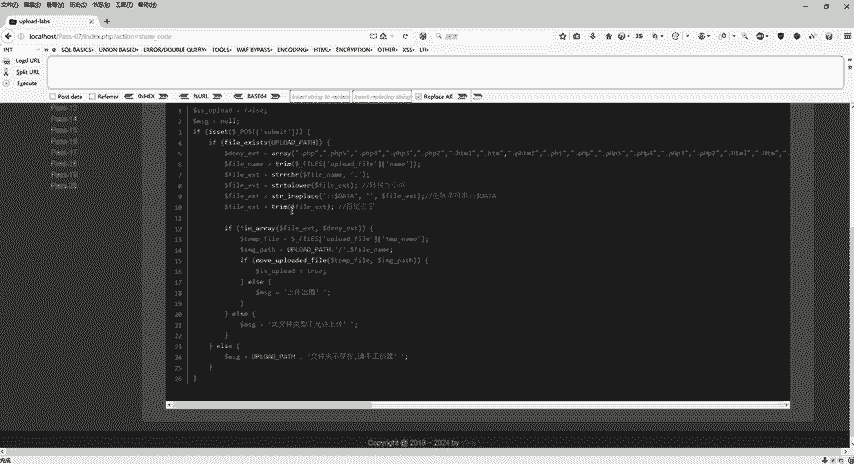

以下是关键的绕过思路：
我们可以在文件名**末尾添加一个点号**。例如，将 `shell.php` 改为 `shell.php.`。这样，在进行后缀名检查时，程序检查的是 `php.`，这不在黑名单内。而在Windows等系统保存文件时，末尾的点号会被自动去除，文件最终仍以 `.php` 格式保存。

具体操作步骤如下：
1.  选择 `shell.php` 文件，用Burp Suite拦截上传请求。
2.  在拦截的数据包中，将文件名修改为 `shell.php.`（在php后加一个点）。
3.  放行数据包。
4.  在网页中确认上传成功，并通过访问上传地址来验证Webshell功能。

利用系统对末尾点号的自动处理特性，我们成功绕过了第七关的防御。

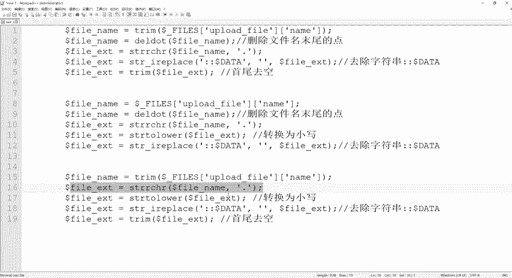

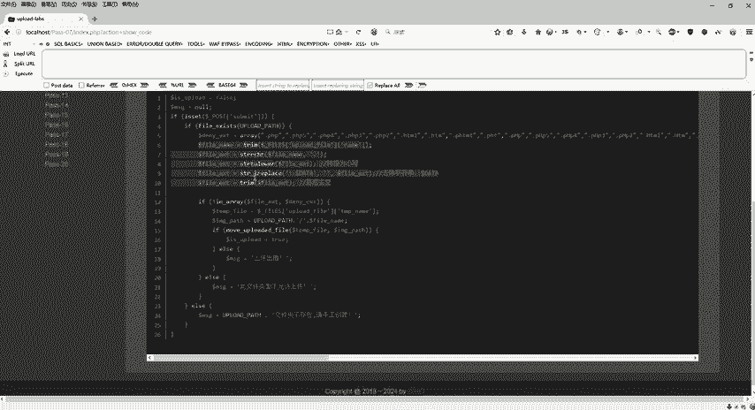

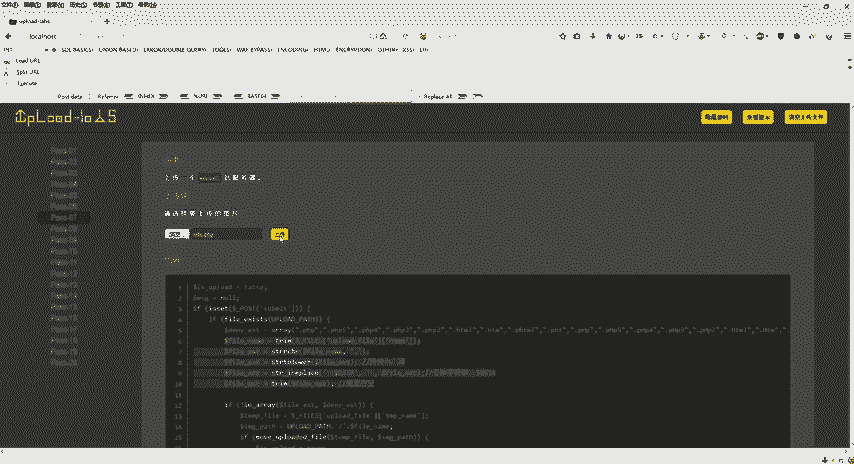

## 总结

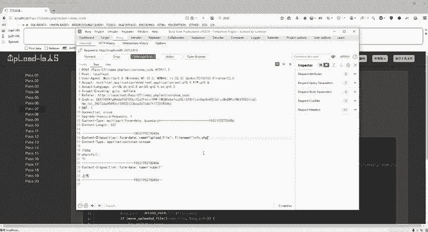

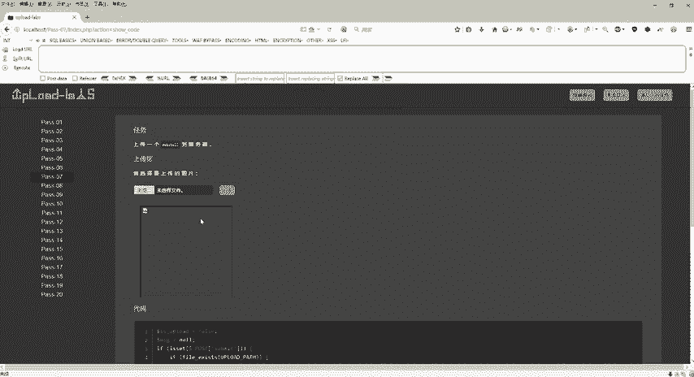

本节课中我们一起学习了文件上传漏洞的三种绕过技巧。
*   **第五关**：通过将文件后缀名改为**全大写**（如`.PHP`），利用验证逻辑缺失进行绕过。
*   **第六关**：通过在文件名**末尾添加空格**（如`shell.php `），利用系统自动修剪空格及验证逻辑漏洞进行绕过。
*   **第七关**：通过在文件名**末尾添加点号**（如`shell.php.`），利用系统自动去除末尾点号的特性进行绕过。

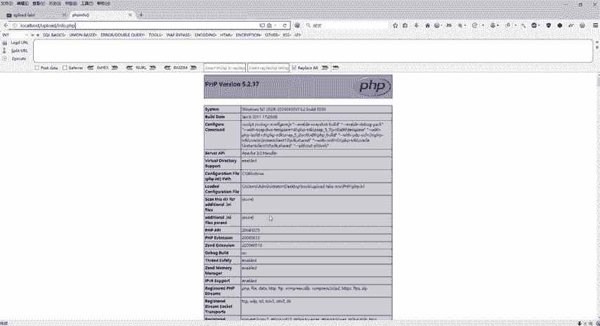

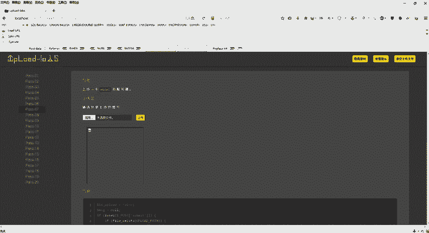

这些关卡演示了安全开发中常见的“补丁式修复”问题，以及如何通过细致的逻辑分析找到新的突破点。理解服务器端处理逻辑与操作系统特性之间的差异，是完成这类挑战的关键。