# CTF入门教学：P23：5、文件上传第八关至第九关

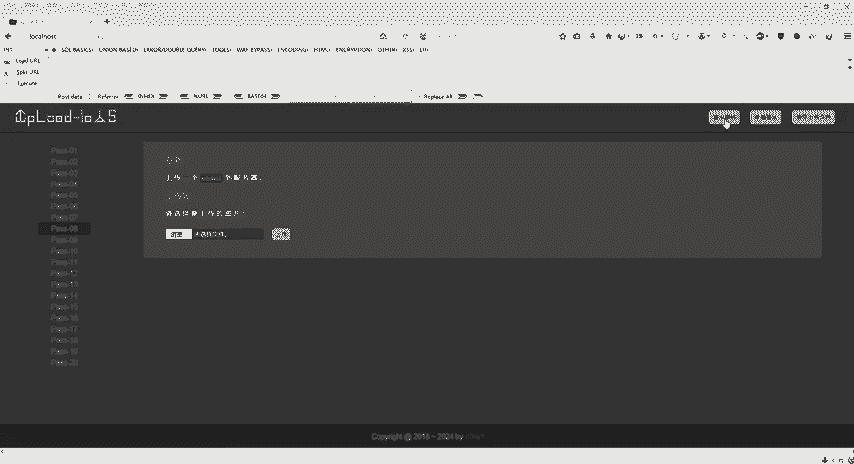

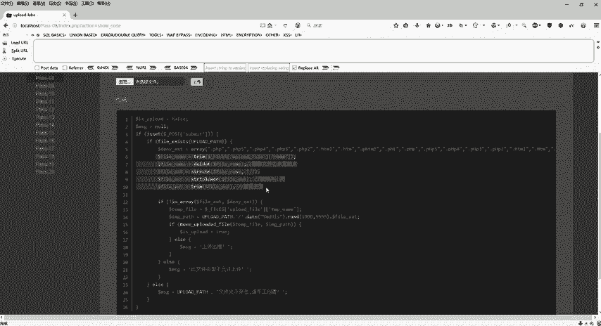

在本节课中，我们将学习CTF文件上传挑战的第八关和第九关。这两关主要考察对Windows系统特性及代码逻辑缺陷的理解与利用。我们将通过分析源码、理解过滤逻辑，并利用特定技巧来绕过防护，成功上传Webshell。

## 第八关：利用Windows文件流特性绕过检测

上一节我们分析了第七关的过滤逻辑，本节中我们来看看第八关。第八关的源码与第七关相似，但存在一个关键差异：它没有过滤字符串 `::$DATA`。

以下是第八关源码的核心过滤步骤：
1.  将文件名转换为小写。
2.  去除字符串首尾的空格。
3.  检查文件类型是否为图片。

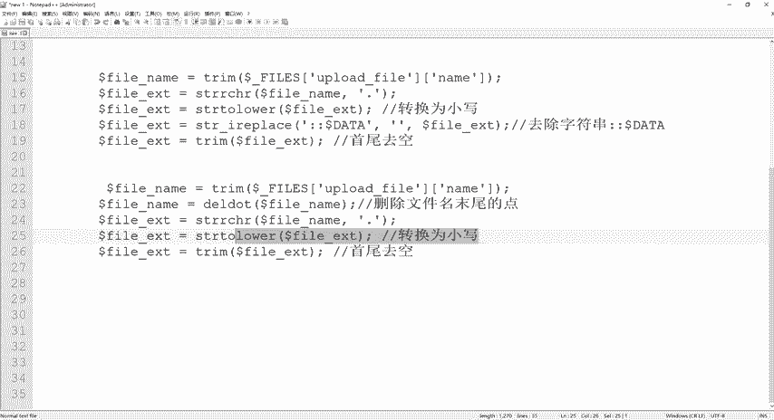

关键点在于，与第七关相比，第八关**没有**去除 `::$DATA` 这个字符串。在Windows系统中，如果文件名包含 `::$DATA`，系统会将冒号之后的数据当作文件流处理，从而**不检查后缀名**，并保留 `::$DATA` 之前的部分作为实际文件名。

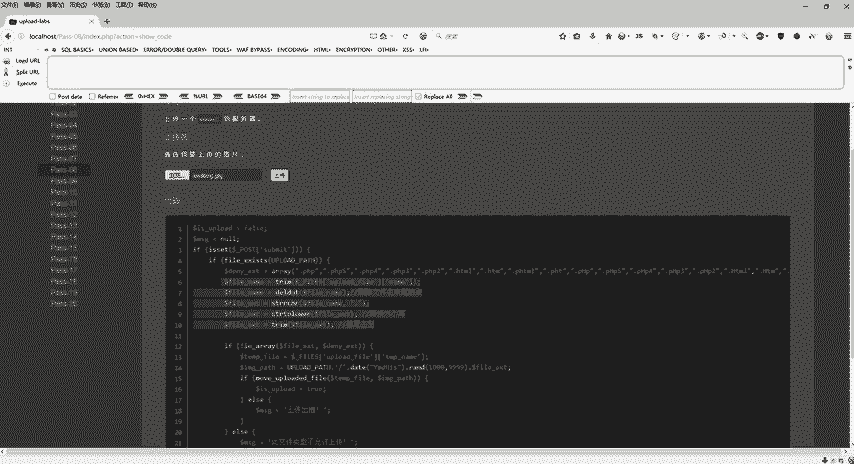

例如，文件 `shell.php::$DATA` 在Windows系统中会被当作 `shell.php` 来执行。

### 攻击步骤

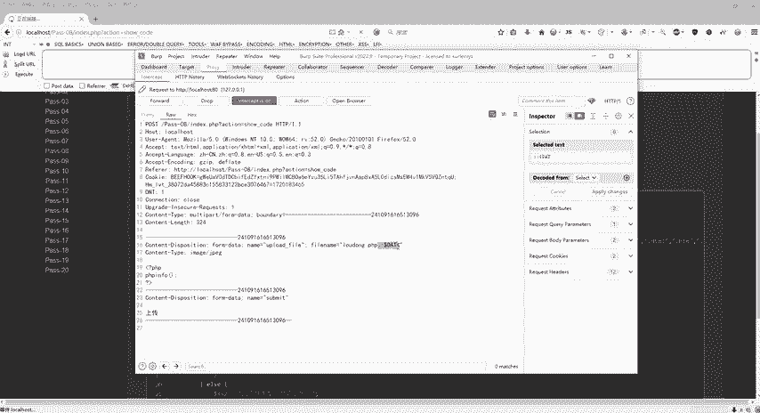

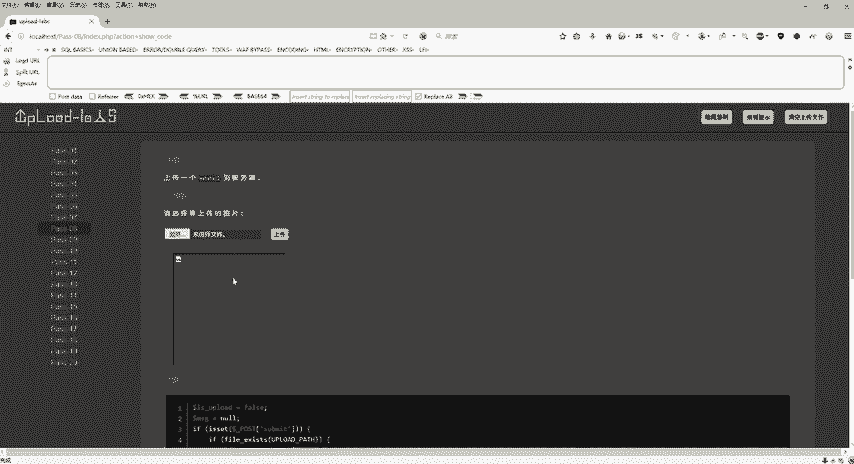

以下是利用此特性绕过检测的具体操作流程：

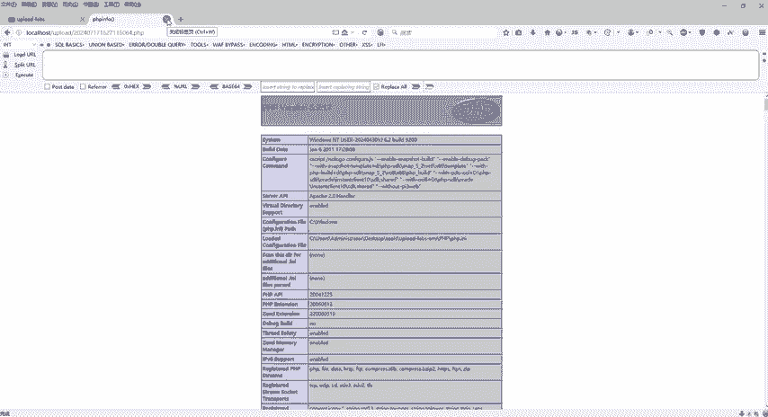

1.  **准备文件**：选择一张图片文件（例如 `vuln.jpg`），但其实际内容是一个PHP Webshell。
2.  **拦截上传请求**：点击上传前，使用Burp Suite等工具拦截HTTP请求。
3.  **修改文件名**：在拦截到的数据包中，找到文件名参数，将其从 `vuln.jpg` 修改为 `shell.php::$DATA`。
    ```http
    POST /upload HTTP/1.1
    ...
    Content-Disposition: form-data; name="file"; filename="shell.php::$DATA"
    ```
4.  **放行请求**：修改完成后，放行数据包。
5.  **访问文件**：上传成功后，复制返回的文件路径。注意，路径中会包含 `::$DATA`。在浏览器中访问时，需要手动将 `::$DATA` 从URL中删除，然后访问，即可成功执行PHP代码。

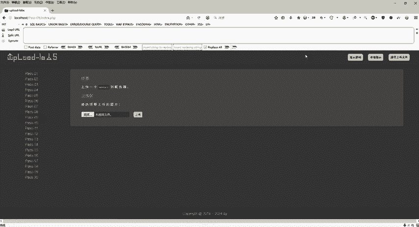

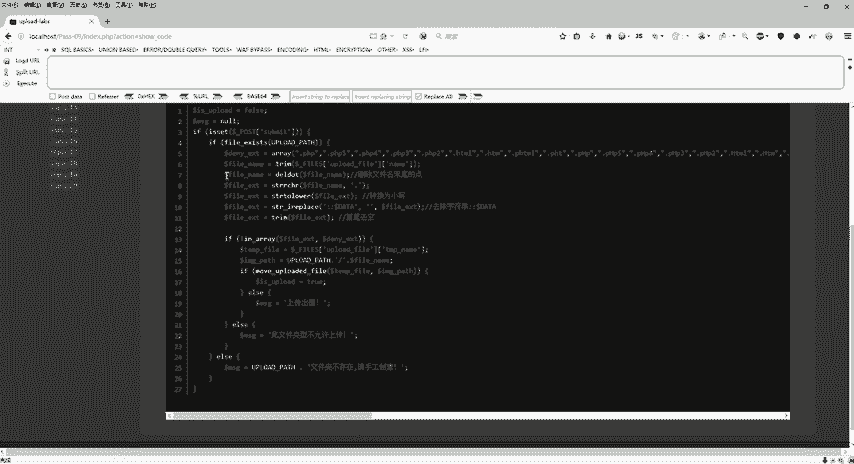

通过利用Windows系统的 `::$DATA` 文件流特性，我们绕过了服务端对文件后缀的检查，成功上传并执行了Webshell。

## 第九关：利用代码逻辑缺陷绕过过滤

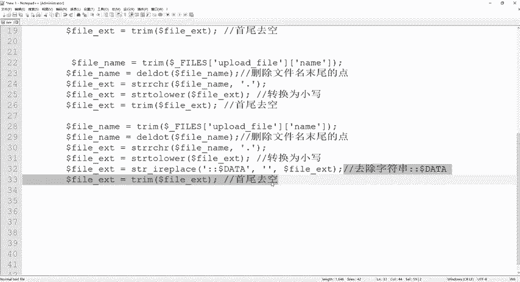

解决了第八关后，我们进入第九关。第九关的源码看似将所有危险操作都加入了黑名单，但存在一个代码编写不严谨导致的逻辑缺陷。

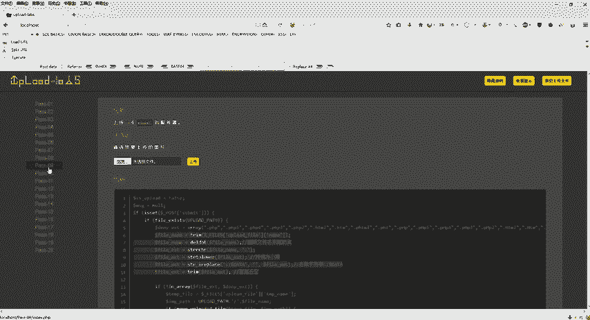

以下是第九关源码声称的过滤步骤：
1.  删除文件名末尾的点。
2.  转换为小写。
3.  去除字符串 `::$DATA`。
4.  去除字符串首尾的空格。

通过代码审计（直接查看靶场 `index.php` 源码），我们发现 `删除文件名末尾的点` 这个功能的代码**没有正确着色**，暗示其可能并未生效或存在逻辑问题。该函数本意是从字符串末尾开始向前删除所有的点 `.`。

### 攻击思路

既然 `删除文件名末尾的点` 函数遇到空格就会停止删除，而 `去除字符串首尾的空格` 是另一个函数，我们可以构造一个特殊的文件名来利用这个执行顺序上的漏洞。

我们构造文件名：`shell.php. .`
*   首先，`删除文件名末尾的点` 函数从右向左删除点，遇到空格后停止。此时文件名变为 `shell.php. `（末尾有一个点和一个空格）。
*   然后，`去除字符串首尾的空格` 函数被执行，去掉了末尾的空格。最终文件名变为 `shell.php.`（末尾只有一个点）。

在Windows系统中，`shell.php.` 会被等同于 `shell.php` 来执行，从而绕过了黑名单检查。

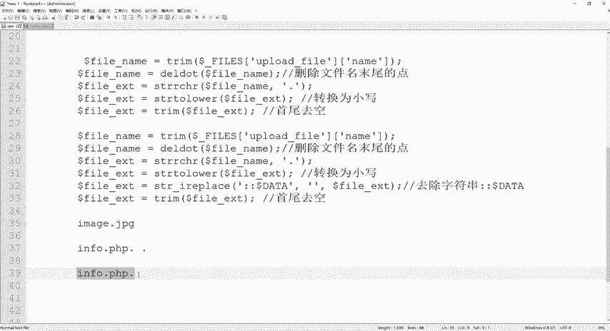

### 攻击步骤

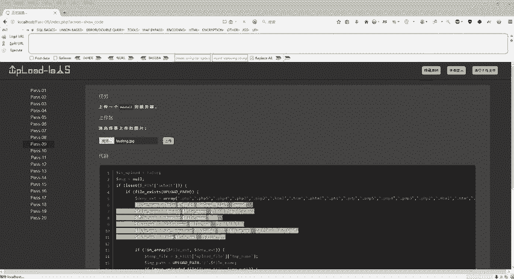

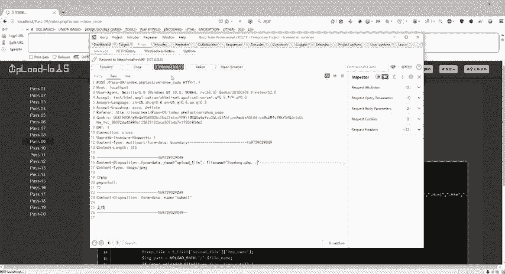

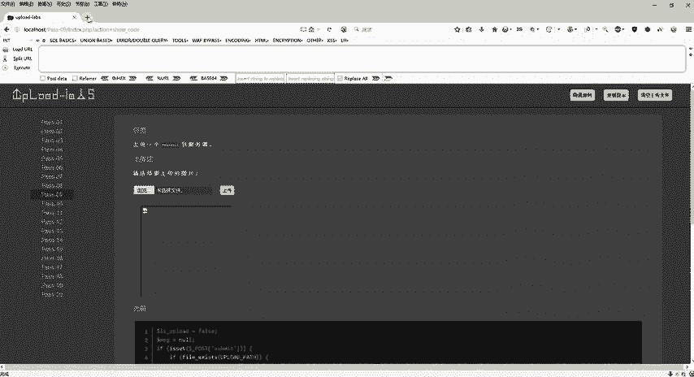

以下是利用此逻辑缺陷的具体操作：

1.  **准备文件**：同样准备一个内容为PHP Webshell的图片文件 `vuln.jpg`。
2.  **拦截并修改请求**：使用Burp Suite拦截上传请求，将文件名修改为 `shell.php. .`（注意点后面有空格）。
    ```http
    POST /upload HTTP/1.1
    ...
    Content-Disposition: form-data; name="file"; filename="shell.php. ."
    ```
3.  **放行请求并访问**：放行数据包，上传成功后，复制图像地址并访问，即可成功执行PHP代码。

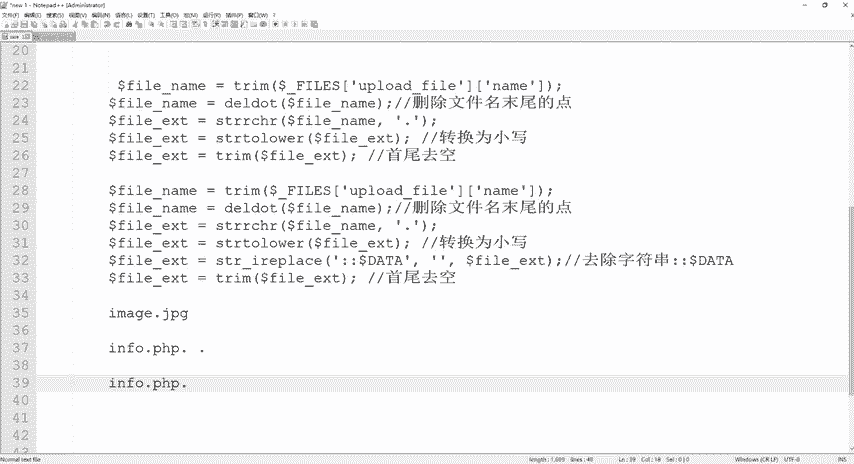

本节课中我们一起学习了CTF文件上传的两种进阶绕过技巧。在第八关，我们利用了Windows系统的 `::$DATA` 文件流特性来绕过后缀检查。在第九关，我们通过代码审计发现了逻辑缺陷，并利用函数处理顺序（先删点后去空）构造了特殊文件名 `shell.php. .`，最终使其被解析为可执行的 `shell.php`。这两关的核心在于深入理解系统特性和代码执行流程，从而找到突破点。