# CTF入门教学：P24：6、文件上传第十关至第十一关 🛡️

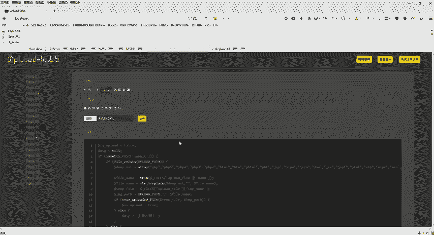

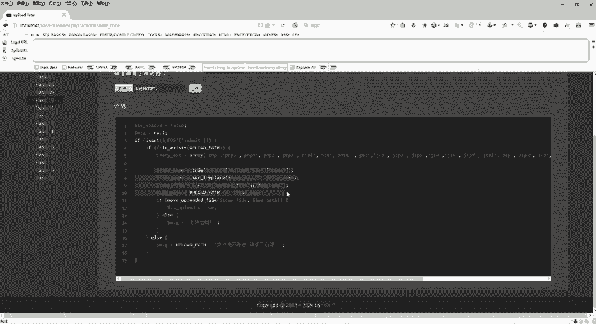

在本节课中，我们将学习CTF文件上传挑战中的第十关和第十一关。这两关分别涉及利用字符串替换函数和操作系统底层漏洞进行绕过。我们将详细分析源码逻辑，并演示具体的攻击步骤。

## 第十关：字符串替换绕过

上一节我们讨论了基于后缀名检查的绕过方法。本节中我们来看看第十关，它引入了新的防御机制。

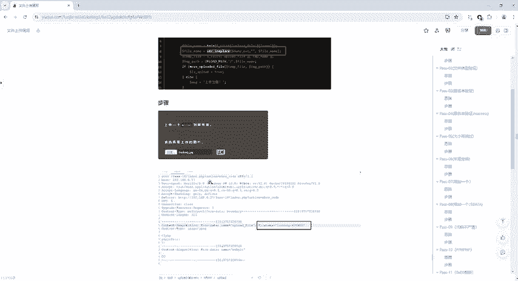

首先，我们查看第十关的源代码。关键部分在于使用了一个名为 `str_ireplace` 的函数。

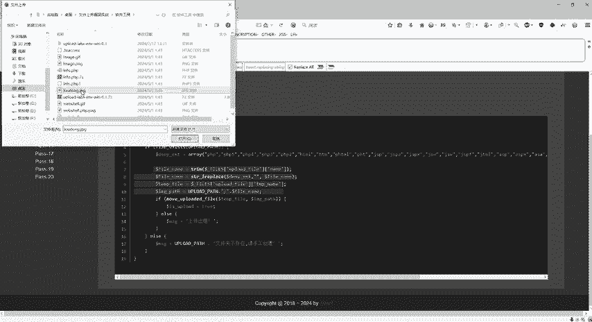

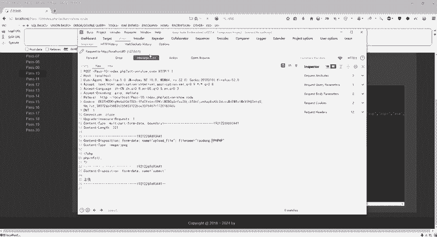

`str_ireplace` 是PHP中用于字符串替换的函数，其特点是不区分大小写。它的标准语法如下：
```php
str_ireplace($find, $replace, $string)
```
*   **`$find`**：必需，规定要查找的值。
*   **`$replace`**：必需，规定替换 `$find` 的值。
*   **`$string`**：必需，规定被搜索的字符串。

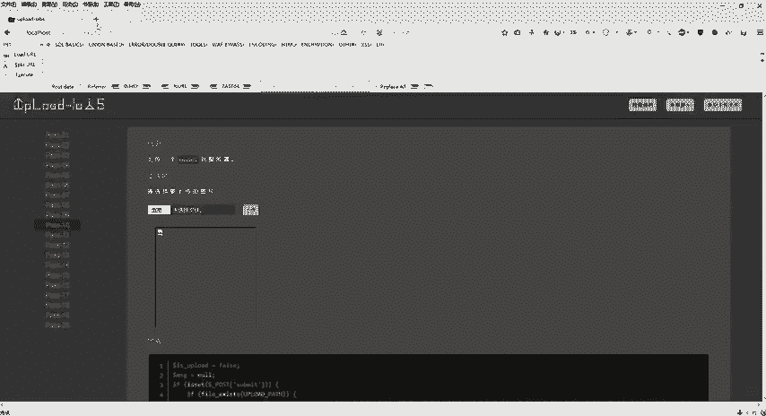

在第十关的代码中，该函数的作用是在文件名中查找一个黑名单列表（包含 `php`、`php5`、`php4` 等字符串），并将其替换为空字符串。

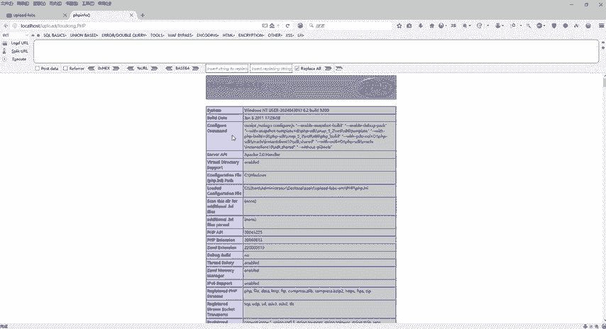

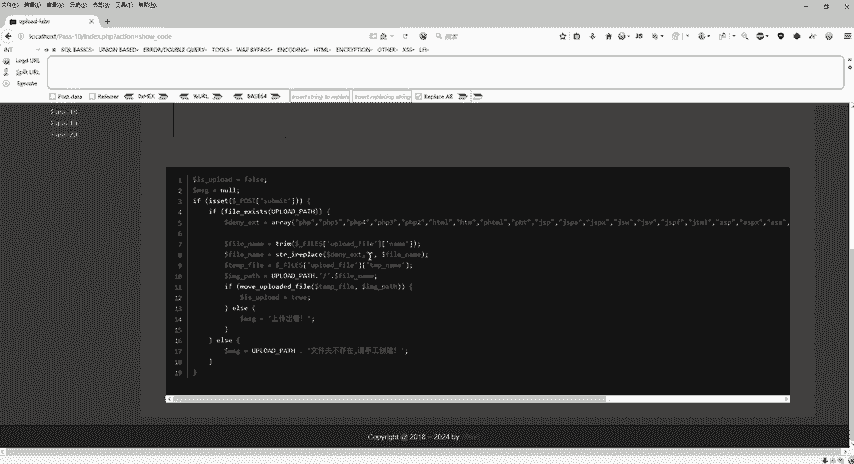

这意味着，如果上传的文件名中包含 `php`，该函数会将其删除。例如，文件名 `shell.php` 会被处理成 `shell.`。

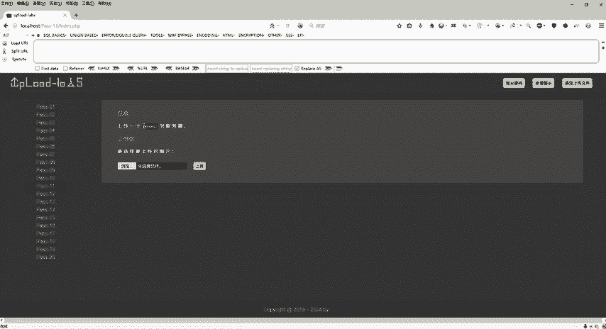

那么，如何绕过这种过滤呢？思路是构造一个文件名，使得在 `str_ireplace` 函数执行删除操作后，剩下的部分恰好能组成我们想要的后缀。

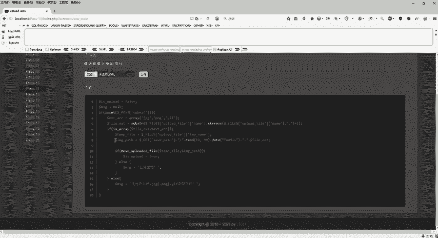

以下是具体的绕过步骤：

1.  使用Burp Suite拦截文件上传请求。
2.  在拦截到的请求中，找到文件名参数。
3.  将文件名修改为 `pphphp`（或 `PpHp` 等变体）。当 `str_ireplace` 函数查找并删除其中的 `php` 后，剩下的字符正好是 `php`。
4.  放行请求，完成上传。

访问上传后的文件地址，即可验证绕过成功。第十关的核心是通过构造 `pphphp` 这类文件名，利用字符串替换规则，最终得到有效的 `.php` 后缀。

## 第十一关：%00截断绕过

在掌握了字符串替换的绕过技巧后，我们进入更具挑战性的第十一关。这一关利用了操作系统底层的特性。

查看第十一关的源码，我们发现文件上传路径 `$save_path` 是一个可由用户控制的变量，但代码会在其后强制拼接一个后缀（如 `.jpg`）。同时，代码要求服务器配置中的 `magic_quotes_gpc` 选项为关闭状态（off）。

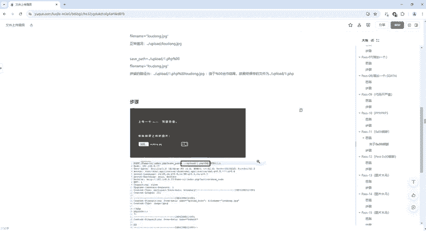

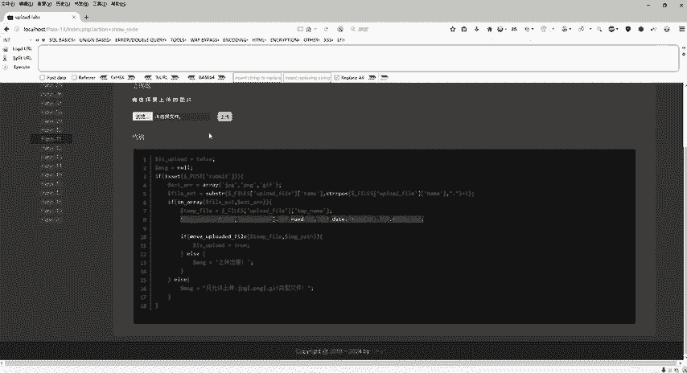

关键绕过思路是利用“%00截断”。%00代表ASCII码为0的字符（空字符），在C语言等底层语言中常作为字符串的结束标识符。当操作系统或某些处理函数遇到%00时，会认为字符串已经结束，其后的内容将被忽略。

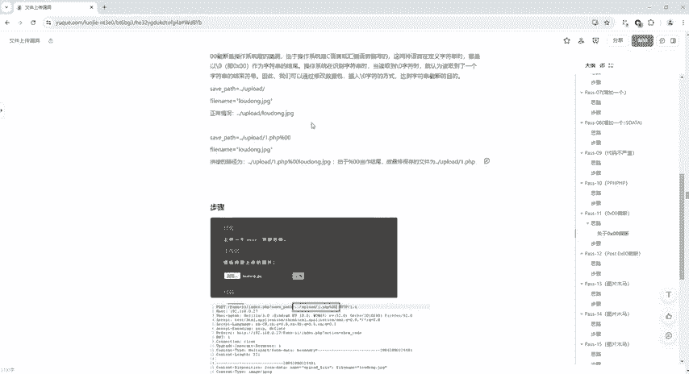

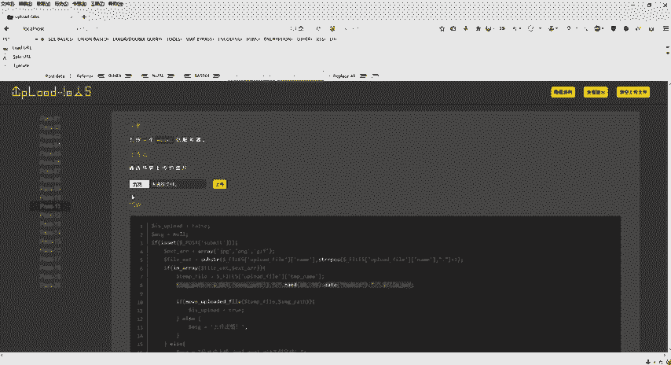

具体到本关：
*   正常上传路径可能是：`../upload/漏洞.jpg`
*   利用截断，我们构造路径为：`../upload/shell.php%00`
*   代码拼接后缀后，完整路径变为：`../upload/shell.php%00.jpg`
*   由于%00截断，系统实际保存的文件名是 `../upload/shell.php`，后面的 `.jpg` 被忽略。

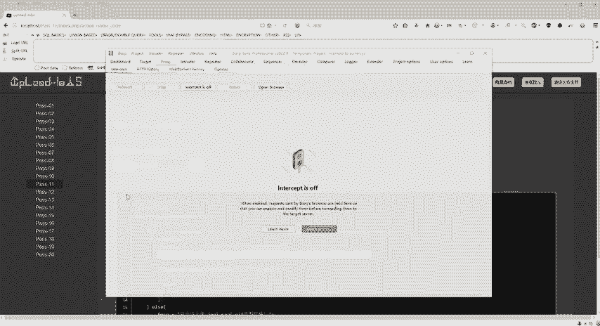

以下是利用%00截断的具体操作步骤：

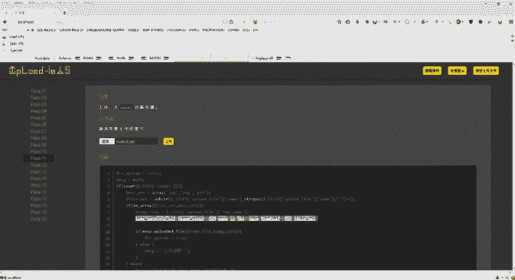

1.  确保PHP环境配置中 `magic_quotes_gpc` 为关闭状态。
2.  准备一个图片马（如 `shell.jpg`），用于通过前端检查。
3.  使用Burp Suite拦截上传请求。
4.  在请求中，找到文件路径或文件名参数（通常是 `save_path` 或 `filename`）。
5.  将其值修改为 `shell.php%00`（注意：在Burp Suite的Hex视图下，有时需要将 `%00` 直接替换为十六进制的 `00`）。
6.  放行请求。虽然返回的链接可能显示为 `xxx.php%00.jpg`，但实际在服务器上生成的文件是 `shell.php`。
7.  直接访问 `../upload/shell.php` 即可执行我们的恶意代码。

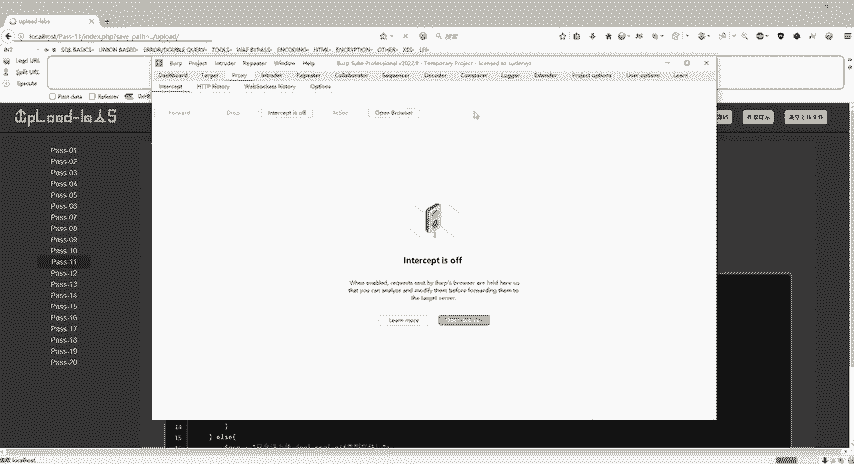

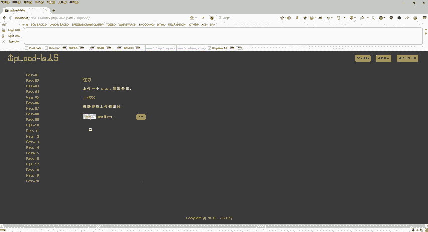

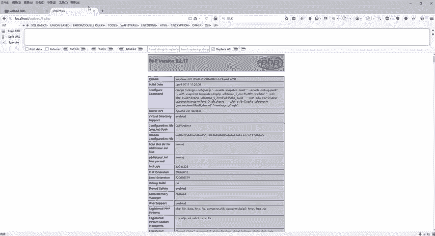

本节课中我们一起学习了CTF文件上传挑战的两种高级绕过技术。第十关利用 `str_ireplace` 函数不区分大小写和替换机制，通过精心构造文件名（如`pphphp`）实现绕过。第十一关则利用了操作系统底层的%00空字符截断漏洞，通过控制文件路径参数，使系统忽略强制添加的后缀，从而上传PHP文件。理解这些原理对于Web安全渗透测试至关重要。