# CTF入门教学：P25：7、文件上传第十二关至第十五关 🚩

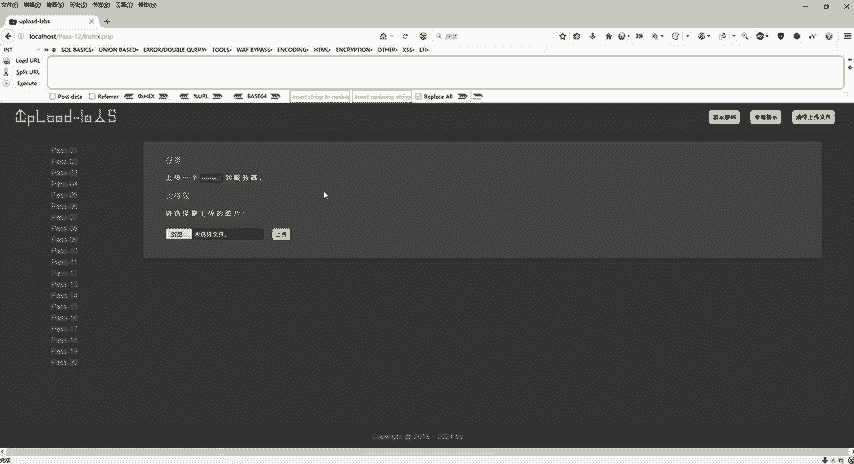

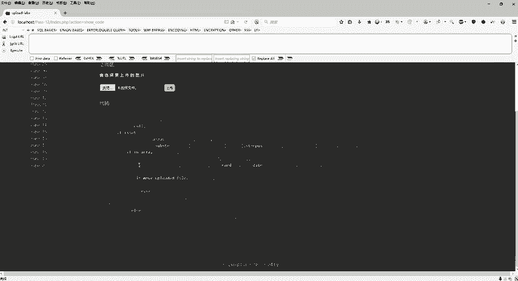

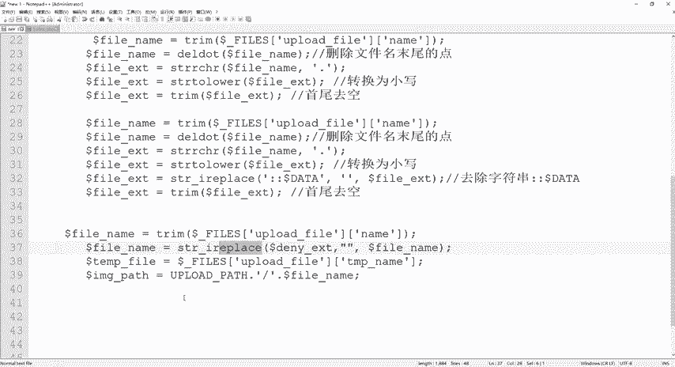

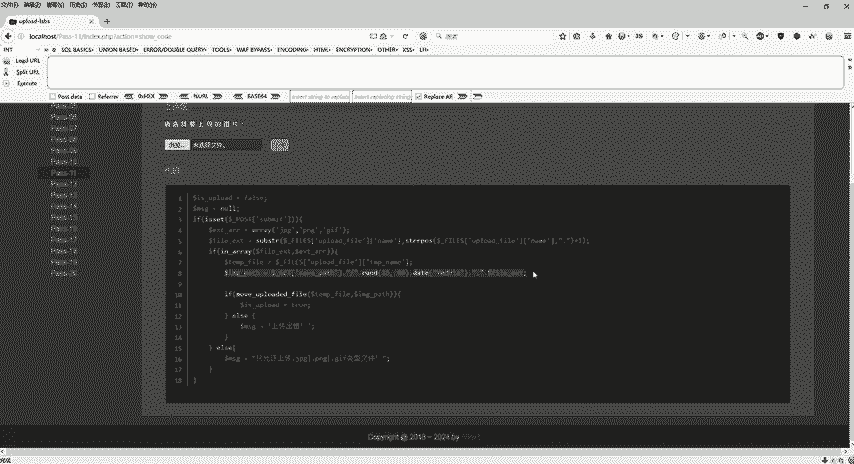

在本节课中，我们将学习CTF文件上传挑战的第十二关至第十五关。我们将重点分析POST请求下的截断攻击，以及如何利用图片木马结合文件包含漏洞绕过更严格的文件内容检查。

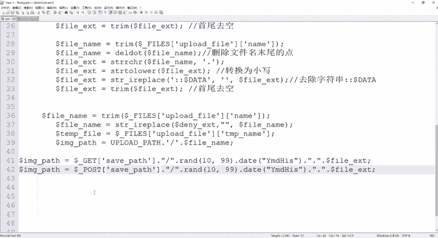

## 第十二关：POST请求下的截断攻击

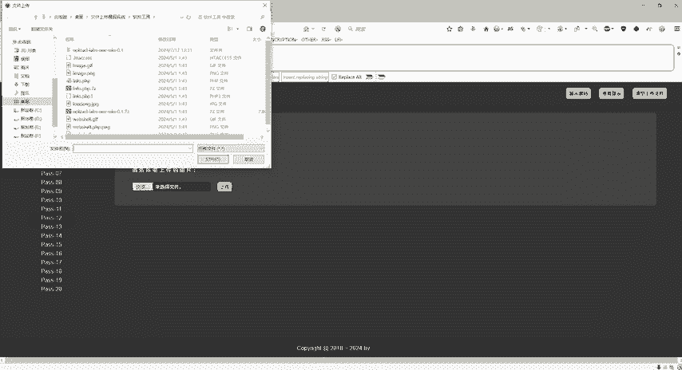

上一节我们介绍了GET请求下的截断攻击。本节中我们来看看当提交方式变为POST时，攻击方法有何不同。

首先，对比第十一关和第十二关的源码，核心区别在于参数传递方式：第十一关使用`$_GET`，而第十二关使用`$_POST`。这意味着第十二关同样可以利用`%00`进行截断攻击，但需要对Payload进行额外处理。

以下是利用Burp Suite进行POST截断攻击的步骤：

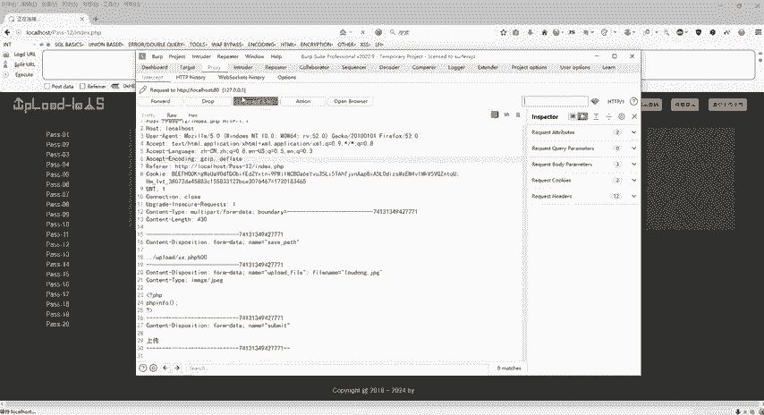

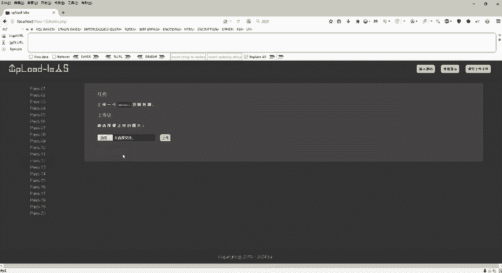

1.  正常上传文件并抓包。
2.  在Burp Suite的Repeater模块中，修改文件名，例如将`shell.php`改为`shell.php%00.jpg`。
3.  由于POST请求会对参数进行URL解码，我们需要手动对`%00`部分进行解码。在Burp Suite中，选中`%00`，右键选择 **`Convert selection`** -> **`URL`** -> **`URL-decode`**。
4.  解码后，`%00`将显示为空，点击发送请求即可完成攻击。

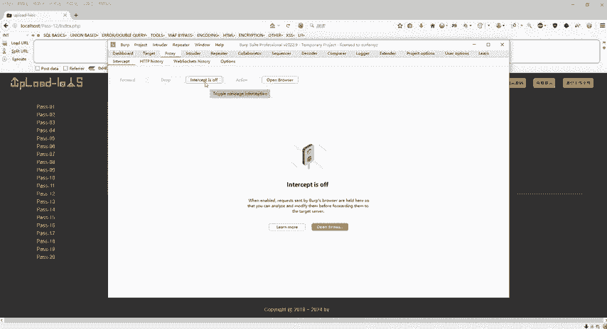

**核心操作代码（在Burp Suite中手动执行）：**
```
文件名：shell.php%00.jpg
操作：对 %00 进行 URL-decode
结果：shell.php .jpg
```

## 第十三关至第十五关：图片木马与文件包含

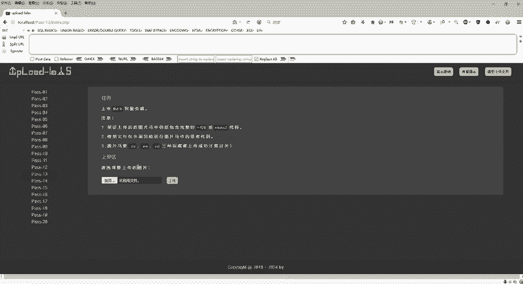

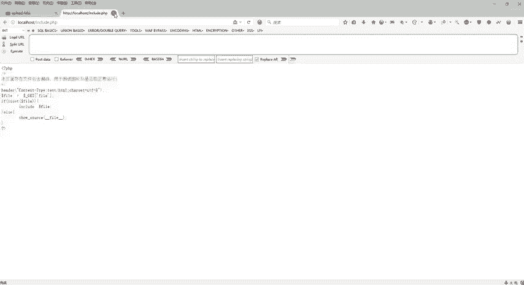

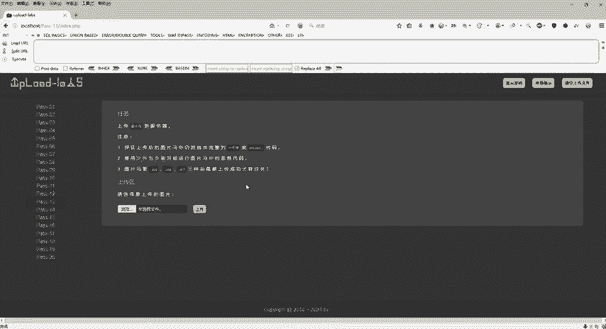

从第十三关开始，靶场引入了新的防御机制：检查文件内容而不仅仅是后缀名。同时，提供了一个文件包含漏洞（`include.php?file=`）用于验证上传的“图片”是否包含可执行的恶意代码。

这三关的绕过思路一致：制作一个既包含正常图片文件头、又包含PHP恶意代码的“图片木马”，然后利用文件包含漏洞执行其中的代码。

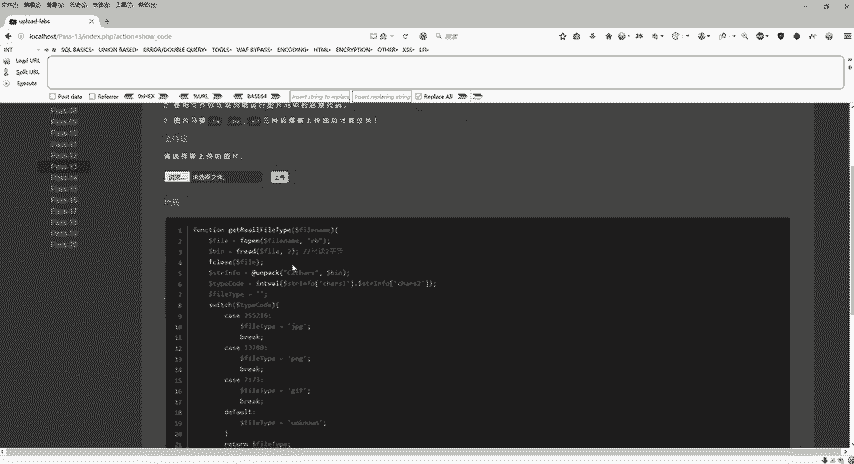

### 制作图片木马

我们可以使用系统命令将正常的图片与PHP Webshell合并。

**核心命令如下：**
```bash
copy /b normal.png + webshell.php merged.png
```
这条命令将`normal.png`和`webshell.php`二进制合并，生成一个新的`merged.png`文件。新文件保留了PNG的文件头特征，同时包含了PHP代码。

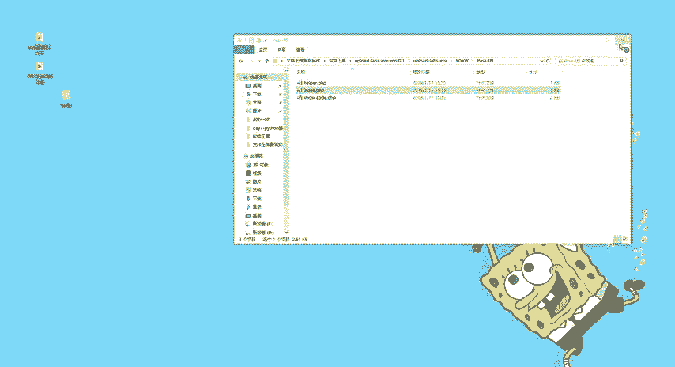

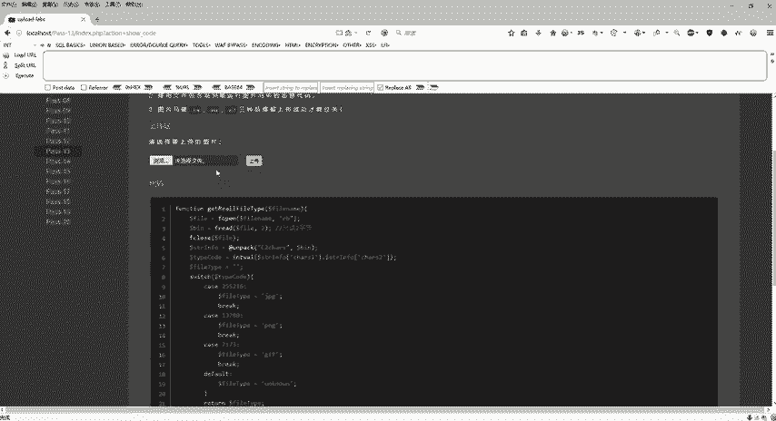

### 攻击流程

以下是利用图片木马和文件包含漏洞的攻击步骤：

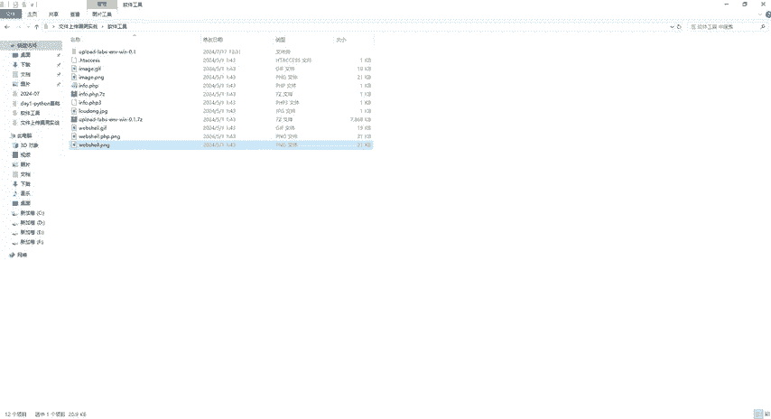

1.  **上传图片木马**：使用上述命令生成图片木马，在靶场上传该文件。
2.  **获取文件路径**：上传成功后，右键复制图片的访问地址。
3.  **利用文件包含漏洞执行**：访问文件包含页面，并通过参数指向我们上传的图片木马路径。例如：
    ```
    http://靶场地址/include.php?file=./upload/merged.png
    ```
4.  此时，文件包含漏洞会读取`merged.png`的内容并将其作为PHP代码执行，从而触发其中的Webshell。

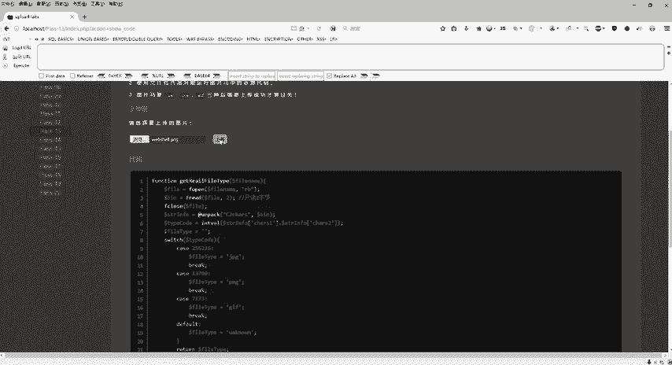

**核心概念公式：**
```
图片木马 = 合法图片文件头 + PHP恶意代码
成功利用 = 上传图片木马 + 文件包含漏洞触发
```

### 关卡实践

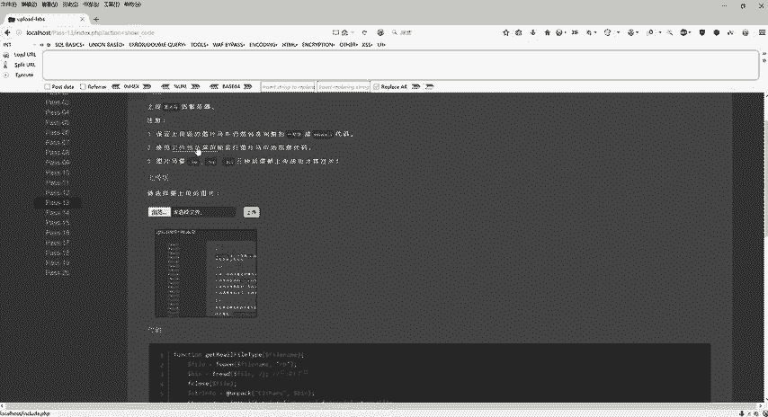

*   **第十三关**：按照上述流程，上传合并后的图片木马，并通过`include.php`页面成功执行其中的`phpinfo()`代码。
*   **第十四关**：防御机制与第十三关相同，重复上述攻击步骤即可绕过。
*   **第十五关**：防御机制依然相同，继续使用图片木马配合文件包含漏洞完成挑战。

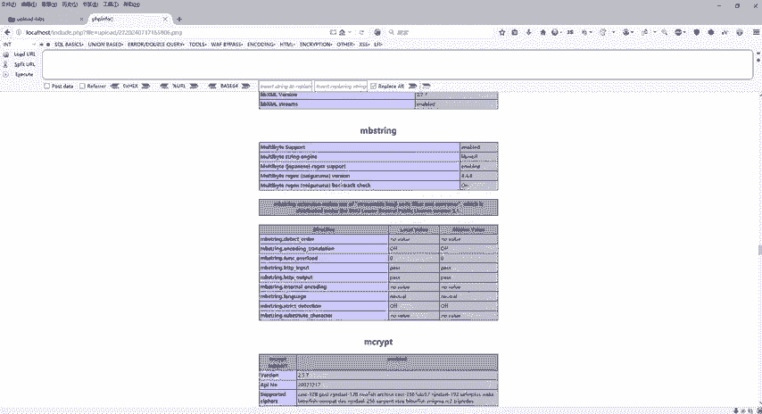

## 总结

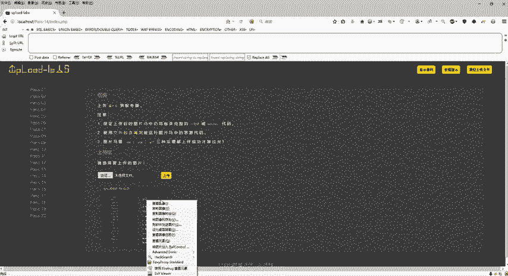

本节课中我们一起学习了CTF文件上传挑战的进阶技巧。

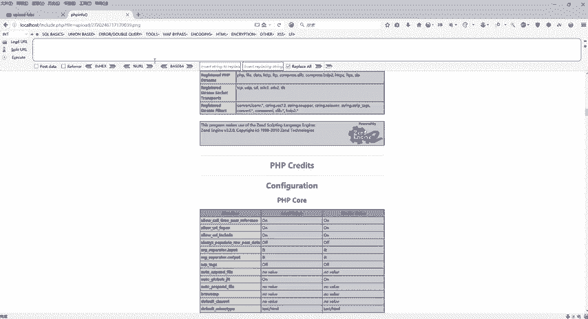

1.  在**第十二关**，我们掌握了在POST请求下进行截断攻击的方法，关键步骤是对`%00`进行URL解码。
2.  在**第十三关至第十五关**，我们学习了如何绕过文件内容检查。核心方法是制作**图片木马**，并利用靶场提供的**文件包含漏洞**来执行隐藏在图片中的恶意代码。

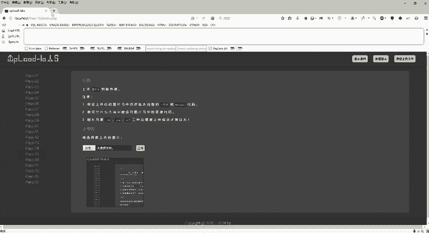

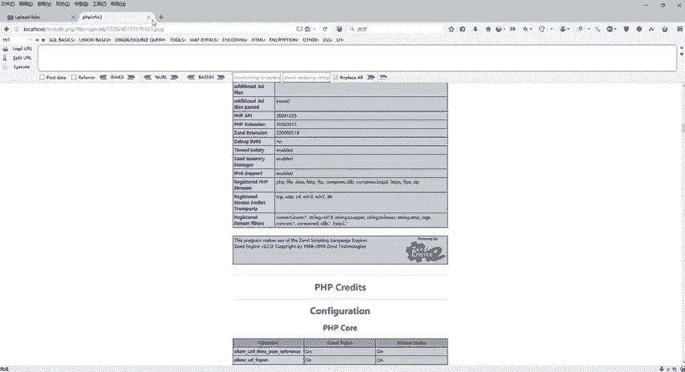

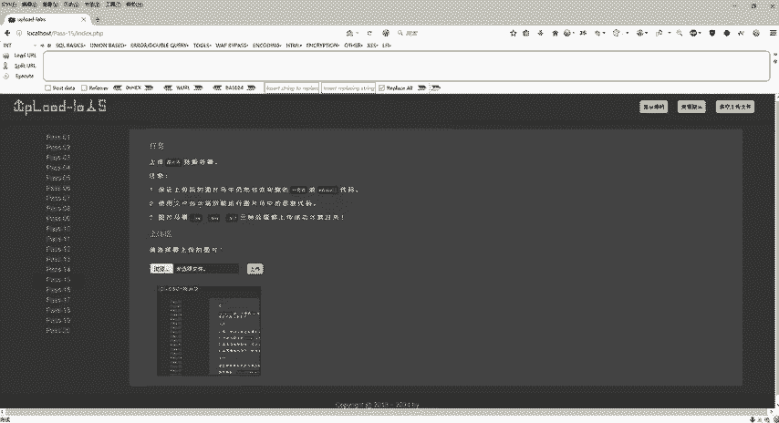

这些关卡展示了安全防护的层层深入（从检查后缀名到检查文件内容）以及攻击者相应的绕过策略（从截断攻击到多漏洞组合利用），对于理解文件上传漏洞的攻防对抗非常有帮助。