# CTF入门教学：P26：文件上传第十六关至第十七关 🚩

在本节课中，我们将学习CTF文件上传挑战中的两种高级绕过技术：**二次渲染绕过**与**条件竞争**。这两种技术是Web安全中常见的防御突破手段，理解它们有助于提升渗透测试能力。

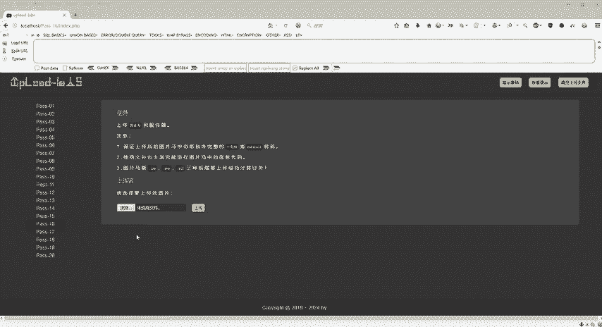

## 第十六关：二次渲染绕过 🖼️

上一节我们讨论了文件包含漏洞的利用。本节中我们来看看第十六关，它同样允许上传图片文件并利用文件包含漏洞执行恶意代码。但本关的核心防御机制是**二次渲染**。

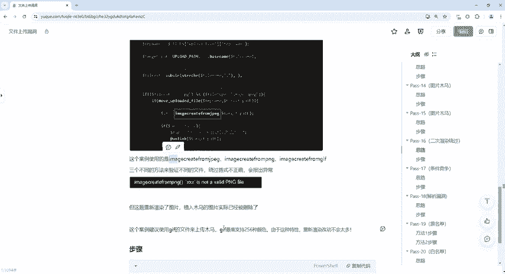

二次渲染是指服务器对上传的图片文件进行两次处理。第一次处理是常规的上传和保存，第二次处理则会重新生成图片文件。如果植入的恶意代码在第二次渲染后被修改或删除，攻击就会失败。

### 核心概念与步骤

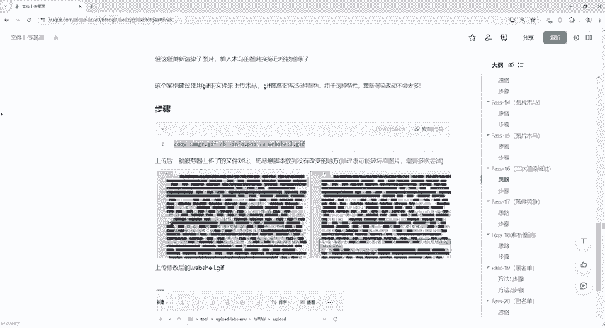

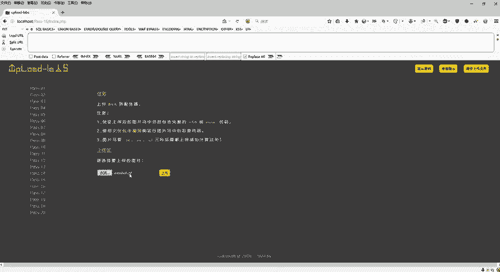

以下是利用GIF文件特性进行二次渲染绕过的步骤。由于GIF格式仅支持256种颜色，重新渲染时改动较少，因此更容易保留嵌入的恶意代码。

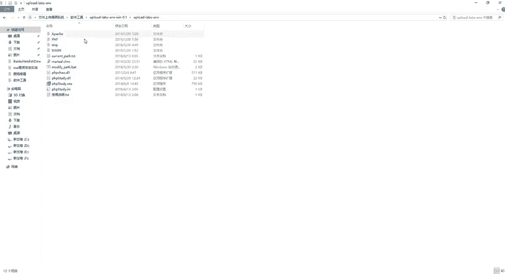

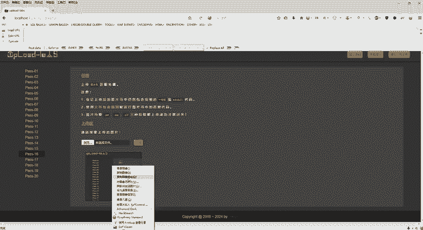

1.  **准备恶意GIF文件**：使用工具将一句话木马代码植入到GIF图片中未被改动的部分。关键代码如下：
    ```bash
    copy /b normal.gif + shell.php webshell.gif
    ```
    这条命令将`shell.php`的内容追加到`normal.gif`的末尾，生成一个包含恶意代码的`webshell.gif`文件。

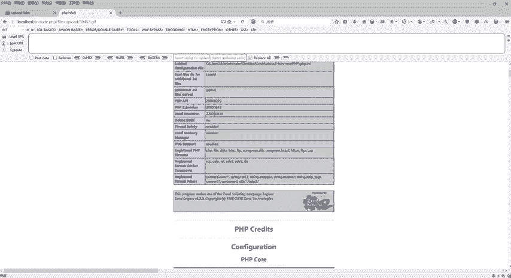

2.  **上传并获取地址**：将制作好的`webshell.gif`文件上传至靶场。上传成功后，右键复制图像的地址。

3.  **利用文件包含执行**：访问文件包含漏洞页面，在参数中拼接上传文件的路径。例如：
    ```
    http://target.com/include.php?file=upload/30453.gif
    ```
    如果绕过成功，页面将显示`GIF89a`等文件头信息，并执行嵌入的PHP代码。

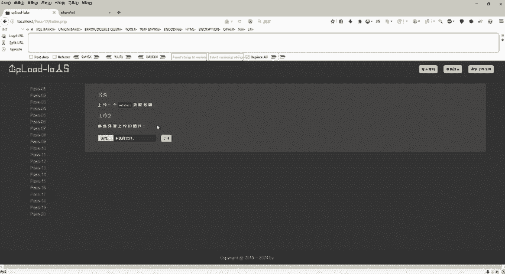

通过上述步骤，我们利用了服务器二次渲染时对GIF文件改动较小的特点，成功绕过了防御。

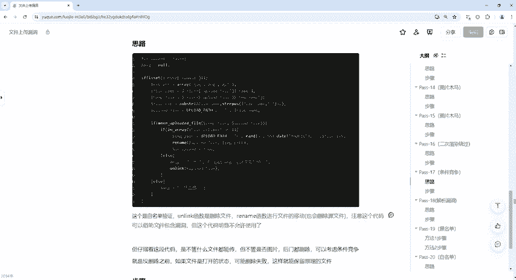

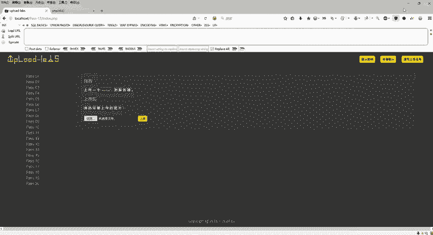

## 第十七关：条件竞争 ⏱️

在掌握了二次渲染技巧后，我们进入第十七关。本关移除了明显的文件包含漏洞入口，但引入了一个新的挑战：**条件竞争**。

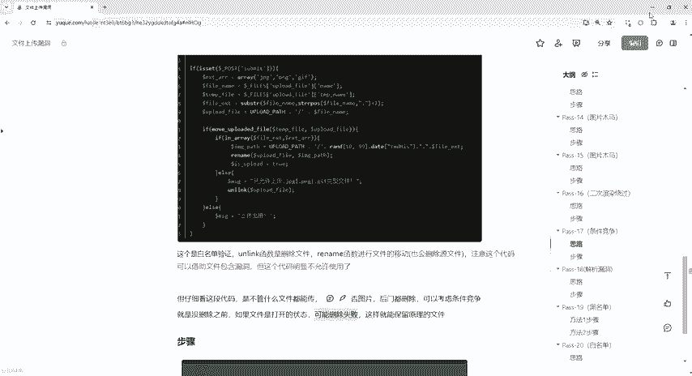

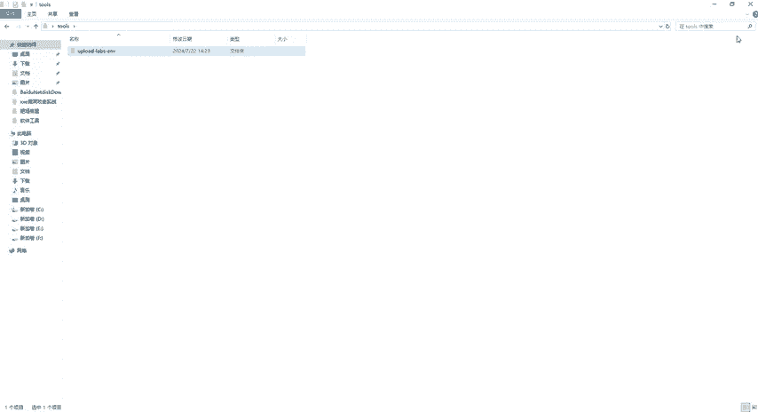

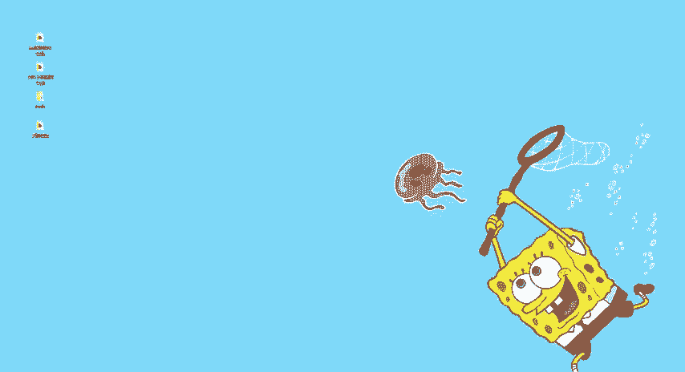

条件竞争是一种利用程序在处理多个请求时存在时间差而引发的漏洞。在本关中，服务器采用白名单验证，允许上传任意文件，但会立即使用`unlink()`或`rename()`函数删除非图片文件。我们的目标是在文件被删除前访问并执行它。

### 核心概念与攻击流程

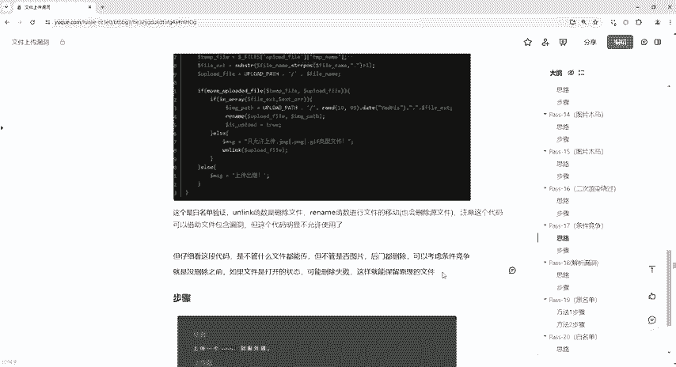

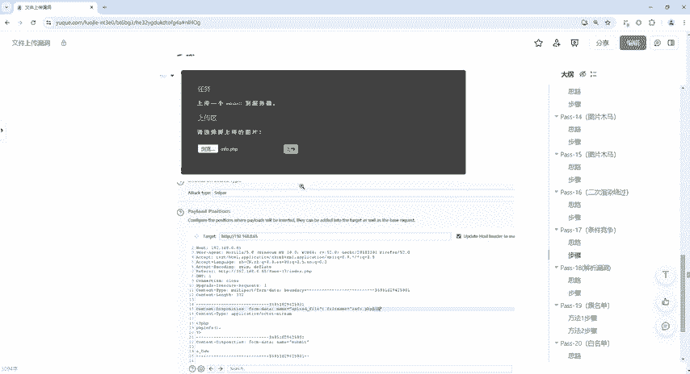

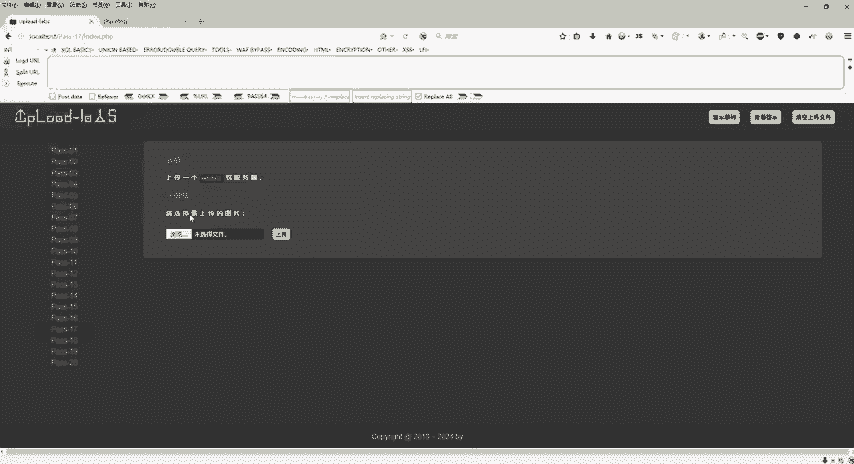

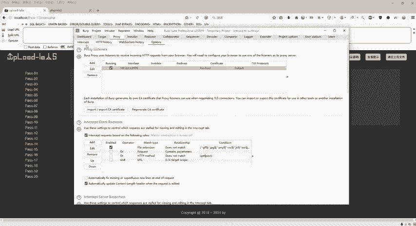

攻击的核心思路是：在上传恶意文件后，服务器删除操作完成前，通过高频率的并发访问“占用”该文件，使其无法被成功删除。

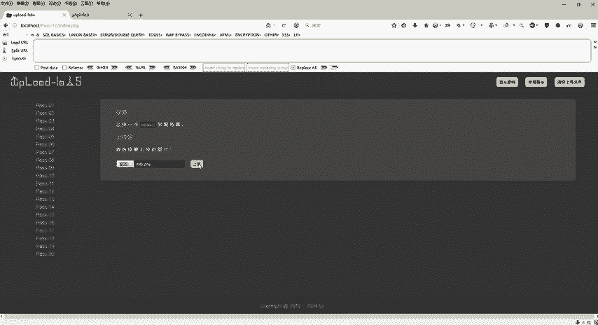

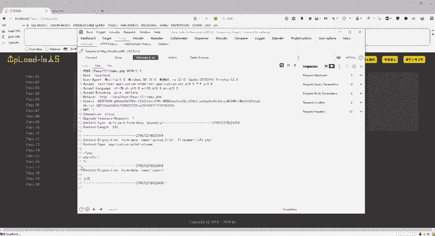

以下是利用Burp Suite进行条件竞争攻击的具体步骤：

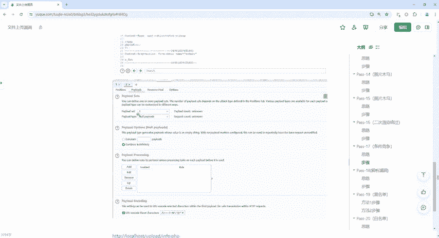

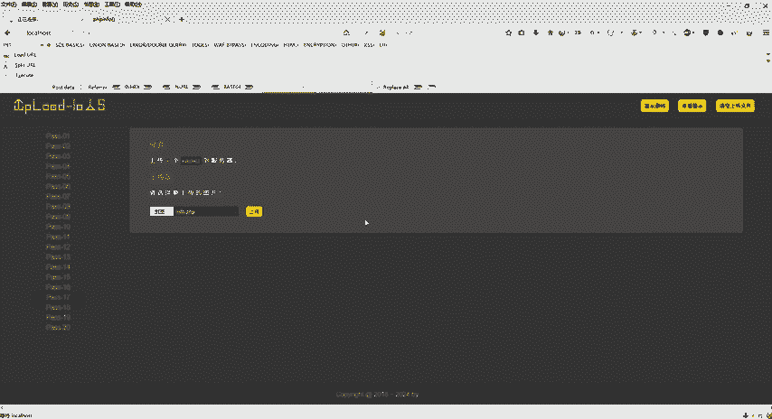

1.  **拦截上传请求**：配置浏览器代理，使用Burp Suite拦截上传`shell.php`文件的HTTP请求包。

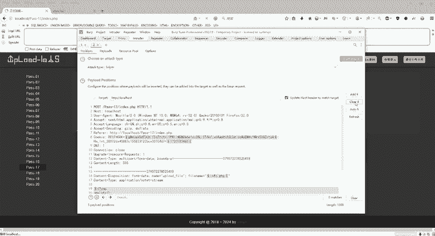

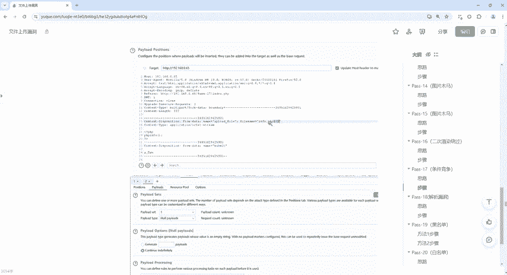

2.  **发送到Intruder模块**：将拦截到的请求发送到Burp Suite的Intruder（爆破）模块。

3.  **设置攻击载荷**：在Intruder模块中，清除所有载荷标记，然后在文件名（如`shell.php`）后添加一个`$`符号作为标记。选择载荷类型为“Null payloads”，并设置持续生成请求。

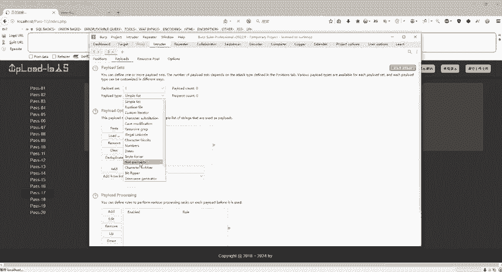

4.  **启动攻击并频繁访问**：开始Intruder攻击，它会持续向服务器发送上传请求。同时，在浏览器中高频刷新访问上传文件的地址（如`http://target.com/upload/shell.php`）。

5.  **竞争成功**：当某个时刻，访问请求抢在服务器删除操作之前到达时，恶意代码就会被执行，攻击成功。由于是竞争关系，可能需要多次尝试。

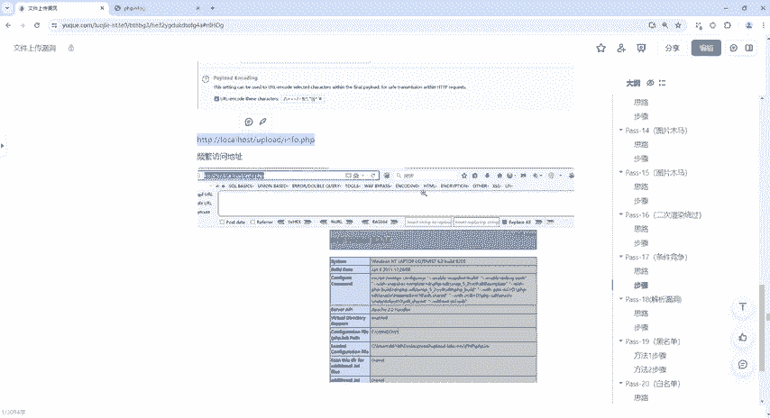

本节课中我们一起学习了两种高级的文件上传绕过技术。**二次渲染绕过**利用了图片处理过程的特性，而**条件竞争**则巧妙地利用了程序处理逻辑的时间差。理解这些原理对于深入Web安全领域至关重要。