# CTF入门教学：P27：9、文件上传第十八关

在本节课中，我们将要学习CTF文件上传挑战的第十八关。这一关的核心是利用Apache服务器的解析漏洞，结合条件竞争来绕过白名单限制，最终上传并执行PHP文件。

上一节我们介绍了利用条件竞争绕过文件重命名的方法，本节中我们来看看如何结合服务器解析漏洞来达成目标。

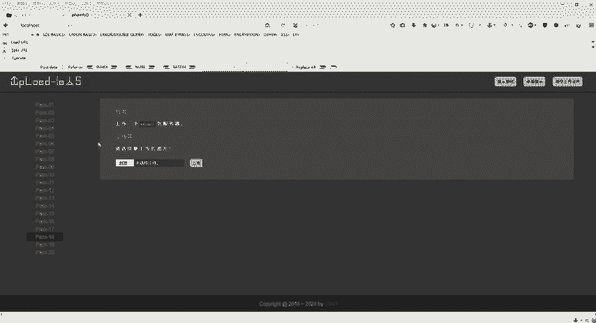

## 关卡概述

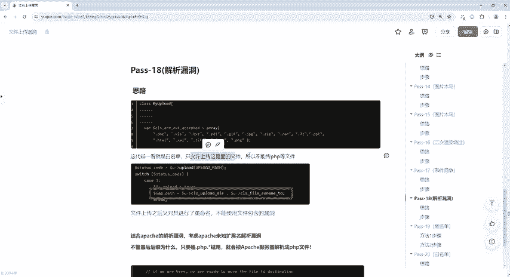

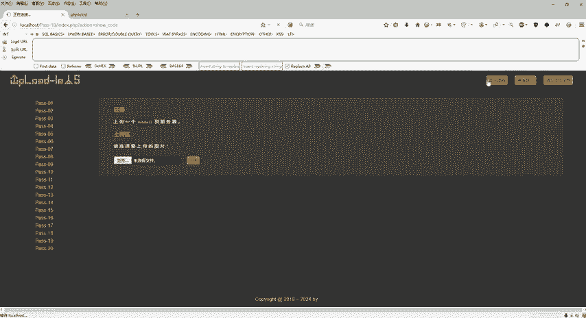

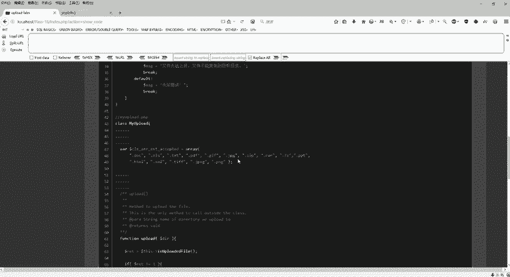

第十八关与第十七关类似，同样不允许直接上传PHP文件，并且禁用了文件包含漏洞的利用。关卡采用白名单机制，只允许上传特定扩展名的文件。文件上传后，服务器会尝试对其进行重命名。我们需要利用Apache服务器的解析漏洞和条件竞争来突破这些限制。

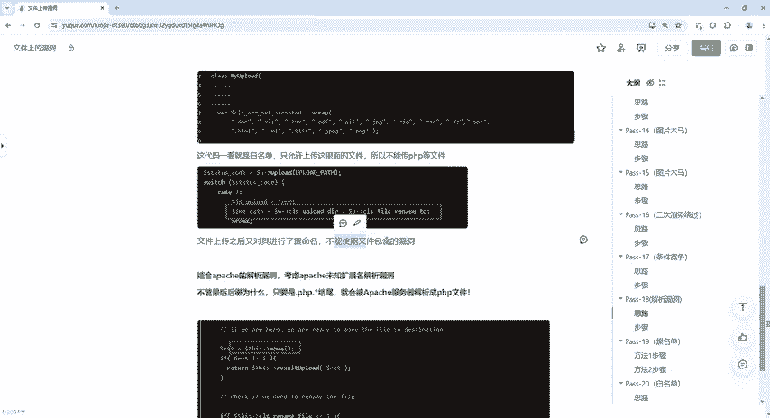

## 代码分析与限制

以下是关卡的核心限制逻辑：

1.  **白名单过滤**：服务器代码只允许上传列表内的文件类型。从代码片段可见，允许的扩展名包括 `.doc`, `.xltx` 等，但不包括 `.php`。
    ```php
    // 示例性代码，表示白名单逻辑
    $allowed_ext = array('jpg', 'png', 'gif', 'html', 'doc', 'xltx');
    if(!in_array($file_ext, $allowed_ext)) {
        die('文件类型不允许上传。');
    }
    ```
2.  **文件重命名**：上传成功后，文件会被重命名，这阻止了我们直接访问上传的原始文件。
3.  **禁用文件包含**：无法通过文件包含漏洞来执行非PHP文件中的代码。

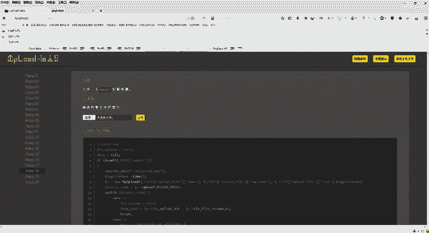

## 漏洞原理：Apache解析漏洞

本关的突破关键在于一个经典的Apache服务器解析漏洞。

**漏洞描述**：Apache 1.x 和 2.x 版本中存在一个特性，当遇到无法识别的扩展名时，它会从右向左尝试解析。例如，对于文件 `shell.php.xyz`，Apache 不认识 `.xyz` 扩展名，它会继续尝试将 `.php.xyz` 整体视为扩展名，最终将文件解析为PHP文件并执行其中的代码。

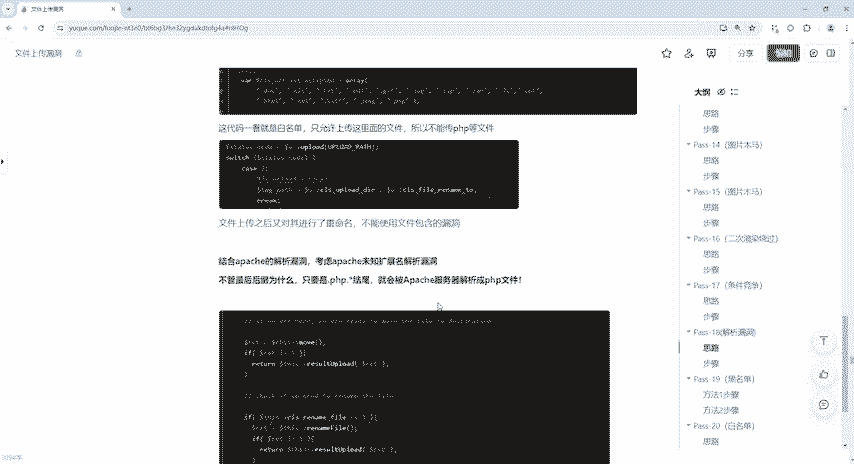

**核心公式**：
`文件名.php.未知扩展名` → 被Apache解析为 **PHP文件**。

在我们的挑战环境中，可以利用此漏洞。即使白名单不允许 `.php`，但如果我们上传一个名为 `shell.php.7z` 的文件，Apache 服务器可能不认识 `.7z`，从而将文件作为 `shell.php` 来解析执行。

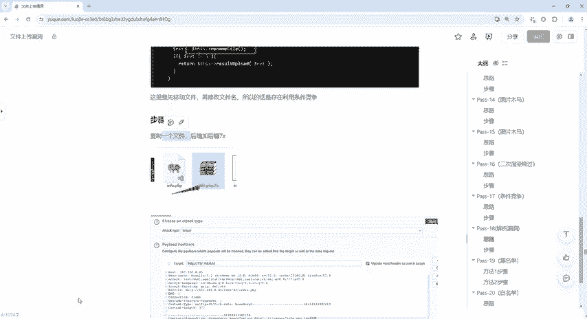

## 利用步骤详解

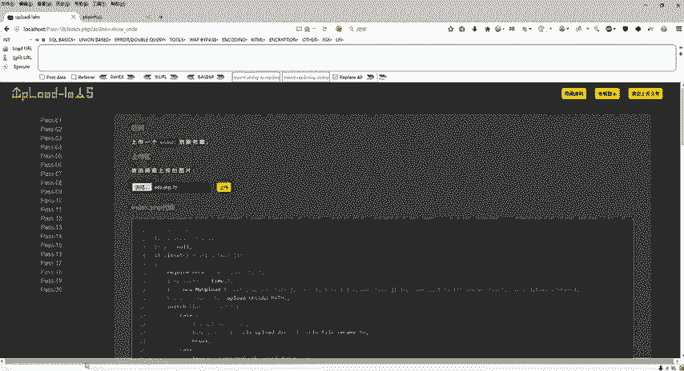

以下是结合条件竞争与解析漏洞的完整攻击流程。

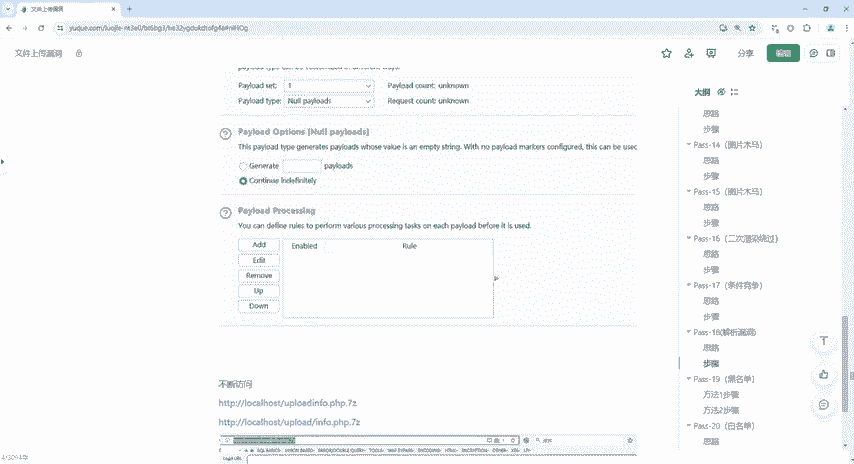

### 第一步：准备攻击文件

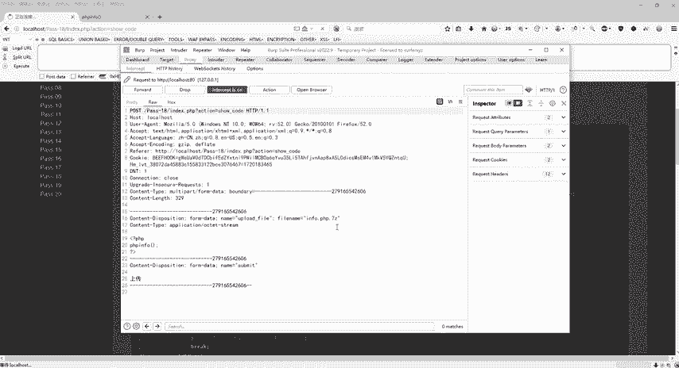

创建一个PHP Webshell文件，并将其命名为可利用解析漏洞的形式，例如 `info.php.7z`。文件内容为：
```php
<?php @eval($_POST['cmd']); ?>
```

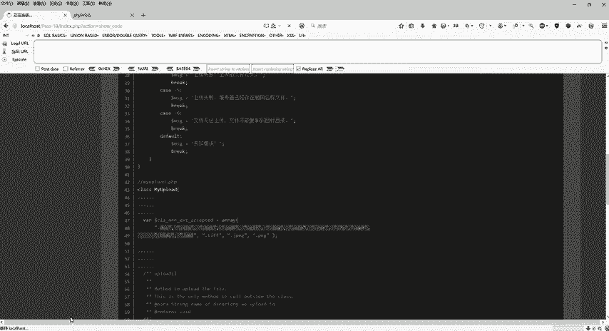

### 第二步：上传并拦截请求

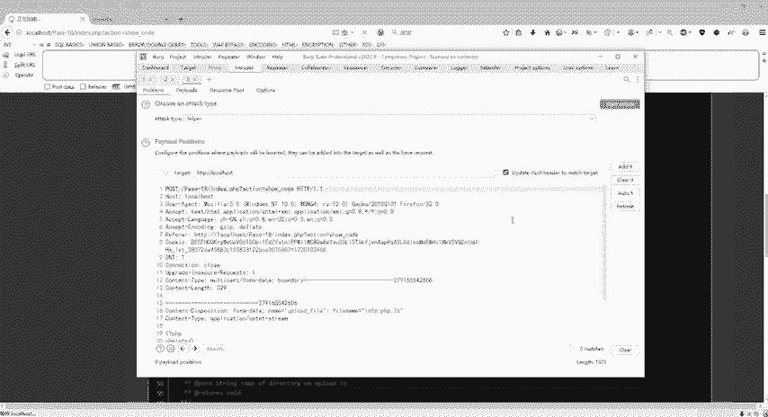

1.  在关卡页面选择准备好的 `info.php.7z` 文件进行上传。
2.  使用Burp Suite等工具拦截上传请求数据包。

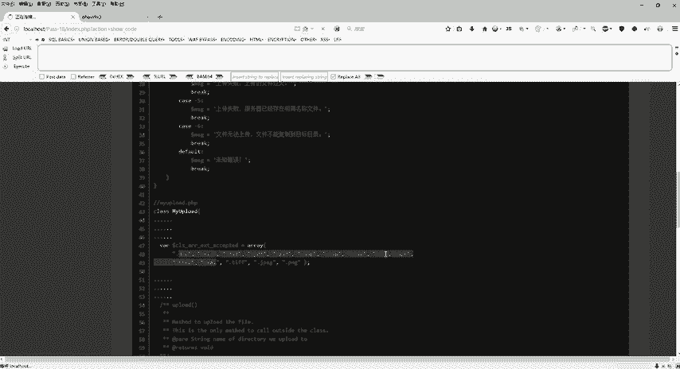

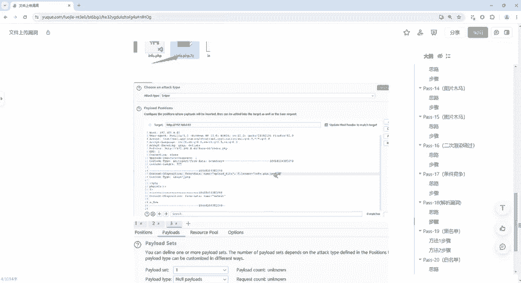

### 第三步：利用条件竞争进行爆破

这是攻击的关键环节，目的是在服务器完成重命名操作前，访问到原始上传的文件。

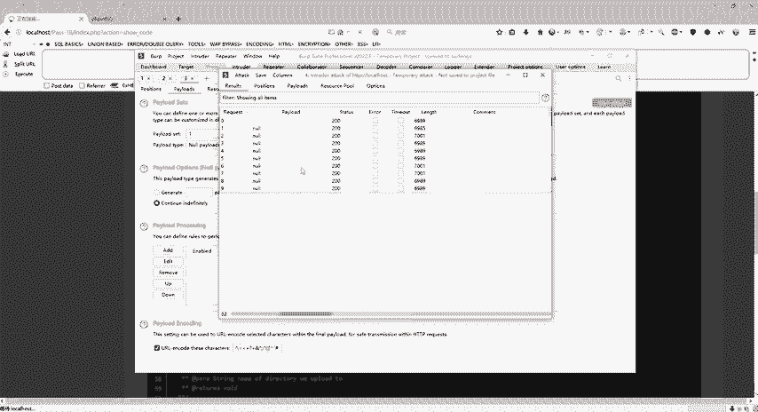

1.  将拦截到的上传请求发送到Burp Suite的Intruder模块。
2.  在Intruder中，需要修改文件名部分以触发解析漏洞。通常需要**在文件名末尾添加一个空格**，然后加上 `::$DATA`（Windows文件流特性），以尝试绕过某些检查。
    *   **攻击位置**：将请求包中文件名（如 `info.php.7z`）的末尾设置为攻击载荷（Payload）位置。
    *   **载荷设置**：选择 `Null payloads` 类型，并设置一个较大的重复次数（例如1000次），目的是快速、连续地重复发送上传请求。

### 第四步：竞争访问文件

在Intruder攻击运行期间，我们需要争分夺秒地尝试访问上传的文件。

1.  确定文件上传的目录。根据提示，通常是 `/upload/` 或 `/www/upload/` 目录。
2.  在浏览器中快速、反复地访问可能存在文件的URL，例如：
    *   `http://靶场地址/upload/info.php.7z`
    *   `http://靶场地址/www/upload/info.php.7z`
3.  由于条件竞争，在服务器尚未将 `info.php.7z` 重命名之前，我们的某次访问可能会命中该文件。此时，Apache服务器会因其解析漏洞，将 `info.php.7z` 当作PHP文件执行。
4.  如果看到空白页或没有错误提示，可能意味着PHP已执行。此时可以用中国菜刀或蚁剑等工具，尝试连接 `http://靶场地址/upload/info.php.7z`，密码为 `cmd`，以验证是否成功获取Webshell。

## 核心要点总结

本节课中我们一起学习了文件上传第十八关的解法。

1.  **关卡限制**：白名单过滤、文件重命名、禁用文件包含。
2.  **利用漏洞**：主要依赖 **Apache解析漏洞**（`文件名.php.未知扩展名`）。
3.  **攻击手法**：结合**条件竞争**，在文件被重命名前，利用解析漏洞访问并执行上传的恶意文件。
4.  **关键步骤**：制作特殊后缀的Webshell -> 上传并拦截 -> 使用Intruder进行高频重放 -> 竞争访问目标路径。

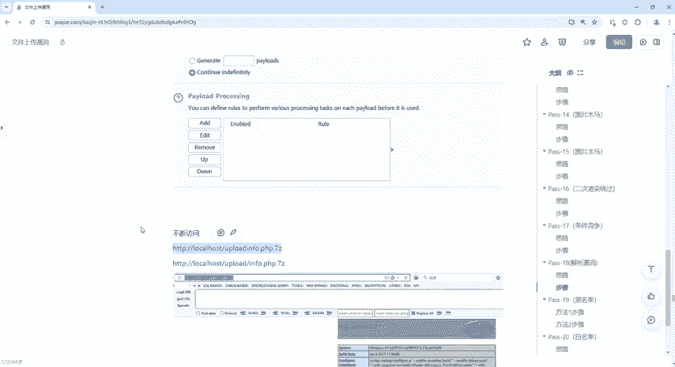

这一关融合了多种技巧，是理解文件上传漏洞复杂利用场景的经典案例。掌握解析漏洞和条件竞争的组合利用，对解决实际CTF题目至关重要。