CTF入门教学：P28：10、文件上传第十九关 🚩

在本节课中，我们将要学习CTF文件上传挑战的第十九关。这一关的核心是绕过服务器的黑名单检测机制，通过控制上传文件的保存名称来执行恶意代码。我们将探讨两种具体的绕过方法：空字节截断和路径拼接。

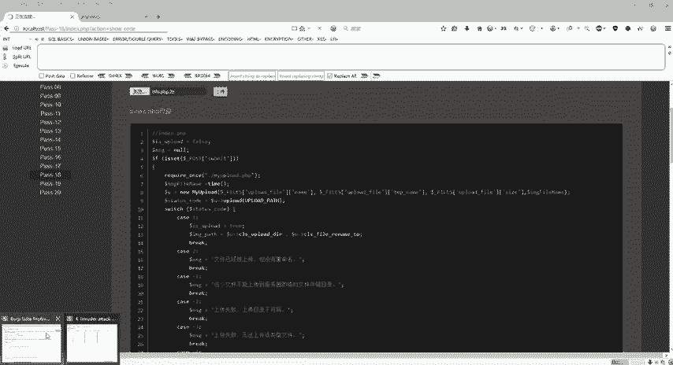

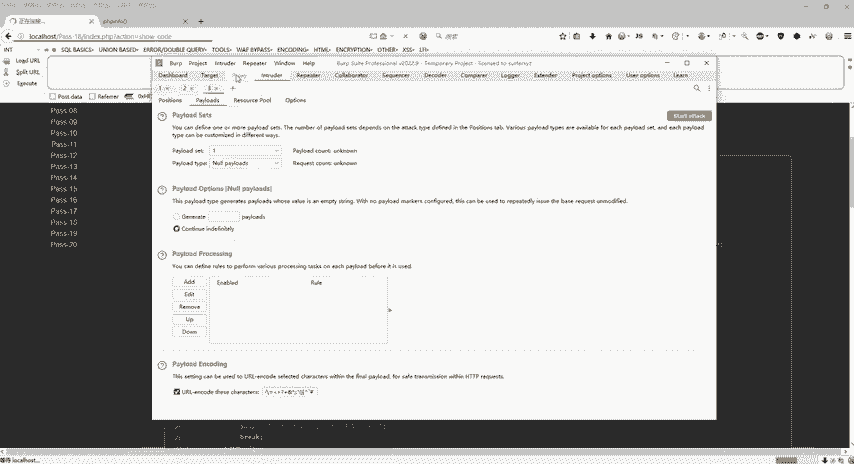

---

### 环境准备与问题分析

上一节我们介绍了文件上传的基本流程，本节中我们来看看第十九关的具体设置。首先，需要停止任何正在进行的爆破或拦截工具，以确保能正常访问挑战页面。

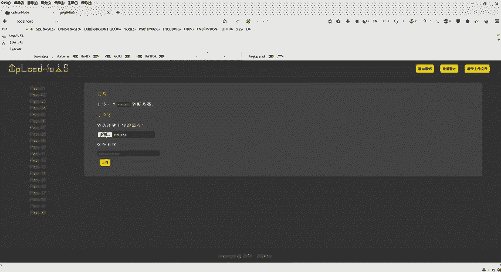

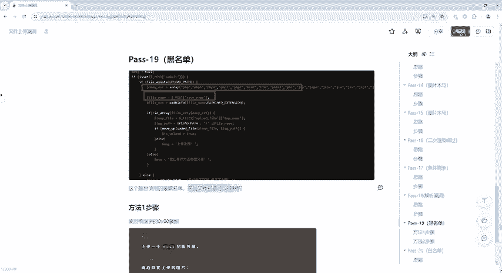

关闭拦截工具后，访问第十九关。页面提示将文件上传到服务器，但无论上传什么文件，服务器保存的名称都是固定的，例如 `upload-19.jpg`。

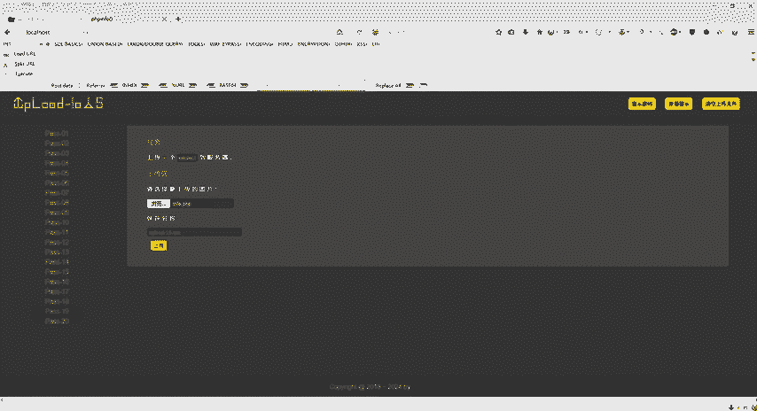

通过分析页面代码可知，本关使用了黑名单机制，禁止上传如 `.php`、`.asp` 等特定后缀的文件。然而，关键点在于上传后文件的保存名称是可以通过POST请求控制的。

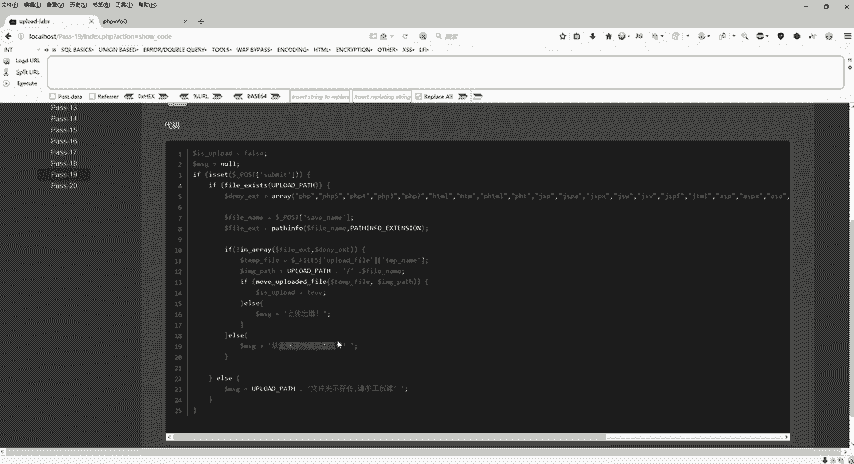

```php
// 示例代码逻辑：从POST请求中获取用户指定的文件名
$save_name = $_POST['filename'];
// 然后进行黑名单检查
```

这意味着，虽然直接上传 `.php` 文件会被阻止，但我们可以尝试在上传过程中修改最终保存的文件名来绕过检查。

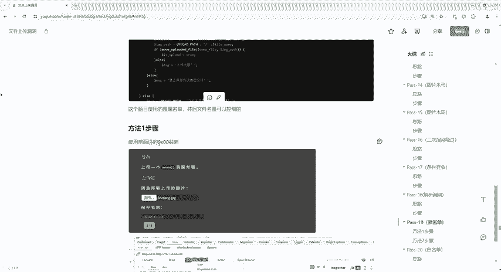

---

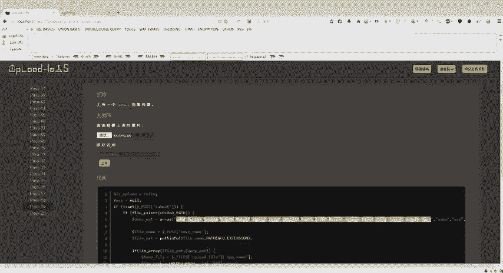

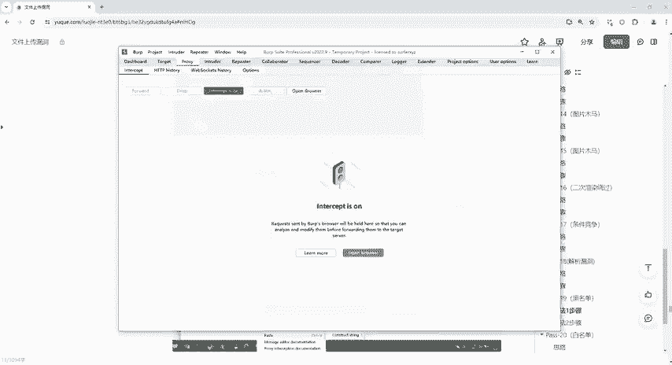

### 方法一：空字节截断绕过

第一种绕过思路是利用空字节截断。其原理是，在某些旧版PHP环境中，字符串中的空字节（`%00`）会终止字符串处理，导致其后的内容被忽略。

以下是操作步骤：

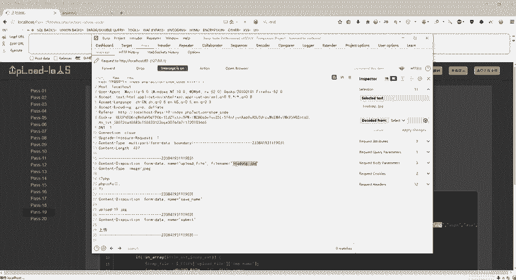

1.  选择上传一个内容为PHP代码但后缀为 `.jpg` 的文件（例如 `shell.jpg`）。
2.  开启抓包工具（如Burp Suite），拦截上传请求。
3.  在拦截到的POST请求中，找到控制文件名的参数（例如 `filename`）。
4.  将参数值修改为 `upload-19.php%00.jpg`。这里的 `%00` 就是空字节的URL编码形式。
5.  由于是POST请求，需要对整个参数值进行URL编码。在Burp Suite中可右键选择 **`Convert Selection` -> `URL` -> `URL-encode`**。
6.  发送修改后的请求。服务器在保存时，遇到 `%00` 会认为文件名在 `.php` 处结束，从而将文件保存为 `upload-19.php`。

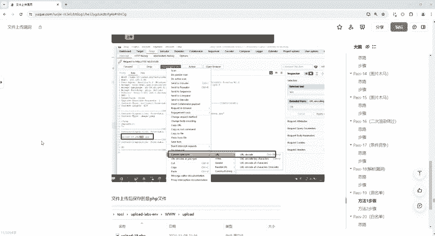

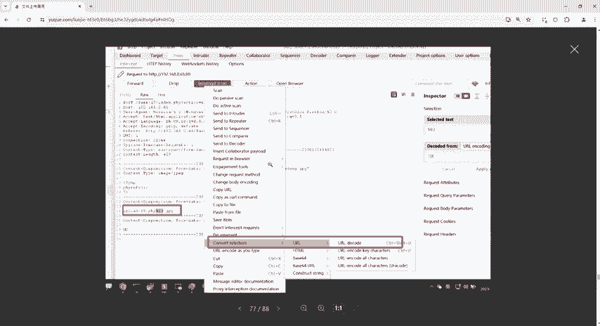

**核心公式**：`最终文件名 = 指定文件名(如：upload-19.php) + 空字节(%00) + 被忽略的后缀(如：.jpg)`

操作成功后，访问保存的文件路径即可执行其中的PHP代码。

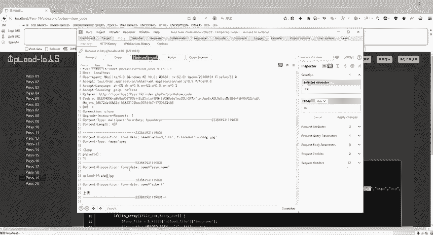

---

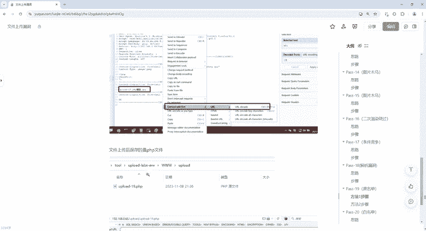

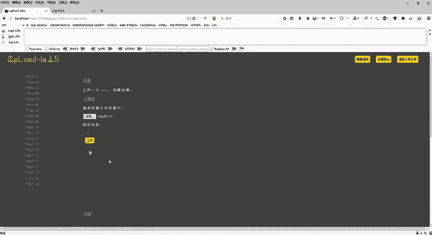

### 方法二：路径拼接绕过

如果空字节截断无效，可以尝试第二种方法：路径拼接。通过分析服务器拼接文件路径的代码，我们发现可能存在缺陷。

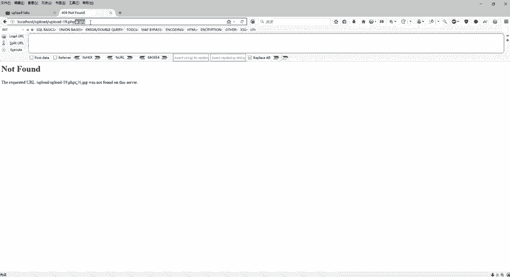

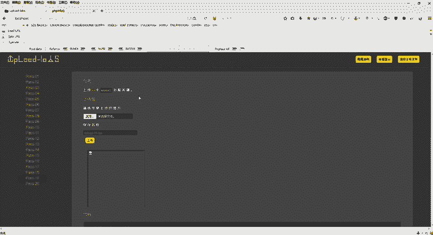

以下是操作步骤：

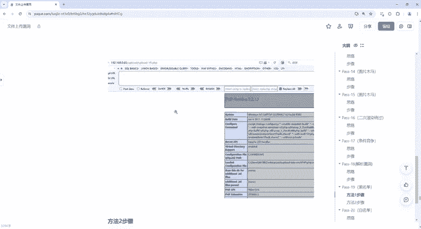

1.  同样，准备一个内容为PHP代码的 `.jpg` 文件并拦截上传请求。
2.  在文件名参数中，不直接指定 `upload-19.php`，而是指定 `upload-19.php/.`（注意是英文符号）。
3.  原理是：服务器代码可能将上传路径与文件名简单拼接，如 `$path . $filename`。当我们提交 `upload-19.php/.` 时，拼接后的路径可能形如 `/upload/path/upload-19.php/.`。
4.  在许多文件系统中，路径末尾的 `/.` 是没有实际意义的，系统在处理时会将其规范化，最终访问的文件就是 `upload-19.php`。

**核心逻辑**：利用文件系统路径解析规则，使服务器保存的文件名有效部分为 `.php` 后缀。

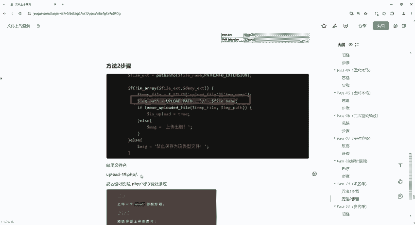

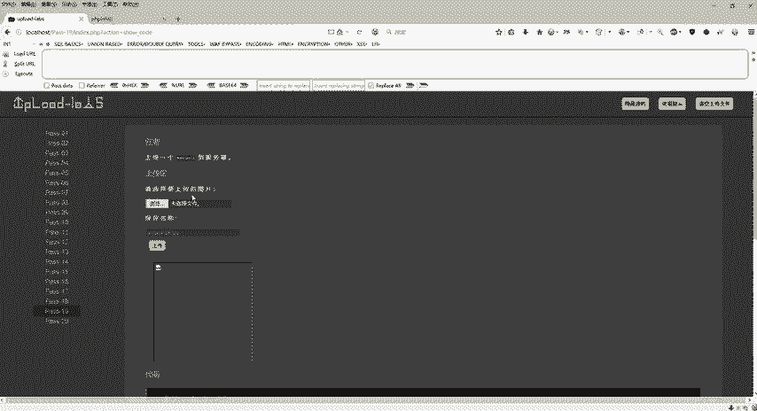

发送修改后的请求，上传成功后，访问文件路径，同样可以执行PHP代码。

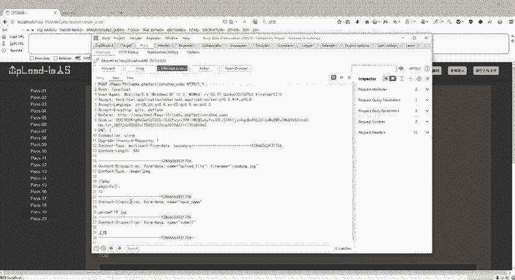

---

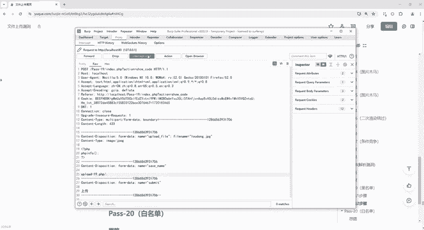

### 总结

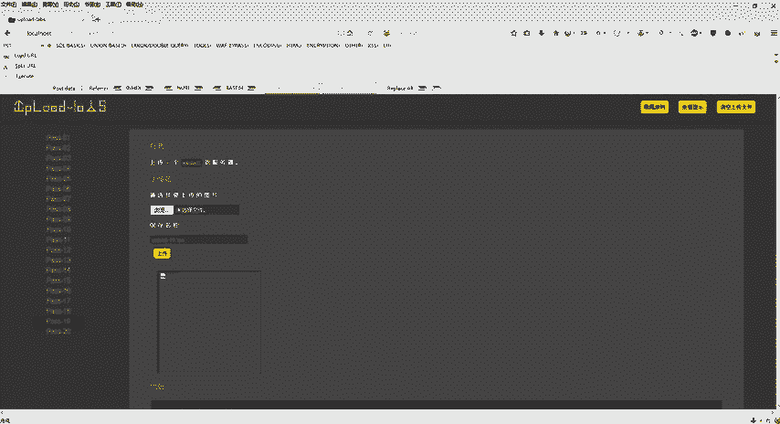

本节课中我们一起学习了CTF文件上传第十九关的两种绕过方法。
1.  **空字节截断**：利用 `%00` 截断文件名，使黑名单检查失效。
2.  **路径拼接**：通过提交包含 `/.` 的特殊文件名，利用文件系统路径解析特性，实现后缀绕过。

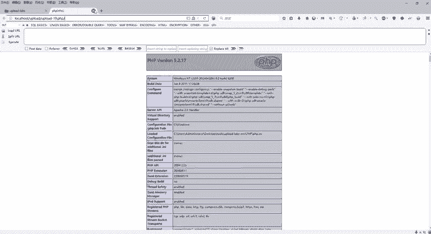

这两种方法的核心都是**控制服务器最终保存的文件名**，从而绕过对文件内容的直接检查。理解服务器如何处理和拼接用户输入的文件名，是解决此类文件上传漏洞的关键。