# CTF入门教学：P29：11、文件上传第二十关 🏁

在本节课中，我们将要学习CTF文件上传挑战的第二十关，也是本系列的最后一关。这一关的核心是利用PHP数组的特性来绕过白名单检查，实现上传PHP文件的目标。我们将通过分析源码、理解逻辑并动手实践来完成挑战。

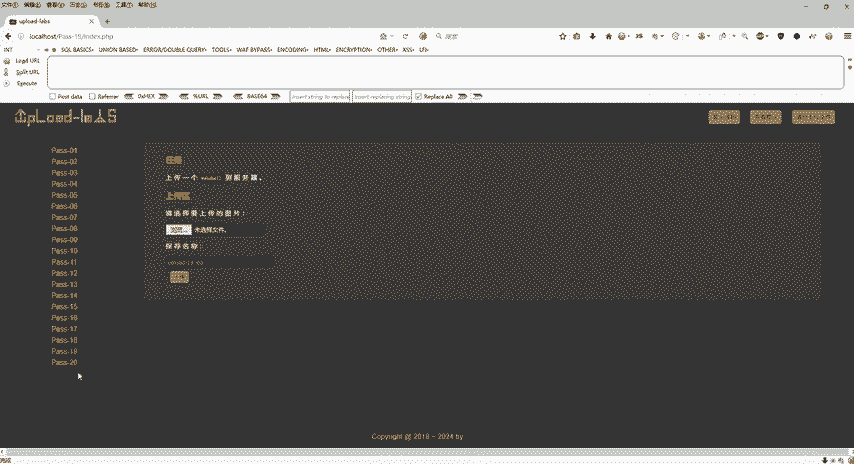

## 关卡概述

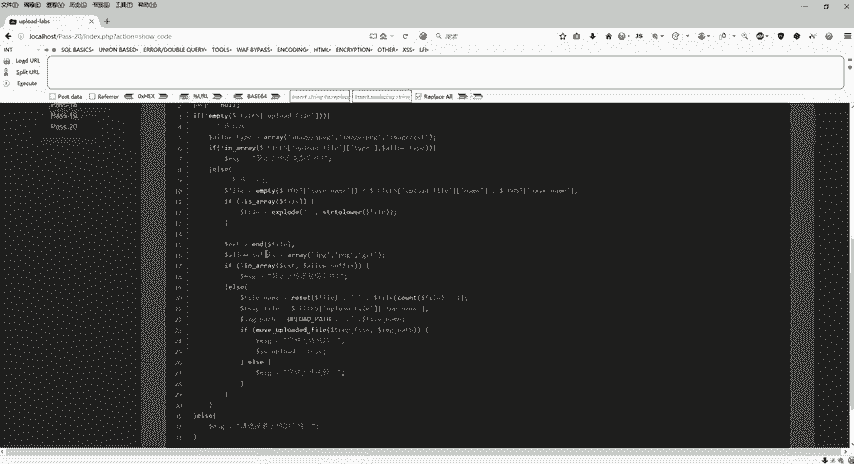

第二十关的防御机制与第十九关类似，采用了白名单策略。它检查文件类型和文件名后缀，只允许上传`JPG`、`PNG`和`GIF`格式的文件。如果上传其他类型或后缀不匹配的文件，操作将被禁止。本关的难点在于需要构造一个特殊的数组来欺骗服务器的检查逻辑。

## 源码分析与核心逻辑

上一节我们介绍了基于后缀检查的绕过方法，本节中我们来看看如何利用PHP数组的`end()`和`reset()`函数来构造一个“合法”的文件名。

首先，查看服务器端的检查逻辑。它主要做两件事：
1.  检查文件MIME类型（如图片类型）。
2.  检查文件名后缀是否为`JPG`、`PNG`或`JIF`。

关键的处理代码如下（示意）：
```php
$file_name = $_FILES['upload_file']['name'];
$file_ext = strtolower(end(explode('.', $file_name))); // 获取后缀
$allow_ext = array('jpg', 'png', 'gif');
if (in_array($file_ext, $allow_ext)) {
    // 通过检查，进行上传
} else {
    // 禁止上传
}
```
这段代码使用`explode(‘.’, $file_name)`将文件名按点分割成数组，然后用`end()`函数取数组最后一个元素作为文件后缀进行校验。

我们的绕过思路是：构造一个特殊的数组，使得`end()`函数返回我们期望的“合法”后缀（如`JPG`），而文件实际保存时使用的名字（由`reset()`函数或类似逻辑获取）却是我们的PHP文件名。

## 构造Payload

以下是构造攻击载荷的具体思路和步骤。

我们需要上传一个文件，其最终在服务器上保存的名字应为`upload_20.php`，但又要能通过后缀检查。可以通过控制`$_FILES[‘upload_file’][‘name’]`为一个数组来实现。

**核心概念**：
*   `end($array)`: 返回数组的最后一个元素。
*   `reset($array)`: 返回数组的第一个元素。
*   `count($array)`: 统计数组中元素的数量。

假设我们构造一个数组`$file_name`：
```php
$file_name[0] = “upload_20.php”;
$file_name[2] = “jpg”;
```
此时，`count($file_name)`的值为2（只有下标0和2有值）。在某些拼接逻辑中，可能会尝试访问`$file_name[count($file_name)-1]`，即`$file_name[1]`，但这个下标不存在，其值为空。

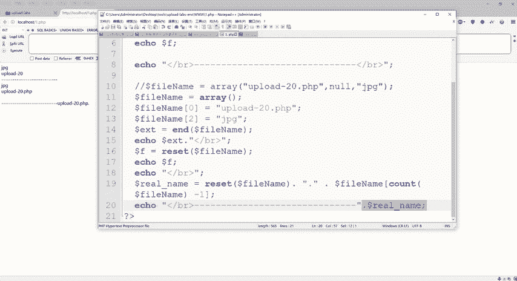

因此，一个可能的拼接过程`$file_name[0] . “.” . $file_name[1]`的结果将是`”upload_20.php.”`，后面没有后缀。而`end($file_name)`的值是`”jpg”`，能通过白名单检查。服务器最终可能将文件保存为`upload_20.php`。

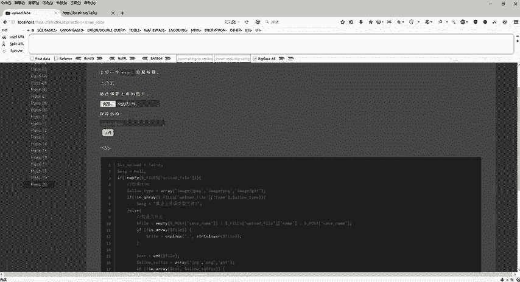

## 实战操作步骤

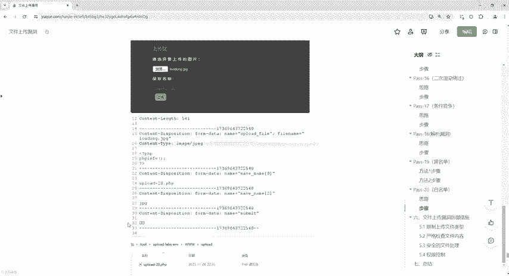

理解了原理后，我们通过Burp Suite来实施攻击。

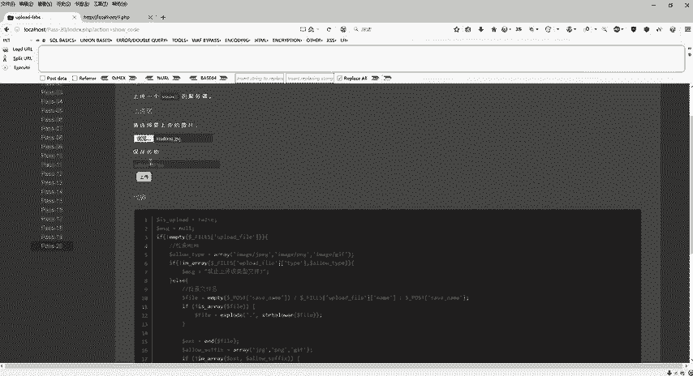

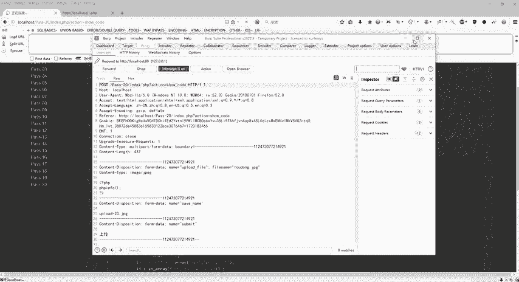

1.  **准备文件**：首先，准备一个图片马文件，例如`shell.jpg`，其内容包含PHP代码。
2.  **拦截请求**：在网页上传`shell.jpg`，并使用Burp Suite拦截发出的HTTP请求。
3.  **修改数据包**：找到`filename`参数，将其修改为数组形式。原始数据可能为：
    ```
    Content-Disposition: form-data; name="upload_file"; filename="shell.jpg"
    ```
    我们需要将其修改为：
    ```
    Content-Disposition: form-data; name="upload_file[0]"; filename="upload_20.php"
    Content-Disposition: form-data; form-data; name="upload_file[2]"; filename="shell.jpg"
    ```
    这样，`$_FILES[‘upload_file’][‘name’]`在服务端就会成为一个我们预设的数组。
4.  **放行请求**：修改完成后，在Burp Suite中放行这个请求。
5.  **验证结果**：回到浏览器，页面可能会显示“文件上传成功”。此时，访问上传文件所在的目录（例如`http://target/upload/upload_20.php`），如果能够执行其中的PHP代码，则说明攻击成功。

## 总结

本节课中我们一起学习了CTF文件上传第二十关的解法。这一关的核心是**利用PHP将HTTP请求中的`filename`参数解析为数组的特性**，通过精心构造数组下标和值，使`end()`函数返回合法的后缀绕过检查，同时让文件以`.php`后缀保存。

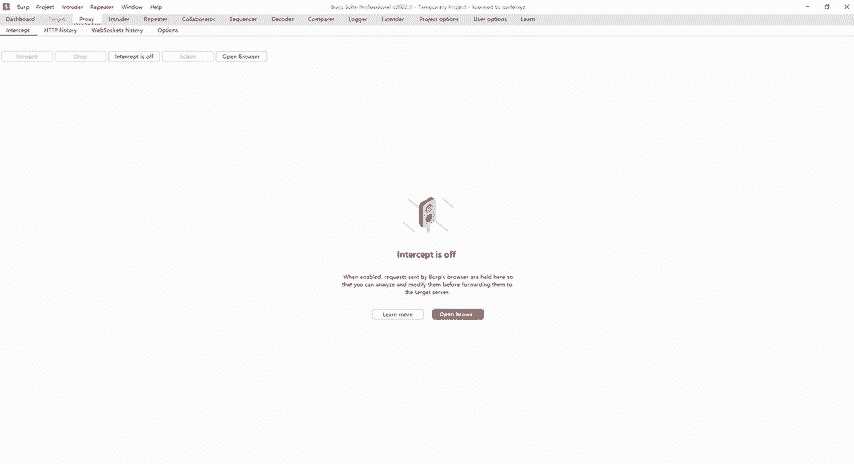

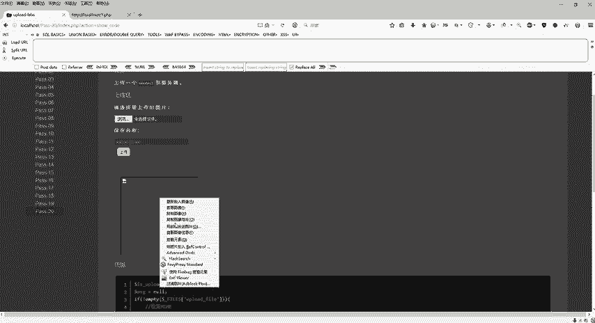

关键点总结：
*   目标：绕过白名单，上传`.php`文件。
*   原理：`$_FILES[‘name’]`可被构造为数组，利用`end()`和`reset()`或数组索引拼接的逻辑差异。
*   方法：使用Burp Suite拦截修改上传请求，将`filename`改为数组形式。
*   结果：服务器保存了名为`upload_20.php`的Webshell。

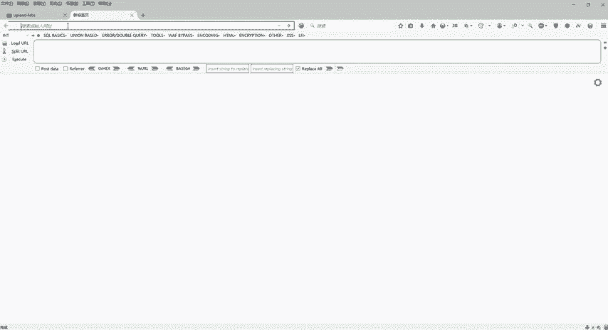

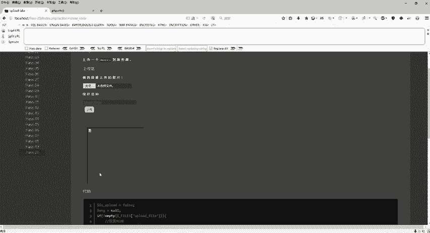

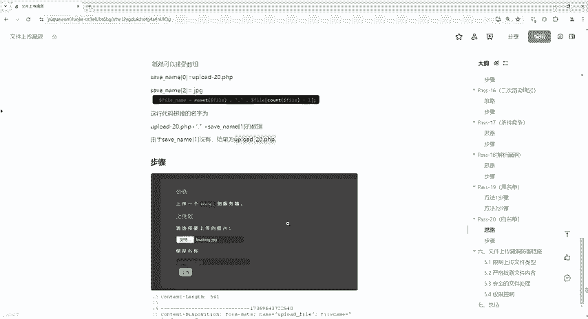

通过这一关，我们掌握了在更严格的白名单检查下的一种高级绕过技巧。至此，从第一关到第二十关的文件上传常见漏洞与绕过方法就全部介绍完毕了。