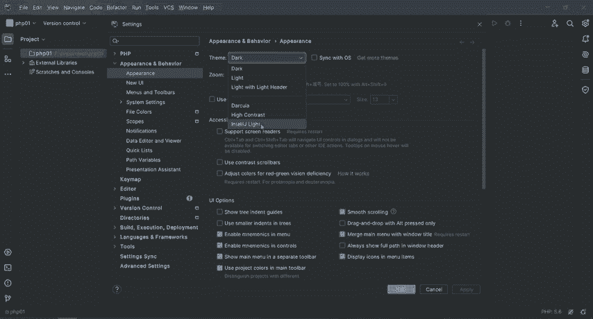
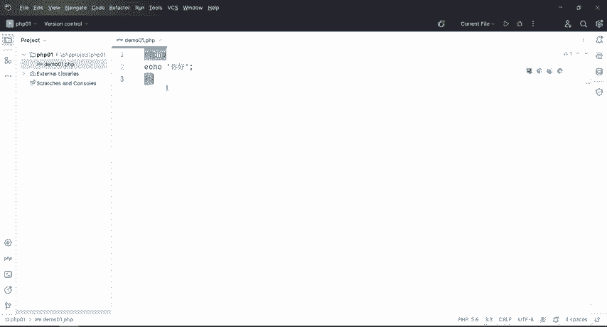

# CTF入门教学：2：PHP第一个程序及工具使用 🚀


在本节课中，我们将要学习如何创建并运行第一个PHP程序，以及配置和使用PHP开发工具。这是CTF Web安全方向的基础。


## 概述

上一节我们成功安装了PHP环境。本节中，我们来看看PHP的基础语法，并动手创建第一个PHP脚本，同时学习如何配置开发工具以顺利运行代码。


PHP脚本可以放在文档中的任何位置。脚本以 `<?php` 开始，以 `?>` 结束。默认的文件扩展名是 `.php`。PHP文件通常还包含一些HTML标签和PHP脚本代码。

## 创建PHP项目

以下是创建PHP项目的具体步骤。



1.  打开开发工具，点击“New Project”。
2.  选择“PHP Empty Project”创建一个空项目。
3.  选择项目存放路径。不建议放在C盘，可以放在其他盘符，例如F盘。
4.  在F盘右键新建一个名为“PHPproject”的文件夹，专门用于存放PHP文件。
5.  在工具中选中F盘的“PHPproject”文件夹，并在路径后加上斜杠和项目名称，例如“/php01”。
6.  点击“Create”完成项目创建。

## 配置开发环境

创建项目后，需要对开发环境进行一些基础配置，以方便后续编码。

1.  点击工具界面左上角图标，选择“View”菜单，勾选显示菜单栏，方便操作。
2.  点击“Settings”，在设置中将编辑器主题（Color Scheme）改为“Light”，将背景改为浅色。
3.  在“Settings”的“Editor” -> “Font”选项中，可以调整字体大小（如设置为18）和字体样式，使代码更易阅读。
4.  工具默认为英文界面，建议保持英文以准确理解各项功能。关键操作如新建文件（New File）、打开文件（Open File）等词汇需要熟悉。

## 编写第一个PHP脚本

现在，我们来创建并编写第一个PHP文件。

1.  在项目文件视图中右键，选择“New” -> “PHP File”。
2.  为文件命名，例如“hello01.php”，系统会自动补全 `.php` 后缀。
3.  文件创建后，编辑器会自动生成PHP开始标签 `<?php`。

在PHP中，有两种基础输出文本到浏览器的方式：`print` 和 `echo`。通常推荐使用 `echo`。

我们在 `<?php` 标签后编写第一行代码：
```php
echo "你好";
```
这段代码使用 `echo` 语句输出一个字符串“你好”。字符串需要用双引号或单引号包围，语句以分号 `;` 结尾。
最后，我们加上结束标签 `?>`。实际上，如果文件纯PHP代码，结束标签可以省略。
编写完成后，使用 `Ctrl + S` 保存文件。

## 配置PHP解释器与运行程序

要运行PHP脚本，需要配置正确的PHP解释器路径。

1.  点击编辑器中的运行按钮，或右键文件选择“Run”。
2.  如果首次运行，工具会提示选择浏览器。建议安装并使用Chrome或Firefox浏览器。
3.  如果遇到“502”错误或提示PHP解释器未配置，需要进行以下设置：
    *   点击“File” -> “Settings”，打开设置面板。
    *   找到“PHP”配置项。
    *   在“CLI Interpreter”旁点击加号，添加本地PHP解释器。
    *   路径指向PHPStudy安装目录下的对应版本，例如：`...\phpstudy_pro\Extensions\php\php5.6.9nts\php.exe`。
    *   在“PHP language level”中选择与解释器匹配的版本（如5.6）。
    *   点击“Apply”应用配置。
4.  配置完成后，再次点击运行。代码将在指定的浏览器中执行，并输出“你好”。

## 总结



本节课中我们一起学习了PHP开发的基础流程。我们创建了PHP项目，配置了友好的编码环境，编写了使用 `echo` 输出内容的第一个PHP脚本，并解决了PHP解释器配置问题以成功运行程序。掌握这些是进行后续PHP代码分析和Web安全测试的第一步。