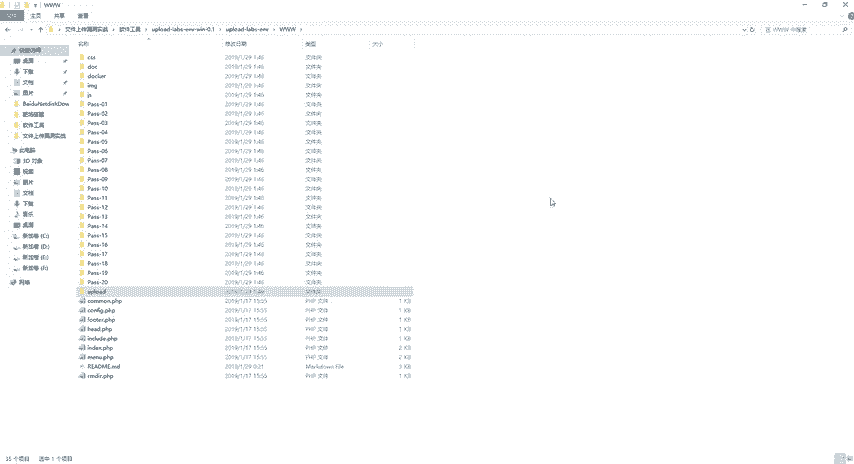
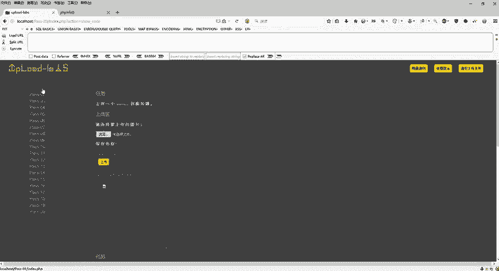
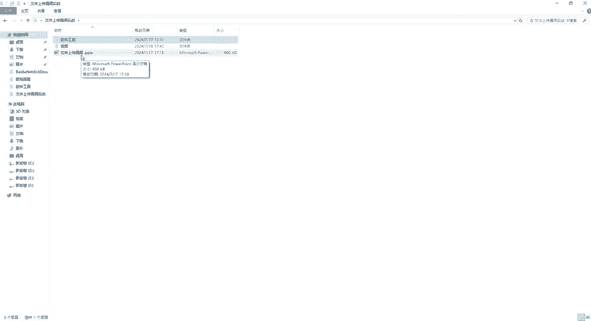

# CTF入门教学：P30：12、文件上传总结

在本节课中，我们将对文件上传漏洞的攻防知识进行总结，并学习如何有效防御此类漏洞。

## 课程概述

通过之前1到20关的实战闯关，我们已经掌握了多种文件上传漏洞的利用方法。本节课程将对这些内容进行系统性总结，并重点讲解作为开发者应如何实施防御措施，以保障Web应用的安全。

## 文件上传漏洞防御措施

上一节我们介绍了各种文件上传的绕过技巧，本节中我们来看看如何从防御角度构建安全防线。有效的防御策略能从根本上降低被攻击的风险。

以下是四种核心的防御措施：

1.  **限制文件类型**
    必须严格限制允许上传的文件类型。推荐采用**白名单**策略，只允许特定的安全文件类型（如`.jpg`, `.png`）。应避免使用**黑名单**策略，因为攻击者总能找到未被列入名单的恶意文件类型。
    *   **白名单示例代码（伪代码）:**
        ```php
        $allowed_extensions = array('jpg', 'png', 'gif');
        if (in_array($file_extension, $allowed_extensions)) {
            // 允许上传
        } else {
            // 拒绝上传
        }
        ```



2.  **检查文件内容**
    不能仅依赖文件扩展名进行判断。需要对**文件头**（Magic Number）和文件实际内容进行扫描，确保文件内容与其扩展名声称的类型一致，防止攻击者通过伪造文件头上传恶意文件。

3.  **安全的文件处理**
    此措施包含两个关键点：
    *   **重命名文件**：服务器在上传文件后，应使用随机字符串对文件进行重命名。例如，用户上传`shell.php`，服务器将其保存为`5f3d2a1e8c9b.php`。这样即使文件被上传，攻击者也无法直接访问或猜到文件名，从而无法利用。
    *   **存储隔离**：将上传的文件存储在Web根目录以外的独立位置。例如，不存放在`/var/www/html/upload/`，而是存放在`/var/app_uploads/`。同时，可以设置独立的、难以猜测的目录名。这样，即使攻击者上传了恶意脚本，也无法通过Web URL直接访问和执行该文件。

4.  **权限控制**
    确保上传目录的权限设置正确。基本原则是：上传目录应设置为**不可执行**脚本。通常，目录权限设置为`可读（R）`、`可写（W）`，但**不可执行（X）**。这样，即使恶意文件被上传至此目录，也无法被服务器解析执行，从而消除了漏洞利用的可能性。



## 课程总结

本节课中我们一起学习了文件上传漏洞的防御体系。

**什么是文件上传漏洞？** 它是在Web应用上传文件功能中，由于校验不严或处理不当而产生的一种安全漏洞，攻击者可利用它上传恶意文件（如Webshell），进而控制服务器。

通过实施严格的**上传策略**（如白名单校验、内容检查）和有效的**安全措施**（如重命名、存储隔离、权限控制），可以极大地降低应用遭受此类攻击的风险。作为开发者，在编写代码时必须高度重视文件上传功能的安全性，以确保Web应用能够安全稳定地运行。



至此，关于文件上传漏洞的入门教学部分已全部结束。我们从环境准备开始，逐步分析了1到20关靶场的各种漏洞案例与通关方法，并最终完成了防御策略的总结。希望本课程能帮助你建立起对CTF中文件上传考点的基础认知。