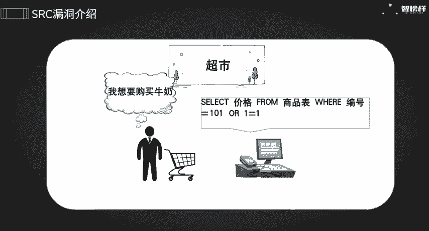
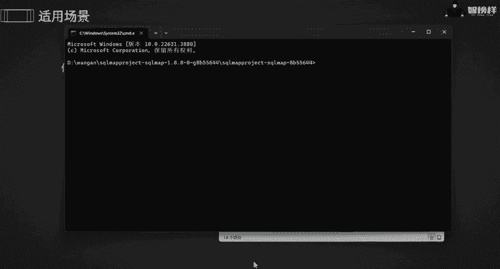
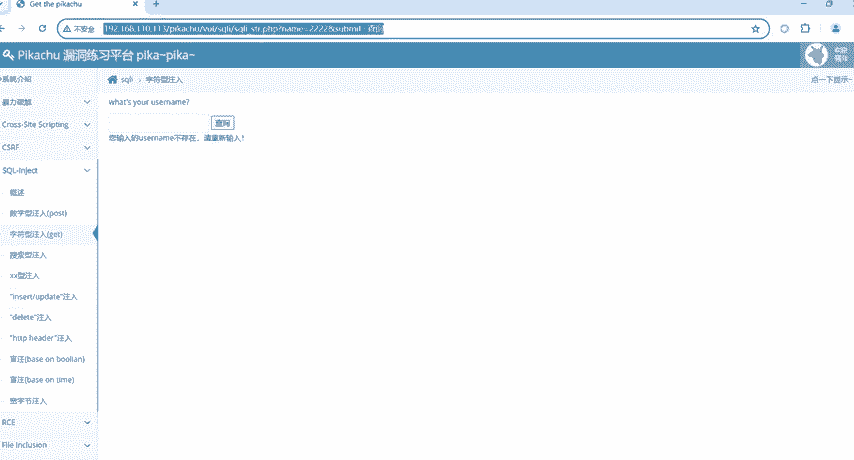
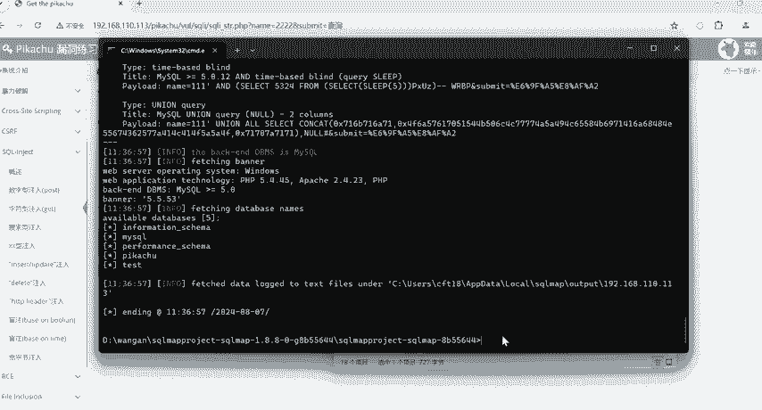
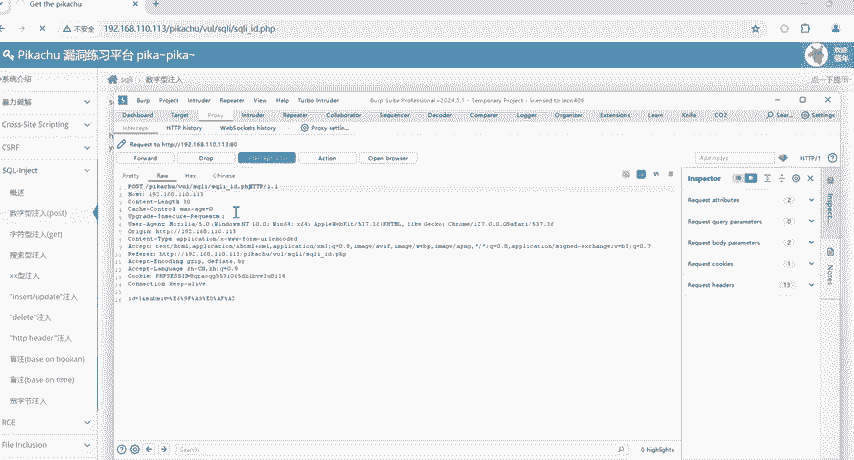
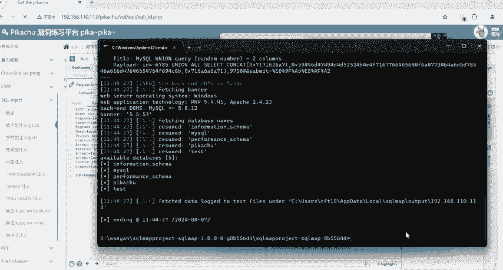
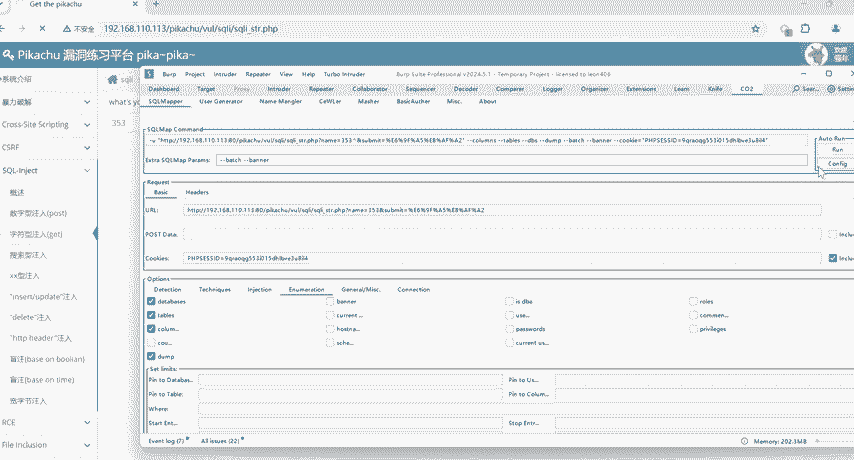
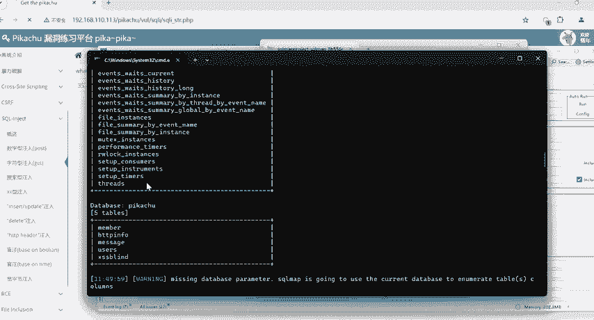
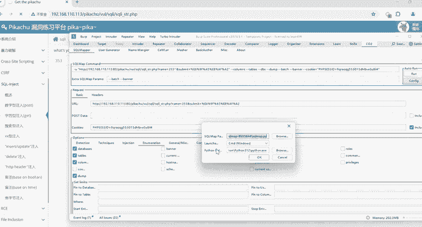

# CTF入门教学：P31：1.漏洞挖掘实战3之SQL注入

## 概述
在本节课中，我们将要学习网络安全中一个非常经典的漏洞类型——SQL注入。我们将了解SQL注入的基本原理，并通过实战演示如何使用工具来发现和利用这种漏洞。

## 什么是SQL注入？🔍
上一节我们介绍了漏洞挖掘的基本概念，本节中我们来看看SQL注入的具体含义。

SQL注入是一种攻击技术。攻击者通过在应用程序的输入字段中插入恶意的SQL代码，欺骗后端数据库执行非预期的操作。这可能导致敏感数据泄露、数据被篡改，甚至完全控制数据库服务器。

为了更直观地理解，我们可以通过一个简单的例子来说明。

### 一个简单的例子
假设你经营一家超市，并拥有一个库存管理系统。为了方便顾客结账，你设置了一个简单的查询系统，允许通过输入商品编号来查询价格。



这个系统的后台是一个数据库，储存了商品编号和对应的价格。例如，牛奶的编号是101。当顾客输入“101”查询时，系统会执行类似下面的SQL查询语句：
```sql
SELECT 价格 FROM 商品表 WHERE 编号 = 101;
```
然后系统会返回牛奶的价格。

现在，假设一个攻击者知道系统存在漏洞。他可能不会输入正常的商品编号，而是输入一段特殊的字符，例如：`101 OR 1=1`。

由于`1=1`这个条件永远为真，当它与`OR`运算符结合时，会改变原SQL语句的逻辑。系统实际执行的查询可能变成：
```sql
SELECT 价格 FROM 商品表 WHERE 编号 = 101 OR 1=1;
```
这条语句的含义是：“选择商品表中所有编号等于101**或者**1等于1的记录的价格”。由于`1=1`永远成立，这个条件会匹配表中的**所有**记录。结果就是，攻击者可以获取到库存中所有商品的价格信息，相当于拿到了整个便利店的“库存钥匙”，导致信息全部泄露。这就是SQL注入漏洞。





**核心概念**：不法分子通过输入数据，插入恶意的SQL代码，欺骗系统执行非预期的操作，从而获取敏感数据。

## SQL注入实战环境与工具 🛠️
了解了SQL注入的原理后，我们需要一个环境来实践。本节将介绍实战所需的工具和基本环境配置。

我们主要使用以下环境与工具：
*   **操作系统**：Windows系统。
*   **抓包工具**：Burp Suite (简称BP)，用于拦截和分析网络请求。
*   **测试工具**：SQLMap，一个自动化的SQL注入检测与利用工具。
*   **浏览器插件**：CO2插件（视频中提及），可以方便地与BP和SQLMap联动进行测试。



**重要提示**：SQL注入可能存在于任何与数据库交互的操作中。以下是可能存在SQL注入的场景列表：
*   用户登录和注册功能
*   数据查询功能（如搜索框）
*   数据修改功能
*   简而言之，任何涉及数据库“增删改查”操作的地方，都可能存在SQL注入漏洞。

## 使用SQLMap进行手动测试 💻
知道SQL注入是什么以及可能存在的场景后，我们需要通过工具进行测试。本节将演示如何使用SQLMap工具进行手动漏洞检测。



SQLMap是一个用Python编写的强大工具。以下是使用SQLMap对目标进行测试的基本步骤。

首先，需要找到可能存在注入点的参数。例如，在一个查询功能中，我们输入`2222`进行查询，系统返回“账号不存在”。这个交互过程就可能存在注入点。

**以下是使用SQLMap测试GET请求的步骤：**
1.  打开命令提示符（CMD），并导航到SQLMap工具所在的目录。
2.  构造测试命令。基本命令格式为：
    ```
    python sqlmap.py -u “目标URL”
    ```
    例如，针对一个GET请求的URL，命令可能如下：
    ```
    python sqlmap.py -u “http://target.com/search?id=1”
    ```
3.  执行命令后，SQLMap会开始检测。如果发现注入点，它会显示请求类型、参数、测试的Payload（攻击载荷）等信息。
4.  确认存在注入后，可以进一步探索数据库。例如，使用以下命令列出所有数据库：
    ```
    python sqlmap.py -u “目标URL” --dbs
    ```



**对于POST请求的测试，步骤略有不同：**
1.  首先，使用Burp Suite拦截一个POST请求（例如登录请求）。
2.  将拦截到的整个请求数据（包括Headers和Body）复制下来，保存到一个文本文件中（例如 `post.txt`）。
3.  在SQLMap中使用 `-r` 参数指定这个请求文件进行测试：
    ```
    python sqlmap.py -r post.txt
    ```
4.  同样，测试成功后，可以使用 `--dbs` 等参数进行后续操作。

手动使用SQLMap需要区分GET和POST请求，并且对于POST请求需要先保存请求数据，过程相对繁琐。

## 使用Burp Suite插件CO2进行自动化测试 ⚡
上一节我们介绍了手动使用SQLMap的方法，虽然强大但步骤较多。本节中我们来看看如何利用Burp Suite的CO2插件来简化整个测试流程，实现自动化。

CO2插件可以集成到Burp Suite中，它能自动将拦截到的请求发送给SQLMap进行测试，无需手动处理请求类型和保存文件。

**以下是使用CO2插件进行自动化SQL注入测试的步骤：**

1.  **抓取数据包**：打开Burp Suite，并确保代理拦截功能开启。在浏览器中进行正常操作（如输入查询内容），让Burp Suite拦截到相关的HTTP请求数据包。
2.  **发送到插件**：在Burp Suite的拦截历史中，右键点击目标请求，选择 `Extensions` -> `CO2` -> `Send to SQLMap`。
3.  **配置测试选项**：在弹出的CO2界面中，可以配置SQLMap的扫描选项。
    *   **Level (等级)** 和 **Risk (风险)**：控制测试的深度和广度，通常使用默认值即可。
    *   **目标选项**：可以勾选你想要进行的操作，例如：
        *   `--dbs`：枚举数据库。
        *   `--tables`：枚举指定数据库中的表。
        *   `--columns`：枚举指定表中的列。
        *   `--dump`：导出指定表中的数据。
4.  **配置工具路径**：这是关键一步。必须确保CO2插件知道SQLMap和Python的正确安装路径。在插件的设置中，需要正确指向 `sqlmap.py` 文件和 `python.exe` 的路径。
5.  **开始测试**：所有配置完成后，点击 `Run` 按钮。CO2插件会自动调用SQLMap，并在Burp Suite的界面中显示扫描进度和结果。



使用CO2插件的优势非常明显：它自动处理了请求类型的识别和数据包的格式化，用户只需点击和勾选，大大提高了测试效率。但务必注意，使用前必须正确配置SQLMap和Python的环境路径。

## 总结与思考 🤔
本节课中我们一起学习了SQL注入漏洞的完整知识。





**我们学习了：**
1.  **SQL注入的原理**：通过构造恶意输入，改变后端SQL查询语句的逻辑，从而窃取或篡改数据库数据。
2.  **SQL注入的实战工具**：重点介绍了自动化工具SQLMap，以及它与Burp Suite的两种结合使用方式。
3.  **手动测试方法**：通过命令行使用SQLMap，需要区分GET/POST请求。
4.  **自动化测试方法**：通过Burp Suite的CO2插件，可以极大地简化测试流程，实现一键化漏洞检测与利用。

**课后思考题：**
除了课程中演示的查询功能，SQL注入还可能利用应用程序中的哪些具体功能点？（例如：用户登录、密码找回、订单查询、数据排序等）


**工具获取**：课程中提到的SQLMap工具及CO2插件等资源已打包。