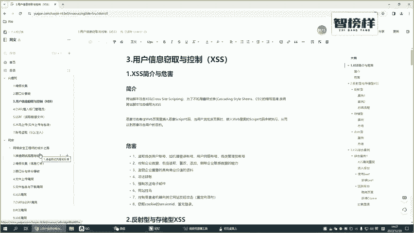
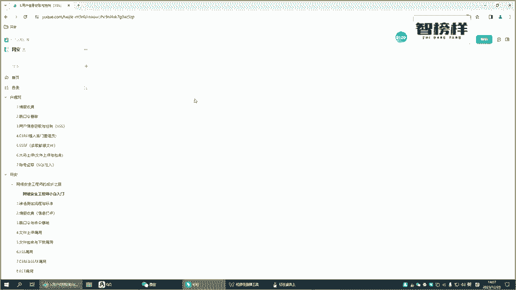
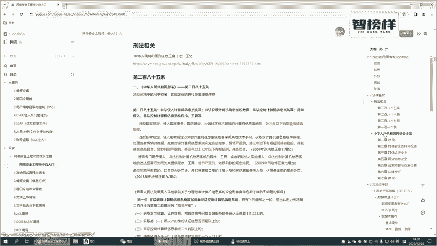
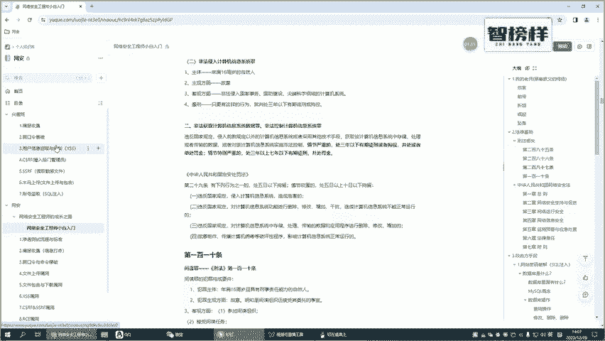
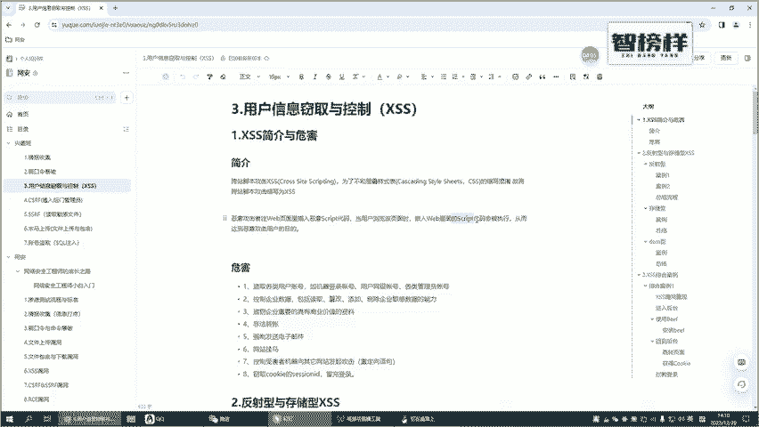
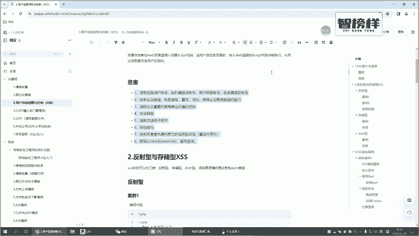
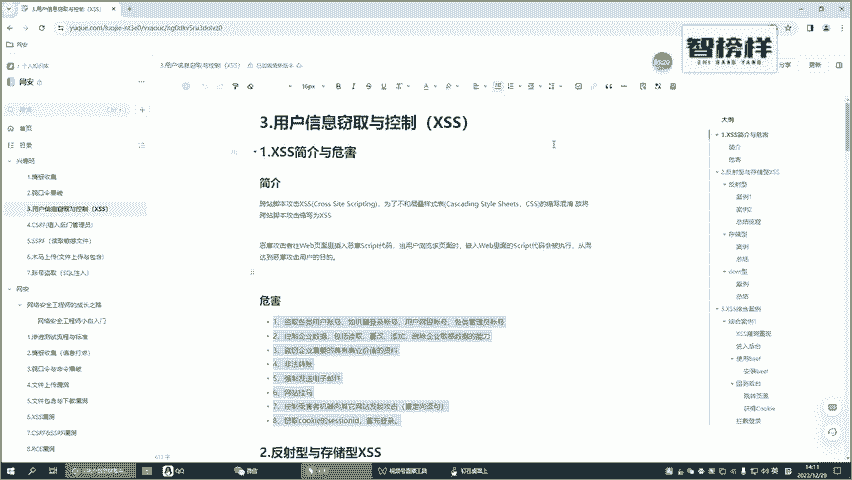

# CTF入门教学：P32：1.XSS简介与危害 🔓

在本节课中，我们将要学习CTF比赛中一个常见且重要的漏洞类型——跨站脚本攻击，即XSS。我们将了解它的基本概念、攻击原理以及可能造成的危害。

## 概述

上一节我们介绍了情报收集与弱口令相关的漏洞。本节中，我们来看看另一种常见的Web安全漏洞：跨站脚本攻击。在学习具体技术之前，必须强调：本教程内容仅用于网络安全知识的学习与研究。请务必遵守《中华人民共和国网络安全法》等相关法律法规，切勿进行任何违法活动。





## 什么是XSS？🤔

XSS，全称是**跨站脚本攻击**。我们来拆解一下这个名字：
*   **跨站**：指攻击并非发生在攻击者自己的网站，而是发生在其他用户的浏览器或目标网站上。
*   **脚本**：指攻击的主要手段是脚本语言，在Web环境中，通常指 **JavaScript**。

因此，XSS攻击就是攻击者将恶意的JavaScript代码**注入**到目标网页中。当其他用户浏览这个被“污染”的页面时，嵌入的恶意脚本就会在他们的浏览器中执行。



> **为什么叫XSS而不是CSS？**
> 这是为了与前端技术**层叠样式表**区分开来，避免混淆。



## XSS的攻击原理 💻

简单来说，攻击者会在一个网站的可输入区域（如评论区、搜索框、URL参数）中，嵌入恶意的JavaScript代码。

例如，一段基础的恶意脚本可能是：
```javascript
<script>alert('XSS攻击演示')</script>
```
如果网站没有对用户输入进行严格的过滤，这段代码就会被存入数据库或直接输出到页面上。当其他用户加载该页面时，他们的浏览器就会弹出一个警告框。

当然，真实的攻击远比弹出警告框危险。

## XSS的危害有哪些？⚠️

以下是XSS攻击可能带来的一些主要危害：

*   **盗取用户敏感信息**：恶意脚本可以窃取用户的登录凭证、Cookie、会话令牌等。攻击者利用这些信息可以**冒充用户身份**登录账户。
*   **篡改网页内容**：攻击者可以利用脚本修改页面显示，例如插入虚假的登录表单、钓鱼链接或恶意广告。
*   **发起恶意请求**：脚本可以以用户身份向网站发送请求，执行如转账、更改密码、发布内容等用户不知情的操作。
*   **传播恶意软件**：可以在网页中植入木马或勒索软件的下载链接。
*   **劫持用户会话**：通过盗取的会话信息，完全控制用户的账户。



## 总结

本节课我们一起学习了XSS的基础知识。我们了解到XSS是一种**跨站脚本攻击**，攻击者通过向网页注入**恶意JavaScript代码**来危害其他用户。其危害包括盗取信息、篡改页面、发起恶意操作等，危害性极大。





在接下来的章节中，我们将深入探讨XSS的不同类型、利用方式以及如何在CTF题目中识别和利用它。