# CTF入门教学：P33：反射型XSS与fofa案例讲解 🎯

在本节课中，我们将学习跨站脚本攻击中的反射型XSS，并通过一个简单的PHP案例和一个使用Fofa搜索引擎的实战案例，帮助你理解其原理和攻击流程。

上一节我们介绍了XSS的基本概念，本节中我们来看看XSS的具体类型之一：反射型XSS。

## XSS的类型概述

XSS攻击总体上可以分为反射型和存储型。有些分类方法还会加入DOM型。DOM型与反射型在原理上较为相似，但存在细节上的差别。其中，反射型和DOM型比较容易混淆。

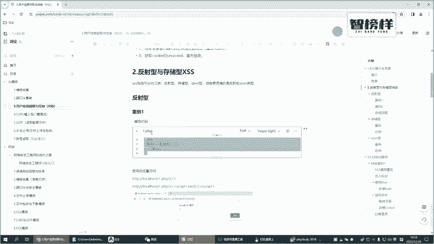

为了让各位理解它们之间的区别，我将通过案例结合流程图进行讲解。

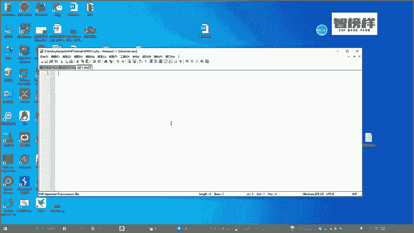

## 案例一：搭建简易PHP环境

首先，我们来看一个简单的PHP页面案例。你需要准备相关的PHP运行环境。

以下是搭建步骤：

1.  启动PHP集成环境工具（例如PHPStudy），确保Apache和MySQL服务正常运行。
2.  在工具的`www`根目录下，新建一个名为`1.php`的文件。
3.  使用记事本或其他编辑器打开该文件，并输入以下代码：

```php
<?php
$xss = $_GET[‘x‘];
echo $xss;
?>
```

这段代码的功能非常简单：它通过`GET`方法接收一个名为`x`的参数，并将其值直接输出到页面上。

4.  在浏览器中访问该页面，地址为`http://localhost/1.php`。初始访问时页面是空白的，因为尚未传递任何参数。
5.  尝试传递参数。在地址后添加`?x=hello`，例如`http://localhost/1.php?x=hello`，页面将输出“hello”。这是一个正常的交互过程。

## 什么是XSS攻击？

XSS攻击的本质是攻击者通过注入恶意脚本代码来实施攻击。目前我们传递的都是普通参数，因此没有安全问题。

现在，我们尝试注入一段JavaScript脚本。将参数`x`的值修改为以下内容：

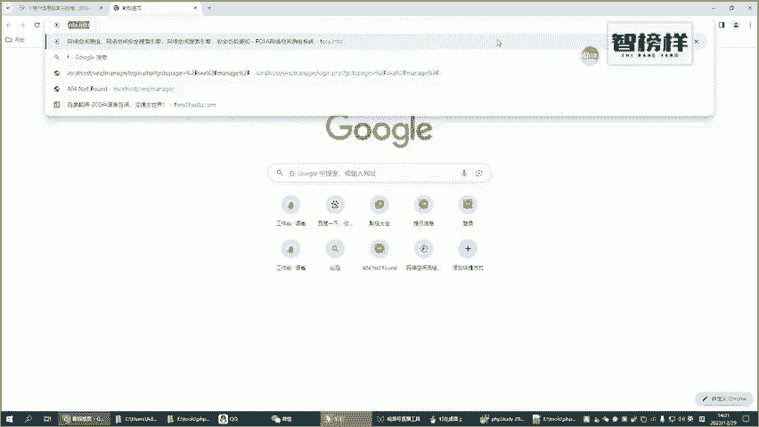

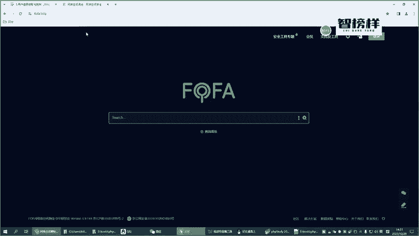

```
<script>alert(1)</script>
```

完整的访问地址变为：`http://localhost/1.php?x=<script>alert(1)</script>`。

访问该地址后，浏览器会弹出一个显示“1”的警告框。这就是一个最简单的XSS攻击演示。攻击者可以通过此类脚本弹出广告、进行骚扰，甚至窃取用户信息。

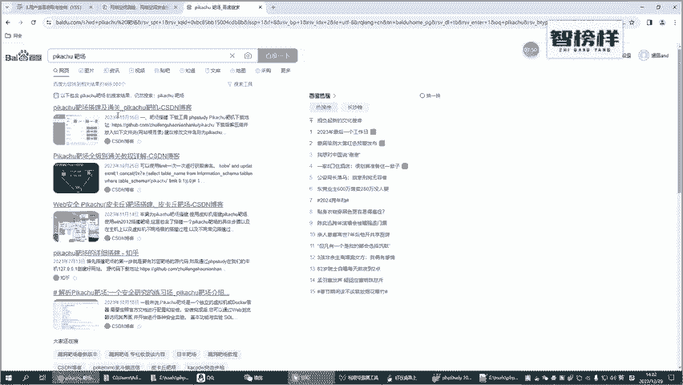

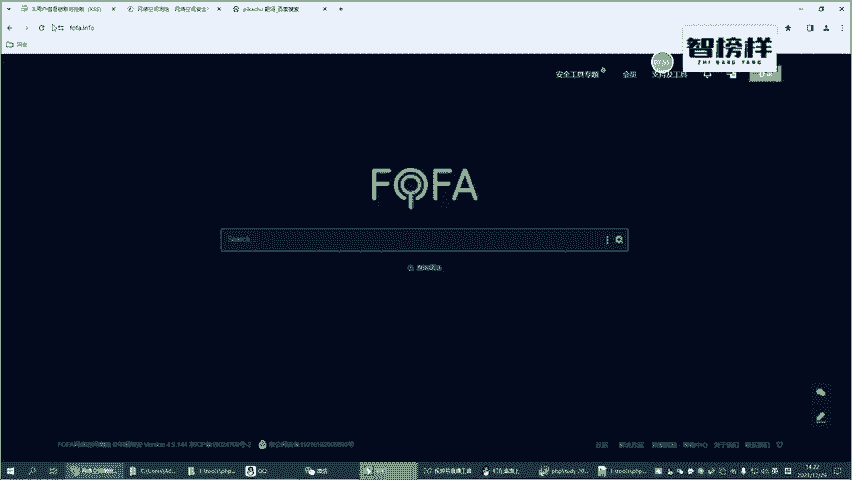

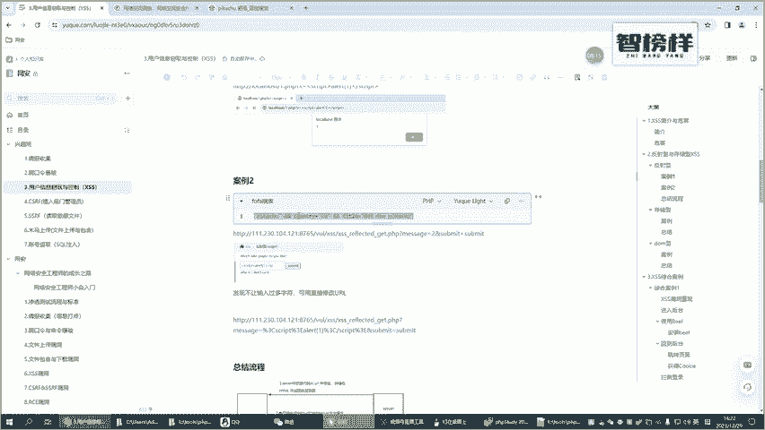

虽然在国内对XSS漏洞的重视程度不一，但在国外，由于更注重用户体验，报告此类漏洞通常能获得可观的奖励。

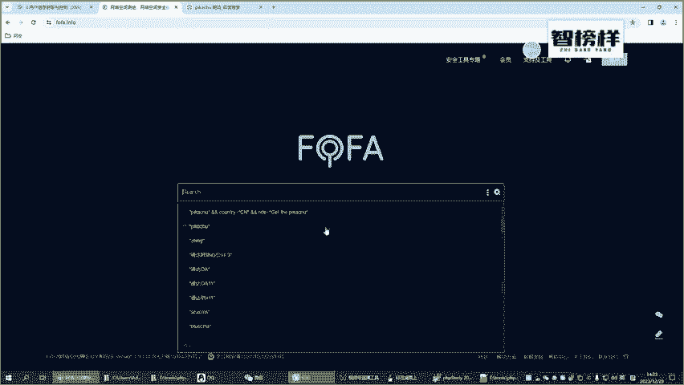

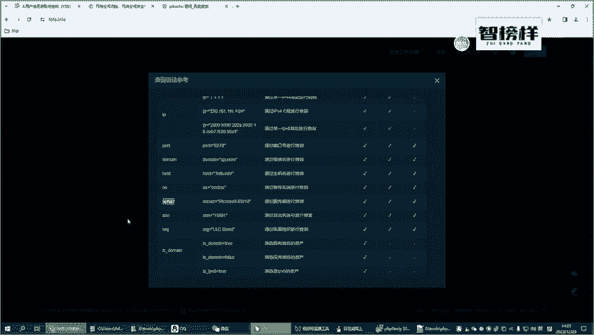

通过这个简单案例，我们了解了XSS攻击的基本形式：**攻击者通过注入脚本，利用浏览器解析执行这些脚本，从而达到攻击目的**。

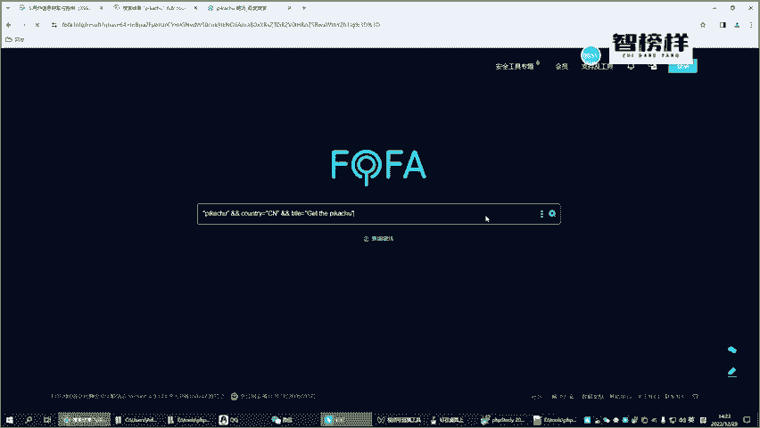

这个案例演示的正是**反射型XSS**。

## 案例二：使用Fofa搜索实战靶场

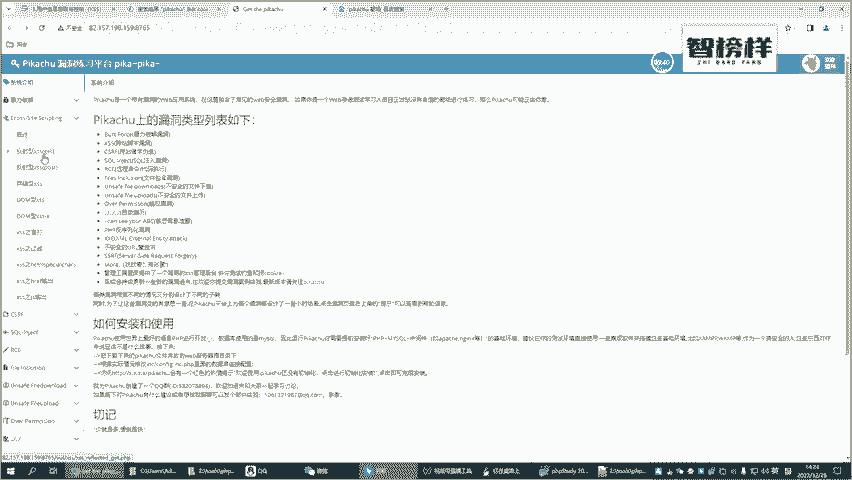

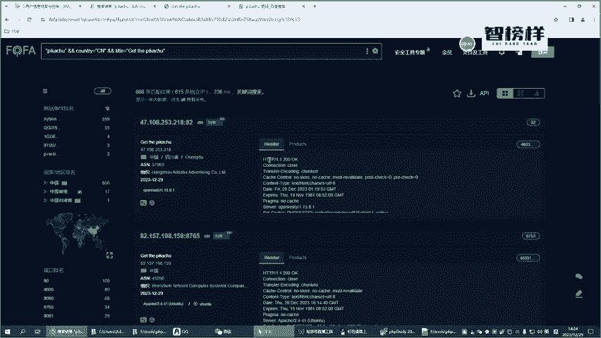

为了加深理解，我们不再手动搭建复杂靶场，而是使用之前学过的Fofa网络空间搜索引擎来寻找一个现成的、包含XSS漏洞的练习靶场。

以下是操作步骤：

1.  访问Fofa搜索引擎。
2.  在搜索框中输入以下语法，用于搜索标题中包含“pikachu”（一个知名的Web漏洞练习靶场）且位于中国的相关资产：
    `title=“pikachu” && country=“CN”`
3.  从搜索结果中选取一个可访问的地址。例如，我们找到一个地址：`http://example.com/pikachu/`（此为示例，实际地址需在Fofa中获取）。
4.  访问该靶场地址，找到其中的“XSS”漏洞测试模块。

在靶场的反射型XSS测试页面，我们通常会看到一个输入框。正常输入如“kobe”，页面会显示相关图片。

现在，我们尝试进行XSS攻击。在输入框中尝试输入`<script>alert(1)</script>`，可能会发现输入长度受限。

此时，我们可以通过修改URL参数的方式绕过前端的输入限制。观察页面，发现参数可能通过`message`传递。例如，正常请求URL为：`http://example.com/pikachu/vul/xss/xss_reflected_get.php?message=kobe`。

我们将参数`message`的值替换为我们的恶意脚本：
`http://example.com/pikachu/vul/xss/xss_reflected_get.php?message=<script>alert(1)</script>`

访问这个构造好的URL，如果漏洞存在，浏览器将会执行脚本并弹出警告框。

## 反射型XSS攻击流程总结

通过以上两个案例，我们可以总结出反射型XSS的攻击流程，它通常涉及四个步骤：

1.  **攻击者构造恶意URL**：攻击者将恶意脚本代码作为参数，嵌入到一个正常的URL中。
2.  **诱导用户点击**：攻击者通过邮件、社交网站等手段，诱使用户点击这个恶意URL。
3.  **服务器反射脚本**：用户点击后，浏览器向目标网站服务器发送带有恶意参数的请求。服务器端脚本（如我们的PHP代码）未对参数进行过滤，直接将其取出并拼接到返回的HTML页面中。
4.  **用户浏览器执行脚本**：用户的浏览器接收到服务器返回的HTML页面，将其作为正常内容进行解析。当解析到其中包含的恶意脚本（如`<script>alert(1)</script>`）时，便会执行它，从而完成攻击。

**核心特点**：反射型XSS的恶意脚本**并未持久化存储在服务器数据库或文件里**，它只是通过一次HTTP请求“反射”回用户的浏览器。其危害通常依赖于诱使用户点击特定的链接。

你可以通过浏览器的“查看网页源代码”功能来验证：在攻击成功的页面查看源码，你会发现我们输入的恶意脚本代码被直接输出在了HTML页面的某个位置。

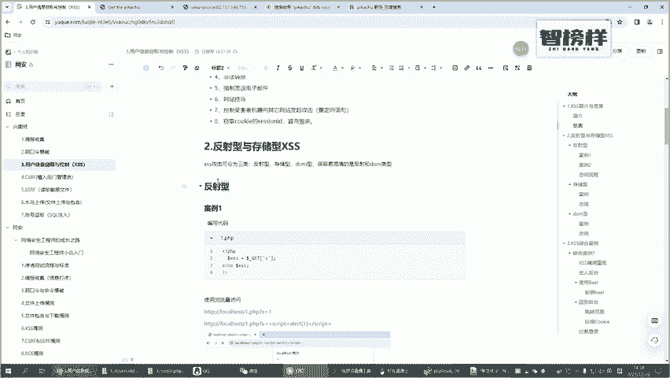

本节课中我们一起学习了反射型XSS的原理，并通过自建环境和Fofa实战两个案例，掌握了其基本的攻击与验证方法。理解“参数输入->服务器直接反射输出->浏览器解析执行”这一流程是掌握反射型XSS的关键。