# CTF入门教学：P34：存储型XSS以及案例简介 🎯

在本节课中，我们将要学习XSS（跨站脚本攻击）的第二种主要类型——存储型XSS。我们将通过一个实战案例，理解其原理、危害，并比较其与反射型XSS的区别。

## 概述

上一节我们介绍了反射型XSS，本节中我们来看看存储型XSS。顾名思义，存储型XSS会将攻击者的恶意脚本“存储”在服务器上（通常是数据库中），因此其危害通常比反射型XSS更大。

## 存储型XSS核心概念

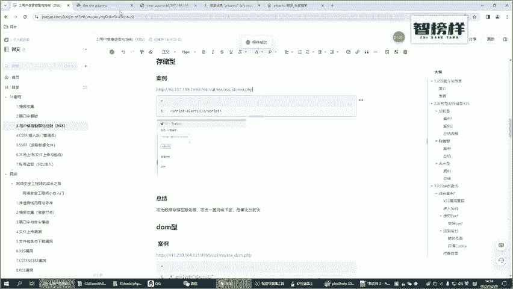

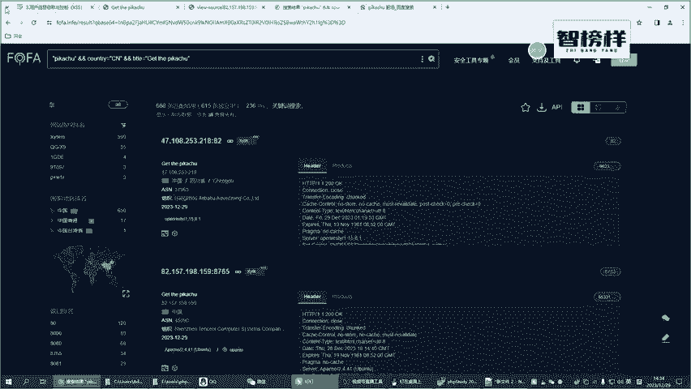

存储型XSS与反射型XSS的核心区别在于**数据是否持久化**。
*   **反射型XSS**：恶意脚本不经过数据库存储，仅在一次HTTP请求-响应中生效。
*   **存储型XSS**：恶意脚本会经过数据库的存储，并被持久化保存。

因此，存储型XSS的危害性更大，因为一旦注入成功，所有访问特定页面的用户都可能受到攻击，而无需攻击者每次都发送恶意链接。

## 实战案例：寻找与测试存储型XSS漏洞

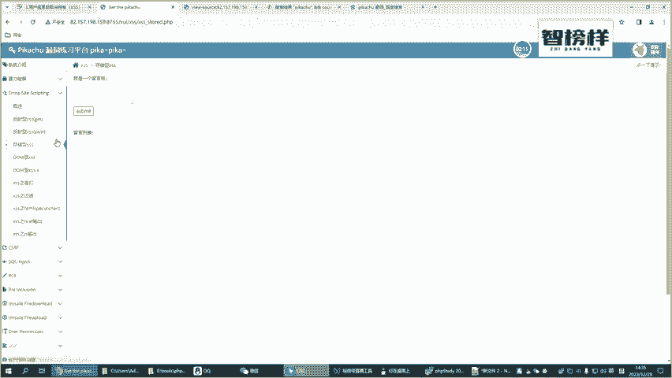

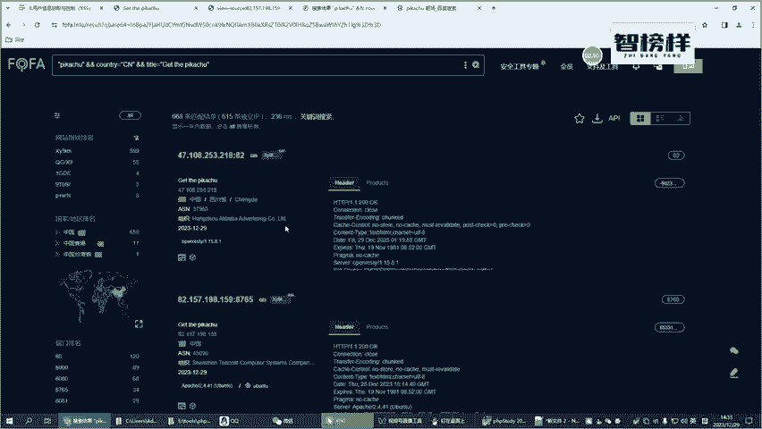

理论需要实践验证。以下是寻找和测试一个存储型XSS漏洞靶场的过程。

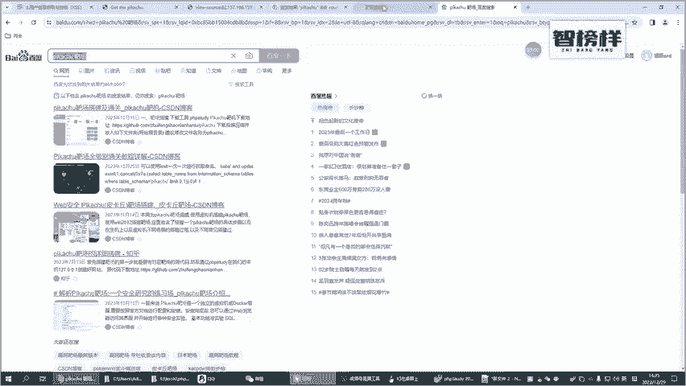

### 1. 寻找合适的靶场

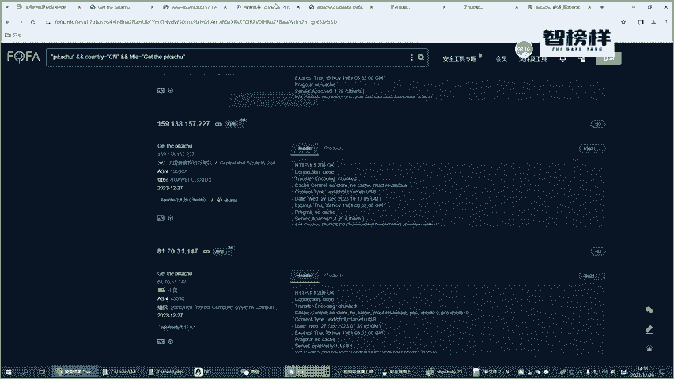

我们使用“皮卡丘”（一个常见的Web漏洞练习平台）来寻找存储型XSS案例。请注意，在线靶场地址可能发生变化，这正是网络安全学习的常态——你会遇到各种“挫折”，但这正是学习和挑战的机会。

**第一次尝试**：找到一个疑似存储型XSS的留言板页面，但测试时发现留言无法保存，说明该靶场功能异常。

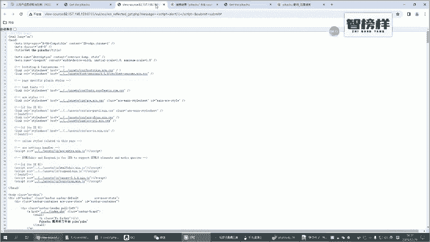

**第二次尝试**：更换浏览器并关闭代理设置后，再次测试，发现留言依然无法提交，确认该靶场不可用。

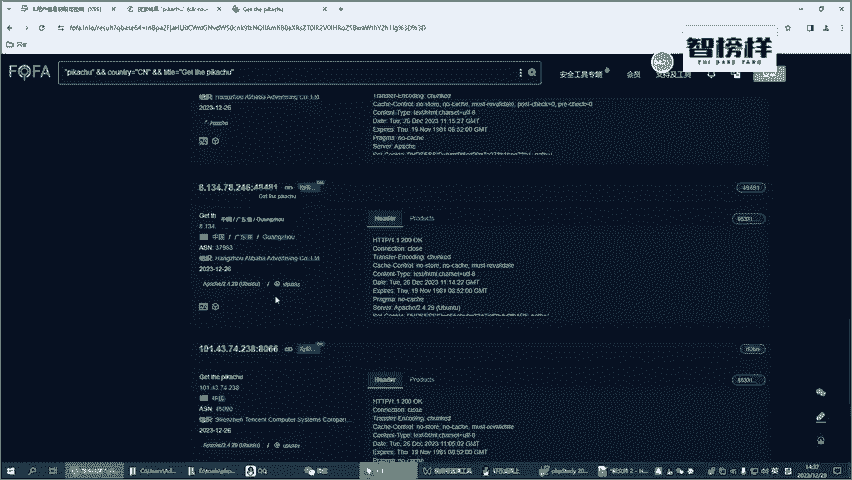

**第三次尝试**：重新搜索，最终找到一个功能正常的“存储型XSS”测试页面。这个过程表明，在实战中，耐心和多次尝试是必要的。

### 2. 理解正常功能

找到可用的靶场后，首先观察其正常功能。这是一个留言板，用户可以输入信息（如“论坛的朋友大家好”）并提交。提交后，即使刷新页面或重新进入，留言内容依然显示。这证明了数据被**存储**在了服务器端（如数据库中）。

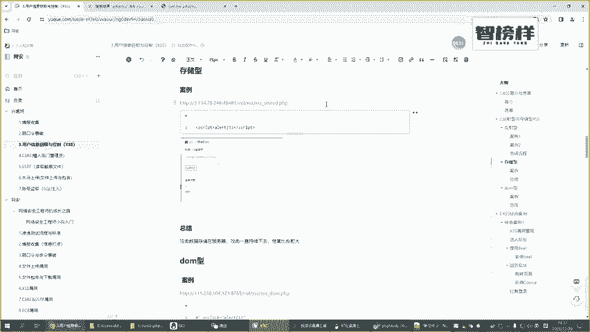

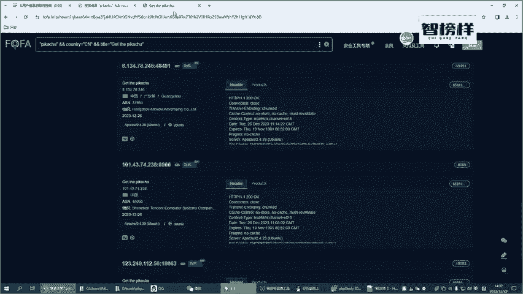

### 3. 注入恶意脚本

接下来，我们尝试注入XSS攻击脚本。

我们在留言框中输入经典的测试脚本：
```html
<script>alert(1)</script>
```
然后点击提交。

**结果**：页面弹出了显示“1”的警告框，攻击成功。

### 4. 验证存储性

为了验证这是“存储型”攻击，我们进行以下操作：
1.  关闭当前浏览器标签页。
2.  重新打开靶场的“存储型XSS”页面。
3.  **观察**：无需再次输入攻击脚本，页面加载后**再次弹出了警告框**。

这说明恶意脚本`<script>alert(1)</script>`已经被永久存储在服务器数据库中。每当任何用户访问这个留言板页面时，服务器都会从数据库读取这条包含恶意脚本的留言，返回给用户的浏览器，浏览器便会执行该脚本，导致攻击反复发生。

## 存储型 vs 反射型 XSS 危害对比

通过案例，我们可以清晰地比较两者危害：

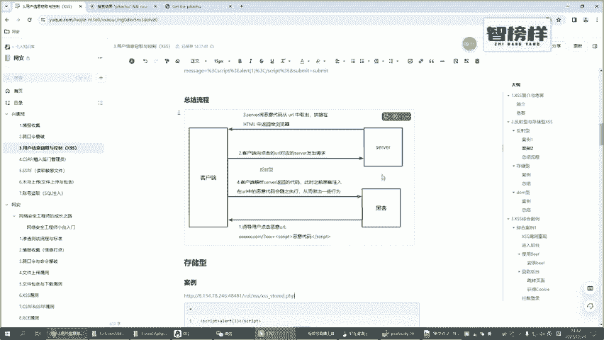

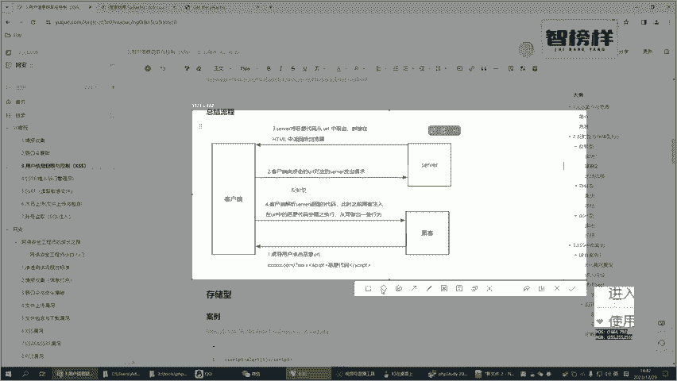

*   **反射型XSS**：攻击者需要诱骗用户点击一个**特定的恶意链接**。用户一旦离开该页面或链接失效，攻击即终止。
*   **存储型XSS**：恶意脚本已**植入在网站页面中**（如留言板、文章评论、用户资料）。任何访问该页面的普通用户都会自动受到攻击，影响范围广、持续时间长。

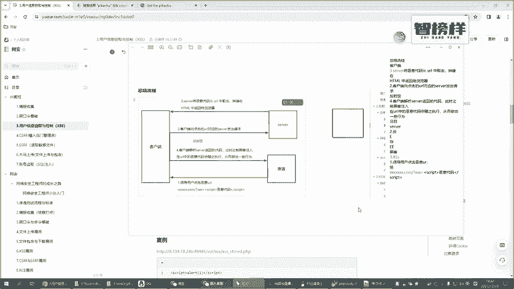

显然，**存储型XSS的危害性远大于反射型XSS**。

## 存储型XSS攻击流程详解

以下是存储型XSS攻击的完整流程图解：


结合图示，其攻击流程可分为以下步骤：
1.  **攻击构造**：黑客在网站的可存储用户输入的位置（如留言框），写入恶意脚本（例如 `<script>alert(1)</script>`）。
2.  **请求发送**：客户端（浏览器）将包含恶意脚本的提交请求发送给服务器。
3.  **数据存储**：**（关键区别）** 服务器在处理请求时，未对输入进行充分过滤，便将包含恶意脚本的数据**存储到数据库**中。
4.  **数据读取**：当其他正常用户访问该页面（如查看留言板）时，服务器会从数据库中读取数据。
5.  **响应返回**：服务器将包含恶意脚本的页面数据返回给正常用户的浏览器。
6.  **脚本执行**：正常用户的浏览器解析响应，执行了嵌入在页面中的恶意脚本，从而完成攻击（如弹窗、窃取Cookie等）。

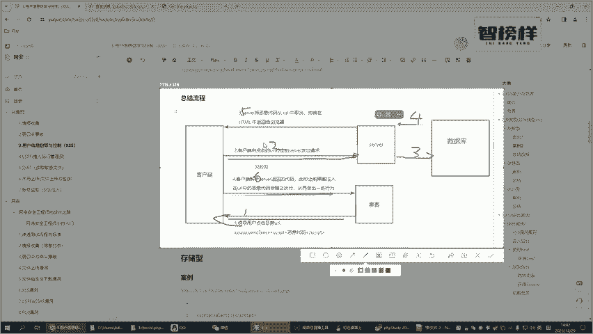

## 总结

本节课中我们一起学习了存储型XSS。
*   我们理解了其核心特征：恶意脚本会被**持久化存储**在服务器端。
*   我们通过一个一波三折的实战案例，体验了如何寻找和测试存储型XSS漏洞，并理解了其反复攻击的特性。
*   我们对比了存储型与反射型XSS，明确了存储型因其持久化特性而**危害更大**。
*   最后，我们通过流程图详细剖析了存储型XSS的完整攻击链条。

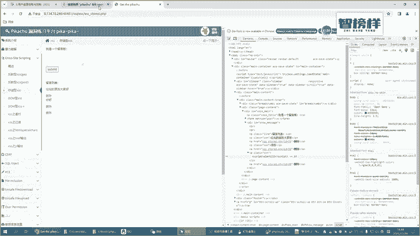

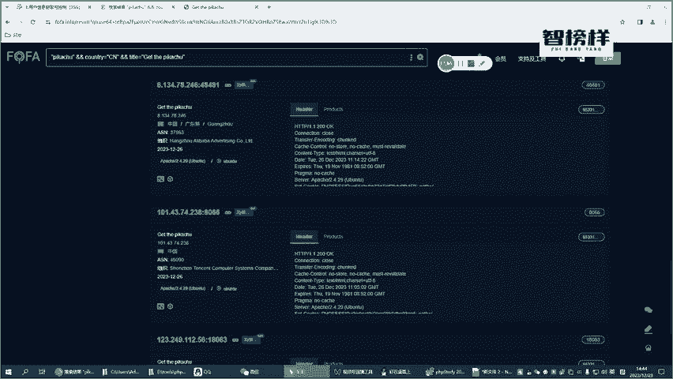

重点在于，防御XSS的核心原则是对所有**不可信的输入数据进行严格的过滤和转义**，无论是反射型还是存储型。对于存储型XSS，在数据**存入数据库前**和**从数据库读出后**进行双重检查尤为重要。