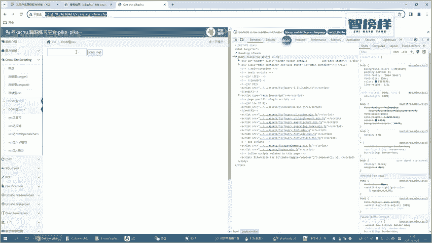
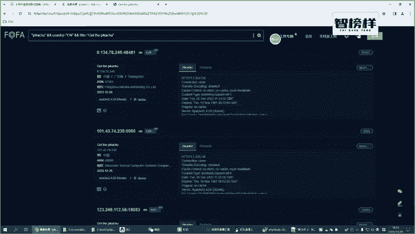
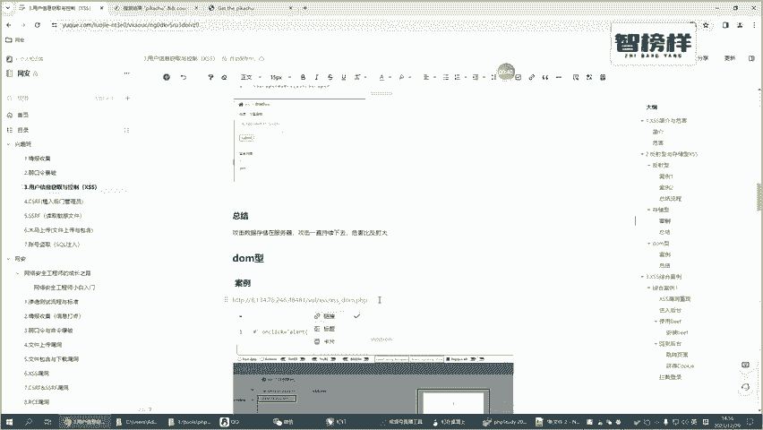
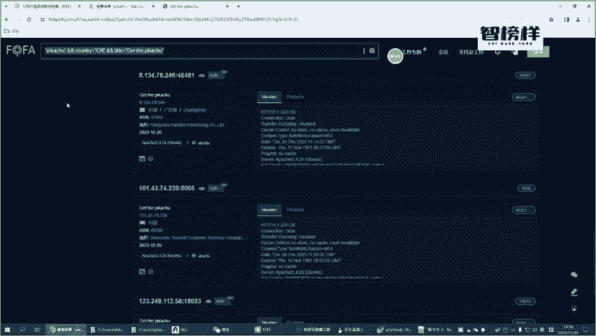
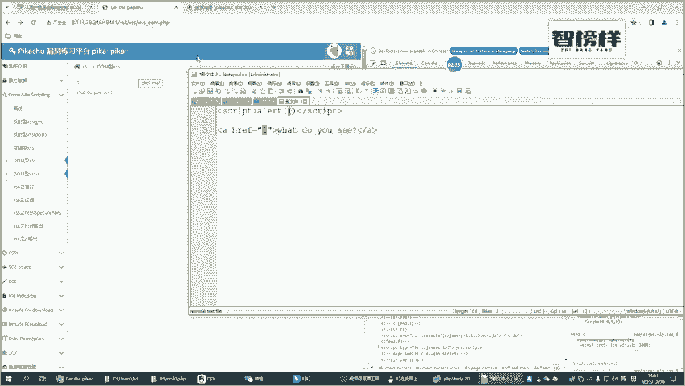
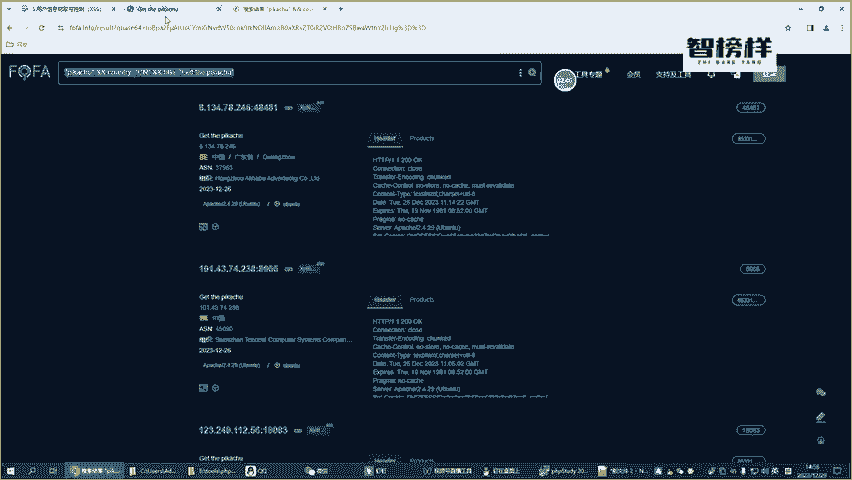
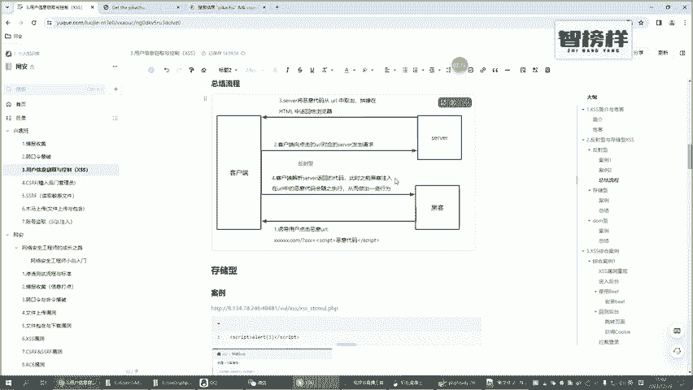

# CTF入门教学：P35：4. DOM型XSS以及和反射、存储XSS的区别 🎯

在本节课中，我们将要学习XSS（跨站脚本攻击）的第三种类型——DOM型XSS。我们将通过实例演示其攻击原理，并重点分析它与之前学过的反射型、存储型XSS在流程和危害上的核心区别。

## 概述
前面我们已经介绍了存储型和反射型XSS。本节中，我们来看看容易让人困惑的DOM型XSS。理解其特点对于区分不同类型的XSS攻击至关重要。





## DOM型XSS攻击演示
我们以一个示例页面来演示DOM型XSS的攻击流程。





首先，我们访问目标页面并输入一个正常参数，例如数字“1”。页面会将该参数值动态插入到页面中的一个链接（`href`属性）里。


当我们点击这个链接时，页面会根据`href`的值进行跳转。例如，输入`http://www.baidu.com`并点击，就会正常跳转到百度。


接下来，我们尝试注入恶意脚本。观察发现，我们输入的内容被直接放入了`href`属性的值中。

因此，我们可以构造特殊的输入来闭合`href`属性，并插入新的HTML事件属性（如`onclick`）来执行脚本。攻击载荷如下：

```html
#‘ onclick=‘alert(1)
```

当我们输入上述内容并点击按钮时，页面生成的HTML代码会变为：





```html
<a href="#‘ onclick=‘alert(1)">click me</a>
```

此时，`href`的值被截断，`onclick`事件被成功注入。点击链接，就会触发`alert(1)`弹窗，证明DOM型XSS攻击成功。


## 三种XSS类型的核心区别
为了深入理解DOM型的特殊性，我们需要将其与反射型、存储型XSS进行对比。以下是它们之间最根本的区别。

### 交互流程对比
下图清晰地展示了三种XSS攻击中数据流的差异：



*   **DOM型XSS**：攻击完全发生在**客户端（浏览器）**。恶意脚本的注入和执行不经过服务器端处理。攻击者构造的恶意数据（如URL片段）被浏览器端的JavaScript代码（DOM操作）直接读取并输出到页面上，从而触发攻击。
*   **反射型XSS**：攻击流程涉及**客户端与服务器**。恶意脚本通常作为请求参数（如URL中的查询字符串）发送到服务器，服务器未加过滤地将该参数内容“反射”回响应页面中，由浏览器执行。
*   **存储型XSS**：攻击流程最为复杂，涉及**客户端、服务器和数据库**。恶意脚本被提交到服务器后，会被**存储到数据库**等持久化介质中。当其他用户访问包含该数据的页面时，脚本从服务器加载并执行。

### 危害性对比
基于它们的交互流程，我们可以对三者的危害性进行排序：

1.  **存储型XSS危害最大**：因为恶意脚本被持久化存储，所有访问特定页面的用户都会受到影响，攻击范围广，持续时间长。
2.  **反射型XSS危害次之**：需要诱导用户点击特定的恶意链接，攻击依赖于用户的交互，影响范围相对有限。
3.  **DOM型XSS危害相对最小**：同样需要用户交互（如点击特制链接），且攻击不经过服务器，通常更难被传统的服务端安全防护机制检测到。但其危害性取决于具体的漏洞场景。

## 总结
本节课中我们一起学习了DOM型XSS攻击。

我们通过一个实例演示了如何利用前端JavaScript对DOM的不安全操作来注入并执行恶意脚本。最关键的是，我们对比了三种XSS类型：

*   **DOM型**：攻击在客户端完成，**不经过服务器**。
*   **反射型**：恶意脚本经服务器“反射”回页面。
*   **存储型**：恶意脚本被服务器**存储到数据库**，危害最大。


希望结合讲解与示意图，你能清晰理解这三者之间的区别与联系，为后续的CTF挑战和Web安全学习打下坚实基础。