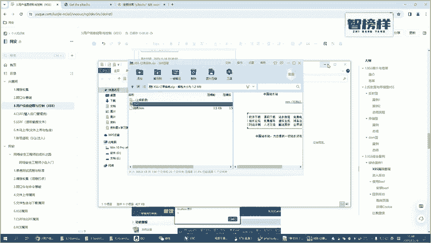
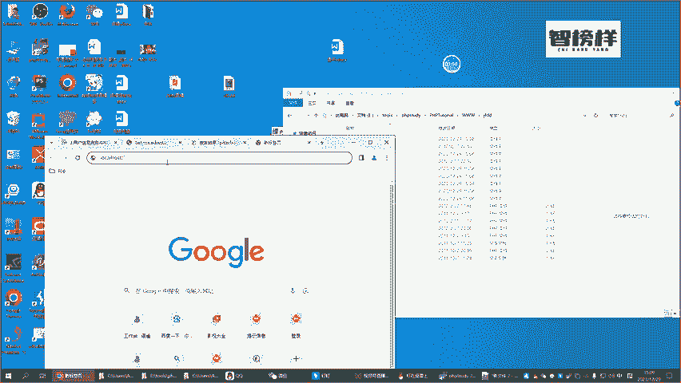
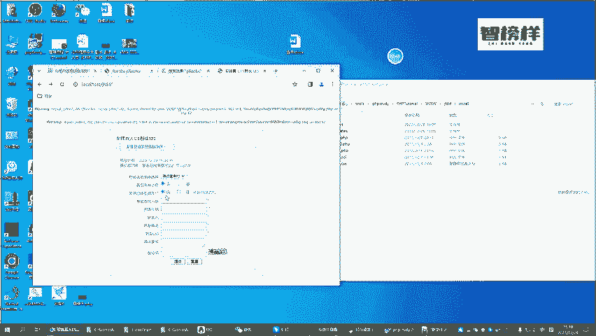
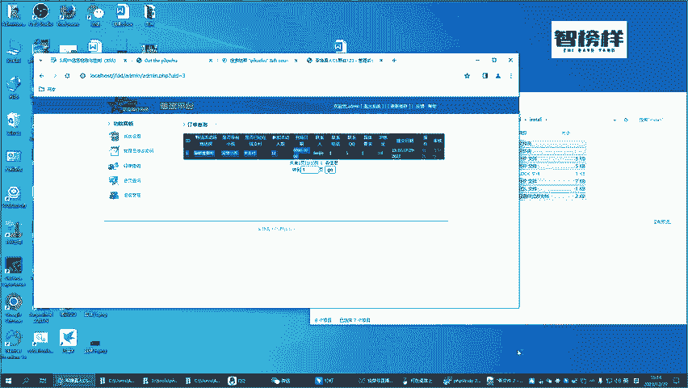

# CTF入门教学：P36：5.正式靶场环境搭建 🛠️

在本节课中，我们将学习如何搭建一个用于实战演练的靶场环境。通过亲手搭建环境，我们可以更直观地理解后续将要学习的XSS（跨站脚本攻击）等安全漏洞的危害，并确保理论知识能够转化为实际操作能力。

## 环境搭建概述

上一节我们介绍了XSS的基本概念与类型。本节中，我们来看看如何搭建一个用于综合案例演练的靶场环境。这个环境模拟了一个在线活动订单提交系统，我们将在此系统上进行后续的实战操作。

## 搭建步骤详解

以下是搭建靶场环境的具体步骤。

### 1. 获取并解压靶场文件

首先，我们需要将准备好的靶场系统文件解压到Web服务器的根目录中。

*   靶场文件是一个压缩包，可以直接解压使用。
*   需要将文件解压到PHPStudy的 `www` 目录下。

### 2. 启动安装向导

解压完成后，通过浏览器访问靶场目录来启动安装程序。

*   在浏览器地址栏输入靶场目录的路径，例如：`http://localhost/jfdd/`
*   如果无法直接访问，可以尝试访问目录内的 `install.php` 文件，例如：`http://localhost/jfdd/install.php`

### 3. 处理安装锁文件

在首次安装时，可能会遇到一个常见的错误提示。

*   如果页面提示“请先删除 install/install.lock”，则需要手动删除该锁文件。
*   这是一个安全机制，防止重复安装。删除后刷新页面即可继续。

### 4. 配置数据库连接

安装向导启动后，需要配置数据库信息以连接MySQL。

*   **数据库地址**：通常使用本地地址 `localhost`。
*   **数据库用户名**：默认是 `root`。
*   **数据库密码**：如果使用PHPStudy，默认密码也是 `root`。若使用其他MySQL环境，请填写实际密码。
*   **数据库名**：可以保持默认，或根据提示创建。

配置完成后，点击“导入数据”按钮，系统会自动创建所需的数据表。

### 5. 设置管理员账户

数据库初始化成功后，需要为系统的后台管理设置一个管理员账户。

*   **管理员账号**：例如 `admin`。
*   **管理员密码**：例如 `123456`。
*   **其他信息**：如站点名称等，可按需填写或使用默认值。

### 6. 安装完成并登录验证

完成以上步骤后，系统会提示安装成功。此时可以尝试登录前后台，验证环境是否搭建正常。

*   **访问前台**：提交一个测试订单，填写任意信息并提交。
*   **登录后台**：使用刚才设置的管理员账号和密码登录管理后台。
*   **验证功能**：在后台的“订单查询”页面，应能看到刚才提交的测试订单数据。

## 环境功能简介

至此，靶场环境已搭建完毕。这个系统模拟了一个简单的在线订单提交与管理平台：
*   **用户前台**：用于提交活动预约订单。
*   **管理后台**：用于管理员查看和处理用户提交的订单。

这个环境将作为我们后续进行XSS等Web安全漏洞实战演练的基础。

## 总结

本节课中，我们一起学习了如何从零开始搭建一个CTF实战靶场环境。我们完成了从文件解压、安装引导、数据库配置到最终验证的完整流程。请务必跟随步骤亲手操作一遍，确保环境搭建成功，这将为后续的漏洞原理学习和实战攻击演练打下坚实的基础。