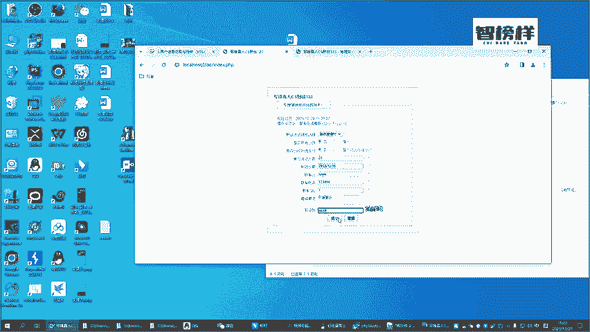
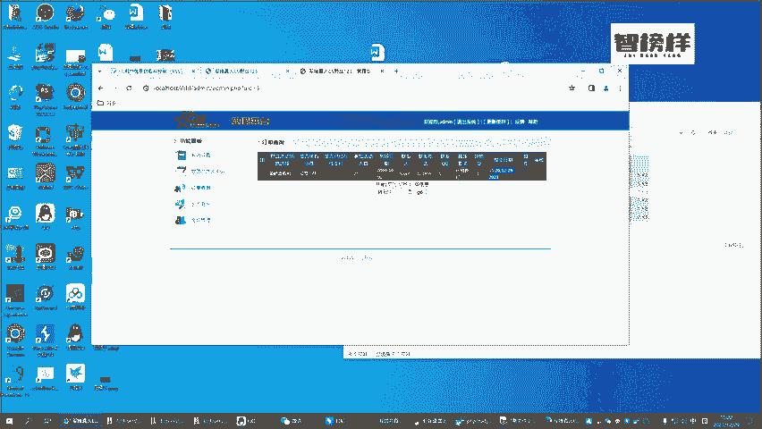
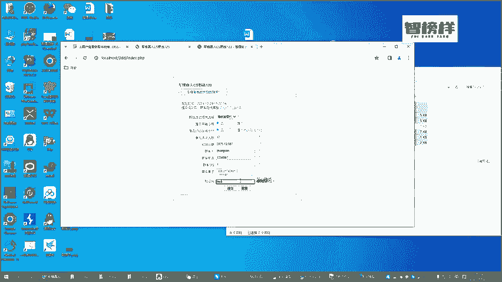
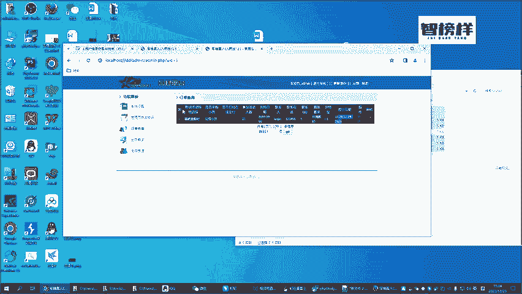
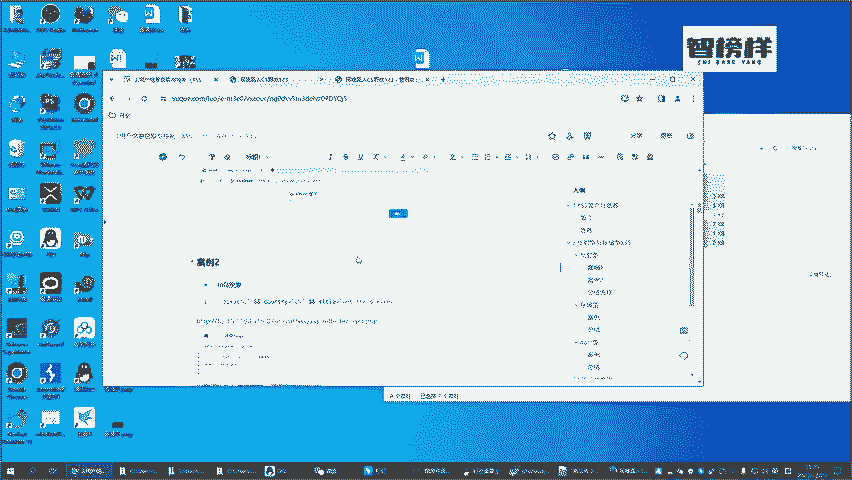

# CTF入门教学：P37：6.靶场XSS漏洞重现 🎯

在本节课中，我们将学习如何在已搭建好的靶场环境中，重现一个典型的跨站脚本攻击漏洞。我们将通过一个模拟的场地预订流程，演示XSS攻击的基本原理和实现方式。

---

## 环境与正常流程回顾

上一节我们介绍了靶场环境的搭建，本节中我们来看看它的正常业务流程。

一个正常的场地预订流程如下：用户在表单中输入相关信息并提交，管理员在后台查看这些数据并进行后续安排。

以下是正常提交订单的步骤：

1.  输入人数，例如 `23`。
2.  输入到场时间，例如 `12月37号`。
3.  输入联系人，例如 `罗杰`。
4.  输入联系电话，例如 `123456`。
5.  输入QQ号码，例如 `1`。
6.  输入具体要求，例如 `环境要好`。
7.  输入验证码，例如 `66649`。
8.  点击“提交”按钮。

提交成功后，订单信息会进入后台数据库。管理员会看到这些信息，并电话联系用户进行确认。这是一个完整的正常业务流程。

---

## XSS攻击漏洞重现

既然我们学习的是XSS攻击，那么它是如何利用JavaScript进行攻击的呢？接下来，我们将在同一个表单中尝试注入恶意脚本。

我们重复提交订单的步骤，但在“具体要求”字段中，输入我们准备好的攻击脚本。

以下是构造恶意订单的步骤：

1.  输入人数，例如 `12`。
2.  输入到场时间，例如 `12月37号`。
3.  输入联系人，例如 `张三`。
4.  输入联系电话，例如 `1234567`。
5.  输入QQ号码，例如 `1`。
6.  在“具体要求”字段中，输入XSS攻击代码：``。
    *   **核心概念**：这段代码是一个典型的XSS攻击载荷，``
7.  输入验证码，例如 `9601`。
8.  点击“提交”按钮。

提交成功后，我们返回后台的订单查询页面。此时，页面会弹出一个显示“1”的警告框。

这个弹框证明，我们利用前面所学的知识，成功发现了当前靶场网站存在XSS漏洞，并且完整地重现了这个漏洞。攻击脚本被服务器存储，并在管理员查看订单时于其浏览器中执行。

---

## XSS漏洞的危害性说明

各位如果认为XSS攻击仅仅能弹出一个警告框或显示广告，那就错了。XSS攻击所能带来的威胁和危险，远比这要大得多。

那么，它具体能造成哪些更大的危害呢？例如，攻击者可以窃取管理员Cookie、劫持用户会话、发起钓鱼攻击、甚至控制用户浏览器。

我们将在后续的案例中，通过搭建更多环境来详细演示这些高级攻击手法。

---

## 本节总结

本节课中我们一起学习了如何在实战靶场中重现一个存储型XSS漏洞。我们回顾了正常业务流程，然后通过向“具体要求”字段注入``代码，成功在后台页面触发了弹窗，验证了漏洞的存在。最后，我们强调了XSS漏洞的潜在危害远不止于简单弹窗，为后续深入学习更复杂的攻击场景做好了铺垫。